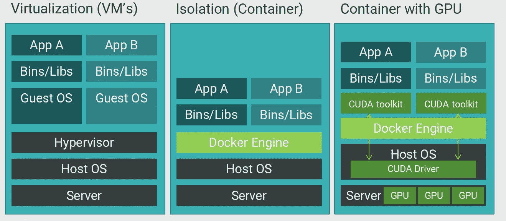
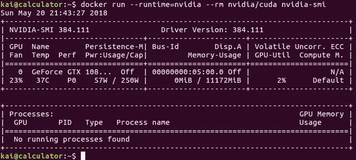
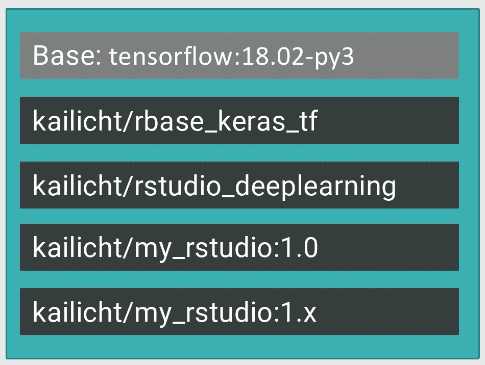

# 使用 nvidia-docker 为 R 和 Python 创建令人敬畏的深度学习环境

> 原文：<https://towardsdatascience.com/use-nvidia-docker-to-create-awesome-deep-learning-environments-for-r-or-python-pt-i-df8e89b43a72?source=collection_archive---------6----------------------->


*安装完整的支持 GPU 的深度学习环境(包括 RStudio 或 jupyter)和所有软件包需要多长时间？您必须在多个系统上这样做吗？在这篇博文中，我将向您展示我如何以及为什么使用支持 GPU 的 docker 容器来管理我的数据科学环境。在这第一篇文章中，你会读到:*

*   *为什么我的数据科学工作流完全转向容器*
*   *docker 是什么，它与虚拟机相比如何(如果你已经知道，跳过它！)*
*   *我如何构建我的数据科学映像*
*   *如何在 GPU 支持下用 r-base、Keras 和 TensorFlow 构建容器*

## 现状

您如何管理您的数据科学堆栈？我从来没有真正满意过我是如何做到的。在不同的机器上安装整个堆栈，包括我使用的所有包、GPU 支持、Keras 和 TensorFlow for R 以及底层的 Python 内容，是一个乏味而繁琐的过程。你最终会得到一个非常脆弱的工具链，而我是那种喜欢摆弄和破坏东西的人。这也有更多的负面影响。例如，不同机器上的环境不一样。我在至少三台不同的机器上进行数据科学研究:我的笔记本电脑，我的装有 GTX 1080 Ti 的工作站和 AWS 实例。我的开发环境和主机操作系统早就应该分离了。我一直都知道，虚拟机不是一个好办法，因为它们会产生很多开销，而且您必须提前分配所有想要使用的资源。

Docker 非常适合这个目的。它给你一个隔离的开发环境，保护你不把事情弄糟。当我看到英伟达 GPU 云(NGC)时，我知道这将解决我的问题。NGC 不是云服务，而是一个容器注册表，你可以在那里下载预构建和 GPU 支持的 docker 映像，这些映像针对不同的工作流进行了优化。有针对 TensorFlow，pytorch，caffe 等框架的图片。好的一点是:你不用关心任何驱动，框架或者包的安装。你可以马上启动 python，导入 TensorFlow，拷问你的 GPU。不幸的是，这些图像包含 NVIDIA 的专有软件来优化计算。你可以出于各种目的免费使用它，包括商业用途，但是你不允许重新发布他们的图片。这可能就是为什么你在像 [Rocker](https://github.com/rocker-org) 这样的项目中找不到它们的原因。你当然可以做的是发布 docker 文件，使用这些图像作为基础图像，这就是我在这篇博文中要做的。

## 为什么是 Docker？

如果你已经知道 Docker 是什么，以及它与虚拟机相比如何，你可以跳过这一节。我只给你一个简短的概述，有很多好的教程可以学习 Docker 是如何工作的。顺便说一下:我远不是 Docker 的专家，但你真的不需要成为这样的专家。看看下面这张图。左边显示了虚拟机是如何工作的:每个实例模拟一个完整的操作系统。对我来说，这从来都不是数据科学环境的选项。这会产生一些开销，但最重要的是，您必须提前分配资源，并且这些资源不会与您的主机系统共享。对于在同一台机器上使用主机作为通用系统和虚拟机进行数据科学的设置，这是不切实际的。



对于这种情况，使用容器隔离要好得多:它基本上只是一个隔离的文件系统。它使用你的主机系统的内核，这当然增加了很少的开销。不幸的是，对于 Windows 或 Mac 上的 Docker 来说，情况并非如此，因为它在底层使用的是 Linux 虚拟机。即使在我的笔记本电脑上，我也总是尝试完全切换到 Linux，正因为如此，我做到了。但是，即使你想坚持使用 Windows 或 Mac:你可能正在使用 Linux 的工作站或云实例。真正有趣的部分显示在图像的右侧:带有 nvidia-docker 运行时的容器。那些容器可以使用主机系统的 GPU。您只需要一个支持 CUDA 的 GPU 和主机系统上的驱动程序，仅此而已。

现在简单介绍一下 docker 的工作原理以及与之相关的术语。Docker 中最重要的两个概念是图像和容器。该图像包含创建容器的蓝图。它是分层构建的，可以只包含操作系统的基础知识，也可以包含更复杂的软件堆栈。容器是 docker 图像的一个实例。除了您可以访问您的主机系统的资源之外，它与虚拟机的感觉完全相同。因此，当您从一个映像启动 docker 容器(并告诉它是交互式的)时，您将进入一个 shell 环境，就像您登录到一个 VM 一样。容器启动速度也非常快。它几乎不可识别，而在虚拟机中，你必须启动操作系统。

要构建 docker 映像，您必须编写一个 docker 文件。有两种方式可以做到这一点:使用父映像或从头开始，只有当您想要创建新的基础映像时才需要这样做。在大多数情况下，您将使用基础映像作为父映像，并在此基础上构建您的软件堆栈。如果你想在 Ubuntu 16.04 上建立你的映像，你的 docker 文件的第一行应该是:``` FROM ubuntu:16.04 ```。获取图像最常见的方式是从 [docker hub](https://hub.docker.com/) 获取图像，docker hub 是一个共享图像的平台。Docker 自动完成这项工作，或者您也可以使用 docker pull ImageName 手动提取图像。在 Ubuntu 和其他常用图像的情况下，有来自 docker 工作人员的官方维护图像。正如您将在下一节中看到的，您还可以从 docker hub 之外的其他存储库中提取图像。

## 获取 Docker 和 TensorFlow 容器

Docker 和 nvidia 运行时非常容易安装。以下命令使用 get.docker.com 的安装脚本安装免费的 docker 社区版。这个脚本可以在所有常见的 Linux 发行版上安装 docker(详情请看 get.docker.com 的[):](https://get.docker.com)

```
*#Install docker via get.docker script*
curl -fsSL get.docker.com -o get-docker.sh
sh get-docker.sh
```

要安装 nvidia-docker 运行时，您必须添加它们的软件包存储库，并安装和重新加载 docker 守护程序。我使用 Ubuntu 16.04 作为主机系统，但是这应该可以在任何使用 apt 的基于 debian 的发行版上工作。

```
*#Add the package repositories for nvidia docker*
curl -s -L [https://nvidia.github.io/nvidia-docker/gpgkey](https://nvidia.github.io/nvidia-docker/gpgkey) | \ 
    apt-key add -curl -s -L [https://nvidia.github.io/nvidia-docker/ubuntu16.04/amd64/nvidia-docker.list](https://nvidia.github.io/nvidia-docker/ubuntu16.04/amd64/nvidia-docker.list) | tee /etc/apt/sources.list.d/nvidia-docker.listapt-get update

#*Install nvidia-docker2 and reload the Docker daemon configuration* 
apt-get install -y nvidia-docker2 pkill -SIGHUP dockerd
```

要检查是否一切正常，您可以加载 cuda 映像并执行 nvidia-smi:

```
*#Test nvidia-smi with the latest official CUDA image*
docker run --runtime=nvidia --rm nvidia/cuda nvidia-smi
```

该命令从 docker hub 下载 cuda 映像，基于该映像启动一个容器，在容器内执行命令 nvidia-smi，然后立即离开容器并删除它。您应该会看到类似这样的内容:



这意味着我的 GTX 1080Ti 在集装箱内可用！这个 cuda 图像是 NVIDIA 在 docker hub 上托管的图像之一。对于优化的深度学习容器，你必须注册英伟达 GPU 云( [NGC](https://ngc.nvidia.com/signup/register) )，它不是云服务提供商，而是类似于 docker hub 的容器注册表。它是免费的，你可以将这些容器用于你自己的或商业的目的，但是你不允许再分发它们。注册后，在左侧菜单中选择*配置*，并生成一个 API 密钥。有了这个键，你可以在 NVIDIA 注册表中注册 docker 安装。你应该把钥匙保存在安全的地方。使用 docker login nvcr.io 命令进行注册。作为用户名，您必须使用$oauthtoken(带$符号！)和 API-Key 作为密码。现在，如果您使用以下命令，docker 应该下载优化的 TensorFlow 容器:

```
docker pull nvcr.io/nvidia/tensorflow:18.04-py3
```

## 我如何建造

我在创造我在不同阶段使用的环境。在第一张图中，我只是安装了 R-base、Python 和 R 的 Keras、R 的 TensorFlow 以及它们的依赖项。在下一张图中，我将在其上安装 RStudio-Server 和 jupyterlab。在第三张图中，我根据自己的需要定制了 RStudio，并安装了我想使用的所有包。



最后一步是安装更多的软件包。如果我意识到在工作会话期间我需要一个额外的包，我可以像在 RStudio 中那样自然地安装它。完成后，我将这个包添加到第四张图片中。如果我使用第三个，我每次都必须重新安装所有的软件包，这需要一些时间。使用 docker，您还可以提交对容器的更改。这也是永久安装新软件包的一种方式。我决定不这样做，以跟踪我添加到我的图像。分步创建这些容器还有另一个好处:您可以将图像用于不同的用例。例如，您可以使用 RStudio 图像创建一个神经网络并保存它。然后，您可以将这个模型加载到基本容器中，并创建一个基于 python 的 flask 微服务来部署它。或者你想做一个使用图像识别的闪亮应用程序。您可以使用 r-base 容器，添加 shiny 并部署它。或者您想为同事提供不同的定制 RStudio 版本。

## 安装 R-base 和 Keras

由于我们已经从 NVIDIA 获得了 TensorFLow 容器，现在我们可以开始构建 r-base 映像。构建 docker 映像本质上就是编写一个 shell 脚本，在您的映像中安装您想要的所有东西。就像我已经指出的，它被写在一个名为 Dockerfile *的文本文件中。*当您运行 docker build -t YourNameTag 命令时。在您的 docker 文件的文件夹中，docker 从您用 from 定义的基本映像启动一个容器，并在这个容器中运行您在 docker 文件中编写的内容。docker 在这个容器中执行什么是用 RUN 定义的。看看下面的 docker 文件:

```
FROM nvcr.io/nvidia/tensorflow:18.04-py3

LABEL maintainer="Kai Lichtenberg <kai@sentin.ai>"

*#Arguments*
ARG USER="docker"
ARG myUID="1000"
ARG myGID="1000"

*#Specifiy R and Keras Version*
ENV R_BASE_VERSION=3.4.4
ENV KERAS_VERSION=2.1.5

*#Set a user* 
RUN groupadd --gid "${myGID}" "${USER}" \
  && useradd \
    --uid ${myUID} \
    --gid ${myGID} \
    --create-home \
    --shell /bin/bash \
${USER}
```

如果我在这个文件上运行 docker build，docker 会做以下事情:它基于我们下载的 TensorFlow 容器启动一个容器，添加一些环境变量(ARG 和 ENV)并创建一个组和一个用户。请注意，ARG 定义了仅在构建过程中可用的变量，您可以使用 docker build 命令为这些变量传递一个值。因此，当您使用 docker build-build-arg USER = Kai 启动命令时，默认的 USER="docker "将在构建过程中被覆盖。用 ENV 定义的变量是持久的，在从创建的映像启动的容器中也是可用的。下一步，我们安装 apt 所需的软件包:

```
*#Install packages needed*
RUN apt-get update \ 
  && apt-get install -y --no-install-recommends \
    ed \
    locales \
    vim-tiny \
    fonts-texgyre \
    gnupg2 \
    libcurl4-openssl-dev \
    libssl-dev \
    libssh2-1-dev \
    sudo \
    virtualenv \
&& rm -rf /var/lib/apt/lists/*
```

下一件事是安装 r。我用的是 CRAN 为 Ubuntu 提供的二进制文件。通常情况下，CRAN 很快就会发布最新版本，但目前(5 月 19 日)R 3.5 无法通过 CRAN 获得(阅读[这里](https://stackoverflow.com/questions/50076354/r-3-5-is-not-available-for-linux)为什么)。我会等 3.5 出现在 CRAN 上。如果你非常想拥有 R 3.5，你可以像在[这个](https://hub.docker.com/r/rocker/r-base/~/dockerfile/)docker 文件中一样安装它，并从源代码安装软件包。下一步中显示的安装与 Rocker 项目中的 r-base docker 文件相同。它正在安装 littler，这是一个方便的 CLI 接口，用于 R，r-base，r-base-dev 和 R-推荐用于 R_BASE_VERSION 环境变量中指定的 R 版本。它还在/usr/local/bin 中为 littler 创建了链接，使它在命令行中可用。

```
*#Add mirror* 
RUN echo "deb [http://cran.rstudio.com/bin/linux/ubuntu](http://cran.rstudio.com/bin/linux/ubuntu) xenial/" >> /etc/apt/sources.list \
  && gpg --keyserver keyserver.ubuntu.com --recv-key E084DAB9 \
  && gpg -a --export E084DAB9 | apt-key add -

*# Install R-base (rocker/r-base with little modification)
# Now install R + littler, create a link in /usr/local/bin
# Set a default CRAN repo, make sure littler knows about it too*
RUN apt-get update \
  && apt-get install -y --no-install-recommends \
    littler \
    r-cran-littler \
    r-base=${R_BASE_VERSION}-* \
    r-base-dev=${R_BASE_VERSION}-* \
    r-recommended=${R_BASE_VERSION}-* \
  && echo 'options(repos = c(CRAN = "https://cran.rstudio.com/"), download.file.method = "libcurl")' >> /etc/R/Rprofile.site \
  && echo 'source("/etc/R/Rprofile.site")' >> /etc/littler.r \
  && ln -s /usr/share/doc/littler/examples/install.r /usr/local/bin/install.r \
  && ln -s /usr/share/doc/littler/examples/install2.r /usr/local/bin/install2.r \
  && ln -s /usr/share/doc/littler/examples/installGithub.r /usr/local/bin/installGithub.r \
  && ln -s /usr/share/doc/littler/examples/testInstalled.r /usr/local/bin/testInstalled.r \
  && install.r docopt \
  && rm -rf /tmp/downloaded_packages/ /tmp/*.rds \
  && rm -rf /var/lib/apt/lists/*
```

R 的 TensorFlow 和 Keras 包通过 reticulate 包连接到 python。这意味着我们需要为 R 和 python 安装两个包。两个 R 包都是通过 littler 提供的 github 安装例程安装的。因为我们使用的是 NVIDIA TensorFlow 映像，所以我们只需要关心 python 的 Keras(tensor flow 已经安装)。如果您以前使用过 Keras for R，您可能会注意到您必须调用函数 install_keras()来安装 python 后端。在我们的情况下，这已经完成了。唯一附加的事情是该函数创建了[虚拟环境](https://docs.python.org/3/tutorial/venv.html) r-tensorflow。在 python 中使用虚拟环境是一个很好的实践，尽管在 docker 容器中这是不必要的，因为它是双重隔离的。

```
*#Install tensorflow and keras*
ENV WORKON_HOME=/home/${USER}/.virtualenvs

RUN install2.r devtools remotes \
  && installGithub.r rstudio/tensorflow \
  && installGithub.r rstudio/keras \
  && virtualenv --system-site-packages /home/${USER}/.virtualenvs/r-tensorflow --python=python3.5 \
  && /bin/bash -c "cd /home/${USER}/.virtualenvs/r-tensorflow/bin/; \
     source activate; \
     pip3 --no-cache-dir install git+git://github.com/fchollet/keras.git@${KERAS_VERSION}"
```

好了，现在我们有了用 R 进行深度学习的基本图像！你可以在这里找到完整的档案。在下一部分中，我将使用 RStudio、jupyter 和定制来创建图像。[如果你想获得这方面的更新，请在推特上关注我！](https://twitter.com/kai_lichtenberg)

*最初发表于* [*凯·利希滕伯格*](https://klichtenberg.com/?p=151) *。*