# 利用文本检索和搜索引擎技术进行税收分类

> 原文：<https://towardsdatascience.com/use-of-text-retrieval-and-search-engines-technology-for-tax-classification-d903fa3cf948?source=collection_archive---------2----------------------->

# 使用信息检索和人工智能(AI)技术来辅助财政分类(文本检索、信息检索、等级和产品税 HS 上应用的搜索)

摘要:使用 word2vec、BagofWords、unigram、bigram、标记化、文本相似性、OkapiBM25 +等技术来处理可用于税收分类建议的子项，如 TEC Mercosul(南美 HS(协调制度)本地定制)文本中所述，并根据搜索单词列表进行排序

正确的税收分类总是一个挑战。巴西版的共同对外关税文本有数万个单词，100 个章节，10，000 多个可用于分类的子项目，一个复杂且不总是统一的层次结构，此外还有章节注释、章节注释、总则等。在这项工作中，我们提议使用计算机来提高这些精确的数字，因为在这方面，计算机已经超过了人类(随着人工智能和机器学习的最新进展——人工智能机器学习和深度学习开始在处理文本的统计分析以及物体的视觉和识别方面达到我们，在某些情况下超过了人类)。

本文结构分为四个部分，相对独立。这样，读者可以直接跳到他最感兴趣的地方。第 1 部分处理概念部分，并对问题进行分析。第 2 部分和第 4 部分将更具技术性。如果您只想下载并测试演示本文概念的软件，可以直接阅读第 3 部分。

**第 1 部分** —对技执委案文的分析以及对财政分类挑战的思考。首先是文字处理和选择路径。

**第 2 部分**—Python 编程语言中的测试和统计(带代码)。矢量化技术、二元模型、词干化、查询相似度和 OkapiBM25 +的应用。

**第 3 部分**——一个用 Java 编程语言开发的用户友好的全功能应用——在 GitHub 网站上有代码可以下载和“分叉”。

**第 4 部分**-讨论使用机器学习和其他技术的可能改进。

**参考资料** —参考书目和在线资源

TEC/NCM——南方共同市场共同对外关税，将在第一部分中制定。

协调制度是 TEC 的国际版本，在第 1 部分也有解释。

# 第一部分

**为了**分析 TEC 文本，第一步是获取其最新版本。TEC 是一种法律规范，由 MDIC[工业、外贸和服务部](http://www.mdic.gov.br/)在巴西发布。MDIC 在下面的链接中以 Word 和 Excel 格式发布了 TEC 的最新版本。

【当前档案】www.mdic.gov.br [](http://www.mdic.gov.br/index.php/comercio-exterior/estatisticas-de-comercio-exterior-9/arquivos-atuais) [MDIC](http://www.mdic.gov.br/index.php/comercio-exterior/estatisticas-de-comercio-exterior-9/arquivos-atuais)

在 Word 中打开 TEC，我们可以开始分析它的结构。基本上，它有六个部分:

> 章节标题
> 缩写和符号
> 协调制度解释通则
> 补充通则
> 航空部门产品征税规则
> 南方共同市场共同术语(NCM)和共同税率

对于我们的工作来说，重要的部分是第六部分，依次划分如下:

> 章节(描述)
> 章节注释
> 章节(描述)
> 章节注释
> 表 NCM，描述，TEC

这里有一个附录和一个重要的观察:税收分类的任务是一项技术工作，它可能依赖于其他信息和具体知识，这些信息和知识不会写入技术执行委员会的文本，如冶金、化学或纺织方面的知识。除了关于税收分类规则的知识(在 TEC 中描述)，语法和法律解释，产品分解混合案例，等等。因此，立法根据货物的税收分类(第 7.482 / 11 号法令第十九节第 15 条和 RFB 2014 年 5 月第 1464 号条例等)确定了税务机关(联邦税务局的财政审计员)。

还应当记住，我们现在所称的“TEC”是国际条约、传统、技术研究和标准的汇编，首先在世界海关组织签署的所谓的《布鲁塞尔国际公约》中的国际协调制度(HS)中进行汇编，然后扩大到南锥体共同市场 NCM——南锥体共同市场货物共同术语的经验和需要。此外，在巴西，还有 RIPI 的附加联邦法规—工业化产品税收法规以及 ICMS —州法规。

由于本文的总体重点不是财政分类或立法，我们不会深入探讨这个主题。一般分类问题暴露出来后才发现，在我们甚至研究 TEC 的文本之前，至少在现阶段，100%自动税收分类是一个乌托邦。这位作者设想的最佳解决方案是一个建议系统，非常类似于当我们在“谷歌”或另一个*互联网*搜索引擎*上进行搜索时，我们从*网页*上收到的建议。*

在这项工作中，所提出的系统将对 TEC 子项目进行“评分”,并以降序显示结果。毕竟有一万多种可能。然后我们会让计算机通过一个我们称之为“粗筛”的东西，我们只看几个排名更好的位置。如果运气好的话，我们可能只需要看看榜单的前三四名。

通过“运气”,我们也可以定义“正确”的问题。在这种情况下，问题是要分类的商品的描述。因此，当局(财政审计员)、进口商、制造商、技术助理、报关行、代理人或其他有责任描述商品的人必须这样做，以便正确识别产品并确定其正确的税收分类(RFB 680/2006 和海关条例第 711 条等)。

总之，我们可以从教学上把税收分类任务分成两步:描述产品；2.将描述插入正确的分类中。因为 TEC / NCM 是分等级的，我们可以用树来类比。通常，我们通过这棵树的树枝来寻找正确的位置。但是有一种可能性，我们正在看一个分支，而正确的项目在另一个分支，我们看不到它，因为我们在错误的分支中使用了非常相似的子项目。克服这种分层搜索是该系统的目标。

再打个比方，让我们想想一位埃及古物学者:在第一步中，他准确地定义了探险队要寻找的人工制品，并通过之前的研究描述了寻找的方式:人工制品怎么样，会是什么考古遗址，等等。第二步是探险本身。在这方面，团队被画廊，隧道等纠缠。你可以在一个房间里找到一件非常相似的艺术品，但是不要在隔壁房间里找，艺术品实际上是在那里被找到的。为了避免这种情况，我们的机器人将检查所有的房间，并根据与第一步中描述的工件的相似性对找到的工件进行评分。

该分数将基于描述所搜索内容的句子和每个 TEC 子项目之间的相似关系。

在税收分类的情况下，还有第三步，因为一个职位或章节或另一个职位或章节可能被排除在外，或者可能有一个条款或章节注释或其他类型的例外作为一般规则之一强加的条件。这项任务也可以通过自然语言处理技术实现自动化，但是这还不在 T2 的工作范围之内。

现在，我们所能理解的“TEC 的子项”。

分析“NCM 表，描述，TEC”部分，我们可以看到并不是所有的行在“TEC”列中都有值:

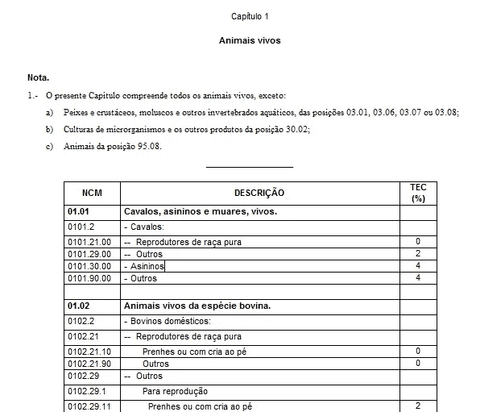

First page of TEC, Word version. Note the third column of the table

在屏幕上，我们可以很容易地注意到上面描述的结构(第二十章(描述)，章节注释，NCM 表。我们还注意到，表中只有几行在第三列中有值(TEC%)。

因此，NCM 的结构是分等级的，按照协调制度:章(2 位数)，位置(4 位数)，子位置 1 和 2 (5 和 6 位数)。南方共同市场增加了两位数:项目和分项(分别为第 7 位和第 8 位)。只有包含 TEC 税率(以及 IPI 和 ICMS 自己的税率)的完整行、较高的订单才能用于税收分类。

但是回头看看表格，我们看到这些行中的描述字段通常是 Spartan。例如，分项 NCM 0102.21.10 只提到“怀孕或有脚印”，更糟糕的是，下面的 0102.21.90 只提到“其他”。

> 所以我们来创建一个概念，叫做“TEC List with full description”。这样，每个子项、项或子项都必须用其层次树的串联来描述。因此，我们知道，子目 0102.21.10 指的是“活牛——家畜——纯种配种动物”,子目 0102.31.90 指的是“活牛——水牛——纯种其他”。肯定比以前信息量大得多。我们仍然可以考虑在这个层次结构中添加章节的描述。

尽管每行提供的信息更多，但要搜索的单词总数会更大，因为许多单词会重复出现。还有，一些表格描述的字数本身就已经很大了，串联更多的描述会让一切变得更大。但是我们不能失去焦点:我们的目标是产生线条，以便计算机，而不是人类，寻找并包含单词的出现。在这一点上，计算机比我们人类好得多。这条被提议的线将被数字机器“消化”和(预)处理，它将只返回给人类它从 10，000 多个选项中寻找的“菲力”。

# 第二部分

GitHub 中提供了一个包含该文本所有代码的脚本。

[](https://translate.googleusercontent.com/translate_c?depth=2&hl=en&rurl=translate.google.com&sl=auto&sp=nmt4&tl=en&u=https://github.com/IvanBrasilico/ClassificadorFiscal&usg=ALkJrhhLSkthjCLrN65GJ4pSKq0h77GLhQ) [## 将论坛标记为已读

### classifier fiscal——这个 JAVA 系统使用文本中的搜索和处理技术来评分…

github.com](https://translate.googleusercontent.com/translate_c?depth=2&hl=en&rurl=translate.google.com&sl=auto&sp=nmt4&tl=en&u=https://github.com/IvanBrasilico/ClassificadorFiscal&usg=ALkJrhhLSkthjCLrN65GJ4pSKq0h77GLhQ) 

一般的想法放在第 1 部分(“创建带有层次树的级联描述的 TEC 列表，只用于带有非零值 TEC 列的表行。”)，我们需要开始动手了。在 2017 年年中，要处理文本、字符、矢量，肯定没有比一个好的友好的 Python 脚本更快更有趣的方法了。

```
Beautiful is better than ugly. 
  Explicit is better than implicit. 
  Simple is better than complex. 
  Complex is better than complicated.In The Zen of Python
```

此外，为了处理我们获得的数据，Python 生态系统有许多库，如 scikit-learn、NLTK、Theano、Tensor Flow，它们以最先进的形式实现了我们可能需要的许多算法。所以不用多此一举***K****eeping****I****t****S****imple*****S****tupid*(如果可以的话)，我们开始工作吧！*

*第一项任务是分析文件的行，并考虑组装单词列表的处理。这将是一个简单的，逐行处理的文本文件。我们将尝试确定列表组合的标准，我们将制作“手指”,希望没有例外，文件的结构尽可能统一。我们称之为我们的 TEC 列表。然后，我们将通过创建一个包含完整描述的列表来处理第一个。我们称之为 TECResumo。*

> *给定一组文档，第二步是提取你的“词汇”。这是应用“单词矢量化”和“BagofWords”技术的最重要部分。我们通过创建唯一单词的向量来遍历整个集合，并将它们称为 vocab。然后，对于 TEC 列表中的每一行，我们将组装一个与词汇表大小相同的向量。这将是一个名为 TEC vectors 的向量列表，包含每个单词的出现次数。使用“文本检索”中的技术术语，SUM 列表中的每一行都是一个文档，所有行构成一个集合。TTC 向量是每个文档的字数，而 vectorVocab 是集合的字数。这将是我们工作的核心。*

```
*## Format of generated variables: 
  ## 
  ## TEC list: string list with each line of the text file 
  ## listCapitulos: list of list containing title, description, and notes of each chapter 
  ##NCM list: list list with each line containing the line code and after the description 
  ##TECResumo list: string list containing the complete code and "complete" description of non-null TEC lines 
  ## vocab: dict with key word and value occurrence count 
  ##TEC vectors, vectorVocab: count of occurrences of the word per line and total count of occurrences of the word in the Collection 
  ## In technical terms, each line of the list will be a collection document, vocab is the collection vocabulary*
```

*第一步，处理 TEC 并创建我们的第一个列表“TEC 列表”的函数。第一个列表将与 TEC 的原始数据(原始数据)组合在一起，向用户显示与原始文件中完全一样的列表。使用 Word 本身或 LibreOffice 中的文件* *[tec * *—Word-complete . docx](http://www.mdic.gov.br/images/REPOSITORIO/secex/deint/cgam/tec/TEC_2017/mar-tec2017-word-completa.docx)，我们将内容导出到文本文件。该文件将类似于下图:*

*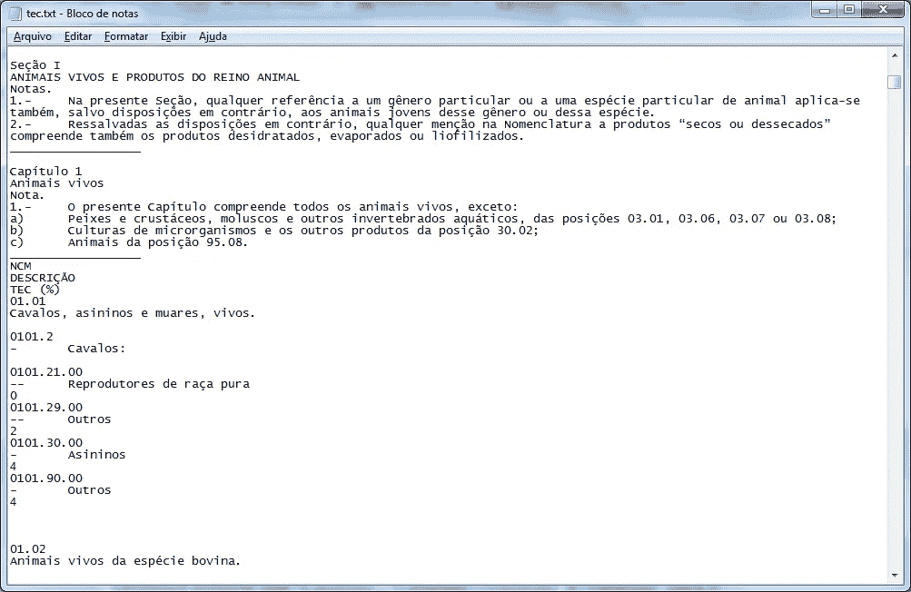*

*TEC file in plain text format*

*我们需要做的是找到具有以下结构的行:第 1 行至少有两个数字和一个点，其中点在第 2 列或更大的列中，后面跟着一行只有文本。我们也将尝试提取章节和笔记，寻找以字母“Cap”开头的行，然后提取下一行直到“Note”行将标题和注释设置为“__ ”,以捕获注释。*

*首先，我们用文件的所有行组装一个列表*

```
*def montaTEC (): 
  arq = open ("src / org / sort / resources / tec.txt") 
  TACfileset = arq.readlines () 
  return TACWatchlist*
```

*然后是章节列表*

```
*def montaCapitulos (plistaTEC): 
  listCapitulos = [] 
  r = 0 
  while (r <len (plistaTEC)): 
  line = plistaTEC [r] 
  if (line [0: 3] == "Cap"): #Search chapters 
  chapter = line 
  description = "" 
  r = r + 1 
  line = TEC list [r] 
  while (line [0: 4]! = "Note"): 
  description = description + line + "" 
  r = r + 1 
  line = TEC list [r] 
  notes = "" 
  r = r + 1 
  line = TEC list [r] 
  while (line [0: 4]! = "____"): 
  notes = notes + line + "\ n" 
  r = r + 1 
  line = TEC list [r] 
  list.append.append ([chapter, description, notes]) 
  r = r + 1 
  return listCapitulos*
```

*以下是 NCM 等级列表:*

```
*def montaNCM (plistaTEC): 
  listNCM = [] 
  r = 0 
  while (r <len (plistaTEC)): 
  line = plistaTEC [r] 
  if (len (line) <12): 
  i = line.find (".") 
  if ((i> = 2) and (line [0] .isnumeric ())): 
  r = r + 1 
  line2 = plistaTEC [r] 
  if (not line2 == "\ n"): # Eliminates number sequences (in part 5 TEC Taxation Rule for Products of the Aeronautical Sector) 
  if (not line2 [0] .isnumeric ()): # First test if line is not empty 
  ncm = line 
  description = line2 
  line3 = plistaTEC [r + 1] 
  tec = "" 
  if ((not line3) or (line3 [0] .isnumeric ())): 
  r = r + 1 
  tec = row3 
  listNC.append ([ncm.strip (), description.strip (), tec.strip ()]) 
  r = r + 1 
  return listNCM*
```

*最后，也是最重要的部分。汇集我们的“文档”，一个包含分类“可用”位置代码(第二列非零)的单词和字母(字符串)列表，以及整个层次结构的描述*

```
*def montaTECResumo (plistaNCM): # Mounts TEC lines containing II with description containing concatenation of line description and "parents" - positions, subheadings, etc. 
  listTECResumo = [] 
  r = 0 
  while (r <len (plistaNCM)): 
  line = plistaNCM [r] 
  II = line [2] 
  if (not II == ''): # Is a valid / "selectable" Classification, search for "parents" 
  code = line [0] 
  description = line [1] 
  s = r-1 
  while (True): #Loop DNA.  Browse the "up" list by looking for the family tree ... 
  line = plistaNCM [s] 
  code2 = line [0] 
  description = line [1] 
  lcodigo = code [0: 2] + "." + code [2: 4] 
  if (lcode == code2): 
  description = description + "" + descricao2 
  listTECResumo.append (code + "" + description) 
  break 
  lcodigo = code [0: 6] 
  if (lcode == code2): 
  description = description + "" + descricao2 
  lcodigo = code [0: 7] 
  if (lcode == code2): 
  description = description + "" + descricao2 
  lcodigo = code [0: 8] 
  if (lcode == code2): 
  description = description + "" + descricao2 
  lcodigo = code [0: 9] 
  if (lcode == code2): 
  description = description + "" + descricao2 
  s = s - 1 
  if ((s == - 1) or ((rs)> 100)): # Exception found, abort! 
  listTECResumo.append (code + "" + description) 
  break 
  r = r + 1 
  return listTECResumo*
```

*我们在这里已经编纂得够多了。所以，说好的编程实践已经过时了，可以写一些自动化测试，或者至少查看我们的结果。我们来做个小预告:*

```
*def Display (): 
  listTEC = montaTEC () 
  print ("RAW File") 
  print (TEC list [0:19]) 
  print (TEC list [5001: 5020])listCapitulos = montaCapitulos (listTEC) 
  print ("Chapterlist") 
  print (ListCapitulos [1]) 
  print (ListCapitulos [50])listNCM = montaNCM (listTEC) 
  print ("listNCM") 
  for line in listNCM [0: 9]: 
  print (line) 
  for line in listNCM [1001: 1010]: 
  print (line)print ("Assembling documents ...") 
  listTECResumo = montaTECResumo (listNCM) 
  print ("Total documents in collection:") 
  print (len (listTECResumo)) 
  print ("First lines:") 
  for line in listTECResumo [0: 9]: 
  print (line) 
  print ("Some random lines:") 
  from random import randint 
  for i in range (1.10): 
  print (listTECResumo [randint (0, len (listTECResumo))])View ()(I.e. 
  ======= RESTART: D: \ Users \ Brazil \ Downloads \ Sorts \ ncmutils.py ======= 
  RAW file 
  \ n ',' \ n ',' \ n ',' \ n ',' \ n ',' \ n ' COMMON FOREIGN TARIFF (TEC) \ n ',' \ n ',' \ n ',' \ n ',' \ n ',' 'BRASIL \ n', '2 0 1 7 \ n'] 
  \ N ', '10 \ n', '1003.90.80 \ n', '1003.90.10 \ n', 'Other \ n', \ n ',' , in grain \ n ', '10 \ n', '1003.90.90 \ n', 'Other \ n', '10 \ n ',' \ n ',' \ n ',' \ n ', '10 .04 \ n ',' \ n ',' 1004.10.00 \ n '] 
  listCapitulos 
  ('Chapter 2', 'Meat and edible meat offal', '1 This chapter does not cover: \ n \ na) \ tFor items 02.01 to 02.08 and 02.10, products unfit for human consumption; \ n \ nb) \ tThe animal fats, bladders and stomachs (heading 05.04) or animal blood (headings 05.11 or 30.02); \ n \ nc) \ t Animal fat, excluding products of heading 02.09 (Chapter 15 ). \ n \ n '] 
  'For the purposes of subheadings 5209.42 and 5211.42, the expression "Denim fabrics" means woven fabrics of yarns of different colors, with a twill not exceeding 4, comprising broken twill (sometimes referred to as satin 4), with warp on the right side, the warp yarns having the same single color and those of the weft, whitened or dyed gray or a lighter shade than of the warp threads. \ n \ n '] 
  CNM list 
  ['01 .01 ',' Live horses, crabs and mules'] 
  ['0101.2', '- \ tHawks:', ''] 
  ['0101.21.00', - 'Pure-bred breeding animals', '0'] 
  ['0101.29.00', '- \ tOutros', '2'] 
  ['0101.30.00', '- \' Asinos', '4'] 
  ['0101.90.00', '- \ tOutros', '4'] 
  ['01 .02 ',' Live bovine animals', ''] 
  ['0102.2', - 'Domestic animals:', ''] 
  ['0102.21', - 'Pure-bred breeding animals', ''] 
  ['0903.00.10', 'Simply shackled', '10'] 
  ['0903.00.90', 'Other', '10'] 
  ['09 .04 ',' Pepper of the genus Piper;  chilies and peppers of the genus Capsicum or of the genus Pimenta, dried or crushed or ground.], 
  ['0904.1', '- \ Pepper of the genus Piper:', ''] 
  ['0904.11.00', '- \ tNot crushed or powdered', '10'] 
  ['0904.12.00', '-' or powdered ',' 10 '] 
  ['0904.2', - - Peppers and peppers (Capsicums of the genus Capsicum or of the genus Pimenta: ',' '] 
  ['0904.21.00', - - - - - - - - - - - - - - - - - - - - - - - 
  ['0904.22.00', '-' or 'powdered', '10'] 
  Assembling documents ... 
  Total documents in collection: 
  10147 
  First lines: 
  0101.21.00 - Pure-bred breeding animals - Horses: Live horses and cousins. 
  0101.29.00 - Other - Horses: Live horses and asses, mules and hinnies. 
  0101.30.00 - Asinines Horses, sharks and mules, live. 
  0101.90.00 - Other Live horses and asses, mules and hinnies. 
  0102.21.10 Pregnant or bred breeding animals - Pure-bred breeding animals - Domestic bovine animals: Live bovine animals. 
  0102.21.90 Other - Pure-bred breeding animals - Domestic bovine animals: Live bovine animals. 
  0102.29.11 Breeding or breeding on foot For breeding - Other - Domestic bovine animals: Live bovine animals. 
  0102.29.19 Other For breeding - Other - Domestic bovine animals: Live bovine animals. 
  0102.29.90 Other - Other - Domestic bovine animals: Live bovine animals. 
  Some Random Rows: 
  5112.19.20 Of fine hairs - Other - Containing 85% or more by weight of wool or fine animal hair: Woven fabrics of combed wool or of fine animal hair. 
  5403.41.00 - Of viscose rayon - Other multiple or cabled yarn: Artificial filament yarn (other than sewing thread), not put up for retail sale, including artificial monofilament of less than 67 decitex. 
  5102.11.00 - Of Kashmir goat - Fine hair: fine or coarse animal hair, not carded or combed. 
  4107.92.10 Of bovine animals (including buffaloes) - Divided with the blossom side - Other, including strips: Leather further prepared after tanning or crusting and parchment-dressed leather, of bovine (including buffalo) or of equine, without hair on, whether or not split, other than leather of heading 41.14\. 
  2916.20.90 Cyclanic, cyclenic or cycloterpenic monocarboxylic acids, their anhydrides, halides, peroxides, peroxyacids and their derivatives, unsaturated acyclic monocarboxylic acids and cyclic monocarboxylic acids, their anhydrides, halides, peroxides and peroxyacids;  their halogenated, sulphonated, nitrated or nitrosated derivatives. 
  5204.11.31 Of two ropes Of bleached or colored cotton yarn of a size not exceeding 5,000 decitex per single yarn - Containing 85% or more by weight of cotton - Not put up for retail sale: whether or not put up for retail sale: 
  8704.32.90 Other - Of a maximum permissible gross weight exceeding 5 tonnes - Other, with spark-ignition internal combustion piston engine (spark) *: Motor vehicles for the transport of goods. 
  5206.24.00 - Of a denomination less than 192,31 decitex but not less than 125 decitex (metric number exceeding 52 but not exceeding 80) - Single yarn of combed fibers: Cotton yarn (other than sewing thread) containing less than 85% by weight of cotton, not put up for retail sale. 
  8467.99.00 - Other - Parts: Tools, pneumatic, hydraulic or with self-contained electric or nonelectric motor,*
```

*到目前为止，似乎一切都在按预期运行。理想的情况是，通过创建一个具有自动化测试的对象或函数，将一些样本行中人工生成的“基本事实”结果与我们的脚本生成的结果进行比较，来进一步完善这个测试。或者至少在更随机的位置浏览，并将它们与原始文件进行比较。*

*现在让我们组装向量。到目前为止，我们还没有处理文本中的单词，我们保留了与原始文本相同的内容，以供用户查看。既然“用户”将是计算机(在合计和排名中)，我们必须记住，“章”、“章”、“章”、“章”和“章”对于计算机是不同的词。所以首先，在我们开始查找和比较单词之前，我们需要创建函数来“清理”特殊字符、标点符号等。并以最简单的方式对文本进行编码，以提高性能并避免意外。*

```
*import re 
  from unicodedata import normalizedef remove_action (txt): 
  return normalize ('NFKD', txt) .encode ('ASCII', 'ignore'). decode ('ASCII')def only_read_and_numbers (raw): 
  raw = remove_acentos (raw) 
  clean = re.sub ("[^ a-zA-Z0-9]", "", raw) 
  return clean*
```

*下一步，我们组装我们的词汇表，也就是说，搜索单词并只添加一次到我们的列表中。在这一步中，我们不仅仅是使用上述函数标准化单词，而是将所有字符都大写，去掉*停用词* *和所有最多包含两个字符的单词。我们将利用 NLTK 库中的*停用词*。*

> **停用词
> (停用词)是简单的日常词汇，在搜索引擎索引过程中没有相关性。在元标签中使用这些词可能会产生负面影响，降低关键字的密度。
> [HTP://www . seopedia . com . br/dicionario-SEO/let ra-s/](http://www.seopedia.com.br/dicionario-seo/letra-s/)*

*要开始使用 NLTK，除了安装库之外，还需要通过在 Python 提示符下键入来下载数据库。然后，在界面中，选择“Forest”和“Stopwords”包。如果没有安装 NLTK 库，通常只需在命令提示符下键入 pip install nltk。*

```
***>>> import** **nltk** 
  **>>>** nltk.download ()*
```

*现在让我们使用 Python 字典来构建我们的词汇表:*

```
*import nltk 
  stopwords = nltk.corpus.stopwords.words ('portuguese')def montaDictVocabulario (plistaTEC): 
  vocab = {} # Traverses all NCM COM subitems with full description.  Create vocabulary through this full description 
  index = 0 
  for line in (plistaTEC): 
  code = line [: 10] 
  description = line [11:] 
  list of words = description.split () 
  for word in lists of words: 
  if ((len (word)> 2) and (stopwords.count (word) == 0)): 
  word = only_letras_e_numeros (word) # Take anything other than AB and 0-9 
  word = word.upper () 
  if word not in vocab: 
  vocab [word] = index 
  index + = 1 
  return vocab*
```

*接下来，字数统计向量的组装。让我们使用 numPy 库，它在阵列的组装和操作方面提供了高性能、灵活性和易用性:*

```
*import numpy as np 
  # Scroll through all NCM COM subitems with full description.  Create a vector dict for each TEC item.  Create a vocabulary vector first 
  def montaVetores (plistaTEC, pvocab): 
  vectorVocab = np.zeros (len (pvocab), dtype = np.int16) 
  vectorsTEC = {} 
  for line in (plistaTEC): 
  code = line [: 10] 
  description = line [11:] 
  list of words = description.split () 
  tecvector = np.zeros (len (pvocab), dtype = np.int16) 
  for word in lists of words: 
  word = only_letras_e_numeros (word) # Take anything other than AB and 0-9 
  word = word.upper () 
  if word in pvocab: 
  index = pvocab [word] 
  tecvector [index] + = 1 
  vectorVocab [index] + = 1 
  vectorsTEC [code] = tecvector 
  return vectorsTEC, vectorVocab*
```

*准备好了。我们的向量已经组装好了(这比看起来容易)，我们有了一个词汇表，现在我们可以练习一下“了解你的数据”。所以我们来摘录一些统计数据。在函数视图()中添加一些行怎么样？*

```
*print ("Mounting vectors ...") 
  vectorsTEC, vectorVocab = montaVetores (listTECResumo, vocab) 
  print ("Vocabulary Vector:") 
  print (vectorVocab.shape) 
  print ("Document Vector:") 
  print (len (TECs)) 
  >>> 
  Assembling vocabulary ... 
  Total TEC Vocabulary words: 
  12787 
  Riding vectors ... 
  Vocabulary vector: 
  (12787) 
  Vector of documents: 
  10147*
```

*所以我们在词汇表中总共有 12，787 个单词(唯一的)，分为 10，147 行，可以用于税收分类。这是因为我们消除了停用词、标点符号、双字、方框等。对一个人来说，这当然是很多信息了。*

*让我们来看一些更有趣的统计数据:*

```
*allwordsTEC = str (listTEC) 
  list of allTEC.split () 
  print ("TEC word totals") 
  print (len (allTextText))   allwordsTECResum = str (listTECResumo) 
  list of all wordsTECResumo = allwordsTECResumo.split () 
  print ("Total words from TEC's NCM lines with complete description (Collection of documents):") 
  print (len (allTextRecords))   print ("Mean of words per line (Collection of documents):") 
  print (len (listofTextRecords) / len (listTECResumo))print ("Number of documents in the collection:") 
  print (len (TECs))print ("Statistics of occurrences of words in vocabulary:") 
  format (vectorVocab.mean (), vectorVocab.min (), vectorVocab.max ()) 
  >>> 
  Total TEC words: 
  170019 
  Total words from TEC's NCM lines with complete description (Collection of documents): 
  353167 
  Average words per line (Collection of documents): 
  34.80506553661181 
  Number of documents in the collection: 
  10147 
  Statistics of occurrences of words in vocabulary: 
  Average 18.51848900223143, min 1, max 8124*
```

*好了，现在是时候创建您的浏览器，在单词搜索中排列这些行了:*

```
*def pointerVector (ptexto, pvocab, pvetoresTEC, vectorVocab, weighted = False): 
  ### For efficiency, select only the columns with words that occur in the search 
  ## Therefore, first convert the TEC vectors list into a Dimension Matrix 
  ## number ofTECs x size of the Vocabulary 
After ## create an array of summing values query vocabulary columns 
matrizVetores = np.asarray (list (pvetoresTEC.values ()), DTYPE = np.int16) 
matrizCodigos = np.asarray (list (pvetoresTEC.keys ()) ) 
matrizSoma np.zeros = (len (pvetoresTEC)) 
wordlist = ptexto.split () 
explanation = "" 
for word in wordlist: 
word = somente_letras_e_numeros (word) # Strip everything is not AB and 0-9 
word = palavra.upper () 
if the word in pvocab: 
index = pvocab [word] 
vector matrizVetores = [index :,] 
explanation = explanation word + + '' + str (vetorVocab [index]) + ' 
matrizSoma = np.add (matrizSoma, vector)
indicesnaozero = np.nonzero (matrizSoma) 
matrizTemp np.vstack = ((matrizCodigos [indicesnaozero] matrizSoma [indicesnaozero])) 
. indices matrizTemp = [1:] argsort () 
indices indices = [:: - 1] 
matrizCodigoePontuacao = matrizTemp [:, indices] 
return matrizCodigoePontuacao, explanation*
```

*最后，创建一个例程来测试搜索引擎:*

```
*test = "T" 
while (test = ""): 
test = input ( "Enter a product-description words Enter simply Enter to end:.") 
matrizPontos explains = pontuaVetores (test, vocab, vetoresTEC, vetorVocab) 
print (explains) 
ind = 5 
if (ind> matrizPontos.shape [1]): 
ind = matrizPontos.shape [1] 
print ( "plus 5") 
is in code (matrizPontos [0: ind]): it 
is in line (listaTECResumo): 
codigo2 = line [10] 
if (code == codigo2): 
print (line)>>>>> 
Enter a product-describing words. Type simply enter to terminate: other tissues 
OTHER TISSUES 8124 569 
5 plus:
8517.62.79 Other Other emitting devices with embedded Digital Receiver - Machines for the reception, conversion, emission and transmission or regeneration of voice, images or other data, including switching and routing (forwarding *) - Other apparatus for transmission, transmission or reception of voice, images or other data, including apparatus for communication in networks wired or wireless network (such as a local area network (LAN) or wide area network (extended *) (WAN)): telephone sets including telephones for cellular networks or for other wireless networks; other devices for emission, transmission or reception of voice, images or other data, including apparatus for communication networks by wired or wireless network (such as a local area network (LAN) or wide area network (extended *) (WAN ))except devices
8517.62.93 Other personal receivers radio message Other - Machines for the reception, conversion, emission and transmission or regeneration of voice, images or other data, including switching and routing (forwarding *) - Other apparatus for transmission, transmission or reception voice, images or other data, including apparatus for communication in networks wired or wireless network (such as a local area network (LAN) or wide area network (extended *) (WAN)): telephone sets, including telephones for cellular networks or for other wireless networks; other devices for emission, transmission or reception of voice, images or other data, including apparatus for communication networks by wired or wireless network (such as a local area network (LAN) or wide area network (extended *) (WAN )), excluding devices
8517.62.59 Other apparatus for transmission or reception of voice, images or other data in wired network - Machines for the reception, conversion, emission and transmission or regeneration of voice, images or other data, including switching and routing (forwarding *) - other apparatus for transmission, transmission or reception of voice, images or other data, including apparatus for communication in networks wired or wireless network (such as a local area network (LAN) or wide area network (extended * ) (WAN)): telephone sets, including telephones for cellular networks or for other wireless networks; other devices for emission, transmission or reception of voice, images or other data,including apparatus for communication networks in a wired or wireless network (such as a local area network (LAN) or wide area network (extended *) (WAN)), excluding devices
8517.62.99 Other Other - Machines for the reception, conversion, emission and transmission or regeneration of voice, images or other data, including switching and routing (forwarding *) - Other apparatus for transmission, transmission or reception of voice, images or other data, including apparatus for communication networks by wired or wireless network (such as a local area network (LAN) or wide area network (extended *) (WAN)): telephone sets, including telephones for cellular networks and for other wireless networks; other devices for emission, transmission or reception of voice, images or other data, including apparatus for communication networks by wired or wireless network (such as a local area network (LAN) or wide area network (extended *) (WAN )), excluding devices
Other 8517.62.39 Other apparatus for switching - Machines for the reception, conversion, emission and transmission or regeneration of voice, images or other data, including switching and routing (forwarding *) - Other apparatus for transmission, transmission or reception of voice, images or other data, including apparatus for communication networks by wired or wireless network (such as a local area network (LAN) or wide area network (extended *) (WAN)): telephone sets, including telephones for cellular networks or for other wireless networks; other devices for emission, transmission or reception of voice, images or other data, including apparatus for communication networks by wired or wireless network (such as a local area network (LAN) or wide area network (extended *) (WAN )), excluding devices
Enter a product-describing words. Type simply enter to terminate: patterned knitted fabrics 
WOVEN FABRIC 569 54 31 STAMPING 
5 plus: 
5407.10.19 Other rubber thread No - fabrics woven from high tenacity yarn of nylon or other polyamides or polyester yarn fabrics of synthetic filaments, including tissues obtained from the products of heading 5404\. 
6001.21.00 - Cotton - rings fabrics: Pile fabrics (including woven fabrics called "long pile" or "the long") and tissue rings mesh. 
5407.20.00 - Woven fabrics obtained from strip or the like Woven fabrics of synthetic filament yarn, including woven fabrics obtained from the products of heading 5404.
5407.30.00 - "Fabrics" mentioned in Note 9 Section XI Woven fabrics of synthetic filament yarn, including woven fabrics obtained from the products of heading 5404\. 
5407.74.00 - Printed - Other fabrics containing at least 85% by weight of synthetic filament fabrics of synthetic filament yarn, including woven fabrics obtained from the products of heading 5404\. 
Enter a product-describing words. Type simply enter to terminate: knitted polyester synthetic fiber fabrics printed 
WOVEN FABRIC 569 839 SYNTHETIC FIBERS 54 281 74 polyester STAMPING 31 
5 plus:
9001.10.20 beams and optical fiber cables - Optical fibers, bundles of cables and optical fibers Optical fibers and optical fiber bundles; optical fiber cables other than those of heading 85.44; polarizing material in sheets and plates; lenses (including contact lenses), prisms, mirrors and other optical elements, of any material, unmounted, other than glass not optically worked. 
Other optical fibers 9001.10.19 - optical fibers, bundles of cables and optical fibers Optical fibers and optical fiber bundles; optical fiber cables other than those of heading 85.44; polarizing material in sheets and plates; lenses (including contact lenses), prisms, mirrors and other optical elements, of any material, unmounted, other than glass not optically worked.
9001.10.11 core diameter less than 11 micrometers (microns) Fiber Optics - Optical fibers, bundles of cables and optical fibers Optical fibers and optical fiber bundles; optical fiber cables other than those of heading 85.44; polarizing material in sheets and plates; lenses (including contact lenses), prisms, mirrors and other optical elements, of any material, unmounted, other than glass not optically worked. 
5511.10.00 - synthetic staple fibers, containing at least 85% by weight of such fibers yarns of synthetic or artificial staple fibers (excluding sewing thread), packaged for retail sale.
6001.22.00 - Of man-made fibers - rings fabrics: Pile fabrics (including woven fabrics called "long pile" or "the long") and tissue rings mesh. 
Enter a product-describing words. Enter simply Enter to end:*
```

*嗯，上面你可以看到我们已经有一个搜索引擎。第一次搜索与我们想要的相差甚远。第二个变好了，第三个好了一点，以此类推。当我们使用搜索引擎时，我们总是不得不“精炼”搜索，并且，迭代地，我们更接近我们想要的。理解精致的关键在于其他 8124 面料 569 系列。这意味着“其他”一词在我们的系列和面料 569 中出现了 8124 次。在上一次调查中，我们进行了以下计数:织物 569 MALHA 54 纤维 839 合成纤维 281 聚酯 74 冲压 31*

*我们可以看到，有“非常常见”的词，“常见”的词，“不常见”的词和“罕见”的词。例如，扑热息痛只出现了 3 次。因此，单词“STAMPED”在一行中的出现应该比单词“FIBERS”在排名中计算更多的分数。因此，如果我们寻找衣服或织物，我们不会在第一个结果之间显示光纤。*

*现在，为了更好地解决问题，让我们调整与用户的交互方式，只搜索字数并进行一些查询:*

```
*teste = "T" 
 while (teste!=""): 
 teste = input("Digite umas palavras-descrição de produto para ver suas ocorrências. Digite simplemente Enter para encerrar:") 
 matrizPontos, explica = pontuaVetores(teste, vocab, vetoresTEC, vetorVocab) 
 print(explica) 
 >>>>> 
 Digite umas palavras-descrição de produto para ver suas ocorrências. Digite simplemente Enter para encerrar:outros outras outro estampado estampados tintos tinto poliester poliesteres 
 OUTROS 8124 OUTRAS 3266 OUTRO 468 ESTAMPADOS 31 TINTOS 35 POLIESTER 33 POLIESTERES 74From the above results, we see that "OTHERS" is a super-frequent word, followed by "OTHERS". Already "STAMPED" occurs only 31 times, and "STAMPED" none. Already "POLYESTER" 33 AND "POLYESTERS" 74 times. To treat different versions of the same word as one, we will discuss the techniques below.
The solution to better score rankings is in a concept called TF-IDF. In a very short explanation, TF-IDF proposes to punctuate repetition in a document, and penalize repetition in the collection (most common word is worth less, rare is worth more).
Thus, we need to modify our score vector, which today contains only the word count, in a vector with the TF-IDF values. For this, in Python, we have the IDFTransformer package from the sklearn library:*
```

*从上面的结果我们看到“别人”是一个超高频词，其次是“别人”。已经“盖章”只出现了 31 次，而“盖章”一次也没有。已经是“聚酯”33 和“聚酯”74 倍了。为了将同一个单词的不同版本视为一个，我们将在下面讨论这些技术。*

*更好的分数排名的解决方案在一个叫做 TF-IDF 的概念中。在一个非常简短的解释中，TF-IDF 建议对文档中的重复进行标点，并惩罚集合中的重复(最常见的词价值更低，罕见的词价值更高)。*

*因此，我们需要用 TF-IDF 值修改我们的得分向量，它现在只包含单词计数。为此，在 Python 中，我们有来自 sklearn 库的 IDFTransformer 包:*

*[](https://translate.googleusercontent.com/translate_c?depth=2&hl=en&rurl=translate.google.com&sl=auto&sp=nmt4&tl=en&u=http://scikit-learn.org/stable/modules/generated/sklearn.feature_extraction.text.TfidfTransformer.html&usg=ALkJrhhAF1WN325_6Mv1Ye5Kq-UGYXj0uQ) [## sk learn . feature _ extraction . text . tfidftransformer-sci kit-learn 0 . 18 . 1 文档

### 使用 tf-idf 代替给定文档中某个标记的原始出现频率的目的是缩小…

scikit-learn.org](https://translate.googleusercontent.com/translate_c?depth=2&hl=en&rurl=translate.google.com&sl=auto&sp=nmt4&tl=en&u=http://scikit-learn.org/stable/modules/generated/sklearn.feature_extraction.text.TfidfTransformer.html&usg=ALkJrhhAF1WN325_6Mv1Ye5Kq-UGYXj0uQ) 

让我们看看 TfidfTransfomer 对向量的影响:

```
from sklearn.feature_extraction.text import TfidfTransformer 
 transformer = TfidfTransformer() 
 matrizVetores = np.asarray(list(vetoresTEC.values()), dtype=np.int16) 
 tfidf = transformer.fit_transform(matrizVetores) 
 matriz_tfidf = tfidf.toarray()print (matrizVetores [1:10]) 
print (matriz_tfidf [1:10]) 
>>>> 
[[0 0 0 ... 0 0 0] 
[0 0 0 ... 0 0 0] 
[0 0 0 ... 0 0 0] 
..., 
[0 0 0 ... 0 0 0] 
[0 0 0 ... 0 0 0] 
[1 1 1 ... 0 0 0]] 
[[... 0\. 0\. 0\. 0\. 0\. 0.] 
[... 0\. 0\. 0\. 0\. 0\. 0] 
[0 ... 0 0., 0\. 0\. 0] 
..., 
[... 0\. 0\. 0\. 0\. 0\. 0.] 
[... 0\. 0\. 0\. 0\. 0\. 0.] 
[0.3453688 0.3453688 0.33742073\. .. 0\. 0\. 0.]]
```

为了比较结果，我们将创建一个稍加修改的评分函数(变化以粗体显示):

```
def pontuaVetores_tfidf (ptexto, pvocab, pvetoresTEC, vetorVocab = False weighted): 
### For efficiency, select only the columns with words that occur in the search 
## Therefore, first convert the TEC vectors list in a dimension Matrix 
## númerodeTECs tamanhodoVocabulario x 
## then create an array by adding the values of the query vocabulary columns 
matrizVetores = np.asarray (list (pvetoresTEC.values ()), DTYPE = np.int16) 
 **from sklearn.feature_extraction.text import TfidfTransformer 
transformer TfidfTransformer = () 
tfidf = transformer.fit_transform (matrizVetores) 
matriz_tfidf = tfidf.toarray ()** 
 matrizCodigos = np.asarray (list (pvetoresTEC.keys ()))
matrizSoma np.zeros = (len (pvetoresTEC)) 
wordlist = ptexto.split () 
explanation = "" 
for word in wordlist: 
word = somente_letras_e_numeros (word) # Strip everything is not AB and 0-9 
word palavra.upper = ( ) 
if the word in pvocab: 
index = pvocab [word] 
vector = **matriz_tfidf** [:, index] 
explanation = explanation word + + '' + str (vetorVocab [index]) + ' 
matrizSoma = np.add (matrizSoma, vector) 
indicesnaozero = np.nonzero (matrizSoma) 
matrizTemp np.vstack = ((matrizCodigos [indicesnaozero] matrizSoma [indicesnaozero])) 
. indices matrizTemp = [1:] argsort () 
indices indices = [:: - 1]
matrizCodigoePontuacao = matrizTemp [:, indices] 
return matrizCodigoePontuacao, explanation
```

最后，我们通过重复上一次测试来查看结果，并列出超出 TEC 线的分数。看看下面的列表，你会发现结果有了很大的改善。“光纤”从第一个位置列表中消失了，它只是与我们所寻求的不太一致。此外，我们注意到“光纤”和下面的项目得分相同，所以排名实际上是随机的。

```
teste="tecidos de malha fibras sinteticas poliesteres estampados" 
 matrizPontos, explica = pontuaVetores(teste, vocab, vetoresTEC, vetorVocab) 
 print(explica) 
 ind = 5 
 if (ind > matrizPontos.shape[1]): 
 ind = matrizPontos.shape[1] 
 print("5 mais:") 
 for codigo in (matrizPontos[0, :ind]): 
 for linha in (listaTECResumo): 
 codigo2 = linha[:10] 
 if(codigo2==codigo): 
 print(matrizPontos[1, :ind]) 
 print(linha) 
 >>> 
 TECIDOS 569 MALHA 54 FIBRAS 839 SINTETICAS 281 POLIESTERES 74 ESTAMPADOS 31 
 5 mais: 
 **['6.0' '6.0' '6.0' '5.0' '5.0']** 
 9001.10.20 Feixes e cabos de fibras ópticas - Fibras ópticas, feixes e cabos de fibras ópticas Fibras ópticas e feixes de fibras ópticas; cabos de fibras ópticas, exceto os da posição 85.44; matérias polarizantes em folhas ou em placas; lentes (incluindo as de contato), prismas, espelhos e outros elementos de óptica, de qualquer matéria, não montados, exceto os de vidro não trabalhado opticamente. 
 **['6.0' '6.0' '6.0' '5.0' '5.0']** 
 9001.10.19 Outras Fibras ópticas - Fibras ópticas, feixes e cabos de fibras ópticas Fibras ópticas e feixes de fibras ópticas; cabos de fibras ópticas, exceto os da posição 85.44; matérias polarizantes em folhas ou em placas; lentes (incluindo as de contato), prismas, espelhos e outros elementos de óptica, de qualquer matéria, não montados, exceto os de vidro não trabalhado opticamente. 
 **['6.0' '6.0' '6.0' '5.0' '5.0']** 
 9001.10.11 De diâmetro de núcleo inferior a 11 micrômetros (mícrons) Fibras ópticas - Fibras ópticas, feixes e cabos de fibras ópticas Fibras ópticas e feixes de fibras ópticas; cabos de fibras ópticas, exceto os da posição 85.44; matérias polarizantes em folhas ou em placas; lentes (incluindo as de contato), prismas, espelhos e outros elementos de óptica, de qualquer matéria, não montados, exceto os de vidro não trabalhado opticamente. 
 **['6.0' '6.0' '6.0' '5.0' '5.0']** 
 5511.10.00 - De fibras sintéticas descontínuas, que contenham pelo menos 85 %, em peso, destas fibras Fios de fibras sintéticas ou artificiais, descontínuas (exceto linhas para costurar), acondicionados para venda a retalho. 
 **['6.0' '6.0' '6.0' '5.0' '5.0']** 
 6001.22.00 -- De fibras sintéticas ou artificiais - Tecidos de anéis: Veludos e pelúcias (incluindo os tecidos denominados de “felpa longa” ou “pelo comprido”) e tecidos de anéis, de malha.test = "synthetic fiber fabrics knitted polyester patterned" 
matrizPontos explains = pontuaVetores **_tfidf** (test vocab, vetoresTEC, vetorVocab) 
print (explains) 
ind = 5 
if (ind> matrizPontos.shape [1]): 
ind = matrizPontos.shape [1] 
print ( "plus 5") 
is in code (matrizPontos [0: ind]): 
for line in (listaTECResumo): 
codigo2 = line [10] 
if (code == codigo2): 
print (matrizPontos [ 1: ind]) 
print (line) 
>>>> 
WOVEN FABRIC 569 839 sYNTHETIC FIBERS 54 281 74 polyester STAMPING 31 
5 plus: 
 **[ '1.5540693500933536' 1.2670506868422255 '1.2275553770539624'
"1.2042355691237416 '1.1558503446987298']** 
 6006.34.20 Of polyesters - Printed - Of synthetic fibers: Other knitted fabrics. 
 **[ '1.5540693500933536' 1.2670506868422255 '1.2275553770539624' 
'1.2042355691237416' 1.1558503446987298 ']** 
 6006.44.00 - Printed - of artificial fibers: Other knitted fabrics. 
 **[ '1.5540693500933536' 1.2670506868422255 '1.2275553770539624' 
'1.2042355691237416' 1.1558503446987298 ']** 
 5516.94.00 - Printed - Other: Woven fabrics of staple fibers. 
 **[ '1.5540693500933536' '1.2670506868422255' '1.2275553770539624' 
'1.2042355691237416' '1.1558503446987298'** 
] 6006.34.90 Other - Printed - Of synthetic fibers: Other knitted fabrics.
 **[ '1.5540693500933536' 1.2670506868422255 '1.2275553770539624' 
'1.2042355691237416' 1.1558503446987298 ']** 
 6003.30.00 - of synthetic fiber mesh fabrics width not exceeding 30 cm, excluding the positions 6001 and 6002.
```

这个算法的一个版本在我们的测试中表现出了更好的性能，Okapi BM25 +(更重要的[+]是由于我们收集的文档中单词数量之间的高度差异)。它是一个插值参数，用于减少短文档的惩罚。此外，让“b”参数默认 BM25 为 60%，而不是标准的 75%。“b”是一个线性插值参数，也有助于减轻短文档的损失。使用各种参数和超和最小化/消除实现的公式绘制排名。

要了解更多关于 TF-IDF 和 BM25 的信息，维基百科中有很棒的文章:

 [## Tf-idf —维基百科，免费的百科全书

### tf-idf 值(英文术语 frequency-inverse document frequency 的缩写，表示术语的频率…

pt.wikipedia.org](https://translate.googleusercontent.com/translate_c?depth=2&hl=en&rurl=translate.google.com&sl=auto&sp=nmt4&tl=en&u=https://pt.wikipedia.org/wiki/Tf%25E2%2580%2593idf&usg=ALkJrhilUYhP0Th-U_nKHMpwAygLVtVFmA)  [## Okapi BM25 —维基百科

### 在信息检索中，Okapi BM25 (BM 代表最佳匹配)是搜索引擎用来对搜索结果进行排序的排序函数

en.wikipedia.org](https://translate.googleusercontent.com/translate_c?depth=2&hl=en&rurl=translate.google.com&sl=auto&sp=nmt4&tl=en&u=https://en.wikipedia.org/wiki/Okapi_BM25&usg=ALkJrhiBE-wbonyiPhC5mG9u8LNfazTniQ) 

另一个有趣的解决方案是将相似的单词分组，处理复数，同一个单词的各种变体，等等:(other，Other，Another，stamped，embossed，printed，red，涤纶，涤纶…)。我们将尝试先从你的偏旁部首开始，而不是从词汇表中的整个单词开始。转换单词和减少变化的技术称为词汇化和词干化。我们可以把搜索词典想象成使用同义词词典，进一步缩小我们的词汇量。词干分析应用于系统的 Java 版本，dicionarizada 搜索将在不久的将来实现。

GitHub 上有一个 IPython 笔记本，用于使用 Python 测试词干和词尾。在伦敦可以买到葡萄牙斯特梅尔。

 [## 茎干工

### 词干分析器从单词中去掉词缀，只留下单词词干。

www.nltk.org](https://translate.googleusercontent.com/translate_c?depth=2&hl=en&rurl=translate.google.com&sl=auto&sp=nmt4&tl=en&u=http://www.nltk.org/howto/stem.html&usg=ALkJrhjepmqIkzhOYdSVPAU3PLOBiEAUjQ) 

```
from nltk.stem import * 
 stemmer = SnowballStemmer("portuguese") 
 palavras = ['TECIDOS', 'TECIDO', 'FIBRAS', 'FIBRA', 'SINTETICO', 'SINTETICA', 'OUTROS', 'OUTRAS', 'OUTRA'] 
 stems = [stemmer.stem(palavra) for palavra in palavras] 
 print(' '.join(stems)) 
 lista = list (set(stems)) 
 print(lista) 
 >>>> 
 tec tec fibr fibr sintet sintet outr outr outr 
 ['fibr', 'tec', 'sintet', 'outr']
```

完成剧本并展示给观众看

[](https://translate.googleusercontent.com/translate_c?depth=2&hl=en&rurl=translate.google.com&sl=auto&sp=nmt4&tl=en&u=https://github.com/IvanBrasilico/ClassificadorFiscal/blob/master/RanqueadorTEC.ipynb&usg=ALkJrhjn7E7rINwFizeFFoGK2c4HNpa0Bw) [## IvanBrasilico/classicadorfiscal

### 分类或分类——这是一个 JAVA 系统，它利用了商业和加工方面的技术

github.com](https://translate.googleusercontent.com/translate_c?depth=2&hl=en&rurl=translate.google.com&sl=auto&sp=nmt4&tl=en&u=https://github.com/IvanBrasilico/ClassificadorFiscal/blob/master/RanqueadorTEC.ipynb&usg=ALkJrhjn7E7rINwFizeFFoGK2c4HNpa0Bw) 

为了继续开发这项工作并实现这些解决方案，Python 无疑是目前可用的最佳解决方案之一。然而，由于在我的工作中，Python 不是一种被广泛采用的开发语言，并且我目前参与了一个大型 Java 项目，甚至这个财政分类器也是该项目的一部分，因此从这一刻起，我将 Python 中的初始代码转换为 Java + Swing。有必要做一些调整，因为最初的版本使用了超过 1GB 的内存，我必须考虑一些优化，将内存的使用降低到 300MB 以下。代码变大了，性能稍微降低了，但是 Java 平台也有一些功能，特别是在界面设计方面，最终变得有用。

完整的代码(Java 和 Python 都有)在我的 GitHub[https://github.com/IvanBrasilico/](https://github.com/IvanBrasilico/)中

Java 版本已经实现了 BM25 +,参数调整、词干、二元模型以及其他改进。我打算在本文的第 4 部分尽快描述它们，并以 Python 版本实现它们。

# 第三部分

A **nd** sta 部分是使用 Java 实现系统的简要手册，可在 GitHub 上获得。

[](https://translate.googleusercontent.com/translate_c?depth=2&hl=en&rurl=translate.google.com&sl=auto&sp=nmt4&tl=en&u=https://github.com/IvanBrasilico/&usg=ALkJrhhEt-hgkfDQjzz3RnBXL6QeoO-2Ew) [## 伊万布拉西利科

### IvanBrasilico 有一个可用的存储库。在 GitHub 上关注他们的代码。

github.com](https://translate.googleusercontent.com/translate_c?depth=2&hl=en&rurl=translate.google.com&sl=auto&sp=nmt4&tl=en&u=https://github.com/IvanBrasilico/&usg=ALkJrhhEt-hgkfDQjzz3RnBXL6QeoO-2Ew) 

该系统使用搜索技术和处理文本来获得概率分数。

该系统完全嵌入运行，完全可以在任何安装了 Java 的计算机上使用，而无需访问网络。

它被并入 MDIC 出版的最后一个 TEC 的全文系统文件中。当加载时，系统执行一些预处理，即使用人工智能技术和语言处理(矢量化单词、TF-IDF、词干、二元模型等)来处理 TEC 的所有文本，并将其以各种结构化形式安装。

该系统提供了七个选项卡用于研究。下面分别介绍。

NCM 完整选项卡
显示未经预处理的原始 TEC 文本。
**按钮“搜索文本”** —按单词或部分单词搜索或滚动文本。重要的是要记住这个标签搜索是准确的，区分大小写和图形符号(例如:acentos)即“章”、“章”、“章”、“章”是不同的搜索。在 TEC 中拼写为“章”。

(这是加载后唯一可以立即使用的选项卡。另一个选项卡必须等待预处理结束，这可能需要 1 到 2 分钟，具体取决于所用的计算机)

NCM 搜索标签
显示 TEC 本身，分层显示，只有子标题的文本和代码，以及最终分类和进口关税配额。
**按钮【搜索代码】**-按代码或部分代码搜索。

章节选项卡
显示 TEC 的章节列表。在列表中选择一个章节，显示您的注释

建议选项卡
这个选项卡是真正使用算法“智能”的地方。TEC 将 sub 显示为“完整的”文本，即添加到所有高级位置的 sub 文本。此外，该子项的单词根据在文本中出现的次数对匹配搜索文本的单词进行评分。结果按分数排序，从最高到最低。

位置反馈
该选项卡与 anterir 相同，但显示子项的位置

**按钮“搜索点”** —搜索单词、点，并在“建议”选项卡中显示结果。
参数:
使用加权权重 TF / IDF (S / N)
而不是简单地对 TEC 行中的搜索词的出现次数进行计数，考虑“权重”对 TEC 中出现频率较低的词进行更多评分，并且还考虑每行中一个词的相对权重。
纯文本(S / N)
只查找输入的单词。对方框和图形符号不敏感。
词干(信噪比)
搜索字根。压印线匝 Estamp，红色线匝 TINT。
Bigrams (S / N)
只是寻找输入的单词。对方框和图形符号不敏感。按照输入的顺序，成对查找单词。“其他织物”、“薄纸”、“网布”等。

解释选项卡
显示搜索词和一些统计数据。它让你知道键入的单词是否在 TEC 中找到，以及找到的频率。适合细化和研究修正。例如，如果搜索“Tylenol”，该选项卡将不会显示统计数据，因为该词在 TEC 中不存在。如果您搜索“扑热息痛”信息，则会出现“扑热息痛”。总事件数:3”。同样，搜索“浮雕”返回“盖章”。总点击量:45”。没有复数形式的" Printed "不返回任何内容。

**示例屏幕**

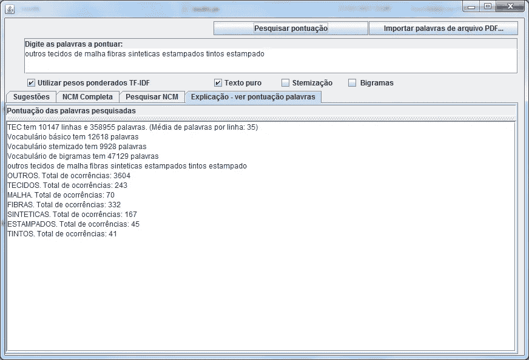

在这里，我们开始了一个简单的搜索，只输入“其他组织”并点击“搜索分数”
请注意，将鼠标指针停留在列表项上，会打开一个小窗口，其中包含该行和在搜索行中找到的每个单词以及每个单词的分数。

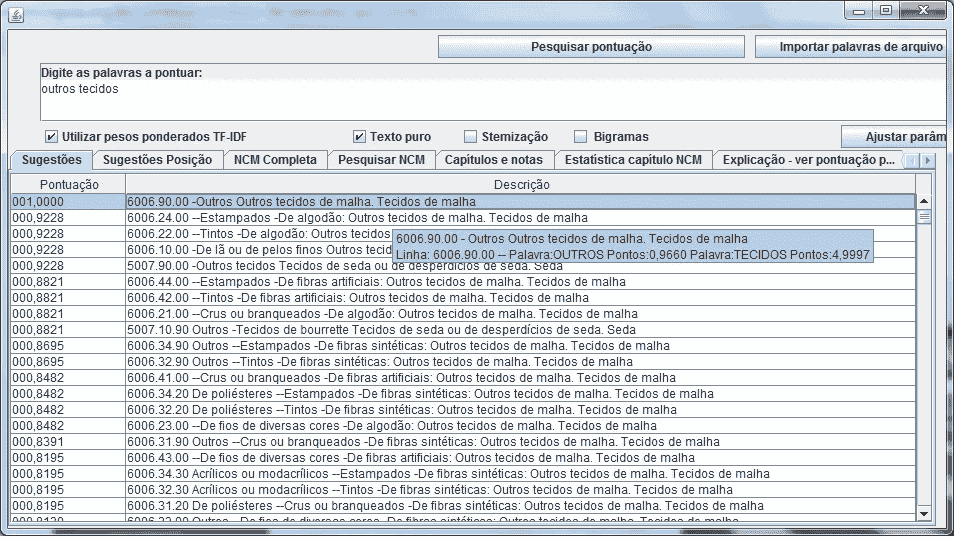

第二步，我们开始细化我们的搜索。请注意，单词“fabric”和“red”得分较高。


在搜索中添加“棉花”一词

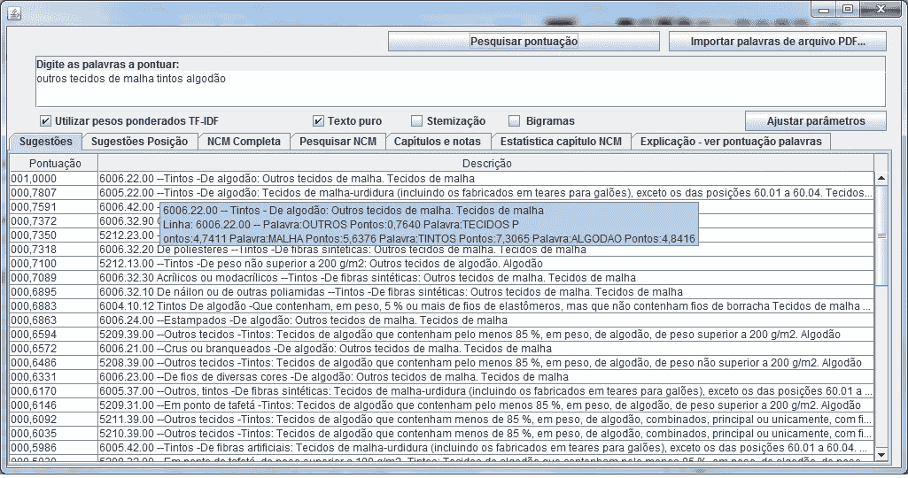

在这里，我们选择“解释”选项卡来了解每个分数的原因。每个单词的分数总是与它的总出现次数成反比。

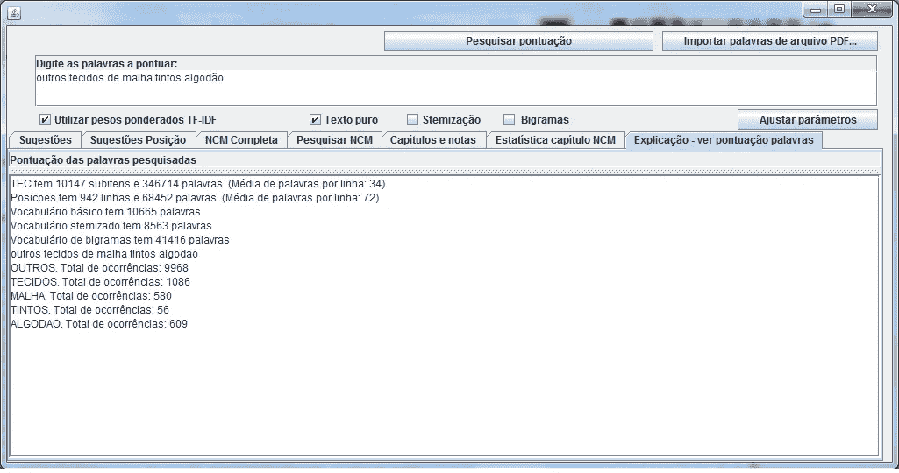

查看“位置”选项卡的结果

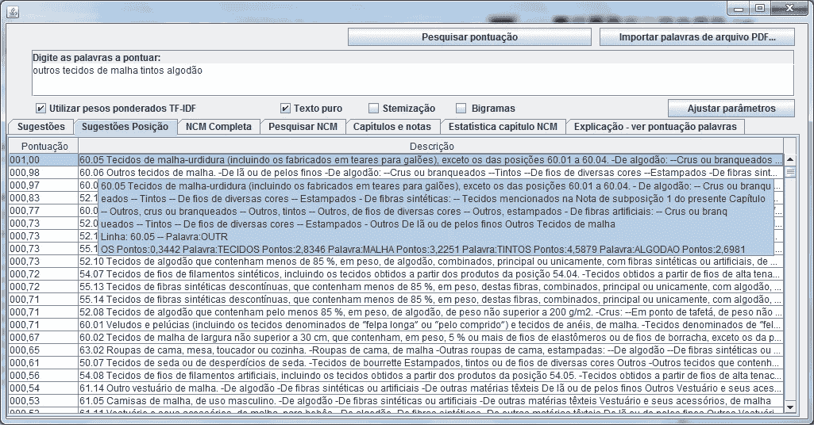

修改对其他类型组织的搜索:

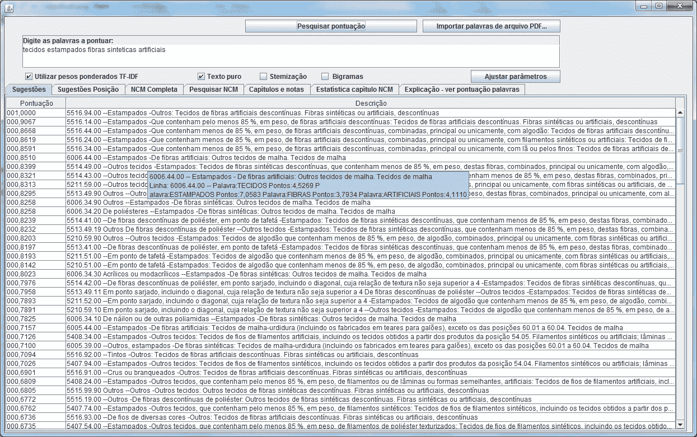

可以用感叹号(！)这个词搜索之前。因此，这个单词的分数将变成负数，包含这个单词的行将排到列表的末尾。

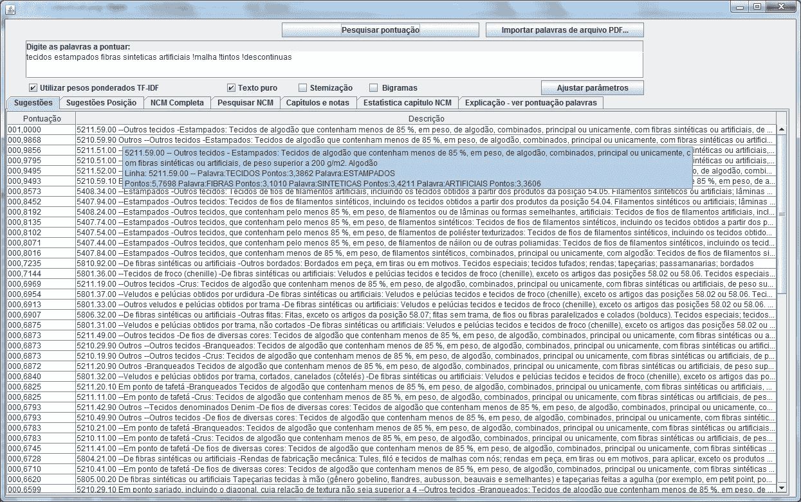

下面是“NCM 完成”标签，如果有疑问，您可以在这里检索 TEC 的完整文本

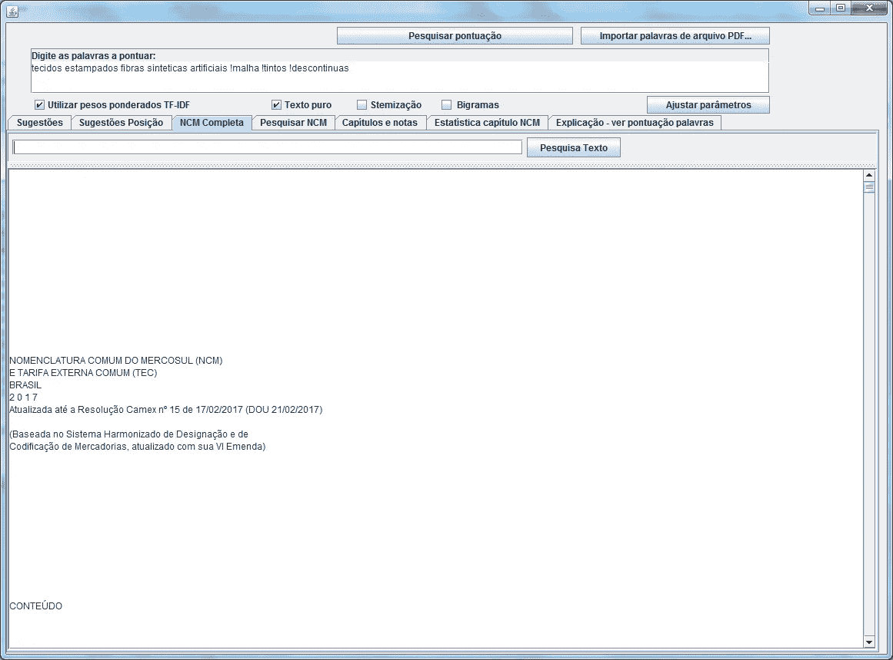

“搜索 NCM”选项卡分层显示 NCM。


“章节和注释”选项卡允许您更方便快捷地查询每个章节、描述和注释

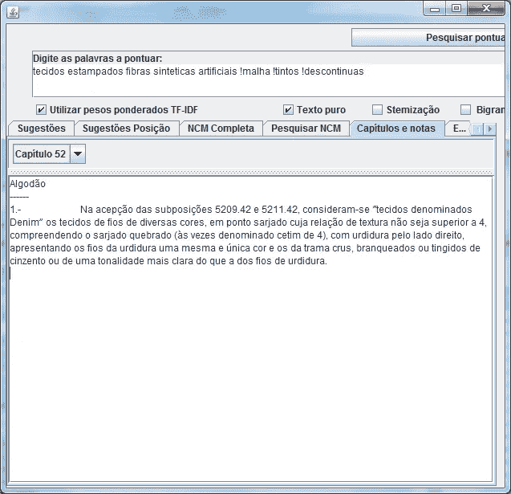

在“统计章节 NCM”选项卡中，可以看到各章节中巴西进口的原产国百分比。


以下屏幕显示了其他研究、结果、统计数据和分数，以展示使用的可能性

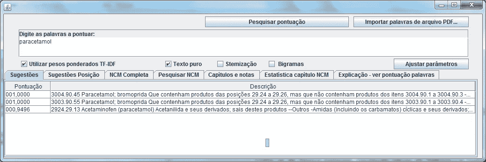

取自报告的复杂描述在第三个列表中显示所需的结果。注意，这个结果主要不是因为这一行，在 TEC 的“环氧树脂”中使用了“环氧树脂”和“环氧树脂”这两个词。炮泥找到了激进分子，但没有找到“树脂”和“环氧树脂”这两个词。并不总是单独解决词干问题，因此查看每行分数的系统返回并优化搜索很重要。

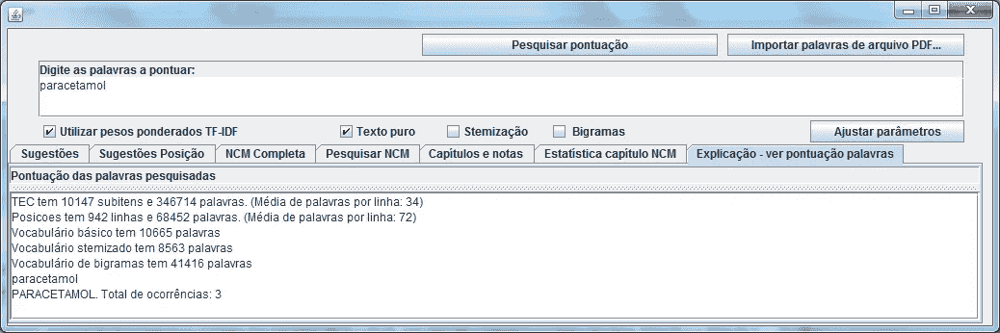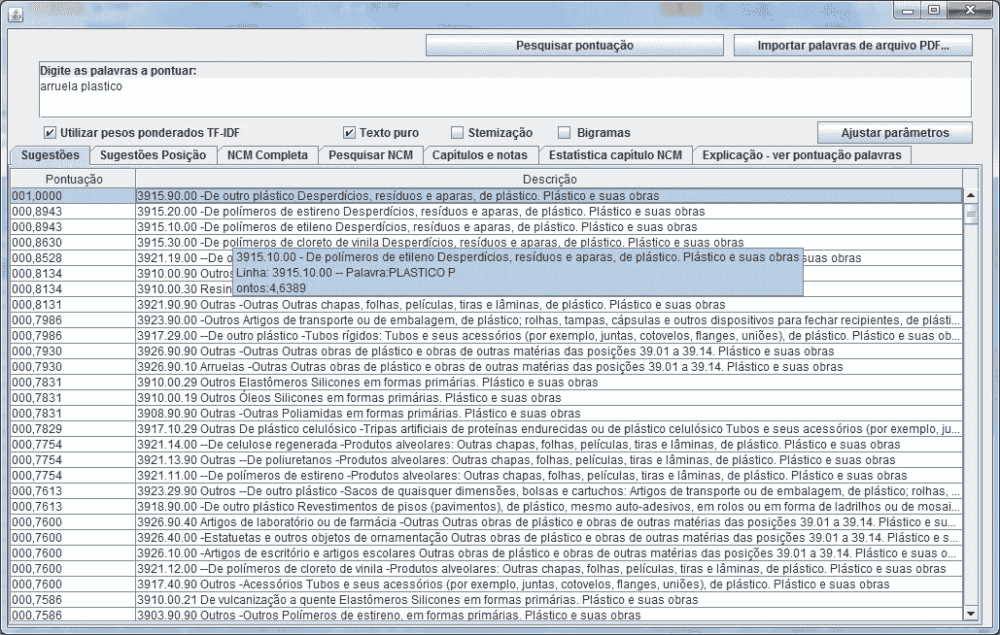

细化的一个例子:把“垫圈”换成“垫圈”，或者找两个术语。去掉“金属”一词，只需要塑料。

在下面的例子中，词干分析也解决了搜索问题。尝试各种组合，直到在第一行找到想要的子项，这比向下滚动几行更有趣。

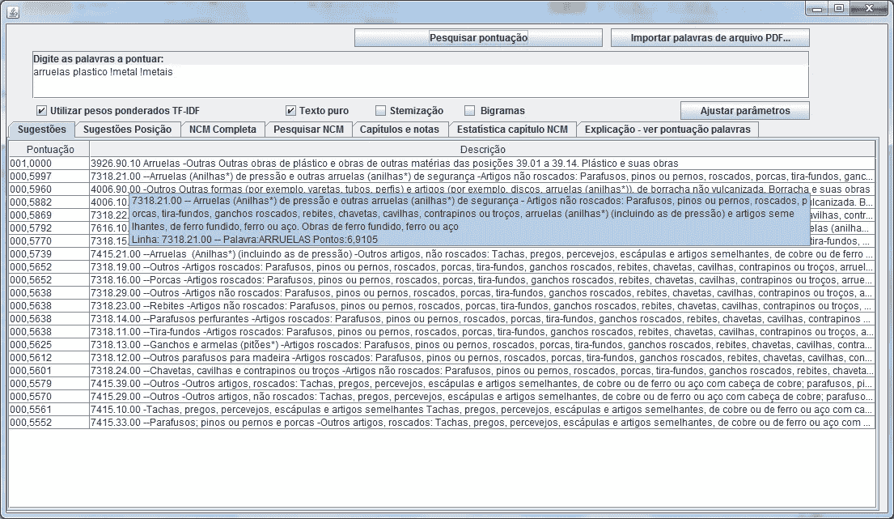

# 第四部分

这部分讨论已经实施的技术的替代和/或补充。

Java 版本在汇编词汇表时已经实现了词干分析、二元模型和单元模型，并且在排序时提供了组合这些方法的可能性。此外，还实现了与 NCM 国家历史统计数据相结合的可能性。还应用了词库和词干来减少词汇量。

其他可能性是使用聚类，通过 k-means 或其他方法或通过层次结构，对整个章节和位置评分，例如，索引反转数据库以允许搜索单词的部分；通过 PCA 等降维，然后用回归树、SVM 或者甚至普通或递归神经网络进行排序。

就使用排名中的其他数据而言，除了原产国，NCM 还可以通过大约日期的*趋势*生成制造商、经济区域、运输的统计数据，而不是几年的统计数据。

所有的技术都可以与“集合”或简单地将结果相乘的方法相结合。在乘法的情况下，一个好的做法是在标准化结果之前。示例:

克服集合“listaTECResumo”中的一些文档太短这一事实的一种方法是以已经为子项目创建的相同方式为位置创建文档，并以相同方式排序。然后把位置的分数乘以每个分项的位置。为了在不考虑字数的情况下平等对待，首先将结果标题列表标准化，并细分所有得分行以获得最高得分的文档得分(因此，列表的第一个位置将是 100%，第二个位置稍低，以此类推)。)

除了新的评分可能性、产品组合和 *ensenblimg* 之外，您还可以创建测试示例“地面实况”，然后使用机器学习来改进参数和/或通过使用精度和召回 F-score 的评估技术、应用加权排名评估(评估方法克兰菲尔德/加权平均精度和召回)来发现已经实施的方法中的缺陷。

一旦进行了测试和改进，GitHub 上将会提供其中的一些替代方案，并在本文中进行讨论。

# 参考

[](http://dl.acm.org/citation.cfm?id=2915031) [## 文本数据管理与分析:信息检索与文本应用导论

### 编辑描述

dl.acm.org](http://dl.acm.org/citation.cfm?id=2915031) [](http://www.cambridge.org/catalogue/catalogue.asp?isbn=0521865719) [## 信息检索导论—剑桥大学出版社

### 类测试和连贯，这本教科书教经典和网络信息检索，包括网络搜索和搜索引擎。

www.cambridge.org](http://www.cambridge.org/catalogue/catalogue.asp?isbn=0521865719) [](http://www.springer.com/la/book/9783642142666) [## 学习信息检索排名|刘铁燕|斯普林格

### 由于网络的快速增长和查找所需信息的困难，高效和有效的…

www.springer.com](http://www.springer.com/la/book/9783642142666) [](https://www.coursera.org/learn/text-mining) [## 文本挖掘和分析| Coursera

### 关于本课程:本课程将涵盖挖掘和分析文本数据的主要技术，以发现…

www.coursera.org](https://www.coursera.org/learn/text-mining) [](https://www.coursera.org/learn/text-retrieval/) [## 文本检索和搜索引擎—伊利诺伊大学香槟分校| Coursera

### 关于本课程:近年来，自然语言文本数据急剧增长，包括网页、新闻…

www.coursera.org](https://www.coursera.org/learn/text-retrieval/) [](https://www.udacity.com/course/intro-to-machine-learning--ud120) [## 机器学习课程简介| Udacity

### 免费课程模式识别的乐趣和利润开始免费课程机器学习是一个一流的门票…

www.udacity.com](https://www.udacity.com/course/intro-to-machine-learning--ud120)*