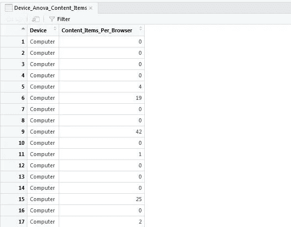
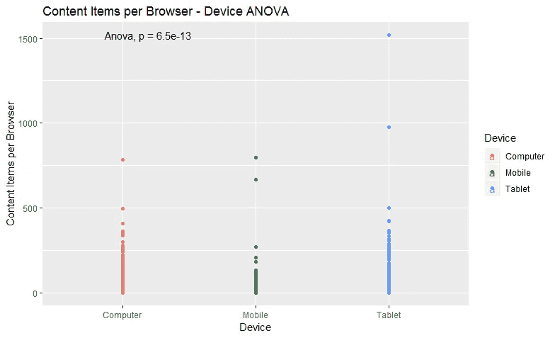

# 利用数字实验数据进行方差分析

> 原文：<https://towardsdatascience.com/using-analysis-of-variance-with-experimentation-data-40142980d5d8?source=collection_archive---------18----------------------->

*单向方差分析(ANOVA)用于确定两个或两个以上独立(不相关)组的均值之间是否存在任何统计上的显著差异(尽管你倾向于只在至少有三个而不是两个组时使用)。*

从以前的学者生涯进入数字分析领域——学习了生物力学和统计学——我有很多问题，关于我以前学到的统计技术如何融入我的“日常工作”。鉴于 Optimizely 的统计引擎使用连续的 AB 测试方法来比较两个或更多独立组的平均值，没有理由(只要流量允许)不能对分段数据执行方差分析(ANOVA ),以检测人口统计数据、设备、平台或区域数据之间的统计差异。

为此，本文将既是对这些方法的探索性报告，也是如何执行这种分析的逐步说明，前提是您已经与 AB 供应商建立了分析集成。

首先，确保你的分析集成正确地标记了然而你的流量是通过你的实验供应商节流。通过这种方式，您将能够拥有一个初始段，该段根据实验条件(即您正在执行分析的变化)来分离您的数据。确保您正确实施了标记，也意味着您可以跟踪您的指标。这对于 ANOVA 如何收集和组织数据至关重要。数据将处于浏览器级别(每个用户的单独数据点)，但出于本指南的目的，我将数据导出显示为未折叠，因此您可以看到我将测试的组。为了这个分析的目的，我将着眼于我的一个实验组/变体的设备/平台比较；我们就叫它**AAT7:**

当这些数据折叠起来时，您可以看到各个浏览器和各种指标的性能。出于本指南的目的，我已经忽略了各个浏览器 ID。我不太擅长用颜料，所以我用山谬·里维的《突破点》把它们抹掉了:

在本文中，我将使用我们的每个浏览器的*内容条目*指标。通过进行 ANOVA，将计算该指标的平均值，因此对于我们的 ***AA*** 条件，我们将得到每个设备/平台的每个浏览器的平均*内容项。这将告诉我们，对于该实验条件，每个设备/平台之间是否存在统计上的显著差异；这可以提供关于设备如何针对这种特定的 web 变化而执行的更加精细的统计分析。然后，您需要从您的分析工具执行数据下载，删除浏览器 ID(现在不需要 Keanu)和任何不感兴趣的指标。对于这种形式的分析，我将使用 *R，* so import your。csv 或。xlsx 到您的 *R* 环境中:*

我们现在将执行单向 ANOVA，从而在实验组(设备/平台)之间比较相同的指标(*每个浏览器的内容项目)*)。在 RStudio 中，你需要安装“stats”包。在某些时候，您可能希望开发一些脚本来自动处理数据，但对于本指南，您可以使用以下语法来执行单向方差分析:

您会希望将其分配给 R 中的一个新项目，这意味着您可以执行汇总分析以及可视化和事后程序:

对您的新项目调用 *summary* 将会得到以下输出:

您可以看到 *R* 为您提供了重要的代码，因此您可以分析 ANOVA 的总体效果。在这种情况下，我们寻找一个小于 0.05 的 *p* 值来检测统计上显著的影响。正如所见，我们在这个实验中的 *p* 值小于 0.001，这意味着我们在这个方差分析中有一个非常显著的 *p* 值。因此，我们可以自信地得出结论，在这个实验条件下，设备/平台类型和每个浏览器的*内容项*之间存在显著差异。确定统计分析如何帮助您对细分市场进行更精细的分析。

然而，这种整体输出并没有告诉我们显著差异在哪里，因此我们可以执行 Tukey 多重成对比较(事后分析)，这是一种可以识别差异存在的工具。其语法和输出应该如下所示:

从上面的输出可以看出，对于我们的 *AA* 变量( *p* < 0.05)，移动设备的表现明显比平板电脑和电脑差。这为我们提供了关于该实验条件下这些设备/平台之间的统计差异的宝贵信息。由此我们可以得出 UX 对这种变化的考虑；这可能是因为 *AA* 在移动设备上存在可用性或功能性问题(例如，它无法正确适应屏幕，它可能会在页面上移动项目)。这种分析意味着您可以将结果提供给利益相关者，他们随后可以执行后续的 web 分析，以评估移动设备性能如此之差的原因。

我很快在 *ggplot* 中绘制了一个图(请安装 *ggplot2* 来执行这个分析)，只是为了描绘出这些数据绘制时的视觉效果。使用 *stat_compare_means* ，您可以将方法设置为“anova ”,这将在您的图上显示您的 *p* 值:

我知道上面的图显示了一些明显的统计异常值，我们将来可能会忽略这些异常值；但我只是想从视觉角度展示数据可能是什么样子——正如您可以看到的，移动设备的性能明显比其他设备差。我将在不久的将来发表一篇关于数据清理的文章。类似地，在执行方差分析之前，您还将调查您的数据的分布——这将是我将来与大家分享的另一篇文章。我要强调的是，这只是一个基本的一步一步的方法，你可以通过数字数据下载对你的细分市场进行统计分析。本文中讨论的方法可以帮助您更客观地描述不同变化下的细分市场表现，而不是单独呈现趋势和提升。

我期待每个人对这份报告的建设性反馈。我期待在不久的将来，随着更多 90 年代动作片英雄的出现，浏览器 id 将会消失。