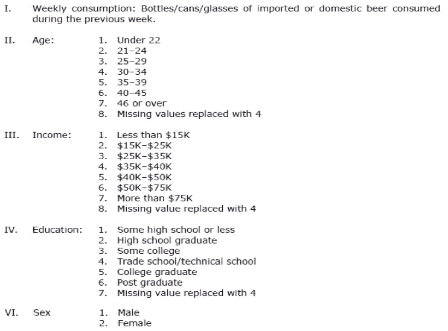
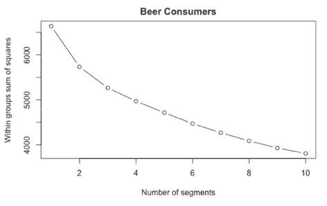
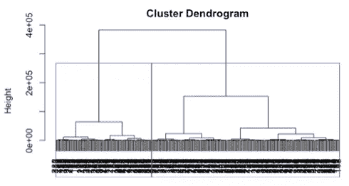
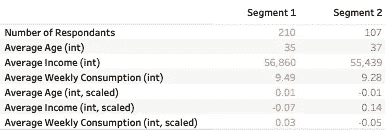
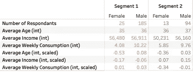
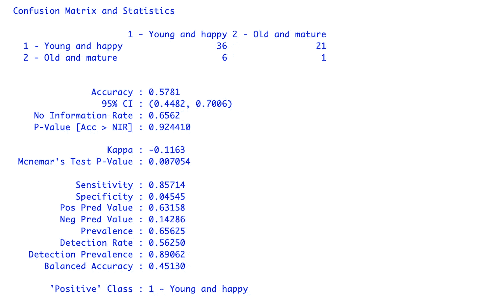
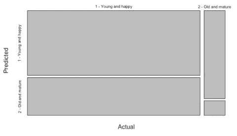
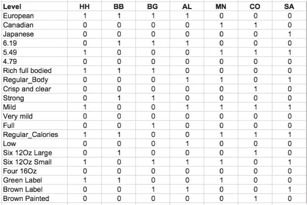
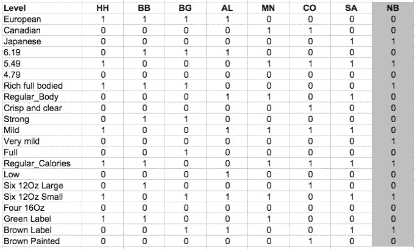
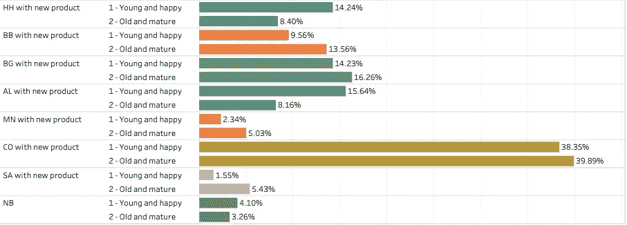

# 使用联合数据

> 原文：<https://towardsdatascience.com/using-conjoint-data-371b237f7533?source=collection_archive---------17----------------------->

德瓦希什·迪曼&维克拉姆·德瓦塔

联合分析有助于确定消费者如何评价产品的不同属性。这是一种常用的统计技术，用于模拟新产品发布时的消费决策和产品市场份额。在这里，我们将联合分析的原则应用于 Partworth 的数据，这些数据来自对 7 个知名啤酒品牌的 317 名受访者的调查。以下是我们处理这个话题的方式:

首先，我们探索数据集，以更好地理解应答者的人口统计数据。接下来，我们根据给定的 Partworth 数据对啤酒品牌进行细分，并使用这些数据对每个细分进行个性化。然后，我们尝试判别分析，以检查该模型是否可以用来分类新的反应。我们计算目前的市场份额，以及当一种新啤酒在同一个市场推出时，市场份额如何变化。根据市场份额的变化，我们确定了新啤酒品牌的最佳细分市场。

这里有原始数据:【https://goo.gl/nP91hF】T2。Tableau 和 R 是本分析中使用的主要工具。

## **探索人口统计**

数据集中提供了以下人口统计详细信息:

年龄直方图显示，大多数受访者年龄在 30-45 岁之间。年龄变量的箱线图显示它有轻微的偏斜，没有异常值。

大多数受访者收入超过 50，000 美元，没有异常值。尽管该分布显示了左偏斜，但它并没有大到足以保证对数变换。

类别变量(年龄和收入)通过取类别平均值转换成整数对应变量。年龄变量的第一类被假定为“21 岁以下”，而不是数据集中给定的“22 岁以下”。

“每周消费量”直方图显示，大多数受访者在任何给定的一周内消费不到 10 瓶啤酒。箱线图揭示了几个异常值，但考虑到领域(“啤酒”)和数据生成过程(“消费模式”)，我们选择不转换数据，并保留异常值。

大多数受访者是大学毕业生，其次是研究生。缺少值(用' 4 '代替)的很少，用'高中'及以下的很少。数据集的男性数量明显多于女性，任何建议都需要牢记这一点。

## 根据 Partworth 数据对品牌进行细分

我们对 Partworth 数据使用 K-Means 聚类，为不同数量的聚类生成“组内平方和”的 scree 图，如下所示。我们找不到一个显著的弯头来给出最佳分段数的直观感觉。

我们尝试使用 3 个段和 4 个段进行聚类，但我们发现用 2 个段描述数据最好。由于数据集很小，我们使用凝聚层次聚类使用欧几里德距离与病房的方法。我们将树分为两段，如下所示:

导出结果成员数据，以便在 Tableau 中可视化和描述受访者。

## 拟人化并描述每个片段

我们将人口统计数据与从聚类算法中获得的成员详细信息“连接”在一起，注意如下:

与细分市场 2 中的受访者相比，细分市场 1 中的受访者年龄略小，收入略高，啤酒消费量也更多。进一步按性别区分，我们得到以下结果:

平均而言，在这两个群体中，男性年龄更大，收入更高，每周消费更多瓶啤酒。然而，第二部分的男女平均收入差距大于第一部分，而第一部分的男女平均周消费差距大于第二部分。

基于以上所述，我们将分段 1 命名为“年轻快乐”，分段 2 命名为“年老成熟”。

通过在 Tableau 中可视化按比例缩放的 Partworth 数据，并使用细分成员数据按颜色区分，我们获得以下金字塔图。

我们发现，“老熟”更喜欢价格为 5.49 美元的普通酒体、日本或加拿大啤酒，具有普通卡路里和浓郁的余味，而“年轻和快乐”则倾向于喜欢欧洲的醇厚啤酒，酒体清脆、清澈，余味温和。

我们可以计算每个回答者赋予每个属性的重要性，即。分配给属性级别的 Partworth 实用程序的范围除以总数。将这些数据导入 Tableau 有助于我们直观地了解每个细分对每个属性的相对重要性，如下所示。

虽然这两个部分似乎对所有属性给予了同等的重视，但我们看到年轻和快乐的人比其他部分更重视啤酒中的卡路里数，而年老和成熟的人比其他部分更重视杯子。

## 执行判别分析

人口统计数据中的描述符可用于基于以上获得的片段执行判别分析。我们尝试了线性判别分析(又名 Fischer 判别)来区分这两个细分市场，并使用该模型来预测新消费者将属于哪个细分市场。人口统计数据与细分成员数据“结合”，然后分成训练和验证数据集(比例为 80:20)。

使用来自 r 中质量包的 lda 函数进行线性判别分析。区段 ID 作为类别变量(因变量), 5 个分类变量(年龄、教育程度、性别、收入和每周消费)作为解释变量。结果如下所示:

下面给出了来自训练集的混淆矩阵:

准确率仅为 69.57%，实际错误率(AER)为 30.43%。然后将 LDA 模型应用于验证数据集，以测试其有效性。获得了以下结果:

准确率仅为 57.81%，实际错误率(AER)为 42.19%。线性判别分析似乎不能很好地处理给定的数据集，我们不建议使用该模型来区分两个细分市场中的新消费者。

## 计算目前的市场份额

每位受访者对某一属性的重视程度被用来计算他/她消费某一品牌啤酒的可能性。每个啤酒品牌的属性和级别用于创建二元矩阵，如下所示:

每个应答者的 Partworth 效用与上述二进制矩阵交叉相乘，然后取幂。通过计算每个品牌占总和的比率，我们获得了新产品发布前每个品牌的市场份额。

目前的市场份额也按细分市场进行了分析，如下所示

虽然大多数品牌在每个细分市场的份额几乎相同，但我们观察到 HH 和 al 在细分市场 1(年轻和快乐)的渗透率更高，而 BB、BG、MN 和 SA 在细分市场 2(成熟和成熟)的表现可能更好。

## 计算新的市场份额

如果一个新品牌 NB 被引入市场，那么新产品被插入二元矩阵，如下所示:

可以通过新品牌的潜在渗透率来重新计算市场份额，即每个受访者的 Partworth 效用与二元矩阵相乘，然后取幂。新产品发布后，每个品牌占总市场份额的比率。新的市场份额如下:

市场份额减少情况汇总如下:

## 选择目标细分市场

按细分市场划分的新市场份额如下所示。

我们还比较了新啤酒品牌发布后的市场份额变化，如下所示:

由于新品牌的出现，HH、BB、AL 和 s a 的细分市场 1(“年轻和快乐”)的市场份额有所下降，而 HH、BB 和 SA 的细分市场 2(“老和成熟”)的市场份额有所下降。新啤酒品牌在“年轻快乐”人群中占有 4.10%的市场份额，在“老年成熟”人群中占有 3.26%的市场份额，这使得瞄准细分市场 1 比细分市场 2 的利润略高。

此外，由于这一部分有较高的平均收入和较高的平均每周消费，这是一个更好的选择给定的两个部分。由于数据集中男性数量明显多于女性，因此上述分析可能更适用于男性。因此，该公司可以将目标锁定为“年轻快乐的男性”，年龄 36 岁，年收入 56-57 万美元，平均每周消费 10 瓶啤酒。

## 关于我们

在 LinkedIn 上找到我们，地址是[https://www.linkedin.com/in/devashishdhiman/](https://www.linkedin.com/in/devashishdhiman/)和[https://www.linkedin.com/in/vikramdevatha/](https://www.linkedin.com/in/vikramdevatha/)

## 参考

Orme，B. (2010 年)。解释联合分析的结果。在 B. Orme，*联合分析入门:产品设计和定价研究策略*(第 77-88 页)。美国威斯康星州麦迪逊:研究出版有限责任公司。可从这里获得:[https://sawtooth software . com/resources/books/getting-started-with-combint-analysis](https://sawtoothsoftware.com/resources/books/getting-started-with-conjoint-analysis)

PPT 实验室。(2014 年 2 月 25 日)。*为什么消费者不买:产品采纳心理学。*从 PPT 实验室检索:[http://PPT Lab . com/PPT/Why-Consumers-don-Buy-The-Psychology-of-The-New-Product-Adoption-16](http://pptlab.com/ppt/Why-Consumers-Dont-Buy-The-Psychology-of-New-Product-Adoption-16)

Qualtrics。(2018).*什么是联合分析？联合类型&何时使用*。2018 年 11 月 5 日检索，来自 qual trics:[https://www . qual trics . com/experience-management/research/types-of-connect/](https://www.qualtrics.com/experience-management/research/types-of-conjoint/)

维基百科。(2018 年 10 月 24 日)。*联合分析*。2018 年 11 月 9 日检索，来自维基百科，免费百科:[https://en.wikipedia.org/wiki/Conjoint_analysis](https://en.wikipedia.org/wiki/Conjoint_analysis)