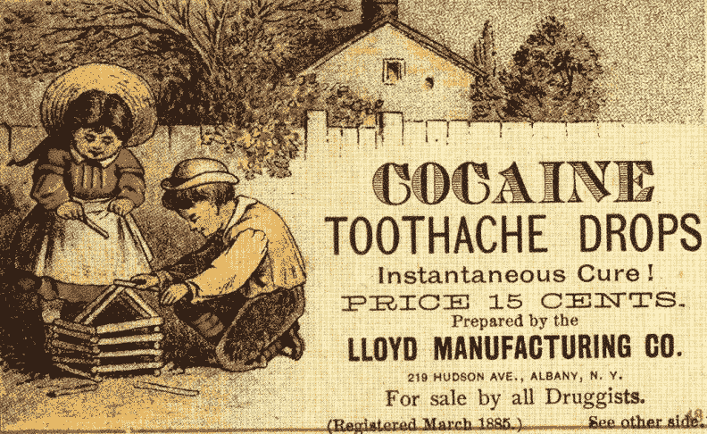
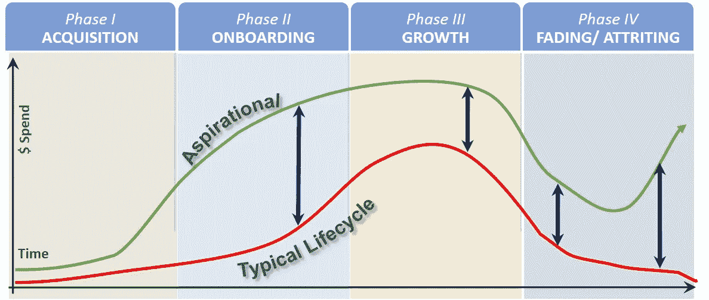
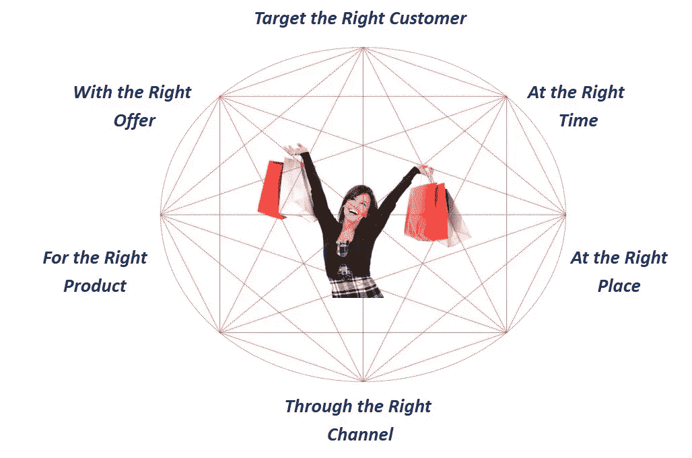
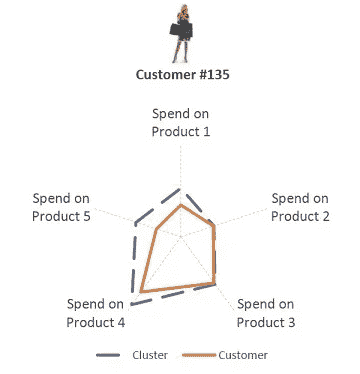

# 利用数据科学实现营销效率的成倍增长

> 原文：<https://towardsdatascience.com/using-data-science-to-achieve-a-multifold-increase-in-marketing-effectiveness-ebe25da7b00e?source=collection_archive---------7----------------------->

在随着技术的出现而改变的所有商业方面中，也许最深刻地受到影响的是营销的作用。营销人员可以简单地通过在杂志上刊登整版广告、在镇上张贴明亮的广告牌，甚至与迷人的名人签约拍电视广告来吸引顾客的日子已经一去不复返了。由于大量客户数据的可用性和数据科学工具的结合，今天的营销人员有能力比过去更加有效。建立对各种可能性的理解将极大地丰富任何营销人员的工具箱。

最根本的变化之一是客户细分观念的转变。我们现在生活在一个 ***【一个人的一部分】*** 的时代，每个顾客都是自己的一部分。公司和品牌对目标个人的理解要深刻得多，甚至可以说是亲密得多，这使他们能够个性化地对待每一位顾客。能够有效地做到这一点的第一步是建立对典型客户生命周期的理解。虽然客户生命周期可能有行业特定的细微差别，但大致代表如下:

Image 1: Phases of a Customer Lifecycle

红线代表典型客户将如何经历这些阶段。在获得客户后，他们的消费会随着品牌/产品的加入而增加。在经历“增长”阶段时，It 部门的支出会有一定程度的快速增长，直到客户脱离并走向流失时，支出才开始减少。

绿线是营销人员希望引导这类典型客户的途径，即理想客户生命周期。每个阶段都要求营销人员采取独特的方法来弥合红线和绿线之间的差距。

## 阶段 1:获取新客户

> 目标:确定正确的目标潜在客户。通过最有可能对每个人起作用的方式来锁定目标。

作为一个数据问题，获取可能是最棘手的。在这一阶段，你的目标客户尚未与你进行交易，因此还不属于你的数据生态系统。这极大地限制了你对他们的了解。幸运的是，人们可以使用数据库，有时是免费的，但通常是收费的。

一旦你有了可用的数据，就可以挖掘出最符合你的理想客户特征的目标。在这个阶段，由于你几乎没有关于实际购买行为的数据，你必须主要关注人口统计信息。令人欣慰的是，在大多数情况下，基本的人口统计数据能够相当准确地识别目标。人口统计数据可能包括大量参数，如性别、年龄、位置、婚姻状况、家庭规模、教育、职业等。

既然已经确定了目标客户，我们就可以进入第二个关键目标，即寻找目标客户的最佳方式。用更专业的术语来说——我们如何最大化“转化率”。同样，由于现阶段数据有限，人们将不得不依靠代理指标来设计收购活动。一个有效的替代方法是分析对以往收购活动的历史反应，看看哪些措施对微观群体有效。如果没有交易或行为数据，微观群体可能只需要通过人口统计学来定义。例如，如果在过去的某个周末，18-24 岁的男性学生通过外拨电话获得了最高的转化率，那么我们也可以将此用于潜在的营销活动。

## 阶段 2:新客户入职

> 目标:深入了解客户。还有，勾住他们，建立忠诚度。

从营销人员的角度来看，这可能是最关键的阶段。到现在为止，你已经成功地争取到了一个新客户，所以你已经迈出了第一步。他们现在需要培育和发展，以便相互关系变得富有成效。把它想象成第一次约会——如果你想有第二次、第三次和第四次约会(作为一名营销人员，你总是希望这样！)，那么你最好确保在最初的交流中你把球打出了公园。

为了能够做到这一点，你首先需要了解客户。这可能包括人口统计方面的更多细节，但也包括其他内容，包括:

*   交易细节(Transactional Details):他们买了什么，花了多少钱，如何付款，他们是在网上购买还是在商店购买，等等。
*   **行为参数**:他们是否倾向于寻找折扣/便宜货，他们一起购买什么类型的商品，他们更喜欢在工作日还是周末购物，等等。
*   **体验细节**:他们是否谈论过他们的体验(例如在社交媒体上)，是积极的还是消极的，他们最近是否与客户支持人员交谈过，等等。

通过捕捉人口统计、交易、购买行为和体验等所有这些方面的细节，营销人员将开始深入了解客户。除此之外，这种做法还有助于确定客户的“钱包大小”——类似于定量评估他们在你销售的产品类型上可能会花多少钱。你也可以开始初步了解是什么让他们这么做的——他们喜欢打折还是免费？他们是只为自己还是家人购买？他们通常买很多小东西还是去大采购？

虽然忠诚度计划本身是一个独立的话题，但有必要提及的是，在入职阶段，将客户注册到忠诚度平台可能非常有用——这不仅能够实现更丰富的数据采集，还有助于建立客户粘性——这是整个入职阶段的主要目标。

## 第三阶段:增长

> 目标:最大化每个客户的潜在收入。

市场营销人员最喜欢的客户生命周期阶段！客户已经进来了，他们已经尝试和测试，并喜欢他们所看到的，你们都很好地理解对方，一切都很好。他们会更频繁地购买更多的东西，从而增加他们在你身上的总支出。因此，这一阶段的挑战是，随着客户的成长，如何增加他们自己的支出。

为了实现这一点，营销人员专注于优化他们的营销活动，以便针对每个客户，他们能够击中所有正确的触发器。

Image 2: Getting it Right!

有许多分析方法可以用来设计活动。让我们来关注这样一种方法，它经常被使用并且被发现非常有效——聚类分析。前提很简单:

*   通过某种形式的聚类模型识别行为相似的客户，即构建聚类 DNA

*Image 3: Identifying Different Clusters and Cluster DNA*

*   将每个个体客户的 DNA 与其集群的 DNA 进行比较，并根据个体客户偏离集群行为的地方采取行动。

Image 4: Cluster DNA vs. Customer Behavior

也可以应用其他模型和方法，以便为每个客户确定正确的触发因素。事实上，一项活动的有效性是通过利用一整套分析技术而不是专注于任何一种方法来最大化的。

## 阶段 4:衰落和损耗

> 目的:识别客户流失的**【预警信号】**，并及时采取干预措施，重新吸引流失的客户。

生命周期的这个阶段经常得不到应有的关注，这很不幸。经常被忽视的事实是，重新获得一个失去的客户的成本几乎与获得一个新客户的成本一样高，而挽救一个逐渐消失的客户的成本要低得多。

早期预警信号可以通过多种方式表现出来，理想的目标应该是发出危险信号并进行干预。衰落信号的一些例子:

*   客户总支出下降
*   购买频率降低
*   减少客户购买的典型产品篮
*   负面客户体验
*   类似于过去流失的其他客户的行为

虽然最基本的营销用例仍然是关于获取客户、增加参与度和防止流失，但营销人员当然可以通过利用数据科学或人工智能驱动的应用程序来实现多个其他目标——情感分析、产品捆绑、定价优化、忠诚度分析等。举几个例子。

随着技术工具(如客户关系管理系统、忠诚度平台、活动管理工具、复杂的销售点系统等)的激增。)围绕客户接触点捕获丰富数据的可能性很大。这个数据是营销人员的金矿。使用它，结合强大的数据分析支持的战略，提供了大量的机会来激发组织内营销职能的效力。我们只是触及了表面——可能性是无限的！尤其是一旦机器学习驱动的人工智能应用开始成为营销人员工具包的主流。