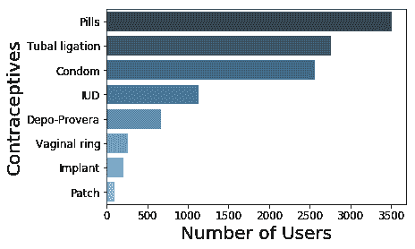
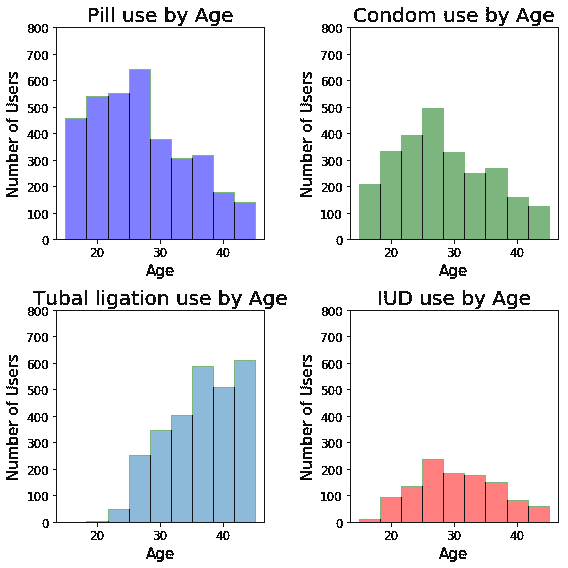
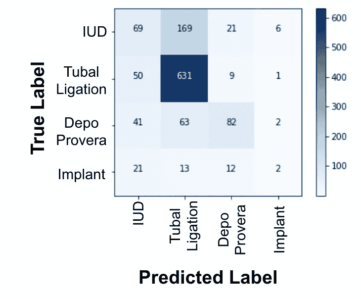
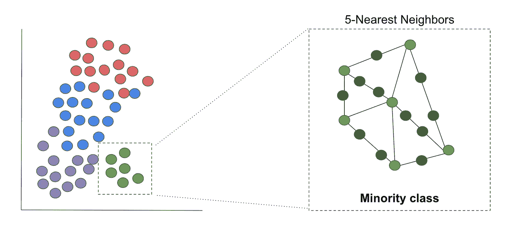
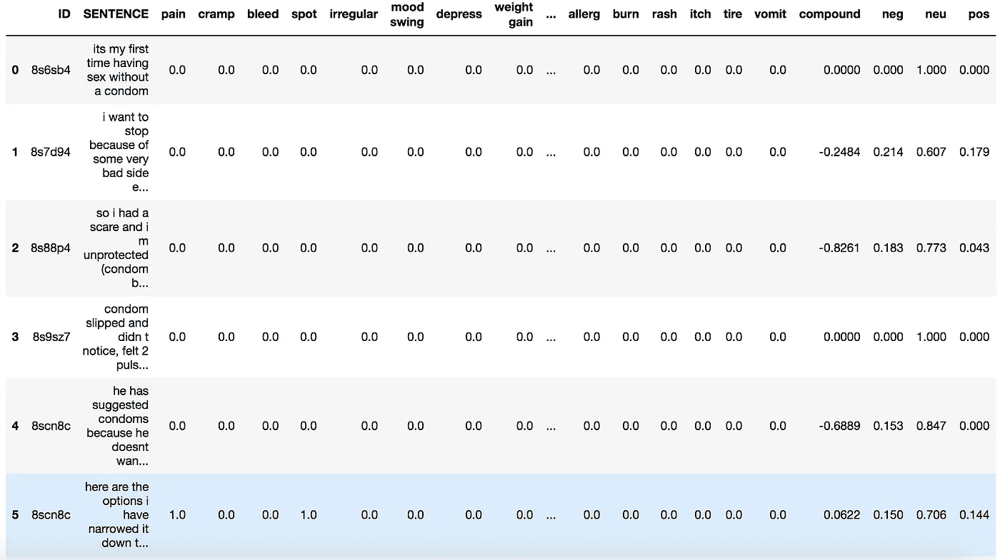
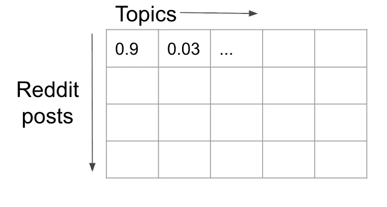
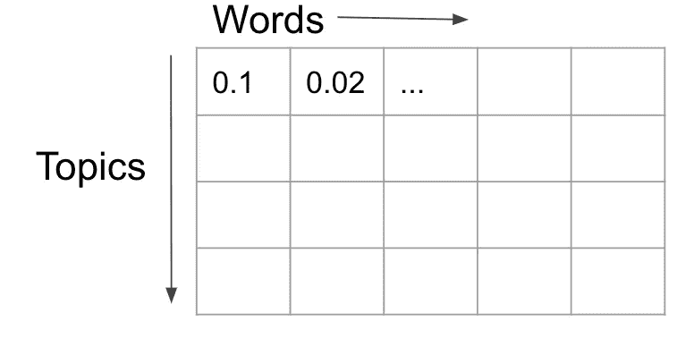
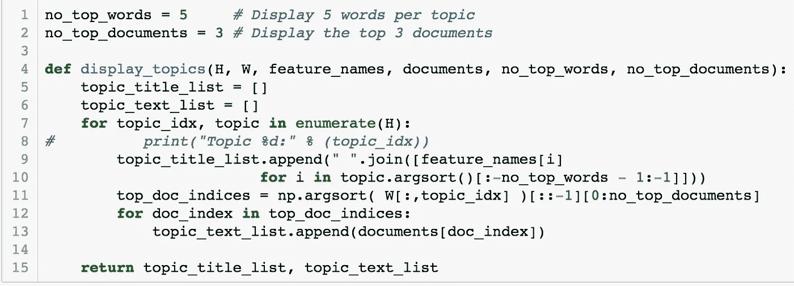

# 利用数据科学帮助女性做出避孕选择

> 原文：<https://towardsdatascience.com/using-data-science-to-help-women-make-contraceptive-choices-8673eb9cdbfd?source=collection_archive---------10----------------------->

你或你认识的人是否曾花数小时担心什么样的避孕药最适合你，并想知道它们的副作用是什么？你是否浏览过无数的在线论坛，试图了解其他女性对避孕药的感受？我自己也经历过这种情况，所以在为期 4 周的[洞察数据科学](https://www.insightdatascience.com/)项目中，我决定开发一个工具来帮助女性做出这些明智的决定！我从波士顿洞察研究员和项目总监那里学到了很多，没有他们我不可能开发出这个应用！

我的 [webapp](http://www.choose-wisely.org) 是为了做三件事而构建的:

1.  根据其他女性使用的避孕方法，向女性推荐避孕方法
2.  分析其他女性对每种避孕药的副作用的感受
3.  显示与避孕药相关的最热门的话题

让我们来分解一下这三个部分。

# **第一步:建议避孕**

我的目标是能够根据其他像她们一样的女性使用的避孕方法向她们推荐避孕方法。为了做到这一点，我使用了全国家庭增长调查中几年的数据。该调查是分批进行的，每一批都跨越 3-4 年的收集数据(2006 年至 2015 年)。这项全国性调查包含来自妇女的报告信息，包括她们的人口统计数据和她们当时使用的避孕药具。一旦我把每次调查的数据合并成一个熊猫的数据框架，我采取了一些步骤来清理它。

## *数据清理:*

1.  更改了避孕药的名称，以匹配不同批次的采集。例如，“植入”和“Nexplanon 和 Implanon”被简单地改为“植入”
2.  删除各个字段中带有 NAs 的行

清理之后，我只剩下了大约 12000 名女性的数据。

## *探索性数据分析:*

我决定从一些探索性的数据分析(EDA)开始。下面是一些图表，显示了每种避孕药具的使用者人数，以及按年龄组分列的每种避孕药具的直方图。

Number of Users of Each Contraceptive Type

Examples of Contraceptive Use by Age

显然，一些避孕药比其他的更受欢迎，使用更频繁，导致了阶层之间的不平衡。我们可以尝试在项目的建模部分解决这个问题。

## 特点:

一些特征包括年龄、种族、婚姻状况、伴侣数量等。我对我想要制造的工具想了很久，并且知道除非使用我的工具的妇女输入所有必要的信息，否则我将无法推荐避孕药，并且询问性伴侣的数量将会太具侵犯性。出于这个原因，我选择在我的模型中只包含三个特征:年龄、种族*和婚姻状况。因为有几种类型的婚姻状况(“分居”、“已婚”、“同居”、“丧偶”等)。)，我将他们分为三个层次，概括了所有这些类型的关系——单身、已婚或恋爱中。此外，使用 sklearn 预处理对种族进行了一次性编码。

我们准备好做模特了！

*使用这个数据集的一个不幸的限制是只有三个种族——白人、黑人和西班牙裔。要么只有这些种族的妇女被包括在内，要么在调查的原始数据收集中妇女只有这三个种族可供选择。

## *建模:*

最初，我试图创建一个模型，预测女性最有可能使用的避孕药，不管是哪种类型。然后，根据我的 Insight 技术顾问的一些有价值的反馈，我将避孕药分为两个小组——半永久性和非永久性——并为每个小组创建了两个模型。每个亚组有四种避孕药作为预测类，使用 sklearn 的模型选择将数据随机分为 80%的训练集和 20%的测试集。

由于这是一个多类分类问题，我从高斯朴素贝叶斯模型开始，而不是逻辑回归，后者往往在二元分类场景中做得更好。我决定在没有任何过采样或欠采样的情况下开始，看看基线模型会如何。

对于这两个亚组，GNB 模型比随机模型(0.60)具有稍高的准确性，在这种情况下，随机模型每次都会预测多数类(0.57)。然而，GNB 模型假设特征之间完全独立——在这里，我们知道年龄和婚姻状况肯定是相关的。为了考虑特征相关性，我使用的下一个模型是随机森林(RF)，它的性能比 GNB (0.65)略好。我选择在产品中实现 RF，因为随着我们添加更多功能，它也可以轻松扩展。下面，你会看到一个半永久群体混淆矩阵的例子。

Confusion Matrix for Semi-permanent Contraceptives

显然，这些阶层是不平衡的。为了减轻这个问题，我使用了合成少数过采样(SMOTE from unbalanced-learn API imb learn；下图)来生成少数类中的一些数据点，以帮助更好地训练模型。SMOTE 通过基于少数类中的 k 邻居生成数据来工作。我考虑过对多数类进行欠采样，但意识到在我已经有限的数据集下，我将在更少的数据上训练我的模型。正如所料，测试集的准确性下降了，召回率没有提高。

An example of SMOTE

您可能会问，为什么我使用准确性作为度量标准来衡量我的模型的性能？我希望这个模型的预测能够反映出女性使用避孕药的真实情况。与欺诈检测和识别乳腺癌等二元分类场景不同，我不希望我的模型针对特定类别的精确度或召回率进行优化。在这种情况下，模型的准确性最好地捕捉了所有类的整体性能。因为这是我的目标，我选择保持我的原始随机森林模型，没有任何过采样。

此外，我注意到测试集的精度(0.65)几乎与训练集的精度(0.66)完全相同，这表明我需要更多的预测功能来提高模型的精度。

## **前进:**

将来，随着手头有更多的时间和资源，我会寻找其他可能更能预测避孕选择的数据来源，如地理上与诊所的距离、收入水平等。我收到的反馈是，纳入对患有某些疾病的人的排除可能是有用的——纳入这一点很好，但我必须小心地在建议工具和医疗建议之间取得平衡。我还可以花时间调整随机森林的额外超参数，如树的深度、一片树叶的最小样本等，这将是更有效的预测功能。

# **第二步:分析避孕药的副作用**

为了了解女性对各种节育方式的感受，我使用 pushshift.io Reddit API 搜集了 r/BirthControl 两年的帖子。这导致了大约 21，000 个职位。从每个帖子的正文开始，我使用了各种工具来清理文本。

## *正文清理*:

1.  删除停用词。为了确保围绕避孕药的情绪保持准确，我保留了自然语言工具包(NLTK)语料库中英语停用词集中的“否定”词。
2.  通过删除 URL 和其他不必要的字符，但保留标点符号来标准化文本。

Code snippet to Standardize Text

3.使用 NLTK 中的 sent_tokenize 将标记化(分隔)的句子彼此分开。

4.词干单词删除其后缀，以便相同的单词不会被计算多次(即药丸成为药丸)。

一旦我把所有的句子都分离出来，我特别想看看那些提到了上述预测模型中使用的八种避孕方式的句子。我提取了**中只有**提到上述避孕药的句子，并将其细分到各自的熊猫数据框架中(即所有提到“药丸”的句子都进入“药丸”数据框架)。为了使情感分析尽可能准确，我只提取了提到感兴趣的避孕药的句子。因此，一个提到避孕药和宫内节育器的句子不会出现在避孕药或宫内节育器的数据框架中。虽然这减少了我必须处理的数据量，但它尽可能准确地分析了每个句子的情绪。

## 提取副作用提及:

我根据 FDA 网站上列出的潜在副作用，以及女性向我提到的其他副作用，列出了一个清单。使用这个列表，我创建了一个新的熊猫数据框架，包括每个句子以及是否提到了特定的副作用(1 或 0)。你可以把这想象成一个定制的“词汇袋”模型，计算某个副作用在某个关于避孕药的句子中被提及的次数。

## 情感分析:

我将 VADER(效价感知词典和情感推理器)包中的 NLTK 情感强度分析器(SIA)应用于每个句子。这种情绪分析器已经过社交媒体数据的预训练，并使用基于词典的方法，不仅考虑情绪的类型(消极或积极)，还通过“极性得分”考虑所表达的情绪的强度。这里有一篇关于这个 SIA 是如何建造的以及它是如何运作的文章。

下面是代码和结果数据集的示例。

我能够:

1.  相对于所有提及特定避孕药的句子，计算副作用提及的频率
2.  对于每种避孕药，将“极性得分”乘以句子中提到的特定副作用。

这导致了我的最终数据框架，如下:

由此，我能够在 Dash 中使用 Plotly 构建我的应用程序的第二部分。

Screenshot of Side-Effect Portion of [WebApp](http://www.choose-wisely.org)

## 验证 VADER

Insight 项目的一位主管给了我宝贵的反馈，说我的情感分析器没有经过验证是没有用的。他建议我让*和其他*洞察力研究员看着同样的句子，并给它们打分，要么肯定，要么否定，要么中立。为此，我首先将 VADER 的极性得分分成三个子集:

1.  极性得分> 0.1 = 1(正)
2.  极性得分< 0.1 = -1(负)
3.  极性得分在-0.1 和 0.1 之间= 0(中性)

基于 VADER 和其他洞察研究员对大约 200 个句子的评价，我能够开发出下面的困惑矩阵:

显然，VADER 在将一个句子正确分类为积极、消极或中性方面做得比机会稍好，这对于以前不知道其他女性对每种避孕药及其副作用的感受的女性来说仍然是有价值的。

## 向前发展:

我能想到几种方法来改进产品的这一部分:

1.  使用命名实体识别的形式来识别副作用，以全面了解所有经历的副作用。
2.  从头开始构建情感强度分析器。首先，要让女性给句子贴上积极、消极或中性的标签。有了足够数量的这些带标签的句子，我可以使用分类模型训练一个基本的情感分析器。

# 步骤 3:提供相关的建议帖子

虽然该产品的前两个方面让女性了解了什么样的避孕药可能对她们有效，以及其他女性的感受，但她们可能仍会在网上论坛上花费数小时，试图更好地了解其他女性对这些避孕药的看法。为了避免这种情况，我决定使用主题建模来提供一些相关的 Reddit 帖子，供女性在应用程序中阅读。

## 主题建模是如何工作的？

主题建模是一种统计方法，用于发现文本语料库下的抽象“主题”。在这种情况下，特定主题建模技术可以使用 reddit 帖子内和所有 reddit 帖子之间的单词分布来创建主题，并将特定 reddit 帖子归属于特定主题。有一些很棒的文章描述主题建模技术(这里的、这里的和这里的)，但是我将简要描述我选择的一个——潜在狄利克雷分配(LDA)。

LDA 是一个概率模型，本质上意味着它给出了一个事件的概率分布。相反，确定性模型会给出事件的单一结果。在主题建模的情况下，LDA 由两个矩阵组成(如下所示)——在主题中选择单词的概率，以及在 reddit 帖子中选择主题的概率。它使用一个词在文章中出现的频率来创建主题。

例如，假设我有三篇*非常简单的*文章:

1.  “狗猫香蕉”
2.  “香蕉香蕉香蕉”
3.  《猫猫猫猫》

LDA 将记录单词在三篇文章中出现的概率，并基于这些分布创建主题。这里，主题 1 可以是“狗”，主题 2 可以是“猫”，主题 3 可以是“香蕉”。然后，LDA 会将帖子 1 分配为具有来自主题 1、2 或 3 的相等概率，而其他两个帖子几乎肯定分别来自主题 2 或主题 3。

## 用 Reddit 帖子实现 LDA

对于 webapp 的这一部分，我需要了解对于每种避孕药，女性中最流行的讨论话题是什么。此外，我需要显示与这个特定主题最相关的帖子。使用 LDA 帮助我提取了每种避孕药最受欢迎的话题，以及与该话题相关的前 3 篇帖子。步骤如下。

1.  使用 sklearn 计数矢量器创建一个单词包模型

2.确定主题的数量(因为 LDA 本身不能自动这样做)，并从 sklearn.decomposition 运行算法

3.显示生成的主题，指定帖子的数量

这让我可以在我的应用程序上显示来自 Reddit 的相关帖子:

虽然[非负矩阵分解](http://mlexplained.com/2017/12/28/a-practical-introduction-to-nmf-nonnegative-matrix-factorization/)也是一个很好的主题建模工具，但当我尝试实现它时，它并没有在这个特定的上下文中产生可理解的主题。

## 主题建模的缺点:

不幸的是，使用主题建模有一些缺点。首先，你必须指定 *k* 个主题。我是怎么选择 10 作为题目数量的？老实说，我尝试了各种主题编号，10 产生的主题既不太宽泛也不太具体。第二，你必须给主题贴上标签——我从与宫内节育器相关的帖子中提取的最受欢迎的主题的一个例子是“只是月经来潮”。这在语义上没有什么意义，但我们可以看出它与月经的时间框架和痉挛的副作用有关。标签将帮助我们验证我们的主题建模是否正确地构建了主题并将帖子分组到这些主题中。

## 向前发展:

我很想在我的应用程序中建立一个反馈功能，允许女性标记主题，或对主题是否对她们有意义进行评级。

# 摘要

简而言之，我的希望是(在 4 周内)创建一个应用程序，它不仅可以向女性推荐避孕药，还可以分析其他女性对其副作用的看法，并为她们提供其他女性所说的相关信息。你可以点击查看整个 webapp [。我真的很高兴使用数据科学和机器学习来创建这样一个工具，在规模上，它可以帮助女性做出重要的决定。在创建这个 webapp 的过程中，我学到了很多东西，如果没有波士顿](http://www.choose-wisely.org) [Insight](https://www.insightdatascience.com/) 研究员和项目主管的帮助，这是不可能的！！

如果您有任何问题或建议，请随时发表评论——我希望听到您的反馈！