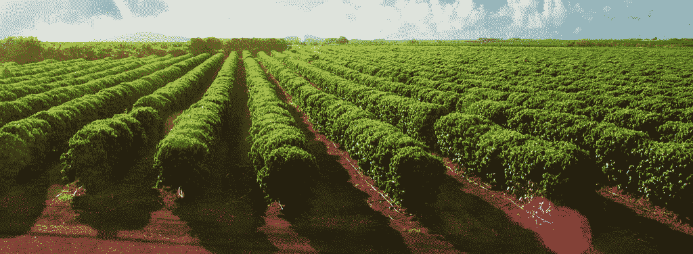
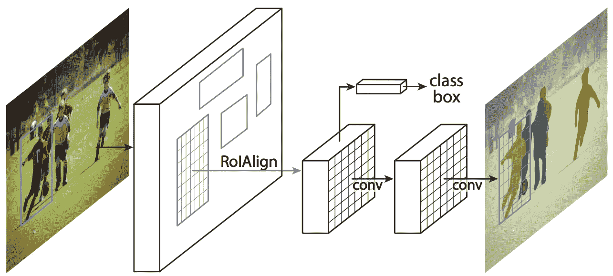
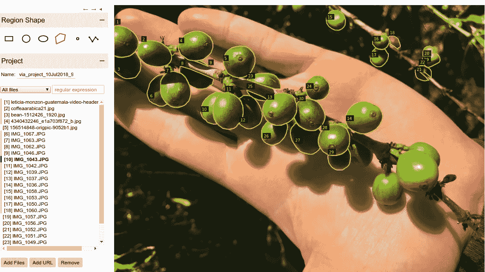
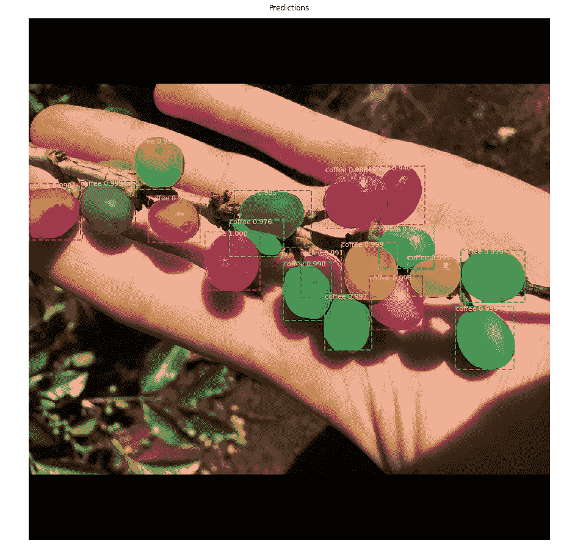
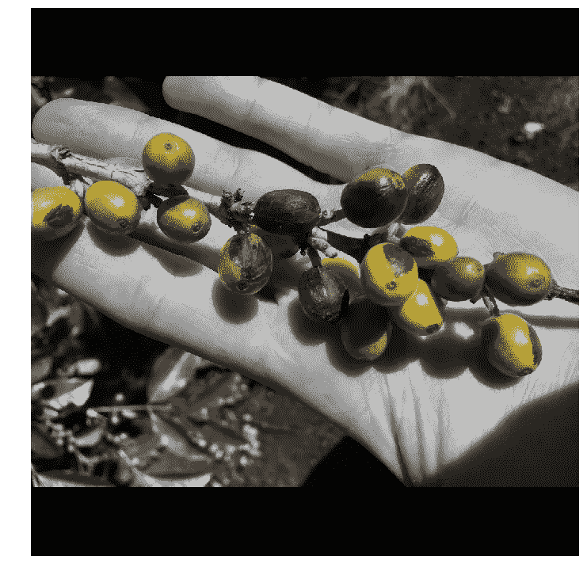

# 使用深度学习来估计咖啡收成

> 原文：<https://towardsdatascience.com/using-deep-learning-to-estimate-coffee-harvest-yields-8edb1b94c698?source=collection_archive---------10----------------------->

我前阵子写过一篇旧文章，讲的是用 OpenCV 检测成熟的水果[。虽然简单的颜色检测器是计算机视觉的有趣入门，但有时我们的问题需要更多的复杂性和前瞻性思维。因此，深度学习允许我们开发一种*健壮的*方法来解决计算机视觉中的大多数问题。我将在本文中使用的算法称为 Mask R-CNN。](https://medium.com/@jamesthesken/detect-ripe-fruit-in-5-minutes-with-opencv-a1dc6926556c)

Kauai Coffee Company. Source: [Hawaii Coffee Association](http://www.hawaiicoffeeassoc.org/kauai)

全球的咖啡果园在很大程度上依赖于手工计算树枝上成熟和未成熟咖啡果的数量，以估计收获时间。根据这个简单的指标，需要大量的专业知识来对何时收割做出更快、更有根据的估计。错误可能会使公司在某一特定领域失去丰收。收获少，钱少。

How many cherries can you count? Now, how long should we wait until harvest?

# 培训计算机

如果你不熟悉机器学习，对于这种类型的问题，你只需要知道一件事。没有它，我们将不得不手工编码这些咖啡果的每一个特征，以便被程序识别。无论你怎么说，都有太多的代码要写，而且咖啡果不能近似为绿色的圆圈(我也绝对没有这个想法)。

因此，我们采取以下方法:

1.  给我们感兴趣的物体拍大约 100 张照片
2.  手绘标签/注释~30 张图片
3.  把图像输入我们的网络
4.  评估模型
5.  重复这个过程，直到我们能够以 90%以上的准确率检测到我们的目标。
6.  额外收获:让我们的模特给我们贴上新图片标签

# 屏蔽 R-CNN

这篇文章的目的是面向这种算法的应用，所以如果你对*如何*网络功能感兴趣，请查阅[原始论文](https://arxiv.org/abs/1703.06870)。简单来说，这个算法返回对象的位置和组成它的像素。非常适合能够:

1.  确定咖啡果的位置/数量(边界框)
2.  确定每个咖啡果的颜色(图像分割)。

Network architecture. Source: [https://arxiv.org/abs/1703.06870](https://arxiv.org/abs/1703.06870)

VGG 图像注释器(VIA) 可能是我发现的最好的多边形对象注释工具。他们更新了一些功能来保存项目，加载以前的注释等。在这种情况下，注释对象需要*长的*时间。在这个阶段很容易陷入不确定性:我真的应该注释所有这些图片吗？通常需要这么长时间吗？如果不行呢？

是的。绝对的。忍忍吧。我们打败了苏联，登上了月球，却不知道它会成功。回到注释咖啡果。

This really is the hardest part of the process.

花了大约 4 个小时来注释所有这些图片，这个方法必须有效。对吗？最简单的测试方法是通过迁移学习和其他人对算法的实现。如果需要，可以对模型进行微调和调整。不要感到羞耻。

马特波特的人们有很好的基础可以利用。这里是 [github 回购](https://github.com/matterport/Mask_RCNN)。

# 结果呢

在与 Amazon Web Services 和包依赖问题进行了无休止的斗争之后，最终结果如下:

Trained model in the wild.

This is art.

一点也不差，尤其是考虑到它工作所需的图片数量很少。下一步将是通过在类似于其应用的设置中拍摄更多照片来完善该模型，并最终将其部署用于一般用途。

如果你喜欢这篇文章，一定要关注我，了解机器学习和计算机视觉在农业中的更多应用。如果您有任何问题，请留言或发电子邮件至 jamesthesken@gmail.com 给我。

—詹姆斯