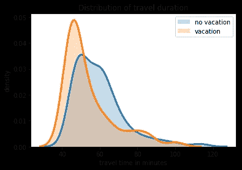
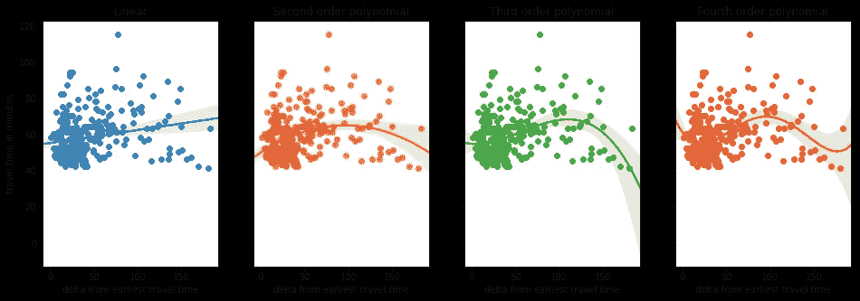
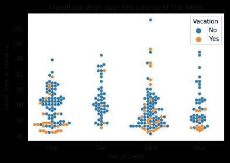
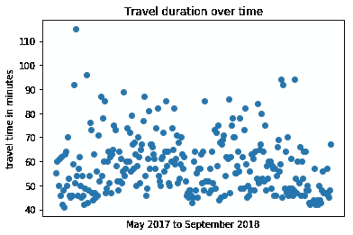

# 使用谷歌地图的位置历史来计算和可视化我自己的交通拥堵成本

> 原文：<https://towardsdatascience.com/using-google-maps-location-history-to-calculate-and-visualize-my-own-costs-of-traffic-congestion-26553cf07ea6?source=collection_archive---------8----------------------->


“cars passing through north and south” by [Alexander Popov](https://unsplash.com/@5tep5?utm_source=medium&utm_medium=referral) on [Unsplash](https://unsplash.com?utm_source=medium&utm_medium=referral)

在阿姆斯特丹自由大学(Vrije Universiteit)工作的一年里，我设计了一个可交易道路许可计划的模型，以应对高峰时段的交通拥堵。现在我从事咨询工作，我成了问题的一部分。我每周开车 4 次去一个离我公寓近 60 公里的客户那里，我亲身经历了“福利损失”，经济学上称之为被拥挤的交通所困扰。但是，当我最近寻找一个免费数据集进行实验时，我的日常通勤证明是派上了用场。当我使用谷歌地图作为我的 GPS 时，我的位置历史包含了我所有的旅行(甚至更多！)而现在它只等着我用在自己的目的上！

我可以用它来计算我在过去 18 个月中经历的福利损失吗？我可以用它来计算我在交通堵塞中花费的总时间吗？我可以用它来调查学校假期或我的出发时间对我的通勤时间有什么影响吗？所有这些问题的答案都是“是的”……或者至少是“在某种程度上”。

谷歌地图数据基本上由坐标、时间戳、精确度和活动变量组成，因此很容易找到你在特定时间点的位置，以及在某种程度上你在做什么。但是后一种方法非常不可靠，尤其是对我来说，因为汽车中的慢速经常被理解为骑自行车甚至走路。因此，我需要做的是将位置快照结合到旅行中，并将我在车上的通勤与其他旅行隔离开来。

我使用了 Python 和 pandas dataframes，这里只显示更关键的代码，但如果需要整个笔记本，请随时联系我。

我的 json 文件产生了将近 800，000 行原始数据。首先，我将时间戳和坐标转换成可以被 *datetime* 和 *geodesic* 模块解释的格式。

```
with open (‘Location History.json’) as f:
 data = json.load(f)
df = pd.DataFrame(data[‘locations’])
df = df[[‘accuracy’,’timestampMs’,’latitudeE7',’longitudeE7']].copy()
df[‘timestampMs’] = df[‘timestampMs’].astype(float)/1000
df[‘datetime’] = df[‘timestampMs’].apply(lambda t: dt.datetime.fromtimestamp(t))
df[‘latitudeE7’] = df[‘latitudeE7’]/10**7
df[‘longitudeE7’] = df[‘longitudeE7’]/10**7
```

现在我已经可以删除 2017 年之前的所有内容了，因为那时我还没有车。通过将时间戳拆分成时间和日期，并应用 *datetime.weekday* 功能，我可以识别周末，并将它们从数据集中删除。然后，我输入我的公寓和我要去的客户的坐标作为参考点。使用*测地线*模块，我可以计算出每个时间点我与客户的距离。按天分组，我会选择那些我离客户办公室的最小距离小于 500 米的日子。我 100%确定我在业余时间从来没有经过那里，所以这个属性立即标识了我通勤上班的那一天。

```
distance_client_by_date = df.groupby('date', as_index = False)['distance_client'].min().apply(lambda x: x)
trip_days = distance_client_by_date.loc[distance_client_by_date['distance_client']<0.5].copy()
df_trips=df.loc[df['date'].isin(trip_days['date'])].copy()
```

接下来，我定义了两个不同的高峰，一个是早上 7:00 到 9:30 的高峰，另一个是晚上 4:00 到 8:30 的高峰。不在这些时间段内的所有内容都将被删除。早上，确定旅程很容易，因为我的位置要么在家里，要么在车里。没有其他可能性。一旦我离家有了一段距离(> 100 米)，这意味着我已经在车上，正在路上。当我离我客户的位置比较近的时候(< 200 米，因为接收不好，所以准确度较低)，我就到了。我为行程设置了一个二进制指示器:

```
np.where((df_trips['distance_home'] > 0.1) & (df_trips_periods['distance_client'] > 0.2) & (df_trips_periods['period']=='Morning'), 1,0 )
```

具有这些属性的某一天早高峰期间的所有数据点构成一次旅行。
晚上，事情有点复杂，因为到家后，我不一定会呆在家里。我需要确定离开客户办公室后**最早的**时间点，即我与公寓的距离小于 100 米。否则，再次去 oude kaasblokjes 商店可能会被错误地计入我的通勤时间。因此，我创建了一个到家时的标志，然后选择最早的(“最小”)时间点，这发生在每个晚高峰:

```
df_trips['arrived'] = np.where((df_trips_periods['smth_dist_home'] < 0.1) & (df_trips_periods['period']=='Evening'), 1,0)df_trips['arrival_time'] = df_trips.loc[df_trips['arrived']==1].groupby('peak')['time'].transform('min')
```

通过*时间增量*功能，我计算出高峰旅行中最早和最晚时间点之间的时间增量。在清除了一些奇怪的异常值后，我可以从有趣的部分开始，调查大约 300 次旅行(通过比较谷歌地图在同一天记录的内容，很容易检查异常值。好像有几天我都没有察觉就瞬移了)。我可以运行一些回归模型，但是图片胜于雄辩。

我感兴趣的一件事是，在学校放假期间，我的通勤时间是否会明显减少。主观上，道路感觉更加空旷，但是数据会支持我的直觉吗？我在学校正式放假期间添加了一个标记，并在密度图中绘制了假期和非假期的旅行时间:



图表支持了我的直觉。假期的出行时间分布更窄，峰值更靠左。我似乎在学校假期之外的路上时间更长。但这并不意味着交通流量马上就会减少。也许我在夏天温暖的日子里提早下班，这也是学校假期，因此通过在高峰的早期边缘时段离开来避免高峰交通拥堵(如果读者碰巧是我的雇主:这是一个严格的假设场景，当然我每天都工作直到我崩溃)。

密度图显示我的出发时间与学校假期无关。


出发时间一般对我的旅行时间有影响吗？我预计会出现非线性影响，传播时间一开始会增加，但在大部分峰值过去后，传播时间会再次下降。我使用出发时间作为因变量旅行时间的线拟合的解释变量来选择 regplots。为了验证我对非线性效应的怀疑，我们可以用不同次数的多项式来比较几个图。



在所有情况下，高峰期间的曲线凹度显示了可疑的影响，但鉴于在稍后的出发时间观察到的少数数据点，这不应该太认真——如果你打算这样做的话。我的另一个问题是，一周中有明显的不同吗？在荷兰，周三是典型的“爸爸日”,父母可以休育儿假，交通也更加顺畅。



周三虫群当然有很重的底(这样的语境下用“thicc”可以吗？)，表明更多的观察和更短的传播时间，但是更多的观察当然有助于进一步研究差异是否真正显著。
最后，我是否调整了自己的出行行为以避免拥堵？毕竟，经济学家通常期望在更长的时间内建立均衡。我是否从我的日常经验中学到了，现在的旅行时间比我刚开始时短了，而且我对其他通勤者的行为一无所知？



没有。

看不到学习效果。我一次又一次驾驶同一条路线的经验并没有体现出任何避免拥堵的能力。

形象化就说到这里，作为运输经济学家，我当然也对我可怜的灵魂因交通拥堵而遭受的福利损失感兴趣。基于 41 分钟的最短行程时间和 59 分钟的平均行程时间，我得出平均 18 分钟的行程时间是由于交通拥堵造成的额外时间。对所谓的“时间价值”应用 15 欧元的标准值，这是一种在经济学中用财务术语表达时间的方法，可用于成本效益分析，这意味着我每天的福利损失大约为 9 欧元。从项目开始到现在，我进行了大约 300 次旅行，所以我的总福利损失约为 1.300 欧元，我在拥堵中度过了大约 6.000 分钟或 100 小时或 4 天。不在路上。而是纯粹靠**因拥堵而多出来的**出行时间。
我在车里听有声读物来打发时间，在《智人》中，作者解释道，佛教徒认为所有的痛苦都是由渴望造成的。渴望更多愉快的经历，或者渴望逃避不愉快的经历。因此，我内心隐藏的佛教徒应该克制自己，不要去想在交通拥堵中损失 4 天是否太多，因为这可能会导致对减少拥堵的渴望，最终导致我自己的痛苦。佛教徒很少是优秀的运输经济学家。