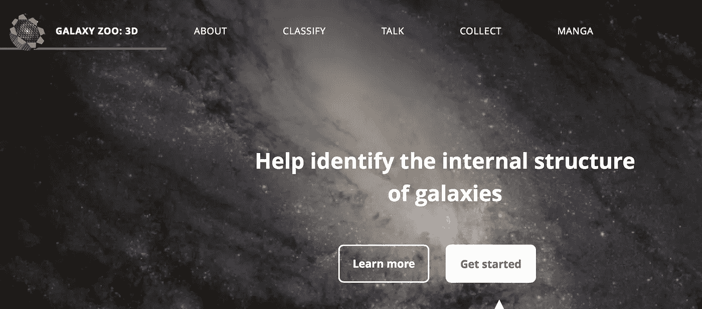
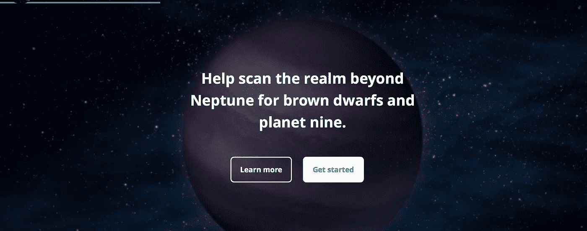

# 利用人性和大数据解决问题

> 原文：<https://towardsdatascience.com/using-humanity-and-big-data-to-solve-problems-15186024c465?source=collection_archive---------5----------------------->

“Pattern Recognition” by Lachlan Hardy is licensed under CC BY 2.0

人类擅长很多事情。其中之一是模式识别，即在大量数据、图片或文本中发现突出部分的能力。

我们非常善于在相当一致的图像中发现事物。我们可以在一堆白点中发现一个星系斑点，或者在一页信中发现一个真实的单词。我们甚至可以 t8k3 a r@nd0m jumbl3 0f numb3r5 和 l3tt3r5 以及其中的 m@k3 s3ns3(我现在就不说那个了)。

人类的心灵是一种美丽而奇妙的东西。它能做这么多，比我们现在知道的还要多。这是有史以来最不可思议的计算机。

想象一下，如果你能让十几个、一百个、一千个甚至上万个人一起工作来发现模式，会有什么样的成就。你可能会有令人难以置信的新发现，发现以前从未被理解的事物，或者发现以前从未见过的事物。

Zooniverse Galaxy 3D project

这是 Zooniverse 项目背后的想法之一。它是“世界上最大、最受欢迎的人力研究平台”。

研究人员创建了一个项目，比如说尝试在恒星图片中寻找星系。他们解释要寻找什么，并提出问题来帮助识别。然后，志愿者们开始着手这项工作，并对他们认为可以处理的尽可能多的数据进行分类。

你让尽可能多的人对随机照片进行分类，希望你能得到一个可验证的数据——比如十几个人说“是的，那个斑点是一个星系，就是这种类型的星系”。然后你可以用望远镜(无论哪种最好)对准那个星系来验证数据，节省随机搜索的时间来验证可能不存在的东西。

它已经被用于旧文件，寻找物种，寻找粒子，当然还有更多的星系搜索。

The Hunt for Planet 9

Zooniverse 说:“21 世纪研究的主要挑战是处理我们现在可以收集的关于我们周围世界的大量信息。计算机可以提供帮助，但在许多领域，人类的模式识别能力——以及我们的惊讶能力——让我们更胜一筹。”

我自己对一些项目进行了分类，与成千上万的其他志愿者一起，项目背后的研究人员能够产生真正的科学，真正的数据，并做出可能需要几十年才能完成的发现。

在志愿者的帮助下，Zooniverse 正在以前所未有的速度拓展理解的边界。