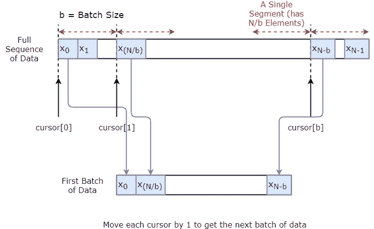
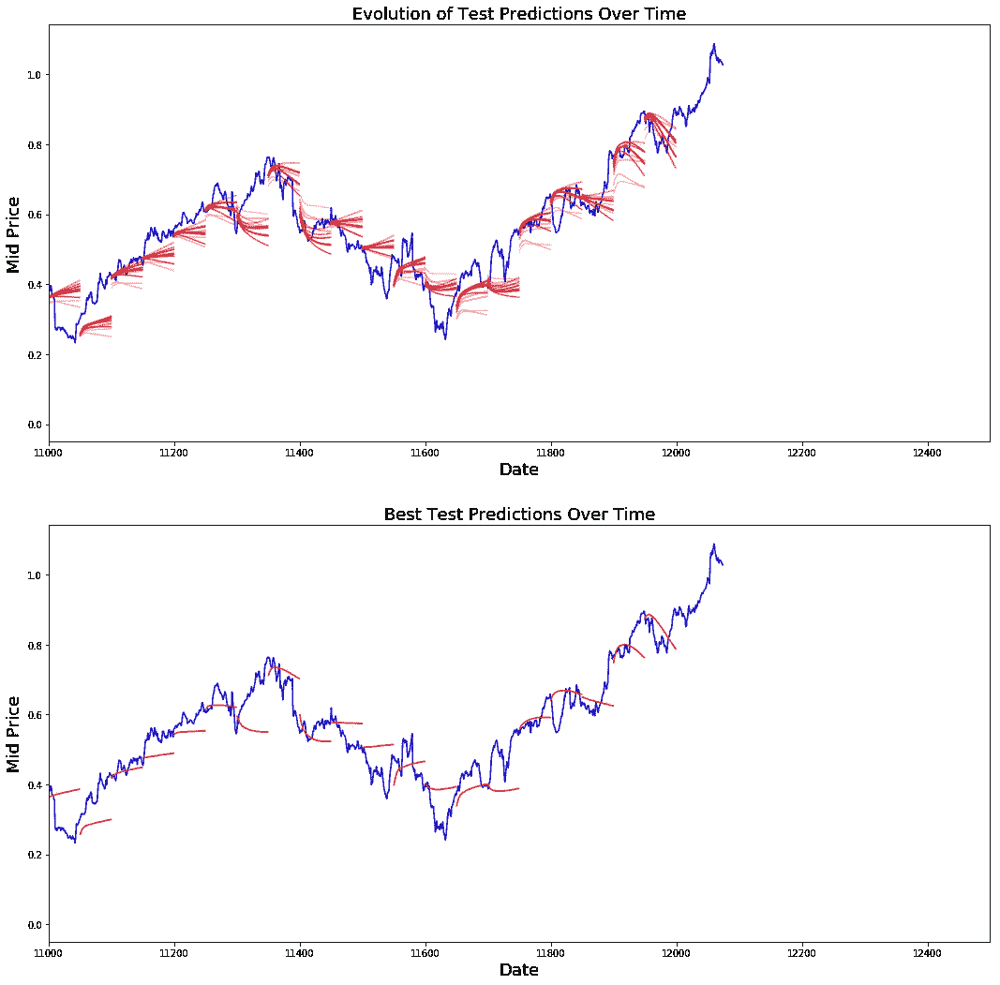

# 使用 LSTMs 进行股市预测(Tensorflow)

> 原文：<https://towardsdatascience.com/using-lstms-for-stock-market-predictions-tensorflow-9e83999d4653?source=collection_archive---------1----------------------->

在本教程中，你将看到如何使用一个被称为长短期记忆的时间序列模型。从设计上来说，LSTM 模型非常强大，尤其是在保留长期记忆方面，你将在后面看到。在本教程中，您将处理以下主题:

*   理解为什么你需要能够预测股票价格的变动；
*   下载数据——您将使用从 Alphavantage/Kaggle 收集的股市数据；
*   拆分训练测试数据，并执行一些数据标准化；
*   激发并简要讨论 LSTM 模型，因为它允许提前一步以上进行预测；
*   用当前数据预测和可视化未来股票市场

**注意:**但在我们开始之前，*我并不主张 LSTMs 是一个高度可靠的模型，可以完美地利用股票数据中的模式*，*或者可以在没有任何人在回路中的情况下盲目使用*。我这样做是作为一个实验，纯粹出于机器学习的兴趣。在我看来，该模型已经观察到了数据中的某些模式，从而使其能够在大多数时候正确预测股票走势。但是这个模型能不能用于实际用途，就看你自己了。

# 为什么需要时间序列模型？

您希望正确地模拟股票价格，因此作为股票购买者，您可以合理地决定何时买入股票，何时卖出股票以获取利润。这就是时间序列建模的用武之地。你需要好的机器学习模型，它可以查看数据序列的历史，并正确预测该序列的未来元素将会是什么。

警告:股票市场的价格是高度不可预测和不稳定的。这意味着数据中没有一致的模式可以让你近乎完美地模拟一段时间内的股票价格。不要相信我，相信普林斯顿大学的经济学家伯顿·马尔基尔，他在他 1973 年的书《漫步华尔街》中认为*如果市场是真正有效的，股票价格一公布就立即反映了所有的因素，那么一只蒙着眼睛的猴子向报纸上的股票上市投掷飞镖应该和任何投资专业人士做得一样好*。

然而，我们不要完全相信这只是一个随机或随机的过程，机器学习没有希望。让我们看看您是否至少可以对数据进行建模，以便您做出的预测与数据的实际行为相关联。换句话说，你不需要未来的确切股票价值，而是股票价格的变动(也就是说，它在不久的将来是上涨还是下跌)。

# 下载数据

您将使用来自以下来源的数据:

1.  阿尔法优势。然而，在开始之前，你首先需要一个 API 密匙，你可以在这里免费获得。之后，您可以将该键分配给`api_key`变量。
2.  使用本页中[的数据。您需要将 zip 文件中的*股票*文件夹复制到您的项目主文件夹中。](https://www.kaggle.com/borismarjanovic/price-volume-data-for-all-us-stocks-etfs)

股票价格有几种不同的风格。他们是，

*   开盘:当天的开盘价
*   收盘:当天的收盘价
*   高:数据的最高股票价格
*   低:当天最低的股票价格

# 从 Alphavantage 获取数据

您将首先从 Alpha Vantage 加载数据。因为您将利用美国航空公司的股票市场价格来进行预测，所以您将自动收报机设置为`"AAL"`。此外，您还定义了一个`url_string`，它将返回一个 JSON 文件，其中包含美国航空公司在过去 20 年中的所有股票市场数据，以及一个`file_to_save`，它将是您保存数据的文件。您将使用预先定义的`ticker`变量来帮助命名这个文件。

接下来，您将指定一个条件:如果您还没有保存数据，您将继续从您在`url_string`中设置的 URL 获取数据；你将把日期、盘低、盘高、成交量、收盘价、开盘价存储到 pandas 数据框架`df`中，然后保存到`file_to_save`。但是，如果数据已经存在，您只需从 CSV 加载它。

# 从 Kaggle 获取数据

Kaggle 上的数据是 csv 文件的集合，您不必做任何预处理，因此您可以直接将数据加载到 Pandas DataFrame 中。确保将数据下载到项目主目录中。因此*股票*文件夹应该在项目主目录中。

# 数据探索

在这里，您将把收集的数据打印到数据框中。您还应该确保数据按日期排序，因为数据的顺序在时间序列建模中至关重要。

## 数据可视化

现在让我们看看你有什么样的数据。您需要随时间推移出现各种模式的数据。

这张图表已经说明了很多事情。我选择这家公司而不是其他公司的具体原因是，随着时间的推移，这张图表充满了不同的股价行为。这将使学习更加稳健，也给你一个机会来测试对各种情况的预测有多好。

另一个需要注意的是，接近 2017 年的数值要比接近 20 世纪 70 年代的数值高得多，波动也更大。因此，您需要确保数据在整个时间段内表现为相似的值范围。您将在*数据标准化*阶段处理这个问题。

# 将数据分成训练集和测试集

您将使用中间价，该中间价通过取一天中最高和最低记录价格的平均值来计算。

现在，您可以拆分训练数据和测试数据。训练数据将是时间序列的前 11，000 个数据点，其余的将是测试数据。

现在您需要定义一个 scaler 来规范化数据。`MinMaxScalar`将所有数据缩放到 0 和 1 的范围内。您还可以将训练和测试数据整形为形状`[data_size, num_features]`。

根据您之前的观察，即不同时间段的数据具有不同的值范围，您可以通过将整个系列拆分为多个窗口来规范化数据。如果不这样做，早期的数据将接近于 0，不会给学习过程增加太多价值。这里你选择一个大小为 2500 的窗口。

**提示**:当选择窗口大小时，确保它不要太小，因为当你执行窗口归一化时，它会在每个窗口的最后引入一个断点，因为每个窗口都是独立归一化的。

在本例中，4 个数据点将受此影响。但是假设你有 11，000 个数据点，4 点不会引起任何问题

将数据重塑回`[data_size]`的形状

现在，您可以使用指数移动平均来平滑数据。这有助于你摆脱股票价格中数据固有的混乱，并产生一个更平滑的曲线。

**注意:**我们仅使用训练数据训练最小最大缩放器，通过将最小最大缩放器拟合到测试数据来标准化测试数据是错误的

**注意**你应该只平滑训练数据。

# 评估结果

我们将使用均方差来计算我们的模型有多好。均方误差(MSE)可以通过计算前一步的真实值和预测值之间的平方误差，并对所有预测进行平均来计算。

# 平均作为股票价格建模技术

在[原始教程](https://www.datacamp.com/community/tutorials/lstm-python-stock-market)中，我谈到了对于这种类型的问题，欺骗和糟糕的平均是如何的。结论是，

> 平均法可以很好地预测一个时间点(这对于股市预测来说不是很有用)，但对于未来却没有多少时间点。更多详情可以在[原创教程](https://www.datacamp.com/community/tutorials/lstm-python-stock-market)中找到。

# LSTMs 简介:预测遥远未来的股票走势

长短期记忆模型是非常强大的时间序列模型。他们可以预测未来的任意步数。一个 LSTM 模块(或细胞)有 5 个基本组成部分，使其能够模拟长期和短期数据。

*   细胞状态(c _ t)——这代表细胞的内部记忆，它既存储短期记忆又存储长期记忆
*   隐藏状态(h_t) —这是根据当前输入、先前隐藏状态和当前单元格输入计算的输出状态信息，您最终使用这些信息来预测未来的股票市场价格。此外，隐藏状态可以决定仅检索存储在单元状态中的短期或长期或两种类型的记忆来进行下一次预测。
*   输入门(i_t) —决定有多少信息从电流输入流向单元状态
*   遗忘门(f_t) —决定有多少来自当前输入和前一单元状态的信息流入当前单元状态
*   输出门(o_t) —决定有多少信息从当前单元状态流入隐藏状态，这样，如果需要，LSTM 只能选择长期记忆或短期记忆和长期记忆

下图是一个单元格。

并且用于计算这些实体中的每一个的等式如下。

*   I*_ t =*σ*(W*{ IX } * x*_ t+W*{ ih } * h _ { t-1 }+b _ I)
*   \ tilde { c }*_ t =*σ*(W*{ CX } * x*_ t+W*{ ch } * h _ { t-1 }+b _ c)
*   f*_ t =*σ*(W*{ FX } * x*t+W*{ FH } * h _ { t-1 }+b _ f)
*   c _ t = f*_ t * c*{ t-1 }+I _ t * \波浪号{c}_t
*   o*_ t =*σ*(W*{ ox } * x*t+W*{ oh } * h _ { t-1 }+b _ o)
*   h_t = o_t * tanh(c_t)

为了更好地(更技术性地)理解 LSTMs，你可以参考这篇文章。

# 数据生成程序

下面，您演示了如何可视化地创建一批数据。基本思想是，我们将数据序列分成 N/b 个段，使每个段的大小为 b，然后我们定义游标，每个段 1 个。然后对单批数据进行采样，我们得到一个输入(当前段游标索引)和一个真预测(在[当前段游标+ 1，当前段游标+ 5]之间随机采样的一个)。请注意，我们并不总是得到输入旁边的值，就像它的预测一样。这是减少过度拟合的一个步骤。在每次采样结束时，我们将光标增加 1。你可以在[原教程](https://www.datacamp.com/community/tutorials/lstm-python-stock-market)中找到更多关于数据生成的信息。

# 定义超参数

在本节中，您将定义几个超参数。`D`是输入的维数。这很简单，因为你把前一个股票价格作为输入，预测下一个，应该是`1`。

然后你有`num_unrollings`，表示你为一个优化步骤考虑多少个连续的时间步骤。越大越好。

然后你就有了`batch_size`。批量大小是指您在一个时间步长中考虑的数据样本数量。越大越好，因为在给定的时间内，数据的可见性更高。

接下来定义`num_nodes`,它代表每个细胞中隐藏神经元的数量。您可以看到，本例中有三层 LSTMs。

# 定义输入和输出

接下来，为训练输入和标签定义占位符。这非常简单，因为您有一个输入占位符列表，其中每个占位符包含一批数据。列表中有`num_unrollings`占位符，将在单个优化步骤中立即使用。

# 定义 LSTM 和回归图层的参数

你将有一个三层的 LSTMs 和一个线性回归层，用`w`和`b`表示，它获取最后一个长短期记忆单元的输出，并输出下一个时间步的预测。您可以使用 TensorFlow 中的`MultiRNNCell`来封装您创建的三个`LSTMCell`对象。此外，您可以让 dropout 实现 LSTM 单元，因为它们可以提高性能并减少过拟合。

# 计算 LSTM 输出并将其馈送到回归层以获得最终预测

在本节中，首先创建 TensorFlow 变量(`c`和`h`)，这些变量将保存长短期记忆单元的单元状态和隐藏状态。然后你把`train_inputs`的列表转换成`[num_unrollings, batch_size, D]`的形状，这是用`tf.nn.dynamic_rnn`函数计算输出所需要的。然后用`tf.nn.dynamic_rnn`函数计算 LSTM 输出，并将输出拆分回一个`num_unrolling`张量列表。预测和真实股价之间的差距。

# 损失计算和优化程序

现在，你将计算损失。但是，您应该注意，在计算损失时有一个独特的特征。对于每批预测和真实输出，计算均方误差。你将所有这些均方损失相加(不是平均)。最后，您定义将用于优化神经网络的优化器。在这种情况下，您可以使用 Adam，这是一个非常新的、性能良好的优化器。

在此定义与预测相关的张量流运算。首先，为输入定义一个占位符(`sample_inputs`)，然后类似于训练阶段，为预测定义状态变量(`sample_c`和`sample_h`)。最后用`tf.nn.dynamic_rnn`函数计算预测，然后通过回归层(`w`和`b`)发送输出。您还应该定义`reset_sample_state`操作，它重置单元格状态和隐藏状态。每次进行一系列预测时，都应该在开始时执行这个操作。

# 运行 LSTM

在这里，您将训练和预测几个时期的股票价格运动，并查看预测随着时间的推移是变好还是变坏。您遵循以下程序。我不分享代码，因为我分享的是完整 Jupyter 笔记本的链接。

**在时间序列上定义一组测试起点(* `*test_points_seq*` *)，以评估*上的模型

> **对于每个时期*
> 
> ** *训练数据全序列长度*
> 
> ** * *展开一套* `*num_unrollings*` *批次*
> 
> ** * *用展开的批次训练神经网络*
> 
> ** *计算平均培训损失*
> 
> ** *对于测试集中的每个起始点*
> 
> ** * *通过迭代在测试点*之前找到的先前 `*num_unrollings*` *数据点来更新 LSTM 状态*
> 
> ** * *连续对* `*n_predict_once*` *步骤进行预测，使用之前的预测作为当前输入*
> 
> ** * *计算预测的* `*n_predict_once*` *点与该时间点的真实股价*之间的 MSE 损失

# 可视化预测

你可以看到 MSE 损失是如何随着训练量的增加而下降的。这是一个好迹象，表明模型正在学习一些有用的东西。为了量化您的发现，您可以将网络的 MSE 损失与进行标准平均(0.004)时获得的 MSE 损失进行比较。你可以看到 LSTM 的表现比标准平均值要好。你知道标准平均法(虽然不完美)合理地跟随真实的股票价格运动。

虽然不完美，LSTMs 似乎能够在大多数时候正确预测股票价格行为。请注意，您做出的预测大致在 0 到 1.0 的范围内(也就是说，不是真实的股票价格)。这没关系，因为你预测的是股票价格的变动，而不是价格本身。

# 结论

我希望这篇教程对你有用。我应该提到这对我来说是一次有益的经历。在本教程中，我了解到设计一个能够正确预测股价走势的模型有多困难。你从为什么需要对股票价格建模的动机开始。接下来是解释和下载数据的代码。然后你看了两种平均技术，它们可以让你对未来进行预测。接下来你会看到，当你需要预测未来不止一步的时候，这些方法是没有用的。此后，您讨论了如何使用 LSTMs 对未来进行预测。最后，您将结果可视化，并发现您的模型(尽管并不完美)在正确预测股票价格变动方面非常出色。

在这里，我陈述几个本教程的要点。

1.  股票价格/运动预测是一项极其困难的任务。就我个人而言，我不认为任何股票预测模型是理所当然的，也不应该盲目依赖它们。然而，模型可能在大多数情况下能够正确预测股票价格的变动，但并不总是如此。
2.  不要被那些显示预测曲线与真实股价完美重叠的文章所迷惑。这可以用一个简单的平均技术来复制，但实际上这是没有用的。更明智的做法是预测股价走势。
3.  模型的超参数对您获得的结果极其敏感。因此，一个非常好的做法是对超参数运行一些超参数优化技术(例如，网格搜索/随机搜索)。这里我列出了一些最关键的超参数；*优化器的学习速率，层数和每层的隐藏单元数，优化器(我发现亚当表现最好)，模型的类型(GRU/LSTM/带窥视孔的 LSTM)*
4.  在本教程中，你做了一些错误的事情(由于数据量小)！那就是你利用考试损失来降低学习速度。这间接地将关于测试集的信息泄露到训练过程中。一个更好的处理方法是拥有一个单独的验证集(与测试集分开)和关于验证集性能的衰减学习率。

# [这里](https://github.com/thushv89/datacamp_tutorials)

# 参考

我参考了[这个库](https://github.com/jaungiers/LSTM-Neural-Network-for-Time-Series-Prediction)来了解如何使用 LSTMs 进行股票预测。但是细节可能与参考资料中的实现有很大不同。

# 想在深度网络和 TensorFlow 上做得更好？

检查我在这个课题上的工作。

[1] [(书)张量流 2 在行动——曼宁](https://www.manning.com/books/tensorflow-in-action)

[2] [(视频教程)Python 中的机器翻译](https://www.datacamp.com/courses/machine-translation-in-python) — DataCamp

[3] [(书)TensorFlow 中的自然语言处理 1](https://www.amazon.com.au/Natural-Language-Processing-TensorFlow-Ganegedara/dp/1788478312/ref=sr_1_25?dchild=1&keywords=nlp+with+tensorflow&qid=1603009947&sr=8-25) — Packt