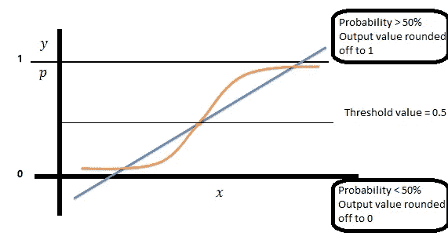
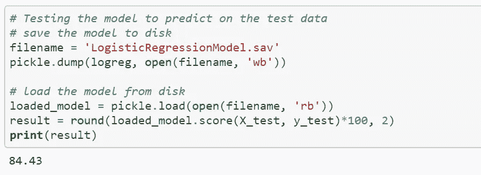
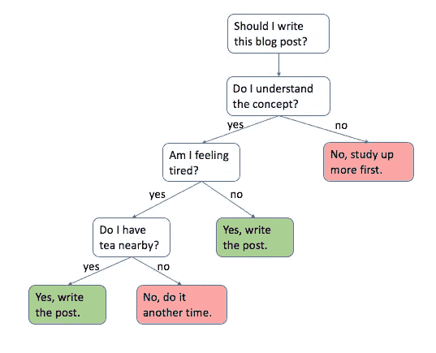
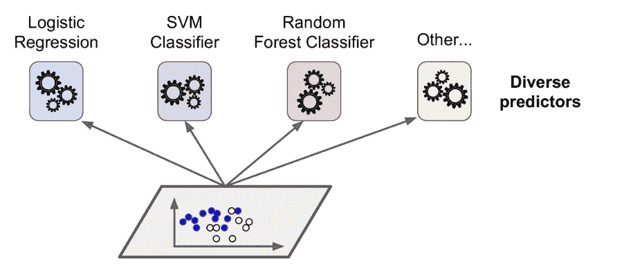
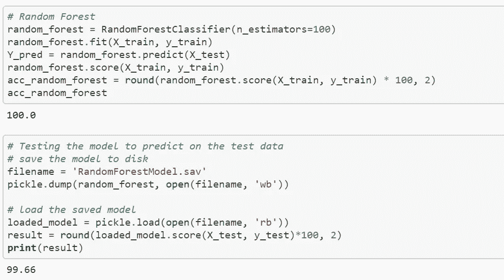

# 使用机器学习模型推荐航空公司——第二部分

> 原文：<https://towardsdatascience.com/using-machine-learning-models-to-recommend-airline-carriers-part-ii-f87ea6d74728?source=collection_archive---------16----------------------->

Photo by [Andrew Palmer](https://unsplash.com/@ampalmer?utm_source=medium&utm_medium=referral) on [Unsplash](https://unsplash.com?utm_source=medium&utm_medium=referral)

在使用机器学习模型解决问题时，没有什么灵丹妙药。我还没有见过一种模式适合所有人。因此，强烈建议对您可能正在处理的任何问题使用多个模型，并评估为什么一个特定的模型比其他模型更好。请参考我博客的第一部分，了解所用数据集的详细信息。

> 在这篇博文中，我的目的是展示如何使用几个机器学习模型找到一个解决方案，为最可靠的航空公司推荐未来的取消率，并讨论每个模型的利弊。

**创建训练和测试数据集**

Figure 1: Creating test, train data sets using train_test_split method in sci-kit learn.

对于手头的分类问题，我将使用以下模型:

1.  逻辑回归
2.  支持向量机
3.  决策图表
4.  随机森林

L **逻辑回归:**与其名称相反，逻辑回归用于因变量为二分变量(二元/分类)的分类类型问题。*计算感兴趣特征出现的概率。*

> logit(p) = ln(特性存在的概率/特性不存在的概率)

*逻辑回归中的估计不是选择最小化线性回归中误差平方和的参数，而是选择最大化观察样本值可能性的参数。*

Figure 2: Logistic regression. [Source](http://www.saedsayad.com/logistic_regression.htm)

Figure 3: Logistic regression. [Source](http://www.saedsayad.com/logistic_regression.htm)

图 4 展示了如何实例化逻辑回归类，以及如何在自变量(X_train)和因变量(y_train)上使用“fit”方法。我们得到了大约 83%的准确率。这是一个相当低的准确度分数，让我们试着理解为什么这个模型的性能如此之差。

Figure 4: Using logistic regression model training data set.

Figure 5: Applying logistic regression model on test data set.

在上面的图 5 中，我们在测试数据集上获得了大约 84%的准确率。下面的相关矩阵图(图 6)显示，逻辑回归模型在预测取消时没有考虑“月”列。这也许解释了为什么这个模型的性能如此之差。

Figure 6: Driving factor behind poor performance of logistic regression model.

**利弊:**

1.  逻辑回归是一个广义的线性模型，所以我们不能用这个模型解决非线性问题——不管是赞成还是反对，这取决于你试图解决的问题的类型。
2.  由于参数和输入向量的线性组合，计算非常简单。
3.  输出可以解释为概率；所以你可以用它来排名而不是分类。
4.  树木通常很难计算出精确的概率。
5.  遭受多重共线性。

支持向量机:SVM 是一个非常强大和通用的最大似然模型，能够解决线性以及非线性分类，回归甚至异常检测类型的问题。是 ML 中最受欢迎的型号之一。缺点是 SVM 只适用于中小型数据集。

Figure 7: Support vector machines aka large margin classification.

SVM 分类器试图在不同类别之间拟合最宽的可能街道(由图 7 中的蓝色矩形表示)。这就是所谓的大幅度分类。图 7 左侧的黑线很好地将两个类别分开，但是没有最大的余量(也称为街道/超平面)，如在右手侧。请注意，在“街道之外”添加更多实例根本不会影响决策边界。决策边界完全由街道边缘的实例决定。这些实例被称为支持向量，因此命名为支持向量机。

Figure 8: Instantiating the SVC class.

由于我们使用的是一个相当小的数据集(只有 6000 个实例)，计算相对来说并不费力。SVM 模型的精确度约为 99.9%。

> 与逻辑回归不同，SVM 分类器不会输出每个类别的概率。

**缺点:**

1.  训练这种模型可能会非常低效。不建议用于大型数据集。
2.  支持向量机对特征缩放很敏感，与数据集中的其余特征相比，具有小得多的缩放比例的特征将在大幅度确定中被忽略。

D 决策树:与 SVM 相似，*决策树*是非常通用的 ML 算法，可以执行分类和回归任务。这是一个流程图类型的算法，其中每个决策节点后面都有一个结果。

Figure 9: Using decision tree model.

Figure 10: Simple decision tree.

**利弊:**

1.  决策树的众多特性之一是它们需要很少的数据准备。它们根本不需要特征缩放或居中。
2.  该模型易于解读、解释、易于使用、功能多样且功能强大。
3.  决策树还可以估计某个实例属于某个特定类 *k* 的概率:首先，它遍历树来查找该实例的叶节点，然后返回该节点中类 *k* 的训练实例的比率。
4.  决策树最大的缺点是它们对训练数据的微小变化非常敏感。他们倾向于过度拟合数据。

我有一种不可思议的感觉，100%准确的决策树过度拟合了这里的数据。

andom Forest:是一种集成学习算法。一组预测器称为集合；这项技术被称为集成学习。这里训练一组决策树分类器，每个分类器基于训练集的不同随机子集。为了进行预测，我们可以获得所有单个树的预测，然后预测获得最多投票的类。这样的决策树集合被称为随机森林。

随机森林模型的成功可以用[大数定律](https://en.wikipedia.org/wiki/Law_of_large_numbers)来解释。最简单的解释是:拿一个装有 100 枚金币的盒子。在任何给定的时间点，期望值大约是 50 头和 50 尾。但是，我摇一次箱子，可能得不到预期的值。但是诀窍是通过摇动盒子来进行合理的大量观察，使得头和尾的数量的平均值接近期望值。

随机森林不需要纯粹基于决策树作为唯一的预测器。可以有一组不同的分类器，并预测得到最多投票的类别，如下图 11 所示。

Figure 11: Diverse set of classifiers. [Source](https://www.safaribooksonline.com/library/view/hands-on-machine-learning/9781491962282/ch07.html).

图 12 显示了随机森林分类器是如何实例化的。

Figure 12: Random forest classifier.

**利弊:**

1.  与决策树相比，随机森林不是一个容易直观解释的模型。
2.  易于在可能具有相关特征的数据集上使用。

# 摘要

在这篇博文中，我展示了各种 ML 模型的使用，以及它们的优缺点。大家 ML 快乐！