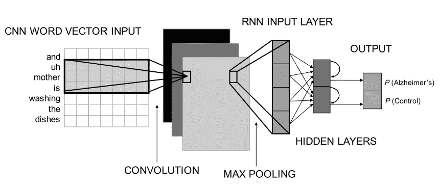

# 用自然语言处理检测阿尔茨海默病患者的语言线索

> 原文：<https://towardsdatascience.com/using-nlp-to-detect-linguistic-cues-in-alzheimers-diseases-patients-3364301b0299?source=collection_archive---------7----------------------->

这篇[论文](https://arxiv.org/pdf/1804.06440.pdf)旨在从阿尔茨海默病(AD)患者生成的语音转录中检测*语言特征*和*语法模式*。这被认为是自然语言处理和深度学习技术在计算健康方面的一个重要应用。

***简介***

作者提出了几种*神经模型*，如 CNN 和 LSTM-RNNs——以及它们的组合——来增强广告分类任务。训练好的神经模型通过 [*激活聚类*](https://arxiv.org/abs/1311.2524) 和 [*一阶导数显著性*](https://arxiv.org/abs/1312.6034) 技术用于解释 AD 患者的语言特征(包括性别差异)。

***动机***

语言变异可以作为监控患者认知功能如何受到影响(例如，单词查找和推理障碍)的代理。这可以使机器具备*诊断能力，这对于治疗 AD 特别有效，因为它既不可治愈也不可逆转。*

***挑战与局限***

检测 AD 阳性患者的挑战在于它需要不同的语言和世界知识。考虑下面的例子:

"*嗯…有个妈妈站在那里嗯嗯地洗碗，水槽满溢…满溢*"有几个语言提示，比如“*溢出……溢出*，表示*混乱*和*记忆丧失*的迹象，这在 AD 阳性患者中非常常见。因此，作者提出了一种从数据中自动学习这些语言线索的神经模型，而不是依赖于手工制作的特征。从以前的文献中观察到的其他重要问题如下:

*   手工制作的特征可能不适合分析 AD 患者数据，这些数据传达了语言模式的渐进变化。
*   随着语言和文化的发展，手工制作的功能很快就会过时。
*   仅仅依靠神经网络并不能提供太多的可解释性。

***数据***

这项工作使用了[痴呆银行数据集](https://talkbank.org/DementiaBank/)，它由 AD(和对照组)患者的抄本和音频记录组成。这些记录是通过对几项任务的采访收集的，如“回忆测试”和“波士顿饼干盗窃”。抄本被分割成带有词性(POS)标签的单独话语。

***车型***

提出了三种类型的神经方法:CNN(嵌入+卷积层+最大池层)、LSTM-RNN(嵌入+ LSTM 层)和 CNN-LSTM(基本上是在 CNN 之上放置一个 LSTM——架构如下图所示)。(详见论文。)

***结果***

表现最好的模型(POS tags + CNN-LSTM)达到了 91.1%的准确率，这为广告分类任务设定了新的基准。参见下面的其他结果。

作者观察到，几乎所有的 AD 阳性结果都被正确分类，而对非 AD 样本的分类有更多的错误。这可能是因为数据集包含了具有与 AD 相关的不同程度症状的患者。(更多结果见论文。)

***分析***

男性和女性 AD 患者的语言模式没有显著差异。

此外，使用两种可视化技术对由神经模型捕获的语言线索进行解释:

*   *激活聚类* —提供对句子级模式的洞察
*   *一阶导数显著性* —提供对单词重要性的洞察

通过激活聚类，在 AD 患者中发现的三种常见语言模式从聚类中出现:简短回答和突发言语(例如，“和”和“哦！”)，反复要求澄清(例如，“我说的是事实吗？”)，并以感叹词(“所以”和“嗯”)开头。此外，对于 Cookie 和 Recall 等几个任务，广告聚类最常用的 POS 标签是不同的。

通过显著性热图，可以看出对照组和 AD 患者之间单词重要性的差异。如下图(左)所示，单词“uh”和“um”是对 AD 患者进行分类的重要且可区分的言语特征。右图显示，控制组没有大量使用这类填充词。

***未来工作与结论***

*   结合可视化技术的神经模型可以为 AD 患者的语言线索和变化提供更多的见解。也就是说，这种模型可以推广到研究其他神经疾病。
*   上下文感知模型和会话上下文可以帮助提高模型的预测性能，并且还提供更多的可解释性。

***参考文献***

[通过解释神经模型检测阿尔茨海默氏痴呆的语言特征](https://arxiv.org/pdf/1804.06440.pdf)——(*Sweta Karlekar，Tong Niu，和 Mohit Bansal*