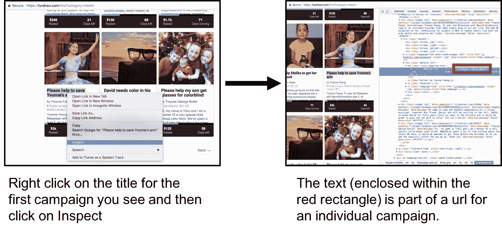
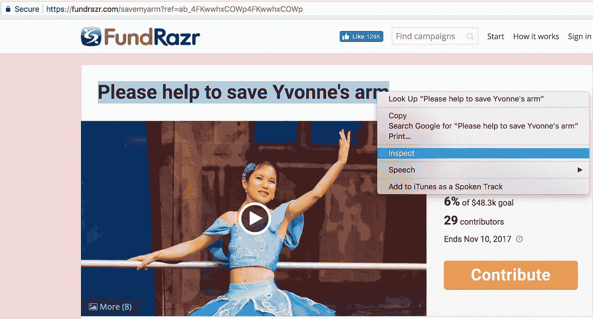
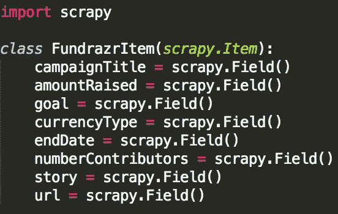
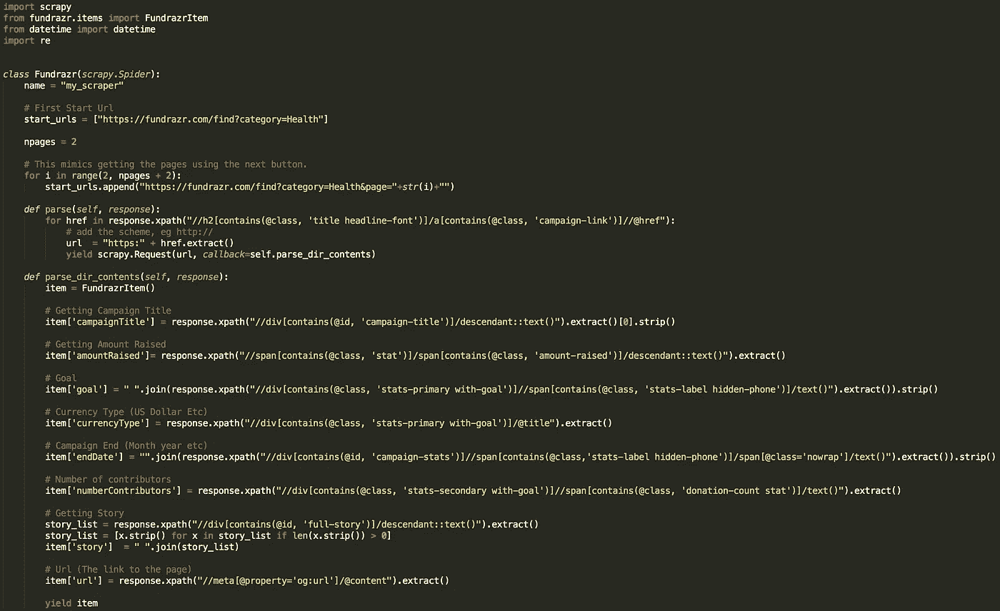
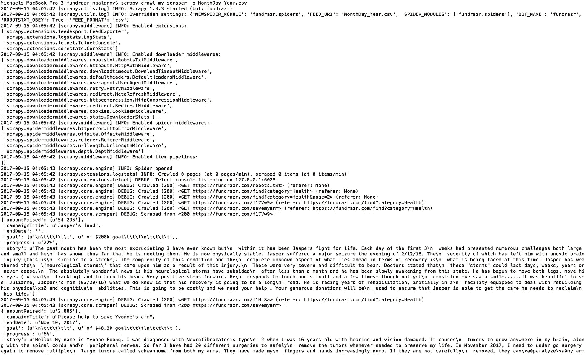
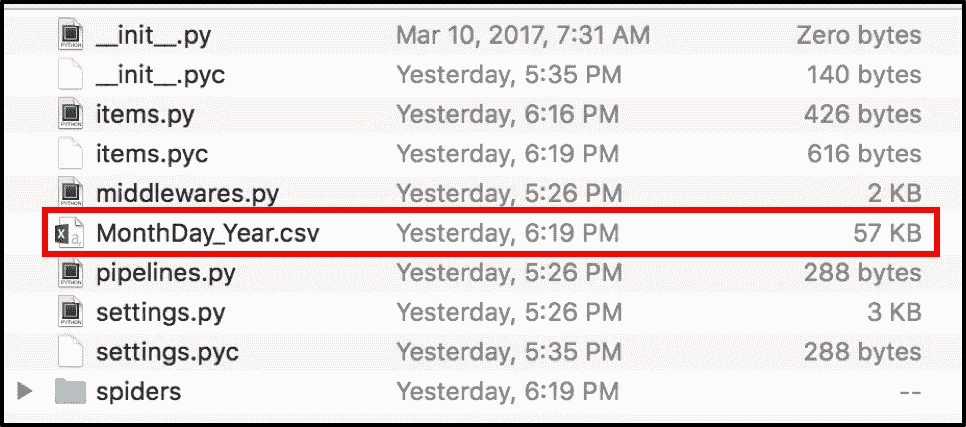
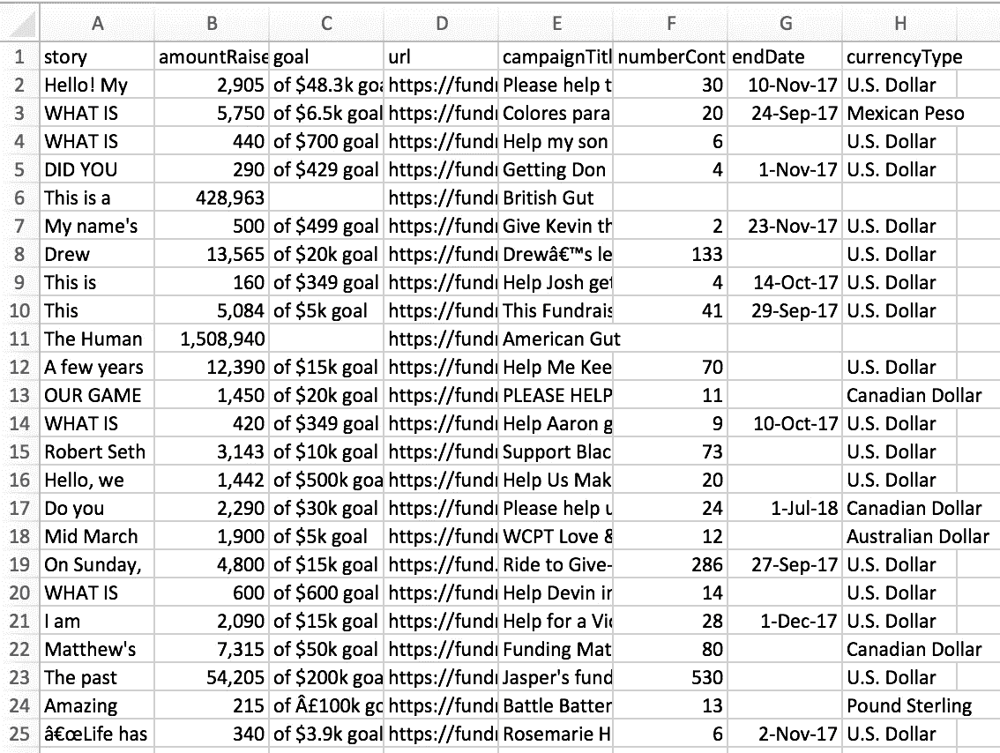
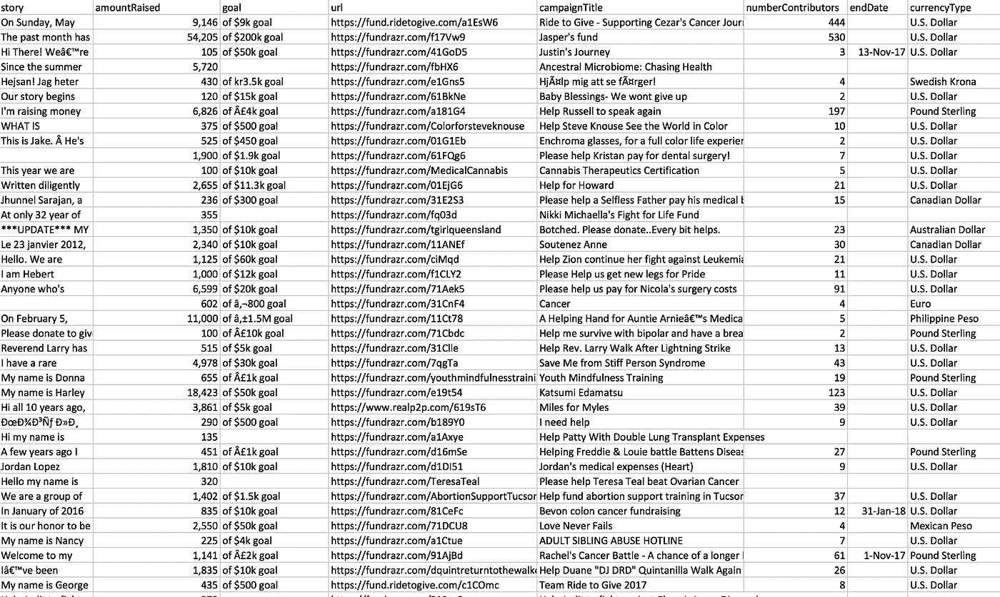

# 使用 Scrapy 构建自己的数据集

> 原文：<https://towardsdatascience.com/using-scrapy-to-build-your-own-dataset-64ea2d7d4673?source=collection_archive---------0----------------------->

Web Scraping (Scrapy) using Python

当我刚开始在工业界工作时，我很快意识到的一件事是，有时你必须收集、组织和清理你自己的数据。在本教程中，我们将从一个名为 [FundRazr](https://fundrazr.com/) 的众筹网站收集数据。像许多网站一样，该网站有自己的结构、形式，并有大量可访问的有用数据，但很难从该网站获得数据，因为它没有结构化的 API。因此，我们将从网站上抓取非结构化的网站数据，并以有序的形式构建我们自己的数据集。

为了抓取网站，我们将使用 [Scrapy](https://scrapy.org/) 。简而言之，Scrapy 是一个框架，旨在更容易地构建 web 抓取工具，并减轻维护它们的痛苦。基本上，它允许您专注于使用 CSS 选择器和选择 XPath 表达式的数据提取，而不是蜘蛛应该如何工作的复杂内部。这篇博客文章超越了来自 scrapy 文档的伟大的[官方教程，希望如果你需要更难的东西，你可以自己做。就这样，让我们开始吧。如果你迷路了，我建议在一个单独的标签中打开](https://doc.scrapy.org/en/latest/intro/tutorial.html)[视频](https://www.youtube.com/watch?v=O_j3OTXw2_E)。

## 入门(先决条件)

如果你已经有了 anaconda 和 google chrome(或者 Firefox)，跳到创建一个新的 Scrapy 项目。

**1。在你的操作系统上安装 Anaconda (Python)。您可以从官方网站下载 anaconda 并自行安装，也可以遵循下面的 anaconda 安装教程。**

Installing Anaconda

**2。**安装 Scrapy (anaconda 自带，只是以防万一)。您也可以在终端(mac/linux)或命令行(windows)上安装。您可以键入以下内容:

```
conda install -c conda-forge scrapy
```

3.确保你有谷歌浏览器或火狐浏览器。在本教程中，我使用的是谷歌浏览器。如果你没有谷歌浏览器，你可以使用这个[链接](https://support.google.com/chrome/answer/95346?co=GENIE.Platform%3DDesktop&hl=en)在这里安装。

## 创建一个新的 Scrapy 项目

1.打开终端(mac/linux)或命令行(windows)。导航到所需的文件夹(如果需要帮助，请参见下图)并键入

```
scrapy startproject fundrazr
```


scrapy startproject fundrazr

这将创建一个包含以下内容的 fundrazr 目录:


fundrazr project directory

## 在 Google Chrome(或 Firefox)上使用 Inspect 寻找好的开始网址

在蜘蛛框架中， **start_urls** 是一个 URL 列表，当没有指定特定的 URL 时，蜘蛛将从该列表开始爬行。我们将使用 **start_urls** 列表中的每个元素作为获取单个活动链接的手段。

1.下图显示，根据您选择的类别，您会得到不同的起始 url。黑色突出显示的部分是可能要刮除的 fundrazrs 类别。


Finding a good first start_url

对于本教程，列表中的第一个 **start_urls** 是:

[https://fundrazr.com/find?category=Health](https://fundrazr.com/find?category=Health)

2.这一部分是关于获取额外的元素放入 **start_urls** 列表。我们正在寻找如何转到下一页，这样我们就可以获得更多的 URL 放入 **start_urls** 。


Getting additional elements to put in **start_urls** list by inspecting Next button

第二个开始网址是:[https://fundrazr.com/find?category=Health&page = 2](https://fundrazr.com/find?category=Health&page=2)

下面的代码将在本教程后面的蜘蛛代码中使用。它所做的就是创建一个 start_urls 列表。变量 npages 就是我们希望从多少个附加页面(在第一页之后)获得活动链接。

Code to generate additional start urls based on current structure of website

## Scrapy 外壳用于查找个人活动链接

学习如何用 Scrapy 提取数据的最好方法是使用 Scrapy shell。我们将使用 XPaths，它可以用来从 HTML 文档中选择元素。

我们将尝试获取 xpaths 的第一件事是单独的活动链接。首先，我们检查一下 HTML 中的活动的大致位置。



Finding links to individual campaigns

我们将使用 XPath 提取下面红色矩形中包含的部分。


The enclosed part is a partial url we will isolate

在终端类型(mac/linux)中:

```
scrapy shell '[https://fundrazr.com/find?category=Health'](https://fundrazr.com/find?category=Health')
```

在命令行中键入(windows):

```
scrapy shell “[https://fundrazr.com/find?category=Health](https://fundrazr.com/find?category=Health)"
```

在 scrapy shell 中键入以下内容(为了帮助理解代码，请查看视频):

```
response.xpath("//h2[contains([@class](http://twitter.com/class), 'title headline-font')]/a[contains([@class](http://twitter.com/class), 'campaign-link')]//@href").extract()
```


There is a good chance you will get different partial urls as websites update over time

下面的代码用于获取给定起始 url 的所有活动链接(稍后在第一个蜘蛛部分会有更多)

通过键入 **exit()** 退出 Scrapy Shell。


exit scrapy shell

## 检查单个活动

虽然我们应该先了解各个活动链接的结构，但本节将介绍各个活动的位置。

1.  接下来，我们转到一个单独的活动页面(见下面的链接)进行搜集(我应该注意到，有些活动很难查看)

[https://fundrazr.com/savemyarm](https://fundrazr.com/savemyarm)

2.使用与前面相同的检查过程，我们检查页面上的标题



Inspect Campaign Title

3.现在，我们将再次使用 scrapy shell，但这一次是一个单独的活动。我们这样做是因为我们想了解各个活动是如何格式化的(包括了解如何从网页中提取标题)。

在终端类型(mac/linux)中:

```
scrapy shell '[https://fundrazr.com/savemyarm](https://fundrazr.com/savemyarm')'
```

在命令行中键入(windows):

```
scrapy shell “[https://fundrazr.com/savemyarm](https://fundrazr.com/savemyarm)"
```

获取活动标题的代码是

```
response.xpath("//div[contains([@id](http://twitter.com/id), 'campaign-title')]/descendant::text()").extract()[0]
```


4.我们可以对页面的其他部分做同样的事情。

筹集的金额:

```
response.xpath("//span[contains([@class](http://twitter.com/class),'stat')]/span[contains([@class](http://twitter.com/class), 'amount-raised')]/descendant::text()").extract()
```

目标:

```
response.xpath("//div[contains([@class](http://twitter.com/class), 'stats-primary with-goal')]//span[contains([@class](http://twitter.com/class), 'stats-label hidden-phone')]/text()").extract()
```

货币类型:

```
response.xpath("//div[contains([@class](http://twitter.com/class), 'stats-primary with-goal')]/@title").extract()
```

活动结束日期:

```
response.xpath("//div[contains([@id](http://twitter.com/id), 'campaign-stats')]//span[contains([@class](http://twitter.com/class),'stats-label hidden-phone')]/span[[@class](http://twitter.com/class)='nowrap']/text()").extract()
```

贡献者人数:

```
response.xpath("//div[contains([@class](http://twitter.com/class), 'stats-secondary with-goal')]//span[contains([@class](http://twitter.com/class), 'donation-count stat')]/text()").extract()
```

故事:

```
response.xpath("//div[contains([@id](http://twitter.com/id), 'full-story')]/descendant::text()").extract()
```

网址:

```
response.xpath("//meta[[@property](http://twitter.com/property)='og:url']/@content").extract()
```

5.键入以下命令退出 scrapy shell:

```
exit()
```

## 项目

抓取的主要目标是从非结构化的源(通常是网页)中提取结构化数据。Scrapy 蜘蛛可以将提取的数据作为 Python 字典返回。虽然方便和熟悉，但 Python 字典缺乏结构:很容易在字段名中打错字或返回不一致的数据，尤其是在有许多蜘蛛的大型项目中(几乎逐字逐句地复制自伟大的 scrapy 官方文档！).


File we will be modifying

items.py 的代码在这里是。

将其保存在 fundrazr/fundrazr 目录下(覆盖原来的 items.py 文件)。

本教程中使用的 item 类(基本上是我们在输出数据之前存储数据的方式)如下所示。



items.py code

## 蜘蛛

蜘蛛是你定义的类，Scrapy 用它从一个网站(或一组网站)抓取信息。我们蜘蛛的代码如下。



Fundrazr Scrapy Code

在这里下载[的代码](https://raw.githubusercontent.com/mGalarnyk/Python_Tutorials/master/Scrapy/fundrazr/fundrazr/spiders/fundrazr_scrape.py)。

将其保存在 fundrazr/spiders 目录下的一个名为**的文件中。**

当前项目现在应该有以下内容:


File we will be creating/adding

## 运行蜘蛛

1.  转到 fundrazr/fundrazr 目录并键入:

```
scrapy crawl my_scraper -o MonthDay_Year.csv
```



scrapy crawl my_scraper -o MonthDay_Year.csv

2.数据应该输出到 fundrazr/fundrazr 目录中。



Data Output Location

## 我们的数据

1.  本教程中输出的数据应该大致如下图所示。随着网站的不断更新，单个广告活动也会有所不同。此外，在 excel 解释 csv 文件时，每个活动之间可能会有空格。



The data should **roughly** be in this format.

2.如果你想下载一个更大的文件(它是通过将 npages = 2 改为 npages = 450 并添加 download_delay **=** 2)你可以通过从我的 [github](https://github.com/mGalarnyk/Python_Tutorials/tree/master/Scrapy/fundrazr/fundrazr) 下载文件来下载一个更大的文件，其中大约有 6000 个战役。该文件名为 MiniMorningScrape.csv(这是一个大文件)。



Roughly 6000 Campaigns Scraped

## 结束语

创建数据集可能需要大量的工作，这通常是学习数据科学时被忽略的一部分。有一点我们没有注意到，虽然我们收集了大量数据，但我们仍然没有清理足够的数据来进行分析。不过这是另一篇博文的内容。如果你对本教程有任何问题或想法，欢迎通过 [YouTube](https://www.youtube.com/watch?v=O_j3OTXw2_E) 或 [Twitter](https://twitter.com/GalarnykMichael) 发表评论。如果你想学习如何使用 Pandas、Matplotlib 或 Seaborn 库，请考虑参加我的[数据可视化 LinkedIn 学习课程](https://www.linkedin.com/learning/python-for-data-visualization/value-of-data-visualization)。