# 使用星巴克应用程序用户数据预测有效优惠

> 原文：<https://towardsdatascience.com/using-starbucks-app-user-data-to-predict-effective-offers-20b799f3a6d5?source=collection_archive---------11----------------------->

## 对于我的 Udacity 数据科学家 Capstone 项目，我使用星巴克奖励应用程序的模拟数据来预测用户接受要约的倾向


Image cropped from [Kaique Rocha](https://www.pexels.com/@kaiquestr)

# 项目概述

在我的顶点项目中，我的目标是回答两个主要的业务问题:

1.  星巴克应用程序上有效报价的主要驱动因素是什么？
2.  **提供的数据，即要约特征和用户人口统计数据，能否预测用户是否会接受要约？**

这两个问题背后的商业动机是双重的:首先，从商业角度来看，星巴克可以更好地将他们的优惠瞄准更有接受优惠倾向的顾客。通过这样做，他们有可能最大限度地提高从正确客户的报价中获得的收入，并通过发送更相关的报价来节省营销和促销成本。

其次，从顾客的角度来看，顾客在星巴克和应用程序上获得了更好的体验，因为他们将收到个性化的、符合他们口味的相关优惠。

这个顶点项目使用 Udacity 提供的数据作为数据科学家纳米学位课程的一部分。它包含模拟星巴克奖励移动应用程序上的客户行为的模拟数据。

手机 app 上提供的背景信息是，每隔几天，星巴克就向手机 app 的用户发出一次优惠。有些用户可能在特定的几周内收不到任何优惠，而且并非所有用户都收到相同的优惠。

# 问题陈述

如上所述，我要回答的问题陈述是(1)发现要约有效性的主要驱动因素，以及(2)探索我们是否可以预测用户是否会接受要约。

提供的数据由 3 个数据集组成:

*   优惠组合，由每个优惠的属性组成
*   每个客户的人口统计数据
*   应用程序上发生的事件的交易记录

使用提供的数据，我使用 3 个分类监督机器学习模型回答了上述两个问题，输入了来自三种不同报价类型的数据。

我使用该模型来揭示特征的重要性，以确定要约有效性的驱动因素，同时探索该模型本身是否可以用来预测用户是否会接受要约。

最后，我还探索了接受或不接受要约的用户的特征。

我的项目旨在回答上面的两个问题，但我最后还添加了两个额外的模型作为探索点，这将在第 4 部分中阐述——第一个，评估是否可以使用一体化模型代替 3 个不同的模型，优惠类型作为分类变量。其次，我还建立了一个回归模型，看看我们是否可以预测用户将花费的金额，假设优惠有效地影响了他们。

如果我能够成功实现上述模型，我的预期解决方案将是找到有效报价的驱动因素，这可能是用户的人口统计属性，例如用户的会员资格。

理想情况下，一个成功的模型还能够预测用户接受要约的倾向，准确率至少为 75%。这将是我计划实现的 3 个模型的基准精度。

为了评估我的模型的性能，我将使用的指标是准确性，并与 F1 分数进行比较，因为这些是分类模型。

与纯粹的准确性相比，F1 分数提供了更好的模型性能感觉，因为在计算中同时考虑了假阳性和假阴性。对于不均匀的类别分布，F1 通常比准确性更有用。

在这种情况下，值得注意的是，F1 分数是基于精确度和召回率的调和平均值，并且侧重于正面案例。对于这里的星巴克应用程序来说，这很好，因为我们会更优先考虑优惠是否有效，而不是为什么优惠无效。

同时，准确性提供了一个很好的总体指标来评估我的模型性能，并且足以用于预测用户接受要约的倾向，因为我们不会太担心负面分类的情况。事实上，出于商业目的，我们可能会允许一些错误分类的负面案例，因为我们可能会通过优惠的激励抓住可能的产品销售，而不是允许错过机会。

至此，我将在以下几个部分解释我的项目:

1.  **数据探索** —我探索所提供数据的属性，并决定用于建模的数据预处理方法
2.  **数据预处理** —我在这部分做了大量的数据清理和特征工程，为建模准备数据
3.  **模型实现** —我实现了我的 3 个模型，并对模型实现进行了细化，考虑了每个版本中的模型性能，并根据结果决定了最佳模型。
4.  **侧面探索** —在实现了模型之后，我探索了一些用于建模数据的替代方法，以及上面提到的一些额外的模型。我还执行了一些进一步的探索性数据分析，以从提供的数据中提取进一步的见解。
5.  **结论** —我对该项目的最终想法，以及我对如何进一步改进数据分析和建模实现的一些思考。

虽然如果需要了解我是如何实现这个项目的，我会深入研究我的代码输出，但我不会深入研究每一步的细节。关于这方面的更多细节，你可以查看我的 Github repo，其中包含了这个项目的 Jupyter 笔记本。

# **第一部分。数据探索**

## a.**报价组合数据**

根据 Udacity 提供的信息，模式如下:

**portfolio.json**

*   id(字符串)—优惠 id
*   offer_type (string) —优惠的类型，如 BOGO、折扣、信息
*   难度(int) —完成报价所需的最低花费
*   奖励(int) —为完成一项提议而给予的奖励
*   持续时间(整数)
*   频道(字符串列表)

此外，关于报价的一些进一步信息是，有 3 种不同的报价类型:

*   BOGO——买一送一
*   折扣——购买折扣
*   信息—提供有关产品的信息

因此，该模式非常简单，因为它包含 3 种不同报价类型的属性。虽然没有解释持续时间，但我从上下文中推测这是天数。

在获取数据的快照视图后，我注意到在预处理阶段进行数据清理的一些关键元素。其中包括:

*   稍后在预处理过程中扩展`channel`列，使其成为我的数据集中的分类变量
*   特征比例——每个的比例是不同的，例如`difficulty`是以美元为单位，而`duration`是以天为单位。
*   没有空值，我们可以保持原样。

## b.人口数据

`profile`数据集中提供了客户的人口统计数据。模式和变量如下:

**profile.json**

*   年龄(整数)—客户的年龄
*   成为会员日期(整数)—客户创建应用程序帐户的日期
*   性别(str) —客户的性别(请注意，有些条目包含“O”代表其他，而不是 M 或 F)
*   id (str) —客户 id
*   收入(浮动)—客户的收入

它也相对简单，因为它包含了客户的人口统计资料。

我对`income`列做了一些数据可视化，发现需要一些进一步的数据预处理步骤。

*   `gender`和`income`列中的空值——如果它们没有占据数据集的大部分，则需要删除

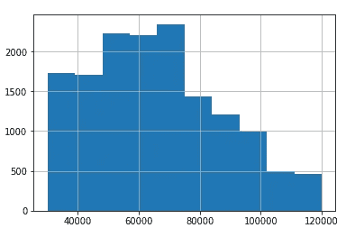

Income also has a relatively normal distribution, ignoring the null values

*   清洁`age=118` 柱


Distribution for agecolumn

*   `became_member_on`柱的特征工程

## c.交易记录

事务数据的模式如下:

**抄本. json**

*   事件(str) —记录描述(即交易、收到的报价、查看的报价等。)
*   人员(字符串)—客户 id
*   time (int) —以小时为单位的时间。数据开始于时间 t=0
*   value —(字符串字典)—报价 id 或交易金额，具体取决于记录

这个数据看起来有点复杂，因为它是按时间排序的，并且有一个事件和值。特别是，`value`列必须根据事件进行预处理。

我还发现抄本中的人数(即唯一 id 的数量)与人口统计数据中的人数相同，所以这是个好消息。但是为了从这个数据集中提取有意义的见解，需要做大量的预处理。

现在，我对抄本数据集进行了一些数据清理。为了从值列中提取细节，我根据事件将值展开到各个列中。这样，我就有了一个干净的转录数据集来做进一步的分析。

## d.定义预处理模型数据的方法

在为模型预处理数据之前，我首先回顾了我的目标。在对数据进行了初步探索之后，我不得不重新评估我将如何为我打算构建的模型清理和准备数据。

为了确定有效报价的主要驱动因素，我必须首先定义星巴克应用程序中的“有效”报价。因此，我对数据集以及这三者如何相互作用做了进一步的探索。

首先，我研究了每种报价类型中的事件种类。

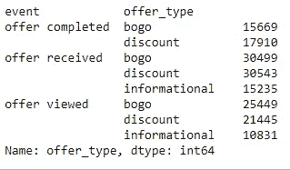

Events grouped by offer_type

我们知道有 4 种类型的事件:`offer completed`、`offer received`、`offer viewed`和`transaction`。但是我们的数据显示我们没有任何与`transactions`相关联的 offer_id，因为它们没有记录在抄本事件数据中。因此，数据预处理的第一个目标是定义一种方法来将 offer _ ids 分配给特定的事务。

此外，我们还知道 BOGO 和折扣优惠在优惠完成时会有一个`offer completed`事件。但是，信息优惠没有与此事件相关联。因此，我们还规定了定义有效报价的方法，如下所示:

对于 BOGO 和折扣优惠，如果按正确的时间顺序记录了以下事件，则定义为有效优惠:

`offer received`->-`offer viewed`->-`transaction`->-`offer completed`

同时，对于信息性报价，由于有`offer completed`事件与之关联，我必须将交易定义为有效报价的转换:

`offer received`->-`offer viewed`->-`transaction`

# 第 2 部分:数据预处理

## a.为交易分配优惠 id

在定义了上面的方法之后，我们现在必须探索将 offer _ ids 分配给特定事务的方法。考虑因素之一是定义以下主要客户群:

1.  **受影响并成功转化的人群—有效优惠:**

*   已收到报价->已查看报价->交易->已完成报价(*BOGO/折扣报价*)
*   已收到报价->已查看报价->交易(*信息报价-必须在报价有效期内*)

**2。收到并查看了优惠但未成功转换的人员—无效优惠:**

*   收到的报价->查看的报价

**3。购买/完成优惠而不考虑任何优惠的人:**

*   交易
*   报价已收到->交易->报价已完成->报价已查看
*   交易->收到报价->完成报价->查看报价
*   已收到报价->交易->已查看报价->已完成报价
*   收到报价->交易(*信息报价*)
*   收到报价->交易->查看报价(*信息报价*)

**4。收到聘用但未采取行动的人员:**

*   收到报价

对于第 2 组中的人，我需要检查是否有事件，其中有`offer received`和`offer viewed`事件，但没有转换事件，即`offer completed`或`transaction`——这些是无效报价的情况。

我必须将组 2 中的人与组 4 中的人分开，因为组 2 中的人可能已经查看了报价，但没有采取任何行动，而组 4 中的人甚至没有`offer viewed`事件。

区分有效优惠的转化(第 1 组)和购买/完成优惠而不考虑任何优惠的人(第 3 组)尤其棘手。对于第 3 组中的人，如果`offer completed`或`transaction`出现在`offer viewed`之前，则转换无效(即，不是从要约的成功转换)。也可能有这样的情况，在查看报价之后发生了`offer completed`，但是在查看报价之前已经完成了交易。在这种情况下，要约可能已经完成，但它也不是有效的转换。

**定义目标变量** `**effective offer**` **:**

定义这些条件后，我们必须决定目标变量是什么。

我们知道第 1 组客户将是我们的目标变量`effective_offer=1`，但对于第 2-4 组客户，有许多无效的报价定义。

那么，我们如何定义无效要约呢？如上所述，第二组属于无效要约的定义范围；用户知道一个提议，但是该提议是无效的，因为它没有将用户转化为顾客。所以第二组可以定义为我们的目标变量`effective_offer=0`。

第三组和第四组呢？组 3 由可能已经收到报价但无论如何都要购买的用户组成。从商业的角度来看，我们不想给他们任何报价。

同时，组 4 用户将被认为是低优先级客户，因为他们不做任何动作，不管他们是否收到报价。

因此，我们可以从模型中取消组 3 和组 4 用户的优先级。仍然值得对第 3 组和第 4 组做一些探索性分析，只是为了探索他们的人口统计数据。

上述条件是我可以通过确保交易发生在`offer viewed`事件之后来分配“影响”交易的报价 id 的基础。

因此，属于组 1 的任何唯一的 person-offer_id 都可以在我们的目标变量`effective_offer=1`组中考虑。

同时，组 2 在我们的目标变量`effective_offer=0`组中。对于第 3 组和第 4 组中的客户，我在模型实现中取消了他们的优先级，但是将在第 4 部分中对他们进行一些探索性分析。

因此，我通过将第 1 组和第 2 组客户数据集附加在一起，为每种包含有效和无效报价的报价类型创建了一个数据集，并成功地为我们的 BOGO 和折扣数据集准备了目标变量。

同时，特别是对于信息优惠，在我们可以标记有效优惠列之前，还有一个额外的考虑—优惠的有效性。这是因为转换事件不是`offer completed`事件，而是`transaction`事件。

对于信息性报价，报价的`duration`可以认为是影响的持续时间。因此，我们可以假设，只有在要约的`duration`范围内，要约才应被视为有效。

同时，对于 BOGO 和折扣优惠，我们可以假设，如果有转换/ `offer completed`事件，它应该在持续时间内，因为如果优惠超过其有效期，则完成优惠没有意义。

## d.特征工程

现在，我们必须回头看看这些功能，看看如何创造性地创造新功能。

**待设计的内径** `**became_member_on**` **柱**

回想我最初的数据探索步骤，`became_member_on`列是日期格式的。因此，为了从该特征中提取有意义的见解，我们可以将其转换为指示成员任期的特征。一个人成为会员的时间长短可能会对他是否接受邀请产生一些影响。

因此，我从`became_member_on`列中提取了每个人的会员任期天数，使用 2018 年作为当前年份。

**d.ii .收到的报价数**

作为进一步数据探索的一部分，我发现每个人可能会收到多个报价。

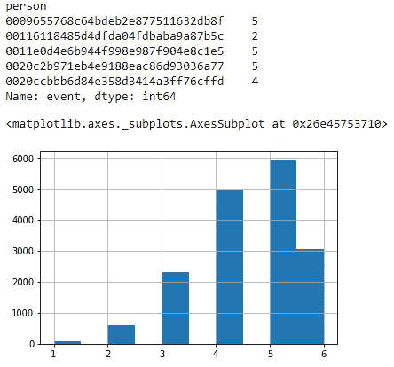

Multiple offers received per person

我们可以从上面看到，在交易数据中，每个人收到的报价范围可以是 1 到 6 个。我有一个假设，即每个人收到的报价频率可能会导致更有效的报价，所以决定设计一个功能`offer_received_cnt`来解释这个频率。

**d.ii .通过交易分离用户行为**

我还想知道根据我的定义，有多少事务被认为是“无效”的。通常，这些是不属于第一组的人完成的交易的总和。优惠的目的是推动购买，因此在交易中花费高的用户将被标记为`effective_offers`。

我们已经定义了第 3 组和第 4 组中的人，他们是独立的用户群，是忠实的消费者，已经倾向于购买更多，不受优惠的影响。

但是对于组 1 中的用户来说，在优惠的效果之外有大量的“无效消费”,可能对优惠的有效性有一些预测能力；因为忠诚的用户可能更倾向于接受报价。

其逻辑是想知道，对于受某些优惠(第 1 组)和第 2 组影响很大的用户，是否存在某种消费基线水平，以及“无效交易”的这种基线水平是否具有某种预测能力，可以预测用户接受优惠的倾向。

因此，我计算了每个人的“无效”交易，作为一个附加特征。

然而，在这样做的时候，我发现在这个工程特性列中缺少的值非常多。

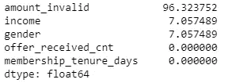

High % of missing values in amount_invalid column for BOGO dataset

由于稀疏性，这个列`amount_invalid`包含在模型中是否有用是有争议的。由于它是如此“稀疏”，它可能没有太多的信息。我计划稍后在模型实现阶段再次评估这个特性。现在，我决定用 0 填充缺失的`amount_invalid`列，因为它可能代表只有 4%的用户倾向于购买没有优惠的商品；其余 96%的人只会在知道有持续优惠的情况下购买。

同时，我们已经在上面对`income`和`gender`列进行了分析，我已经选择删除它们，因为当它们为空时没有用，并且它们只占数据集的 7%。

**丁三世。收到报价的间隔时间**

我还想将时间作为一个潜在的特征包含到我的数据集中，但是由于事务性数据从时间=0 开始，我怀疑如果没有一些特征工程，它不会有太大的预测能力。我有一个假设，如果一个人在某段时间内收到了多个报价，那么在收到报价之间的时间间隔可能会有一些预测能力。

# 第 3 部分:实现

既然数据集已经准备好了，我们就可以开始实现模型了。回到我们的目标，我们想分析有效报价的驱动因素，目标变量是`effective_offer`。

由于我们有 3 种报价类型，因此需要构建 3 种不同的模型。由于我们预测一个提议是否有效，这实际上是一个二元分类监督学习模型。

我决定将简单决策树分类器模型作为基线模型，与集成随机森林分类器模型进行性能比较。我选择决策树作为基线模型的原因是因为我想优先考虑模型的可解释性。回到目标，因为我们打算分析特性的重要性来确定有效报价的驱动因素，所以决策树将为我们的分析提供良好的可解释性。

同时，我还选择了随机森林作为替代模型来比较基线模型，作为对决策树简单集成打包的改进，以提高模型训练的准确性。

在我们继续之前，我们必须确保我们预测的类在每个数据集中是平衡的。

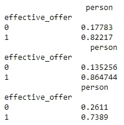

Class breakdown between BOGO, discount and informational offers respectively

我们可以看到，所有三种报价类型的等级很不均衡，但也没有不平衡到会造成问题的程度。因此，我们可以着手实现模型。

关于模型评估和验证的说明:因为所有 3 个模型的类是不平衡的，我决定实现准确性和 f1 分数作为模型评估度量，正如前面已经提到的。

## a.模型实现

回顾我们的目标，我们创建了 3 个模型来预测每种类型的优惠的有效性，具体取决于优惠属性和用户统计数据。

我执行了建模通常所需的步骤:

*   定义目标和特征变量
*   拆分为训练和测试数据
*   应用特征缩放器

我定义了模型管道函数来实现我的模型，因为我计划实现 3 个不同的模型；因此，重复实现会更容易。

我使用决策树分类器作为我的基线模型，并使用随机分配参数的随机森林分类器来比较性能。

**BOGO 公司提供型号**

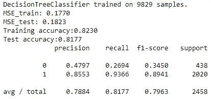

Results for baseline DecisionTree (DT) classifier model on BOGO offers dataset

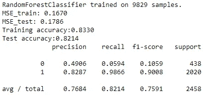

Results for RandomForest (RF) classifier model with randomly set parameters on BOGO offers dataset

随机森林分类器(RF)模型的准确性实际上最终略微优于决策树分类器(DT)模型，但总体而言，两种模型的性能大致相同(就准确性而言，分别为 82.14%和 81.77%)。第一次尝试的准确率相当高，超过 80%。我将尝试进一步调整模型，以获得更好的准确性。

然而，就 F1 分数而言，两个模型都低于 80%，随机森林模型与决策树分类器相比表现更差，分别为 75.91%和 79.63%。为了分析这一点，我们必须参考精确度、召回率和 F1 分数的公式:

**回忆或敏感度或 TPR(真阳性率):**

根据 sklearn 文档，召回直观上是分类器找到所有阳性样本的能力。

全部真阳性中被正确识别为阳性的项目数:真阳性/(真阳性+假阴性)

**精度:**

根据 sklearn 文档，分类器直观地具有不将阴性样品标记为阳性的能力。

在被识别为阳性的项目总数中，被正确识别为阳性的项目数:真阳性/(真阳性+假阳性)

**F1 得分:**

因为我的 F-beta 分数是 F1，beta=1，所以我认为召回率和精确度同等重要。

公式由精度和召回率的调和平均值给出:F1 = 2 *精度*召回率/(精度+召回率)

我们可以看到，DT 的 F1 分数略高于 RF，但都低于准确度。这将表明 DT 模型在不将负面事件错误分类为正面事件方面比 RF 模型做得稍好(意思是，将哪些提议无效的人错误分类为哪些提议有效的人)。

F1 得分与准确性的差异表明，可能存在两个模型都错误地将负面分类为正面的情况，这可能是由于类别的不平衡。但是与 F1 分数相比总体较高的召回率/准确度表明，与预测负面情况(即，要约无效的情况)相比，该模型预测正面情况(即，要约有效的情况)更准确，这在给定不均匀的类别的情况下是可以预期的..

然而，回顾我们的用例，我们可能不太关心这些错误分类，因为我们不介意给人们发送比他们想要的更多的报价；我们不想错过任何一个报价有效的人。

鉴于这种情况，我仍然会选择 RF 型号。

因为我的目标是分析有效报价的驱动因素，所以在我从优化中选择最佳模型后，我将检查模型的功能重要性。

**a.ii .折扣优惠模式**

我重复上面相同的步骤，但是使用我的 offer_discounts 数据集。

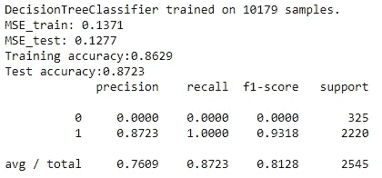

Results for baseline DecisionTree (DT) classifier model on discount offers dataset


Results for RandomForest (RF) classifier model with randomly set parameters on discount offers dataset

这一次，随机森林分类器模型在准确性方面也比决策树分类器有更好的表现(87.23%比 86.72%)，F1 得分也更低(81.43%比 82.87%)。

与准确性得分相比，这些模型的 F1 得分总体较低。这可能表明，在某些情况下，两个模型都错误地对负面情况(effective_offer = 0)进行了分类。同样，我对此并不太担心，因为我更关心准确预测阳性病例的模型，所以我宁愿选择更高准确性的模型，其中病例`effective_offer=1`的 F1 得分更高，我们的 RF 分类器在这方面具有更好的性能(0.9317 比 0.9280)。

**a .三.信息优惠模式**

对`offers_info`数据集重复上述步骤:


Results for baseline DecisionTree (DT) classifier model on informational offers dataset


Results for RandomForest (RF) classifier model with randomly set parameters on discount offers dataset

与其他两个数据集相比，这些模型的性能更差，两个模型的精度都低于 80%，但 RF 模型的性能仍然更好。F1 得分也更差，为 67.54% RF 分类器，比 DT 模型的 68.66%差。

性能较差的一个潜在原因可能是由于我有一个重要的假设，将转换事件指定为仅在查看要约之后且在指定的持续时间内发生的交易；由于删除了那些不管发生的事务，我可能错过了一些有价值的信息。我们可以从总体样本数据集比其他两个报价的数据集小(大约一半)看出这一点，BOGO 和折扣分别只有大约 5K 个样本，而 10K 只有大约 5K 个样本。

## b.精炼

在优化模型时，我将首先尝试对 3 个 RF 模型进行参数调整，然后尝试删除或添加特性来提高模型性能。

**b. i .网格搜索发现最佳参数**

我决定做 GridSearch 来确定模型的最佳参数。

对于所有三个选项，随机森林模型都有相对较好的性能，所以我使用网格搜索来确定最佳参数。

**BOGO:**

当我使用最佳参数重新运行 BOGO 数据集的模型时，我获得了以下结果:

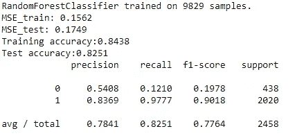

RF model results with params from GridSearch

与第一个模型相比:


Comparing results for 1st model with 2nd model for BOGO dataset

RF 模型的准确性略有提高，从 82.14%提高到 82.51%，F1 得分从 75.91%提高到 77.64%。这是一个很好的性能提升，但幅度很小，这表明可能无法通过参数调整来提高模型的性能。

因此，我将不得不探索其他途径来进一步提高模型的性能。

**对于折扣:**

同时，对于折扣数据集，运行 GridSearchCV 获得了以下参数:


Best parameters for discount offers dataset according to GridSearchCV

使用这些参数实现模型获得了以下结果:


RF model results with params from GridSearch


Comparing results for 1st model with 2nd model for discount dataset

模型的准确率略有提高，从 87.23%提高到 87.47%，F1 评分从 81.43%提高到 82.06%。好的一面是，现在 RF 模型的准确性和 F1 分数都比 DT 模型好。

但是因为增加很少，我们可以再次得出结论，调整参数不会真正显著提高模型的性能。

**对于信息优惠:**

最后，对于信息性报价数据集，运行 GridSearch 获得了以下参数:


Best parameters for informational offers dataset according to GridSearchCV

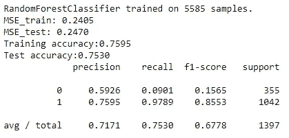

RF model results with params from GridSearch


Comparing results for 1st model with 2nd model for informational dataset

我们再次看到 RF 模型的准确性有所提高，从 75.09%提高到 75.30%，F1 分数从 67.54%略微提高到 67.78%。这种改进是最小的，所以我们研究改进模型的特征选择。

**b.ii 去除稀疏特征，例如** `**amount_invalid**`

就特征选择而言，我想试试看移除`amount_invalid`变量是否会有帮助，我们已经注意到它是稀疏的，因此在预测报价的有效性方面可能没有用处。

我从我的数据准备中删除了该特征，并使用通过 GridSearch 找到的相同最优参数重新训练了该模型，将 DT 模型作为基线。


Comparing model 2 with model 3 for BOGO model

模型准确性和 F1 分数确实提高了，所以我将在模型中去掉 amount_invalid 特征。


Comparing model 2 with model 3 for discount model

模型的准确性实际上增加了，而 F1 模型保持不变。在这种情况下，我还将删除折扣模型的 amount_invalid 特性。


Comparing model 2 with model 3 for informational model

对于 info 模型，模型的准确性实际上降低了，所以我也将保留这个特性。这是意料之中的，因为与其他两个模型相比，该模型已经有了更差的性能，所以与其他模型相比，该模型稍有不足。因此，该模型需要更多的特征来学习更好地预测。

**b. iii。删除一级虚拟变量/一键编码**

当涉及到热编码时，使用树模型和使用回归模型是有争议的。对于回归分类模型(如逻辑回归),我们通常应移除一个级别的变量，以防止变量之间的多重共线性。一般来说，我们不应该在我这里使用的基于树的模型中遇到这个问题。

然而，关于一个人是否应该这样做还有一些争论。根据一些文章(如这里的[)](https://roamanalytics.com/2016/10/28/are-categorical-variables-getting-lost-in-your-random-forests/))，通常不建议对分类变量进行编码，因为它们会生成稀疏矩阵，导致:

1.  由此产生的稀疏性实际上确保了连续变量被赋予更高的特征重要性。
2.  分类变量的单个级别必须满足非常高的标准，以便在树构建的早期被选择进行拆分。这可能会降低预测性能。

在 RF 和 DT 的 scikitlearn 实现中，必须对变量进行编码。因此，我决定测试我的模型性能，如果我放弃一个级别的分类变量(在我的数据中——渠道变量和性别变量),只是为了减少我的模型数据中的稀疏性和噪声。

然而，我发现，总体而言，仅仅通过减少一个级别的分类特征，模型性能并没有太大的改善。

虽然这三个模型都达到了我的基准利率 75%，特别是 BOGO 和折扣模型，我想探索是否可以改善信息模型的性能。

我将暂时把 BOGO 和折扣模型放在一边，因为我对模型的性能很满意。

**b. iv。使用多项式特征**

由于 info 模型的低精度分数可能是由于模型拟合不足，所以我决定尝试进一步变换特征是否可以提高模型性能。我对 info 模型中的变量应用了多项式特征变换来检查模型性能。


Comparing best info model so far (model 2) with current model 5

我们可以看到，RF 模型的性能实际上略有下降。因此，保持模型不变可能是一个更好的主意。信息报价的最大准确度为 75.30%，这是可以接受的，尽管它没有 BOGO 或折扣报价高。毕竟，我们已经根据持续时间对报价的“影响”做了一些假设。

绘制到目前为止 RF info 模型的训练和测试精度会产生以下图表:

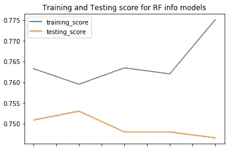

我们可以从上面看到，当我们通过多项式特征为每个模型添加更多变量并移除 amount_invalid 特征时，该模型在训练准确性方面表现得更好。这只是测试精度降低，我们可以看到这是由于过度拟合。

我可以通过使用 RF info model 5 来进一步提高 info model 的准确性和性能，但要添加更多数据，因为我们已经注意到,`offers_info`数据集的大小是 BOGO 和折扣数据集的一半。因此，最终有了更多的数据和性能调整，删除了不必要的变量和特征转换，有了更多的数据，我可能最终得到的模型性能可能超过 80%。

**b .四、关于最佳模式和特性重要性的讨论**

现在，我已经完成了对 3 个模型的优化，我们可以检查所有 3 个模型的最佳模型的结果，并检查功能的重要性，以查看产品有效性的主要驱动因素。使用我的`best_model`函数，我得到了下面的结果数据:

```
#get best model overall for bogo,discount and info offers
best_model('bogo').append([best_model('discount'),best_model('info')]).transpose()
```


Model performance for best models

总的来说，我们可以看到，表现最好的模型是第三个模型(使用 GridSearch 查找最佳模型参数并删除 amount_invalid 列),用于预测 BOGO 和折扣优惠的有效性，而表现最好的信息优惠模型是在执行 GridSearch 查找最佳参数之后。

为了找到有效报价的最有影响力的驱动因素，我们可以检查上面我们的最佳模型的特征重要性。

**针对 BOGO 车型:**


**对于折扣型号:**

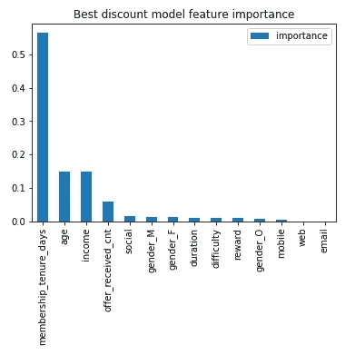

**对于信息模型:**

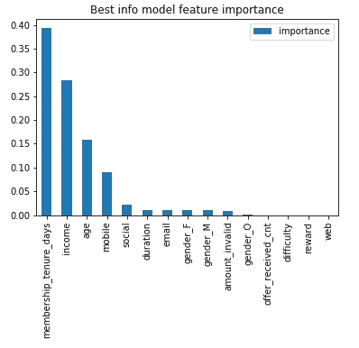

检查功能重要性以分析有效优惠的主要驱动因素，我们可以看到，在所有三个方面，有效优惠的最重要驱动因素是会员资格。然而，第二个最重要的特点是三种型号各不相同。

对于 BOGO 要约，成员任期是最重要的特征，其他变量在比例上要小得多。收入、年龄和 offer_received_cnt 是第 2、3、4 位最重要的特征，但所占比例很小。

对于折扣优惠，在会员资格之后，年龄和收入是下一个最重要的变量。但是比例还是很小的。

与 BOGO 和折扣模型相比，信息优惠模型的特征重要性更加分散，收入是第二重要的特征。年龄是第三位，有趣的是移动渠道是第四位。

# 第 4 部分:侧面探索

## a.探究第 3 组和第 4 组用户——不看任何优惠就购买的人

我们之前将第 3 组和第 4 组的人描述为不管是否看到任何报价都会购买的人。现在我们可以做一些探索性的分析，看看这个用户群是由什么样的人组成的。

**人工智能数据准备**

观察第 3 组和第 4 组的人与第 1 组和第 2 组的人的对比会很有趣，所以我决定在这三组人之间进行比较。

我将来自三种报价类型的所有组的数据附加在一起，然后通过可视化比较每个组的特征。

我还清除了数据集的空值，类似于上面为建模而准备的数据集。


Size of each group of customers in overall dataset

比较 3 个组的大小，我们可以看到组 1 最大，而组 2 最小，这并不奇怪，因为我们已经看到我们的数据集中的类不平衡，有利于正类(即`effective_offers=1`)。同时，对于第 3 组和第 4 组的人来说，也有相当多的人，比第 2 组的人多。

**a .二.人口特征探索**

同时，为了有效地比较各组，我将各组一起可视化。

首先，我们可以探讨 3 个群体之间的收入分配。

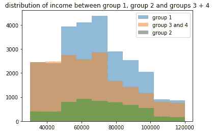

在这三个部分中，大多数人都属于中等收入范围(5 万-10 万)。这三个部分之间的收入分配相对相似。

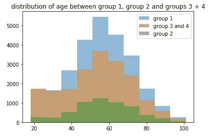

三个组之间的年龄分布看起来也相对相似，大多数人在 40-80 岁之间。

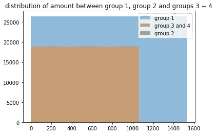

第二组是根本没有消费的人，因为优惠对他们无效，因此他们不在图表中。但对于第 1 组和 3+4 组，我们可以看到花费的金额相对相似，只是第 1 组的人花费略多。这是意料之中的，因为我们可能会认为，这些优惠设法刺激他们购买更多，因此他们的总体支出增加了。

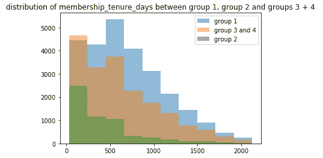

会员任期的分布在 3 个细分市场之间看起来也很相似，大多数人的任期在 0-700 天之间。至少在目前提供的数据中，这三个组之间似乎没有太多的人口统计学特征差异。

## **b .潜力一体机型号**

出于好奇，我想知道如果要约类型作为一个分类特征包含在内，我们是否可以预测要约的有效性。优惠的类型会影响用户的反应吗？

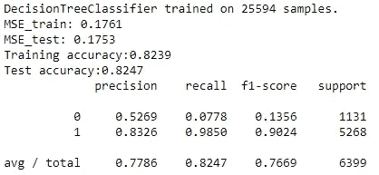

DT baseline model for all-in-one dataset


RF model for all-in-one dataset

在初始化和运行模型之后，我对照一体化模型检查了我之前构建的所有三个模型的性能。


将每种优惠类型的 3 个最佳型号的性能与 all_in_one 型号进行比较，我们可以看出，all-in-one 型号不如 RF bogo 和 discount 型号，大约略好于 info 型号。这可能是由于信息模型拉低了性能，导致一体化模型的准确性降低。我怀疑，如果我们将一体化模型的性能分解为只看它预测信息提供类型的有效性的能力，它也将比它预测其他 2 种类型的性能差。

如果我们退一步，从全局来看，3 个独立的模型具有更高的精度比一个一体化模型更有用。这是因为 BOGO 和折扣优惠实际上旨在通过一些促销成本来推动销售，而信息性优惠基本上是免费的，没有成本，如果它们能够推动销售，那将是一种奖励。

因此，我实际上建议 3 个独立的模型更有用。

## c .给定一个有效的报价，我们能预测某人会花多少钱吗？

除了一体化模型之外，由于我们已经保存了有效交易的数据集，我很想知道我是否可以建立一个回归模型来预测某人在给定有效报价的情况下会花多少钱。我可以为每种优惠类型分别建立一个模型来预测他们的消费，但是我很想知道优惠类型是否也会决定用户的消费水平。


Comparing results for both regression models

然而，回归模型在预测支出金额方面表现不佳。根据我们第 1 组客户的当前数据，似乎没有足够的信息来预测该优惠类型可以推动的金额。我们可以看到决策树回归模型确实过度拟合了数据，训练分数非常高，但测试分数低于标准。同时，线性回归模型(具有岭/l2 正则化)也显示了特征和目标变量之间的最小相关性。这个模型确实对数据拟合不足。

如果我再次根据优惠类型将模型分成 3 个不同的模型，我可能会获得更好的性能；或者甚至尝试包含不受影响的/无效的事务，但这可能是另一次的探索。

# 第五部分:结论

总的来说，我发现这个项目很有挑战性，主要是因为`transcript`数据集中的数据结构。我从两个商业问题开始:

1.  星巴克应用程序上有效报价的主要驱动因素是什么？
2.  提供的数据，即报价特征和用户人口统计数据，能否预测用户是否会接受报价？

## a.反射

**人工智能问题 1 调查结果**

对于问题 1，所有 3 个模型给出的特征重要性是，成员的任期是要约有效性的最大预测因素。进一步的研究将能够表明什么样的平均任期天数将导致有效的 BOGO 要约。

对于所有三个模型，前三个变量是相同的——成员任期、收入和年龄。但是，收入和年龄会根据优惠类型改变订单。

对于 BOGO 和折扣优惠，特征重要性的分布相对相等。然而，对于信息提供，分布稍微平衡一些，收入是第二重要的变量。

**二.问题 2 调查结果**

我决定使用 3 个独立的模型来预测每种优惠类型的有效性，最终 BOGO 和折扣模型的准确性较好(BOGO 为 82.83%，折扣为 87.35%)，而信息性优惠的准确性稍差(75.3%)。然而，在商业环境中，我认为 75%是可以接受的，至于信息性报价，通知用户产品是没有成本的。

与此同时，对于 BOGO 和折扣模型，我对 80%及以上的准确性非常满意，因为在向人们显示报价的商业环境中，即使模型错误分类了一些，整体收入的增加也可能证明这几个错误是正确的。

## b.主要挑战和潜在改进

在分析和构建机器学习模型来回答上述问题时，我对主要挑战和发现的思考如下:

**为交易分配 offer _ ids 的 b.i .归属框架**

为了回答问题 1，我必须首先使用交易记录来定义“有效要约”的含义。这被证明是项目中最棘手的部分。我必须定义一个有效转化的漏斗，因为我们有有效和无效转化的数据。因此，我根据每个人之前发生的事件，为转换事件(`offer completed`和`transaction`事件)设计了一个归因模型。

最后，我不得不根据用户在脚本数据中的行为，将他们分成 4 个不同的池:

*   第 1 组:受优惠影响并因此购买/完成优惠的人(成功/有效转换优惠)
*   第 2 组:收到要约但未受影响的人，因此没有转换事件(要约的无效转换)
*   第三组:有转化事件但实际上没有受到要约影响的人
*   第 4 组:收到提议但没有意见或行动的人

即使在将组分开后，根据事务数据将人分配到组 3 也是一个挑战。我必须先定义事件空间，在这个空间中，正确的事件序列将会发生，然后我才能为事务分配一个 offer id(它没有 offer_id)，本质上是设计一个基于事件/序列的属性窗口。

在将转化归因于特定的优惠之后，剩下的数据准备和清理就相对简单了。我很高兴没有很多丢失的值，分类变量的准备也相对简单。

**b.ii .特征工程**

我决定做一些基本的特征工程，因为我发现这个模型在这个项目中的第一次尝试中有点不足，所以我后来添加了特征工程部分。它略微提高了模型的性能，我从`became_member_on`列中设计出的 membership _ tension 特性最终成为最重要的预测变量。

然而，总的来说，我发现我想不出使用时间数据的额外功能，即使我有预感，收到要约的时间可能对确定它是否有效有很大影响。

**b .三.模式实施决定**

根据我对问题陈述的定义，我决定根据报价类型建立 3 个独立的模型，因为我想发现什么会推动有效的报价，我认为通过将数据分成报价类型来消除数据中的干扰更有意义。我的决定最终是一个相当好的决定，因为与一体化模型的总体分数相比，单一 BOGO 和折扣模型在测试分数中获得了良好的表现。

对于信息模型，准确性稍差，因为我们有更少的记录(BOGO 和折扣模型的一半)。如上所述，我相信如果我们有更多的数据，我可以获得更高的准确性，因为在我决定改进模型拟合(如添加多项式特征和移除“有噪声”的特征，如 amount_invalid 特征)时，训练和测试得分之间出现了明显的背离模式。由于数据有限，我的决策以模型过度拟合而告终，因此我相信更多的数据会有助于模型的准确性。

关于模型选择的补充说明—我选择了基于树的模型，因为我想评估特征的重要性，但我可以通过测试参数/回归模型(例如，用于分类任务的逻辑回归)来进一步扩展这项研究。假设回归模型和基于树的模型具有不同的数据分析方式，那么这两种模型的系数权重可能会与基于树的模型的特征重要性形成对比。与本研究中的情况相反，功能`membership_tenure_days`可能不是权重最高的功能。

**b .四、探索不同客户群的人口统计**

我很想知道第 3 组和第 4 组的特点是什么，他们是完全不受报价影响的客户。然而，在将他们的特征与第 1 组和第 2 组进行比较后，我看不出他们在人口统计学上有任何显著差异。

我希望有更多的数据来了解为什么这部分客户往往不受优惠的影响，以便提出有用的建议，告诉他们如何给他们提供良好的客户体验，即使我们不向他们提供任何优惠。

**b.v .模型在有效报价下预测花费金额的准确性**

我出于好奇建立了一个回归模型，看看我们能否预测用户的消费金额，因为他们会受到优惠的有效影响。这样做的动机是，如果我们能预测给定一个报价，某人会花多少钱，也许我们就能评估哪个报价能带来最多的收入。

然而，我的模型发现，所提供的功能(即，应用程序用户的特征和人口统计数据)与每个用户的消费金额之间几乎没有相关性。这些功能还不足以预测每个用户的花费。也许如果我们也有一个报价的价值，例如，一个折扣报价，以美元计算的折扣价值，也许我们能够更好地预测。

也许我可以把它们分成 3 个不同的模型，用于 3 种报价类型，就像我对二元分类模型所做的那样，以便得到更好的结果。然而，考虑到这只是一种好奇，我想探究报价类型是否是一个具有统计显著性的预测特征，我为此实例构建了一个一体化模型。如果有更多的时间和数据，这将值得进一步探索。

## c.最后的想法

`transcript`数据集的顺序、基于事件的性质带来了最大的挑战，但它在应用程序数据或许多数字分析数据(包括 web 在内的交易数据)中很常见。因此，我发现这次挑战是一次有益的经历。

如果提供更多种类的产品数据以及产品价格，这个项目肯定可以进一步扩大。它可以扩展到更长时间的客户细分练习，以确定偏好某些优惠类型或产品的客户的属性，甚至预测优惠的相关价格范围。

然而，数据准备和清理会更具挑战性，因此在这种情况下，我很感激所提供的数据更加有限和可控。我对我的车型在此范围内的表现感到满意。

如上所述，这篇文章虽然包含了理解所需要的代码输出，但缺少项目中的详尽细节。如果你想进一步了解我的代码和分析，可以点击这里的链接[。](https://github.com/syuenloh/UdacityDataScientistCapstone)