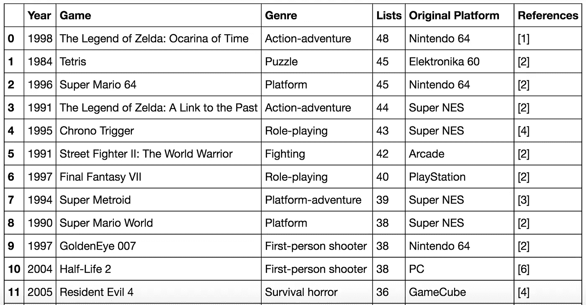
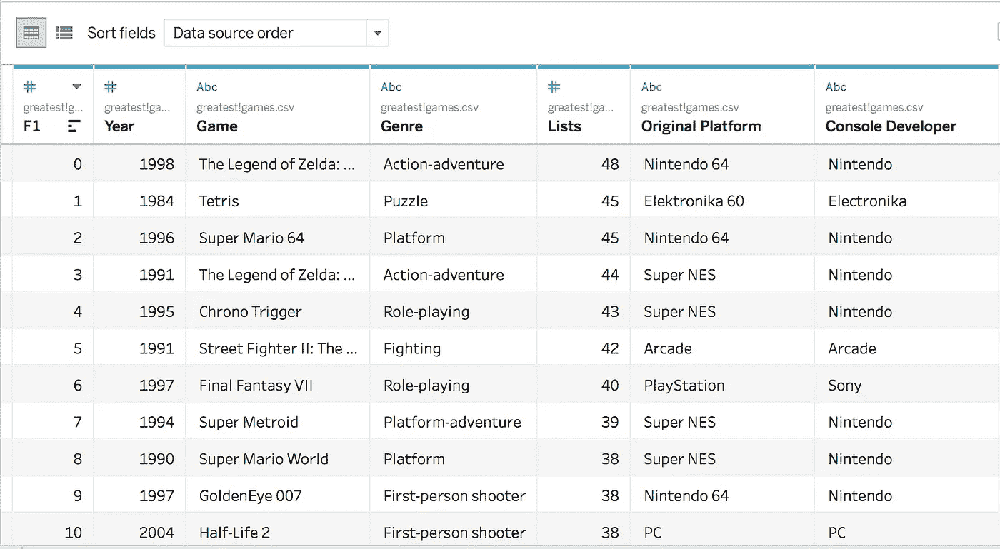
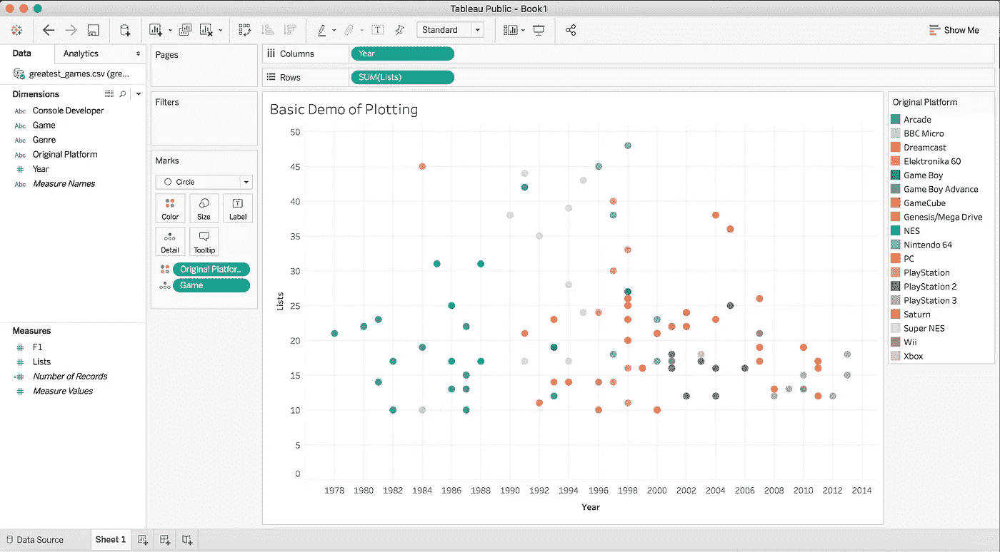
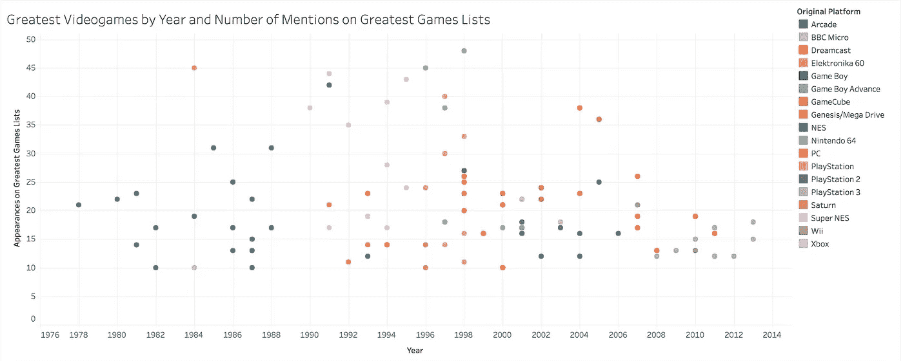
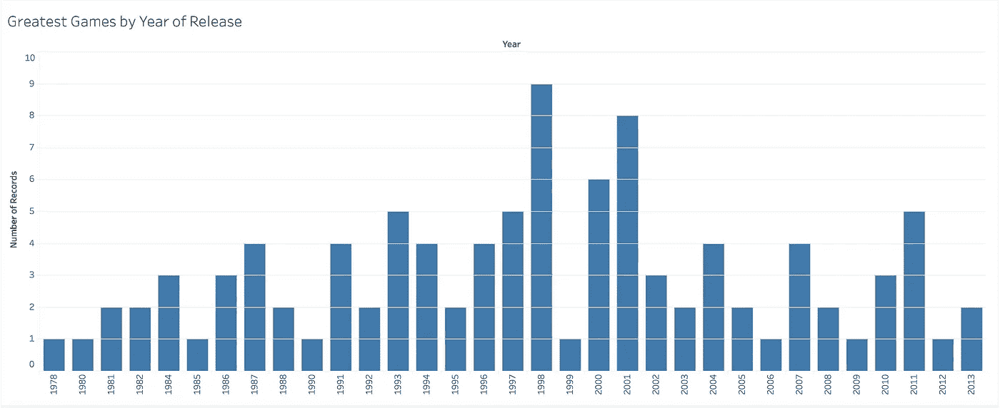
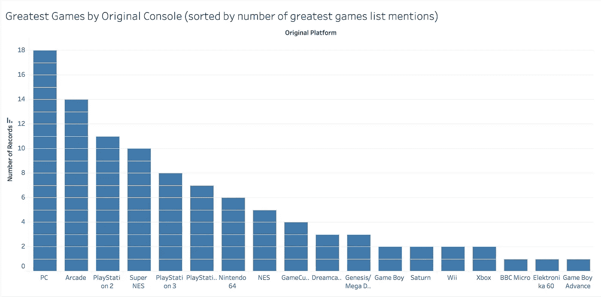
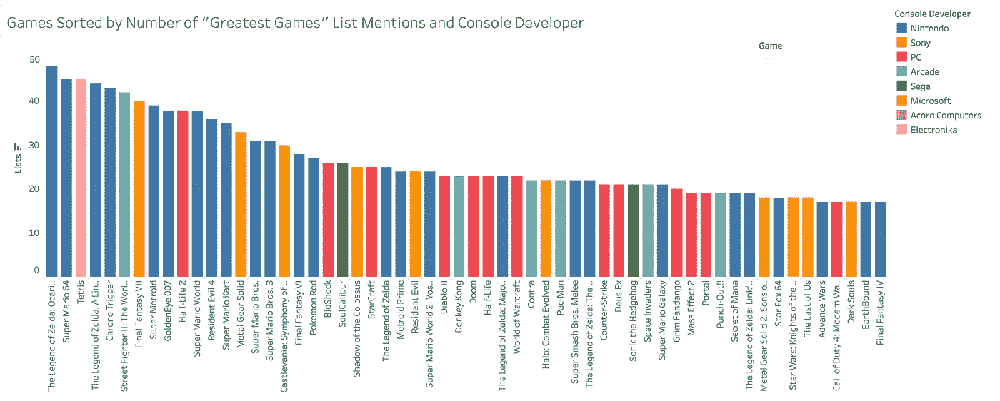

# 使用 Tableau 可视化维基百科上最棒的视频游戏列表

> 原文：<https://towardsdatascience.com/using-tableau-to-visualize-the-list-of-greatest-video-games-from-wikipedia-eee804459f29?source=collection_archive---------1----------------------->

几周前，我在博客上发布了一篇文章[，回顾了我对一个](https://medium.com/towards-data-science/web-scraping-the-list-of-greatest-video-games-from-wikipedia-pt-1-230c64d93e8c)[维基百科页面的](https://en.wikipedia.org/wiki/List_of_video_games_considered_the_best)抓取，该页面列出了有史以来最棒的视频游戏。与此同时，当我忙于其他事业时，我想重温我收集的信息，看看我是否能以有趣的方式将数据可视化，并练习我的紧急画面技巧。

Solid Snake and Liquid Snake from Metal Gear Solid (1998). Original artwork by Yoji Shinkawa

为此，我使用了 [Tableau Public](https://public.tableau.com/s/) ，这是一个免费下载的应用程序，具有相当的深度。使用这个程序的一个注意事项是，您需要创建一个 Tableau 配置文件来保存您创建的任何可视化效果。这些将由 Tableau 公共网站托管，因此在保存您的作品之前，您需要了解与您的数据相关的任何专有问题。

简要回顾一下数据，我在这个过程中使用的最伟大的游戏列表包括 1978 年至 2013 年期间发布的 100 款不同的游戏。这些数据包括每款游戏的发布年份、游戏名称、发布的原始平台/主机、游戏类型以及游戏出现在“最伟大游戏”列表中的次数。以下是数据表内容的部分快照:

Basic structure of the “Greatest Games” data table.

我最初在 pandas 中将这些信息保存为数据帧，然后将数据转换并保存为本地 csv 文件。Tableau Public 在可以处理的文件类型方面非常灵活。它可以导入或连接到单个文件(excel，JSON 等。)或远程数据服务器。要处理 csv 文件，您需要从开始菜单中选择“文本文件”。

Tableau Public 的另一个重要特性是，它可以直观地读取和理解每个数据列中存在的数据类型(例如，分类、连续、地理空间)，这使得“拖放式”可视化更容易生成。

The data structure of my csv file, as interpreted by Tableau. Categorical columns are labeled “Abc”, while continuous variables are labeled “#”. I generated an additional column of information “Console Developer” to ease some of my later visualizations.

创建任何给定的绘图时，只需打开一个新的工作表(参见 Tableau 窗口的左下角)，然后将感兴趣的变量拖到它们各自的列、行或标记字段中。这里有几个额外的字段可以以有趣的方式使用，我不会在这里深入讨论。(例如，左上角的“pages”字段可与时间序列数据一起使用，创建一种数据活页本，显示您的时间数据的每一天/月/年。)

下面快速浏览一下 Tableau 窗口，其中一些数据已经放置到位。该图在 x 轴上描绘了年份，在 y 轴上描绘了最伟大的游戏列表出现的数量，游戏作为每个单独的点，由原始平台着色。

虽然 Medium 还不允许将 Tableau 可视化直接嵌入到帖子中，但我可以发布图像捕获，然后在图像中嵌入链接，将您带到 Tableau 公共网站上这些可视化的交互版本。(对于其他介质用户，可以在 Mac 上使用 **Command+K，在 PC 上使用 Control+K，在图片上嵌入链接。**)

下面是上述情节的一个更加完美的版本，它链接到交互式 Tableau 版本:

使用该链接，你可以将光标悬停在图中的任何数据点上，以显示每个游戏的名称、发布年份和原始平台，以及它出现在最伟大游戏列表中的数量(根据维基百科)。

乍一看，这个最初的情节非常有趣。我们可以看到，在 90 年代中后期和 21 世纪初，游戏数量和最伟大游戏列表的数量呈现出总体上升趋势，在 21 世纪中期和以后再次下降。这可能部分是由于历史偏见，90 年代末和 21 世纪初出现在足够远的距离，以至于流行观点已经就这些游戏的伟大之处达成一致，而其他更现代的经典游戏，如《最后的我们》，自发布以来还没有足够的时间巩固它们在各种最伟大游戏列表中的位置。

虽然一簇簇的点可能有些说明问题，但使用分段条形图可以更容易地查看每年最伟大游戏的数量。探索互动的情节，游戏出现在每年最伟大的游戏名单上的数量下降的顺序。：

当确定过去几十年中每年发布的“最伟大的游戏”的数量时，从表面上看这个图表要容易得多。很明显，1998 年和 2001 年是这里最突出的年份。仅在 1998 年就出现了诸如《塞尔达传说:时间之笛》、《合金装备 2:自由之子》、《口袋妖怪红》、《灵魂口径》、《星际争霸》、《半条命》和《生化危机 2》等开创性经典作品，而 2001 年则出现了诸如《光环:战斗进化》、《超级粉碎兄弟:肉搏》、《合金装备 2:自由之子》、《最终幻想 X》、《侠盗猎车手 3》和《寂静岭 2》等其他具有历史意义的重磅作品。

在查看了按年度发布的最伟大游戏的数量后，我想更仔细地看看由主机发布的游戏的数量:

通过发布的原始控制台绘制游戏对于 PC 和街机游戏来说有些复杂。这在一定程度上是因为这些平台在某种程度上超越了一代游戏机的概念——在家用游戏机被广泛采用之前，街机平台显然占据了主导地位，而个人电脑是一种不受其他家用游戏机占据的不同时间段限制的永恒平台。不过，有趣的是，在最棒的游戏数量排名中，Playstation 游戏机位列前六名。有趣的是，看看有多少任天堂创造的游戏机出现在这个列表中。

为了让 PC 和 Arcade 拥有平等的竞争环境，我按照主机开发商对游戏进行了分类，以了解不同的主机开发商(如索尼、微软、任天堂)在所有不同平台(如 Playstation 1、Playstation 2、Playstation 3 与 NES、SNES、N64 等)上的表现。)

我决定按照列表中提及次数的降序来绘制每款游戏，并由主机开发人员进行着色:(注意，点击交互式绘图，您可以滚动到右侧查看所有列出的游戏)

我认为有趣的是，尽管索尼的个人游戏机比大多数任天堂平台表现更好，但任天堂开发的游戏在最受好评的游戏中表现强劲，被提到的最伟大游戏数量也很多。

我希望你喜欢点击这些最伟大的游戏的可视化。我真的很喜欢在和 Tableau 一起工作的短暂时间里制作它们。我还希望您已经了解了 Tableau 的工作原理，以及如果您决定尝试一下，它会有多友好。

如果你有任何反馈，请告诉我！