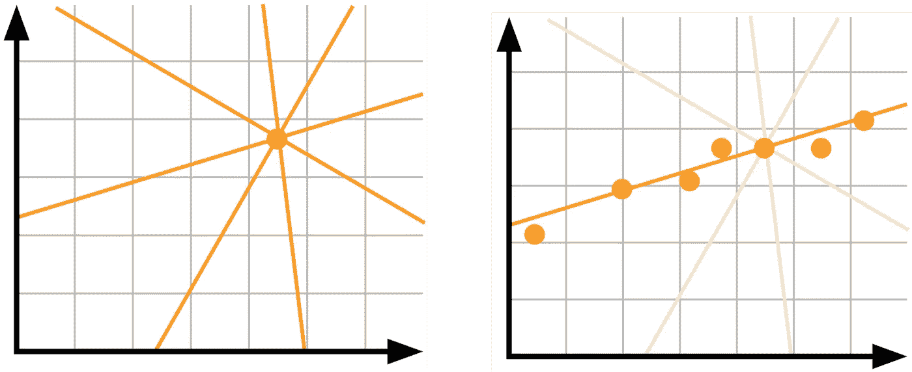
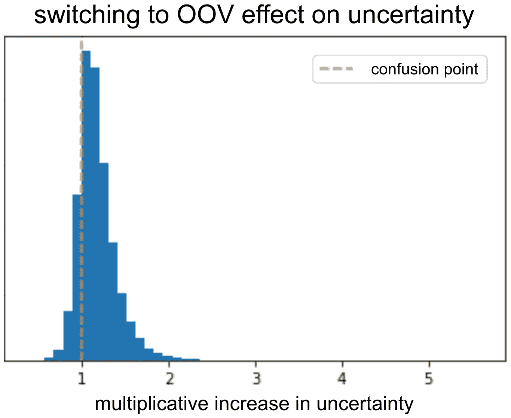
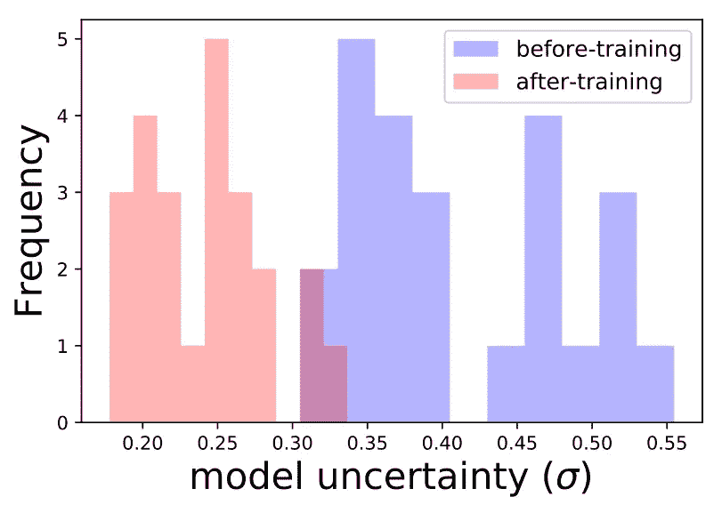

# 用不确定性来解释你的模型

> 原文：<https://towardsdatascience.com/using-uncertainty-to-interpret-your-model-c7b8c9a63072?source=collection_archive---------7----------------------->

*这是一个与* [*约尔·泽尔德斯*](http://anotherdatum.com/) *的联名帖。最初发布于 taboola engineering* [*博客*](https://engineering.taboola.com/using-uncertainty-interpret-model/) *。*

随着深度神经网络(DNN)变得更加强大，它们的复杂性也在增加。这种复杂性带来了新的挑战，包括模型的可解释性。

可解释性对于构建更健壮、更能抵抗恶意攻击的模型至关重要。此外，为一个新的、没有被很好研究的领域设计一个模型是具有挑战性的，能够解释模型正在做什么可以在这个过程中帮助我们。

模型解释的重要性促使研究人员在过去几年里开发了各种各样的方法，去年在 NIPS 会议上，一个完整的研讨会专门讨论了这个主题。这些方法包括:

*   [LIME](https://arxiv.org/abs/1602.04938) :通过局部线性近似解释模型预测的方法
*   激活最大化:一种理解哪些输入模式产生最大模型响应的方法
*   [特征可视化](https://distill.pub/2017/feature-visualization/)
*   将 DNN 层嵌入到[低维解释空间](http://www.interpretable-ml.org/nips2017workshop/papers/04.pdf)
*   [运用认知心理学的方法](https://deepmind.com/blog/cognitive-psychology/)
*   不确定性评估方法——这篇文章的重点

在我们深入探讨如何使用不确定性来调试和解释您的模型之前，让我们了解一下为什么不确定性很重要。

## 你为什么要关心不确定性？

一个突出的例子是高风险应用。假设您正在构建一个模型，帮助医生决定患者的首选治疗方案。在这种情况下，我们不仅要关心模型的准确性，还要关心模型对其预测的确定程度。如果不确定性太高，医生应该考虑到这一点。

自动驾驶汽车是另一个有趣的例子。当模型不确定路上是否有行人时，我们可以使用该信息来减慢汽车速度或触发警报，以便司机可以控制局面。

不确定性也可以帮助我们找出数据之外的例子。如果模型没有使用与手边的样本相似的例子进行训练，那么如果它能够说“对不起，我不知道”可能会更好。这本来可以避免谷歌照片将非裔美国人错误归类为大猩猩的尴尬错误。像这样的错误有时会因为训练不够多样化而发生。

不确定性的最后一种用法，也是这篇文章的目的，是作为从业者调试模型的工具。我们一会儿会深入探讨这个问题，但首先，让我们来谈谈不同类型的不确定性。

## 不确定性类型

有不同类型的不确定性和建模，每一种都有不同的用途。

模型不确定性，又名认知不确定性:假设你有一个单一的数据点，你想知道哪个线性模型最好地解释你的数据。没有好的方法来选择图片中的不同线条—我们需要更多的数据！

左边:数据不足导致高度不确定性。右边:给定更多数据，不确定性降低

认知不确定性解释了模型参数的不确定性。我们不确定哪个模型权重能最好地描述数据，但是给定更多的数据，我们的不确定性会降低。这种类型的不确定性在高风险应用中以及在处理少量稀疏数据时非常重要。

举个例子，假设你想建立一个模型，得到一个动物的图片，并预测这个动物是否会吃你。假设您在狮子和长颈鹿的不同图片上训练模型，现在它看到了一个僵尸。由于该模型不是在僵尸图片上训练的，因此不确定性会很高。这种不确定性是模型的结果，如果有足够多的僵尸图片，这种不确定性就会减少。

**数据不确定性**，或随机不确定性，捕捉观察中固有的噪声。有时候世界本身是随机的。在这种情况下，获得更多的数据对我们没有帮助，因为噪音是数据中固有的。

为了理解这一点，让我们回到我们的食肉动物模型。我们的模型可以识别出一幅图像包含一只狮子，因此你很可能会被吃掉。但是如果狮子现在不饿呢？这一次的不确定性来自于数据。另一个例子是两条看起来一样的蛇，但其中一条有毒，另一条则没有。

任意不确定性分为两种类型:

1.  同方差不确定性:所有输入的不确定性是相同的。
2.  异方差不确定性:取决于手头具体输入的不确定性。例如，对于[预测图像](https://arxiv.org/abs/1703.04977)中深度的模型，无特征的墙预计比具有强消失线的图像具有更高的不确定性。

**测量不确定度**:不确定度的另一个来源是测量本身。当测量有噪声时，不确定性增加。在动物的例子中，如果一些照片是用质量差的相机拍摄的，模型的可信度会受到损害；或者，如果我们正在逃离一只可怕的河马，结果我们只能处理模糊的图像。

**嘈杂的标签**:通过监督学习，我们使用标签来训练模型。如果标签有噪声，不确定性就会增加。

每种不确定性都有不同的建模方法。这些将在本系列的后续文章中讨论。现在，让我们假设我们有一个黑盒模型，它暴露了关于其预测的不确定性。我们如何使用它来调试模型？

让我们考虑一下 Taboola 中的一个模型，它用于预测用户点击内容推荐的可能性。

## 使用不确定性来调试您的模型

该模型具有许多由嵌入向量表示的分类特征[。该模型在学习稀有值的广义嵌入时可能会有困难。解决这一问题的常见方法是使用特殊的词汇外(OOV)嵌入。](https://engineering.taboola.com/using-word2vec-better-embeddings-categorical-features/)

想想一篇文章的广告词。所有罕见的广告客户共享相同的 OOV 嵌入，因此，从模型的角度来看，他们本质上是一个广告客户。这个 OOV 广告商有许多不同的项目，每一个都有不同的点击率。如果我们只用广告客户作为点击率的预测指标，我们会得到 OOV 的高度不确定性。

为了验证 OOV 模型输出的高度不确定性，我们采用了一个验证集，并将所有的广告客户嵌入转换到 OOV。接下来，我们考察了转换前后的不确定性。不出所料，由于切换，不确定性增加了。该模型能够学习给定一个信息丰富的广告客户，它应该减少不确定性。

我们可以对不同的特征重复这一过程，并寻找用 OOV 嵌入替换时导致低不确定性的特征。要么是这些特征没有提供信息，要么是我们将它们输入模型的方式不理想。

我们甚至可以达到更精细的粒度:一些广告客户在不同项目的点击率之间有很高的可变性，而另一些项目的点击率大致相同。我们预计第一类广告客户的模型具有更高的不确定性。因此，一个有用的分析是着眼于广告客户的不确定性和点击率可变性之间的相关性。如果相关性不是正的，这意味着该模型未能了解与每个广告客户相关联的不确定性。这个工具允许我们了解在训练过程中或者在模型的架构中是否出了问题，这表明我们应该进一步调试它。

我们可以执行类似的分析，并查看与特定项目相关的不确定性是否随着我们展示它的次数增加而降低(例如，向更多用户/在更多地方展示它)。同样，我们希望模型变得更加确定，如果不确定，我们会调试！

另一个很酷的例子是标题特性:带有罕见单词的独特标题应该招致高度的模型不确定性。这是模型没有从所有可能标题的区域中看到大量示例的结果。我们可以在验证集中寻找一组罕见的相似标题，并估计模型在这些标题上的不确定性。然后，我们将使用其中一个标题重新训练模型，并查看整个小组的不确定性是否已经降低。事实上，我们可以看到这正是所发生的:

等等……通过向模型展示一些标题，它能够变得更好，并且对一堆新标题更加确定。也许我们可以利用这一点来鼓励对新物品的探索？嗯，是的，我们可以！在本系列的后续文章中会有更多的介绍。

## 最后的想法

不确定性在许多领域都很重要。识别哪种不确定性类型是重要的取决于具体的应用。一旦你知道如何建模，你就可以用各种方式使用它们。在这篇文章中，我们讨论了如何使用它们来调试你的模型。在下一篇文章中，我们将讨论从模型中获得不确定性估计的不同方法。