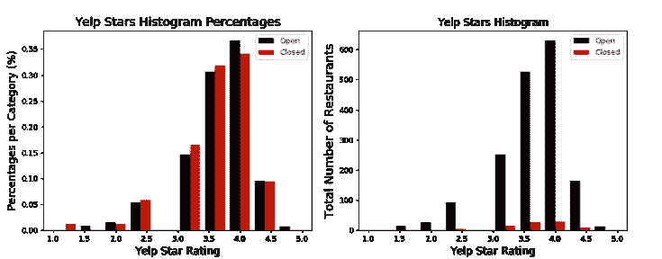
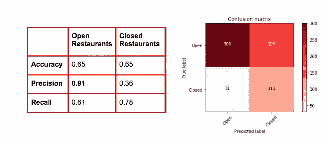
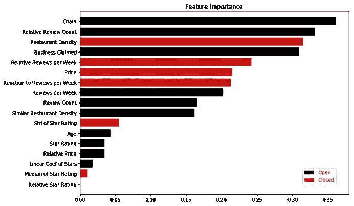

# 利用 Yelp 数据预测餐馆倒闭

> 原文：<https://towardsdatascience.com/using-yelp-data-to-predict-restaurant-closure-8aafa4f72ad6?source=collection_archive---------3----------------------->

米恰伊尔·阿里菲拉克斯是一名有抱负的数据科学家，也是普林斯顿大学的化学工程博士生，他在普林斯顿大学模拟复杂材料的机械和电子特性。他是 2017 年秋季的 [*洞察数据科学研究员*](http://insightdatascience.com/) *。在 Insight，他在三周内建立了一个模型，预测餐馆在四年内关闭。*

作为 Insight Data Science 的研究员，我有机会花三周时间构建餐馆成功模型:一个评估餐馆在未来四年内可能成功还是失败的模型。这个项目最具挑战性的部分是建立正确的数据集，其中包含有关过去某个时间点存在的餐馆的当前信息，并设计预测功能。

过去利用 Yelp 数据预测餐馆成功的努力都没有成功。另一方面， [Yelp 评论文本在短时间尺度上对餐厅关闭具有很强的预测性](https://www.bizjournals.com/washington/blog/top-shelf/2014/12/umd-researchers-use-yelp-reviews-to-predict.html)。在我的工作中，我使用 Yelp 评论的元数据设计了更大时间范围(四年)内的预测功能，以及基于周围餐馆相对表现的功能。这个问题的更多细节、使用的程序和获得的结果在下面给出。

# 1.定义问题

美国餐饮业确实很大，2016 年创造的收入约为[7990 亿美元，分布在 100 多万家企业之间，这些企业雇佣了约 10%的美国劳动力](http://www.restaurant.org/News-Research/Research/Facts-at-a-Glance)。鉴于小企业的数量和这个行业的总规模，我决定创建一个模型，可以帮助餐馆贷款人(如银行)和投资者根据某个餐馆在未来几年内倒闭的可能性来决定他们是否应该贷款/投资该餐馆。

餐厅关闭是一个非常明确的成功衡量标准，尽管可以设计更复杂的成功衡量标准。餐馆关闭度量标准的选择允许我将这个问题作为一个分类问题，这使得获得标记数据变得更加容易。很难找到关于每家餐厅业绩的更详细信息，因为大多数餐厅都是私营公司。

# 2.构建数据集

据我所知，不存在可用于解决上述餐馆关闭问题的标记数据集。首先，要构建这样的数据集，我必须找到过去某个时候存在的餐馆列表，然后将该信息与餐馆的当前信息进行匹配。

我的起始数据集是 2013 年发布的 [Yelp 数据集。该数据集包含亚利桑那州凤凰城地区的商业信息。使用该数据集的训练数据，我决定只研究餐馆，并且只研究在获得该数据集时仍在营业的餐馆。](https://www.kaggle.com/c/yelp-recsys-2013)

这个数据集和 Yelp 发布的所有其他用于学术用途的数据集不包含真实的企业识别码或电话号码。如果有这些代码，从 Yelp API 获取当前数据将变得很容易。为了克服缺少业务 id 的问题，我使用 Yelp 搜索 API 从旧列表中搜索每个餐馆，使用它们的名称和地址，但是结果令人失望。

使用这种方法，只有三分之二的餐馆与当前信息相匹配。其余的搜索给出的结果与真正的餐馆不相符。不过，这种搜索方法的基本问题不是数据点的数量，而是返回结果的方式存在偏差。

通过 Yelp 搜索正确返回的餐馆要么是仍在营业的餐馆，要么是最近关闭的餐馆。这产生了一个包含几乎所有成功餐馆的数据集(因为即使是关闭的餐馆也是自原始数据集发布以来设法保持营业约四年的餐馆)。至于其余的餐厅，在我获得每家餐厅的具体信息之前，我无法确定它们是否已经关门。

## 2a)获得正确的当前餐馆信息的解决方案

尽管 Yelp 不会通过 Yelp 搜索 API 返回关闭很长时间的餐馆的结果，但它会在数据库中保留这些信息。我的解决方案是使用 Google Search API 来搜索 yelp.com 域，并提取尚未匹配的餐馆的业务 id。这些业务 id 用于通过 Yelp 业务 API 直接从 Yelp 获取当前数据。这使我能够获得大多数剩余餐馆的信息，并建立一个有意义的模型。

## 2b)连接新旧数据集

我确认新旧数据集中的餐馆是否相同的方法是，检查新旧餐馆名称的前四个字符是否包含在新旧餐馆名称中，以及地址的前四个字符是否相同。对于只符合上述两个标准之一的餐厅，我手动检查以确定原因，并创建了一个自 2013 年以来在 Yelp 数据库中发生变化的餐厅名称字典(例如，肯德基改为 K.F.C .)。

最终的数据集总共包含 3，327 家餐馆，其中约 23%自 2013 年以来已经关闭。下图概述了创建该数据集的过程。

Graph of process of creating the discussed dataset. The percentages indicate the percentage of data points carried from the previous step.

# 3.特征工程

Yelp 提供的原始特征(例如 Yelp 星级)的预测能力非常差。如下图所示，Yelp 星级分布对于开放和关闭的餐馆来说看起来非常相似。

Yelp star distribution for restaurants that remained open in the 4-year period (black) and for restaurants that closed (red). On the left, the percentages per category are shown, where the similarity of the two categories becomes apparent. On the right, the absolute numbers are presented, which give a better picture of the class imbalance.

生成有意义的特征是建立这个模型的关键，为此我使用 yelp 评论和位置元数据生成了特征。其中一些功能如下:

*   这家餐厅是连锁餐厅的一部分吗？如果餐馆名称在列表中出现不止一次，那么它被认为是连锁店的一部分。这包括全国或地方连锁店。由于连锁店的定义方式，在特定列表中仅由一家餐厅代表的一些连锁店不算为连锁店。
*   当地的餐厅**密度**是多少？根据餐馆坐标，我为列表中的每个餐馆创建了一个半径 1 英里内的餐馆列表。
*   **点评数**、**星级**、**价格**(即一般用餐费用)**相对于周边餐厅**是多少？识别每个餐馆 1 英里半径内的周围餐馆(类似于餐馆密度计算),并且通过从每个单独的餐馆中减去该组餐馆的平均值并除以该组餐馆的值的标准偏差来计算每个餐馆的评论计数、星级和价格的相对值。
*   每个餐厅的**年龄**是多少？这个值大约是 yelp 第一次评论的日期。这意味着加入 yelp 较晚或没有经常收到评论的餐厅看起来比其实际价值相对年轻。此外，餐厅的年龄受到 Yelp 成立日期(即 2004 年)的限制。

# 4.机器学习模型和优化

使用分层采样将数据集分为 80%的训练集和 20%的测试集。这个数据集的基本问题是，即使引入了附加的特性，它也没有很好地分离，其中一些特性已经在上面描述过了。

一家餐厅成功或失败的原因有很多，但不包括在我们的特征空间中(例如，其他邻近的餐厅、周围的场地、更新的税收系统、健康检查结果等)。).在这种情况下，复杂的决策边界没有好处。通过使用准确度、精确度、召回率和 F1 分数作为评估指标，在我们的数据上测试不同机器学习模型的性能，这一点得到了证实。

由于我从使用更复杂的模型中获得的这种改进的缺乏，我选择使用线性逻辑回归模型，它简单并且具有良好的可解释性。基于餐馆贷款的用例，我选择优化我的模型参数，使用交叉验证的网格搜索来提高开放餐馆的精确度。优化的参数是正则化强度(使用 L2 正则化)和截距比例因子。我的参数选择结果如下所示。

On the left, there is a list of evaluation metrics for the model performance. On the right, the confusion matrix is presented, which gives a different perspective on model performance.

如上图所示，开放餐馆的准确率为 91%。这意味着，在被模型识别为开放的餐馆中，91%的餐馆实际上仍然开放。剩下的 9%是误报。基于这种模型做出贷款决定的银行，其 4 年违约率可能为 9%，而不加选择地向列表中的所有餐馆提供贷款的银行，其 4 年违约率约为 23%(相当于我们数据集中的餐馆倒闭率)。

看上面的混淆矩阵可以看出，在餐厅关门的情况下，模型的预测能力很差。在被预测将会关闭的餐馆中，只有 36%的餐馆在 4 年内最终关闭。这是在我们的特征空间中实现的两个类之间的不良分离的结果。封闭式餐厅的精确度可以进一步提高，但开放式餐厅的精确度总是需要权衡。基于我们的用例(即餐馆贷款)，我选择将注意力集中在提高开放餐馆的精确度上。为了提供更多贷款，应该根据银行愿意接受的风险进一步调整模型。

# 5.特征重要性和模型解释

该模型产生的特性重要性如下所示。促使餐馆继续营业的要素显示为黑色，而促使餐馆关闭的要素显示为红色。

A list of features ranked on decreasing importance. Features that contribute towards the restaurants remaining open are shown in black, while features that contribute towards restaurant closure are shown in red.

根据我们的模型，最重要的特征是餐厅是否是连锁餐厅的一部分。连锁餐馆更有可能继续营业。这并不奇怪，因为连锁餐厅的利润率通常高于个体餐厅。

**相对评论数**(即相对于周围 1 英里半径内餐馆的评论数)是促使餐馆保持营业的第二个最重要的特征。很难将这一指标严格定义为成功的标志或原因。大量的评论表明餐馆的流量更高，但这也是在 Yelp 搜索结果中出现更高的原因，这本身就可以带来更多的流量。

高**餐厅密度**与较高的关闭率相关。这可能是由于竞争加剧。与**相似的餐厅密度**(即半径 1 英里内属于同一食品类别的餐厅密度)相比，观察这一特征很有意思。高餐馆密度对餐馆成功是负面的，而高相似餐馆密度是正面的。举例来说，在一个有很多餐馆的地区拥有一家中国餐馆通常对这家中国餐馆是不利的，但是如果这家中国餐馆在一个有很多其他中国餐馆的地区(例如唐人街)，那么这就降低了失败的风险。从消费者的角度来看，这种观察的一个可能的假设是，像唐人街这样的地区的餐馆缺乏差异化减少了个体餐馆之间的竞争(对于一般商品来说这通常是不正确的，但是当尝试一家新餐馆时，从消费者的角度来看通常缺乏信息)。另一个可能的假设是，消费者的胃口不容易改变，因此唐人街受欢迎的餐馆可能会在他们太忙而无法满足需求的时候吸引周围餐馆的流量:去受欢迎的中国餐馆寻求中餐的人会更喜欢去附近的类似餐馆，如果他们的第一选择太忙而无法为他们服务的话。这一主题有待进一步研究，通过关注一些类似餐馆密度高的特定区域的数据，可以获得更深入的理解。

Yelp 上宣称的餐厅**更有可能继续营业。所谓的 Yelp 业务是指所有者努力在 Yelp 上运营，并声明该业务是他们自己的。从这个意义上说，与餐馆成功的正相关是意料之中的。**

每周相对评论数量的增加似乎对餐馆的成功有负面影响。这是一个反直觉的结果，并且可能是由两个原因引起的:1)每周的相对评论是通过相对评论的数量除以餐馆的餐馆**年龄**(自最老评论起的时间)来计算的；餐厅年龄与餐厅成功正相关，用这个数字除一个指标会产生负相关，这可能比评论数效应更重要，2)每周相对评论数与模型已经考虑的相对评论数相关。逻辑回归模型不擅长处理相关特征。

# 6.建议的改进

这一模型的结果非常有希望，它们表明相对于随机模型，贷款目的有了显著的改善。在我看来，进一步改进的关键是添加更多的功能，可能通过利用不同的数据源。

*   餐馆倒闭的一个可能原因是健康检查评级。将健康检查评级作为一个特性添加到我们的模型中可以提高它的精确度。
*   餐馆关闭的另一个原因是高昂的租金。增加每个地区的租金定价可能有助于解释更多餐馆倒闭的原因。
*   城市特定区域人口统计数据的变化会增加或减少某些餐馆的客流量。
*   新的周边场馆是另一个原因，它可以带动餐馆的客流量，并带来目前这种模式无法预测的成功。
*   餐馆的成功目前被定义为餐馆保持营业。一个更准确的成功定义将更适合贷款的目的，将与餐馆收入相关。即使大多数餐馆的收入不是公开信息，也可以构建相关指标。例如，将餐馆每周收到的评论数量乘以餐馆的价格(即，一般餐饮成本)可以作为有用的度量。

# 摘要

*   该模型是为餐馆贷款目的而构建的，可以识别在 4 年内仍在营业的餐馆，准确率为 91%。
*   该数据集是通过 Yelp 和谷歌搜索 API 提取 2013 年在亚利桑那州凤凰城存在的餐馆的最新信息建立的。
*   该模型的一些非常有预测性的功能是使用 Yelp 评论和位置元数据构建的。这有助于构建相对指标，如相对于周围餐厅的餐厅密度和数量。
*   使用的机器学习模型是简单的逻辑回归模型，该模型使用交叉验证的网格搜索针对开放式餐馆的精确度进行了优化。
*   我们得到的一个教训是，决定一家餐馆是否继续营业的最重要因素是它是否是连锁店的一部分。属于连锁店的餐馆关门的频率较低。
*   另一个经验是，在有许多其他餐馆的地区建造餐馆通常是负面的，除非这些餐馆提供类似的食物(例如在唐人街建造一家中国餐馆)。
*   该模型可以通过进一步的数据集进行改进，如健康检查数据(目前在亚利桑那州菲尼克斯不公开)，以及关于周围场馆的信息。

这个项目的代码可以在这个 [github 库](https://github.com/alifier/Restaurant_success_model)中找到。