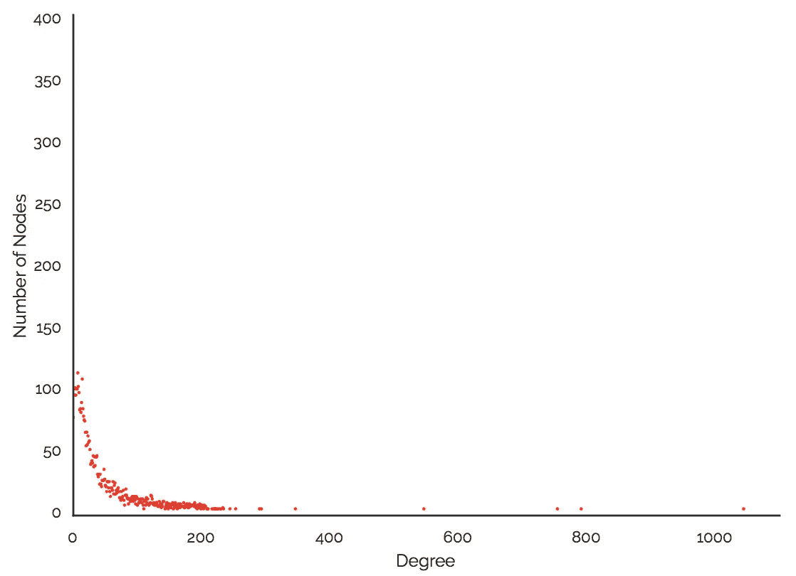
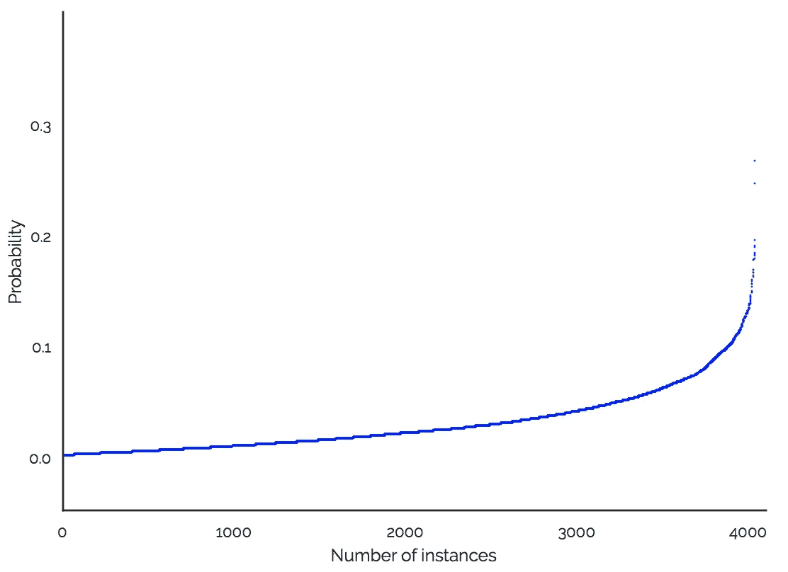
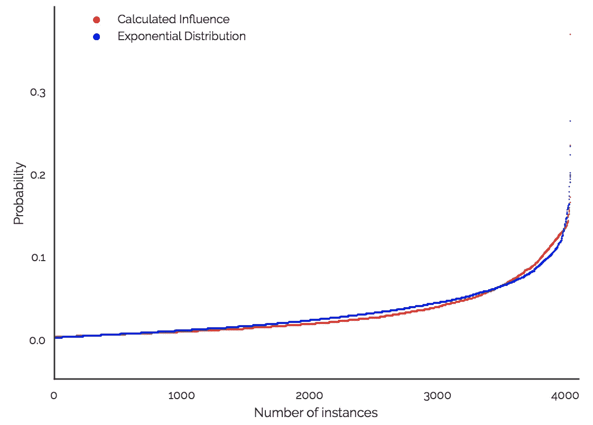
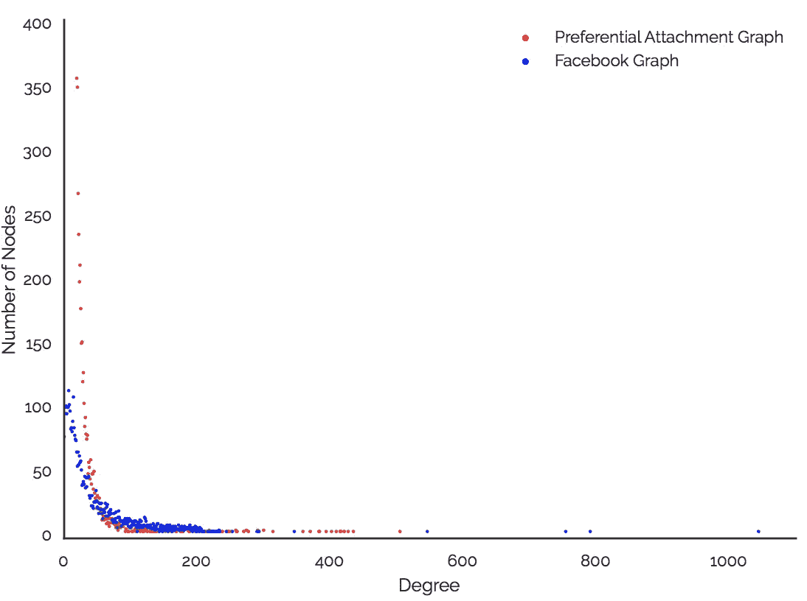
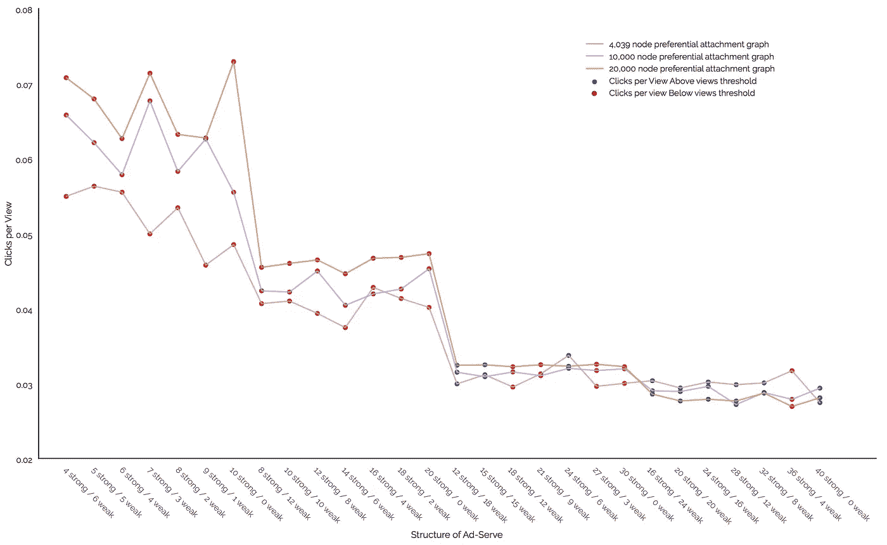

# 利用流行病模型提高脸书的广告点击率

> 原文：<https://towardsdatascience.com/utilising-epidemic-modelling-to-improve-advertising-click-rates-on-facebook-6f294205a43f?source=collection_archive---------5----------------------->

本文是与安迪·麦克斯威尼合写的

社交媒体的年度广告预算在过去几年中出现了大幅增长，预计到 2019 年仅在美国就将达到[173.4 亿美元](https://blog.hootsuite.com/social-media-advertising-stats/)。脸书、Twitter 和 Snapchat 等社交媒体公司所展示的直接瞄准巨大市场的能力，为营销机构提供了一种全新、更强大的接触客户的方式。

为了让广告商满意，社交媒体公司通过其网络有效分发广告的方法需要有效地锁定最有可能对广告做出回应的用户。作为他们服务的费用，脸书收取“每次观看”和“每次点击”的费用，所以广告商必须权衡他们的成本和暴露的用户数量。

很明显，脸书计算的是每个用户回复广告的可能性，并且只锁定可能性高的用户。这对营销人员来说是有效的，因为他们的“每次观看”成本是固定的，“每次点击”成本理论上可以被销售额抵消。不清楚的是，如果脸书利用友谊信息，更具体地说，假设:

> 如果用户点击广告，他们的连接也会点击广告的概率会增加。

基于这种假设，是否可以探索用户网络，以病毒式方式“传播”广告，以获得类似(或更高)的点击量，同时向更少的人显示广告？

为了探索这个想法，我们采用了一个小的子图，即由 4039 个节点和 88234 条边组成的[脸书“社交圈”](https://snap.stanford.edu/data/egonets-Facebook.html)数据集。为了便于理解，你最好把这个网络想象成喜欢脸书网页的用户。大约有 4000 人，他们都是至少一个喜欢这个页面的人的朋友。他们中的一些人非常受欢迎，一个人有 1045 个朋友也喜欢这个页面，而其中的 75 个人只认识一个喜欢这个页面的人。总体而言，学位分布如下:

Lots of nodes have low degree, a few have a high degree. Turns out that’s pretty normal for Facebook

现在，根据一些特征(他们喜欢页面帖子的频率，查看页面的频率，他们喜欢的相似页面等)，脸书对每个人真正喜欢这个主题的程度有了一个不错的想法。

我们的第二个假设是，用户与页面交互的概率分布与页面用户的程度分布非常相似。一些人真的很可能会与之互动，而很多人则相当矛盾。这就是为什么你会看到有几千个赞的页面，但只有几百个赞。

这是一个指数分布，如果我们将“与页面互动的概率”替换为“点击与页面主题相关的广告的概率”，我们就有了一个粗略的衡量用户点击广告的潜在概率的方法。我们无法准确衡量这一点，因为我们没有脸书的数据，但我们有一个起点。

Per user likelihood of clicking on an ad that relates to the group. Most users have a small chance, and a few have a decent chance.

为了提出一个“基础案例”来比较我们的流行病模型，我们选择了阻力最小的方法。将广告展示给小组中的每个成员，使用独立的伯努利试验，看看有多少人根据他们的潜在概率做出了回应。

我们进行了 1，000 次测试，在 4039 次浏览中，平均点击次数为 88.54 次，即每次浏览的点击率为 0.0198。每次点击量(CPV)和总点击量是对广告客户很重要的两个指标。

知道了我们必须打破的数字，我们设计了一种方法，利用用户如何连接的信息来更慢地传播广告，但希望有更好的结果

首先，每个用户的潜在概率是使用均值为 0.03 的指数分布来确定的，与基本情况一样。根据用户共享的连接数量，用户之间的每个连接都被赋予 0 到 1 之间的“强度”。如果两个用户都有 12 个朋友，但其中 8 个是他们共有的，他们的优势是 66%。

由此，在沙地上画了一条线。共享超过 50%好友的用户连接被认为是“强”连接，而那些少于 50%的用户连接被认为是“弱”连接。这很容易想象，只要想想和一个亲密的友谊团体的关系，在那里每个人都认识每个人，和一个你认识的同事或亲戚，但不是你朋友的朋友。

考虑到这一点，还有 3 个因素有待确定。

*   假设用户的一个连接先前点击了广告，那么对用户点击广告的概率的实际影响是什么？
*   广告的“传染性”如何，或者它如何在用户之间传播？
*   广告应该如何开始，或者需要多少个“耐心零”？

所有这些因素都必须设置在两个界限之间。太低的话，广告会很快消失，也许会产生很高的点击率，但总点击率很低。对广告商不利。太高，假设不切实际，也不适用。

第一个因素被设定在 10%的最大增幅，与友谊的强度成线性比例。也就是说，如果用户点击了广告，他们的所有连接都会看到他们点击广告的潜在概率增加了一个数量。如果这两个人之间的友谊强度是 60%，那么数量将是 6%。如果人与人之间的力量是 25%，那么这个量就是 2.5%。每次迭代后都会重新计算，如果越来越多的朋友点击广告，用户可以看到多倍的概率增加。

接下来，广告的病毒式传播取决于“广告服务”的构成。也就是说，当用户点击一个广告时，在下一次迭代中，他们的多少个连接以及哪些连接将被显示广告？广告服务的组成范围从 10 个强连接和 0 个弱连接到 16 个强连接和 24 个弱连接。总共测试了 28 篇作文，让 10 人、20 人、30 人或 40 人看一些强朋友和弱朋友的组合。

改变这些数字的目的很简单。虽然强连接在他们的朋友点击广告后出现概率最高，但只向强连接显示可能会使广告停留在小社区或网络的子图中，并限制其传播。另一方面，仅向弱连接显示广告有广告消失的风险，因为调整的概率较低。我们想测试这种平衡行为是如何影响结果的。

最后一个因素，即“种子”组，或“患者零”的数量在 10 到 40 之间变化。由于假设这些人是第一个点击广告的人，他们被选为具有总体最高原创概率的人。这个假设有点牵强，特别是对于 40 人的 seed 组，稍后会有更多的介绍。

在设置了所有因素的情况下，模拟被设置为针对每个广告组合、每个种子组大小在 20 个随机图上运行(因为概率的原始分布是随机的，所以我们复制了模拟以获得更一般化的结果)。当 4000 个用户看过广告，或者在一次迭代中没有新的点击时，每个模拟都结束了。

在第一次模拟中，我们采用了“最佳”每次点击观看比率(针对所有种子组大小)，并将结果与广告服务构成和生成的总额外点击量(TACG，或总点击量减去种子组大小)进行了对比。结果如下所示:

我们首先看到的是我们最初的恐惧被证实了。小型广告组合产生了较高的点击率(红点)，但整体点击率较低(黑线)。为了避免这种情况，我们根据视图总数过滤了这些点。蓝点达到了 4000 的观看阈值，红点没有(平均而言)。

剔除这些数据后，结果令人振奋。表现最好的广告服务比率是 20 强/ 20 弱，仅播种 12 个初始最高概率用户。

> 这在 4025 次浏览中平均产生了 122.45 次额外的广告点击，CPV 比率为 0.0304，比基本情况下增加了 53%！

有趣的是，不同的广告组合之间似乎没有太大的区别。尽管那些拥有大量强关系的人在概率上有优势，但弱关系的[强度](https://www.jstor.org/stable/2776392)似乎使这种优势达到了平衡！

这非常有趣，因为我们证明了只要减慢广告在网络中的移动速度，每次点击量就会显著增加。

然而，如上所述，我们并不喜欢我们的一些假设。潜在的概率分布和种子用户的选择基本上是随机的，我们想知道是否有更好的方法来模拟这一点。

然后，我们试图对社交媒体“影响者”的真实趋势进行建模。在过去的几年里，社交媒体上“有影响力的人”的崛起经历了巨大的增长。影响者可以被定义为在社交媒体上拥有大量追随者的人，并由公司支付报酬，向他们的网络推广产品。

基于用户的等级(连接的数量)，我们可以用它来代表他们在网络中的影响力。然后，我们让用户点击广告的潜在概率等于他们的朋友数量除以网络中任何人的最大朋友数量(1045)。这产生了一个非常接近指数的概率分布！稍微调整一下(将所有概率乘以 0.7)，我们得到了一个非常接近我们最初假设的分布。

现在最大的不同是潜在概率不再是随机的！这意味着我们对模拟结果有了更多的信心。

像最初的模拟一样，种子用户仍然是组中概率最高的用户，但现在这些用户是组中实际的影响者。不要认为这些人“最有可能”点击广告，他们实际上可能是那些付费推广广告的用户。对于广告如何被引入生态系统，这是一个更加有机和现实的假设。

我们做的第二个改变是，在用户的连接点击广告后，用户的概率是如何调整的。之前是连接强度乘以 10%。现在是连接强度乘以 5%，加上 15%乘以影响力。这代表了一个事实，即用户更有可能受到网络中某个名人的影响，而不是“某个人”。

5 + 15 系数纯粹是假设，但模型的妙处在于实际数字有些无关紧要。如果它们是 0%和 0%，我们将回到基本情况。如果模型显示出任何非零系数的改进，这就证明了病毒式广告方法是有效的！

话虽如此，我们还是来看看结果吧。模拟以与原始情况类似的方式运行，除了没有 20 个随机图形(因为图形现在是确定性的)。

该图显示了与原始情况大致相同的结果，但是每次查看的点击量和总的额外点击量更高！事实上，最好的情况是使用 36 个强的和 4 个弱的广告组合，用 24 个影响者播种，产生 0.0341 的 CPV。这又产生了 137 次点击。

24 个影响者有点多，他们不便宜这些影响者，所以我们看看是否有稍微差一点的结果，使用较少的影响者。而且有:

> 16 强 24 弱的广告组合产生了 0.0335 的 CPV 比率和 135 次额外点击，仅使用了 14 个影响者！比基本情况好 70%!

因此，我们已经看到我们的广告服务病毒式营销模式在小图表上产生了惊人的结果，我们想看看它与更大的模式相比会如何。使用 Albert-Barabási 优先模型，我们生成了更大的图形，这些图形非常接近原始脸书图中的度数分布:

The tails of each distribution are a little different, but they’re close enough for what we’re trying to do

我们生成了具有 4，039 个(直接比较)、10，000 个和 20，000 个节点的图，在每种情况下，为每个新节点附加 20 条额外的边(原始脸书图中的平均度数约为 21)。

令人放心的是，这些网络产生了非常相似的结果，并让人们相信该模型可以扩展到脸书或 Twitter 开发的更大的真实世界图表。

从这一建模实践中得出的最终结论是，无论实际调整值是多少，用户通过朋友点击广告而看到的点击广告的概率的任何增加，病毒式营销模型都将产生 CPV 和 TACG 的增加，从而增加社交网络和广告商的收入。

所有的代码和稍微多一点的技术报告都可以在 https://github.com/Padam-0/facebook_viral_advertising 获得

如果你喜欢这篇文章，请点击❤按钮让你的追随者知道，或者让我知道你的想法。

再次衷心感谢[安迪·麦克斯威尼](http://github.com/mcsweena)对这篇文章的贡献。