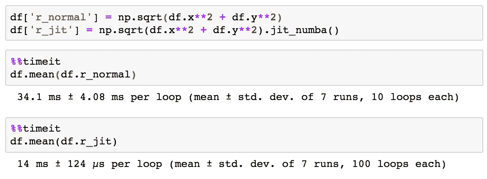
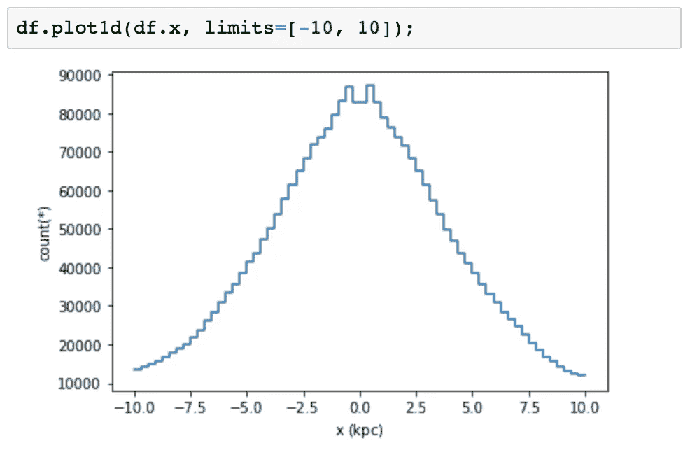

# vaex:Python 和快速可视化的核心数据框架

> 原文：<https://towardsdatascience.com/vaex-out-of-core-dataframes-for-python-and-fast-visualization-12c102db044a?source=collection_archive---------7----------------------->

**1,008,842,985** taxi dropoff location visualized in **1 second** with [vaex](https://vaex.io).

# 数据越来越大

有些数据集太大，不适合你的台式电脑的主存，更不用说你的笔记本电脑了。尽管如此，我们还是希望在大数据时代使用大型数据集。然而，我们真的不想为了一个小实验而学习设置 Hadoop 或 Spark 基础设施。

# 我们的梦想

如果您可以立即加载 1tb 的数据文件，只读取您需要的部分，并使用聪明的内核程序员花了几十年时间优化的策略，这不是很好吗？在提出疯狂请求的同时，我们为什么不请求一个感觉有点像熊猫的 API，我们都在使用它。哦，对了，请不要在我的 2013 MacBook Air 上占用太多内存。因为现在是 2018 年，我们都在 Jupyter 笔记本上工作，所以也让它工作，好吗？请确保我所有打开的笔记本也共享该数据集的内存。

> 如果能瞬间加载 1 TB 的数据文件岂不是很棒。

# 让我们的梦想成为可能

所有这些都可以通过内存映射来实现，这是一种告诉操作系统您希望一块内存与磁盘上的内容同步的技术。它在技术上非常类似于交换磁盘。如果一块内存没有被修改，或者有一段时间没有被使用，内核将丢弃它，以便 RAM 可以被重用。此外，打开相同文件的所有进程共享相同的物理内存。

内存映射非常出色，你可以立即对一个 1 TB 的文件进行内存映射，内核会智能地决定读取或丢弃什么。现在假设您想过滤掉一些包含不相关数据的行。在 pandas 中，使用我们的 1 TB 数据帧，我们可以执行`df_filtered = df[df.x > 0]`，这将复制所有数据，再占用 0.8 TB……实际上，您会看到一个内存错误。

# 遇见 [vaex](https://vaex.io/)

[Vaex](https://github.com/vaexio/vaex) 是一个 Python 库，使得处理如此大的数据集变得轻而易举。除了内存映射之外，除非明确请求，否则它永远不会接触或复制数据。这使得处理硬盘大小的数据集成为可能。此外，它可以进行惰性计算，使用虚拟列，进行有效的数据清理，计算快速的 N 维统计数据，创建交互式可视化等等。
我猜又是一种新的文件格式？不，我们使用好的 ol' hdf5 格式，任何有自尊的语言都支持这种格式。Vaex 并不真正关心文件格式，只要你能内存映射数据，你就会长寿，繁荣🖖.

# 阿帕奇箭头

hdf5 不够新颖性感吗？好的，我们支持 [Apache Arrow](https://arrow.apache.org/) ，它也允许内存映射和与其他语言的互操作性。

# 所以…没有熊猫🐼？

原作者韦斯·麦金尼(Wes McKinney)在他颇有见地的博客文章中概述了熊猫的一些问题:“ [阿帕奇箭头和“我讨厌熊猫的 10 件事”](http://wesmckinney.com/blog/apache-arrow-pandas-internals/)。这些问题中的许多将在下一版本的熊猫(pandas2？)，构建在 Apache Arrow 和其他库之上。Vaex 从头开始，同时保持 API 相似，并准备好今天**使用**。

# Vaex 很懒

Vaex 不仅仅是熊猫的替代品。尽管在执行像`np.sqrt(ds.x**2 + ds.y**2)`这样的表达式时，它有一个类似 pandas 的 API 用于列访问，但是不会发生任何计算。而是创建一个 vaex 表达式对象，当打印出来时，它显示一些预览值。

Calling numpy functions with vaex expression leads to a new expression, which delays a computation and saves RAM.

使用表达式系统，vaex 仅在需要时执行计算。此外，数据不需要在本地:表达式可以通过网络发送，统计数据可以远程计算，这是`vaex-server`包提供的。

# 虚拟列

我们还可以向数据帧添加表达式，这将产生虚拟列。虚拟列的行为类似于常规列，但不占用内存。Vaex 不区分真实列和虚拟列，它们被平等对待。

Adding a new virtual column to a DataFrame takes no extra memory.

如果一个表达式在运行时计算起来非常昂贵，该怎么办？通过使用[python](https://github.com/serge-sans-paille/pythran)或 [Numba](https://numba.pydata.org) ，我们可以使用手动实时(JIT)编译来优化计算。

Using Numba or Pythran we can JIT our expression to squeeze out a better performance: > 2x faster in this example.

甚至远程数据帧也支持 JIT 表达式(JIT 发生在服务器上)。

内存充足吗？只是物化这个列。你可以选择以 RAM 为代价挤出额外的性能。

Materializing a column converts a virtual column into an in-memory array. Great for performance (~8x faster), but you need some extra RAM.

# 数据清理

对数据帧的过滤，例如`ds_filtered = ds[ds.x >0]`，仅仅导致对现有数据的引用加上一个布尔掩码，该掩码跟踪哪些行被选择，哪些行没有被选择。几乎没有内存使用，也没有内存复制。

df_filtered has a ‘view’ on the original data. Even when you filter a 1TB file, just a fraction of the file is read.

> 几乎没有内存使用，也没有内存复制。

除了过滤数据帧，选择还可以定义数据的子集。通过选择，您可以在单次通过数据时计算多个子集的统计数据。这对于不适合内存(核外)的数据帧非常有用。

Passing two selections results in two means in a ***single pass*** over the data.

缺失的价值观可能是一种真正的痛苦，并不总是很容易决定如何对待它们。使用 vaex，您可以轻松地填充或删除缺少值的行。但是事情是这样的:dropna 和 fillna 方法都是通过过滤和表达式实现的。这意味着，例如，无论数据集的大小如何，您都可以在没有额外内存开销的情况下尝试多个填充值。

You can try several fill values at virtually no extra memory cost.

# 分类统计

Vaex 在统计方面真的很强。因为我们正在处理大数据，所以我们需要一种替代 *groupby* 的方法，一种计算速度更快的方法。相反，您可以在一个常规的 N 维网格上计算统计数据，这非常快。例如，即使数据集包含 10 亿行(*是的，每秒 10 亿行)，也要花大约一秒钟来计算常规箱中一列的平均值！*)。

Every statistic method accepts a binby argument to compute statistics on regular Nd array.

> 是的，每秒 10 亿行！

# 形象化

制作有意义的图表和可视化是理解数据的最佳方式。但是，当你的数据框架包含 10 亿行时，制作标准散点图不仅需要很长时间，而且会产生无意义和难以辨认的视觉效果。如果您关注聚合属性(如计数、总和、平均值、中值、标准差等)，您可以更好地了解数据的结构。)的一个或多个特征/列。当在箱中计算时，这些统计数据给出了数据如何分布的更好的想法。Vaex 擅长此类计算，结果很容易可视化。

让我们看看这些想法的一些实际例子。我们可以使用直方图来可视化单个列的内容。

这可以扩展到二维，产生一个热图。我们可以计算平均值，取总和的对数，或者任何自定义的统计数据，而不是像典型的热图那样简单地计算落入每个箱的样本数。

我们甚至可以使用 [ipyvolume](https://github.com/maartenbreddels/ipyvolume) 制作三维体积渲染。

由于在 N 维网格上计算统计数据的底层机制如此之快，我们可以在运行中完成它们，并拥有交互式可视化
(基于 [bqplot](https://github.com/bloomberg/bqplot) )。

Interactively exploring 150 million taxi trips using [vaex](https://vaex.io/)+[bqplot](https://github.com/bloomberg/bqplot)

# 更多？

是的，vaex 包括一个厨房水槽，但它是一个模块化厨房水槽。Vaex 实际上是一个元包，它将安装 vaex 家族中的所有 Python 包。以下是软件包列表:

*   `vaex-core` : DataFrame 和核心算法，将 numpy 数组作为输入列。
*   `vaex-hdf5`:向 vaex 数据帧提供内存映射的 numpy 数组。
*   `vaex-arrow`:类似，但是用的是阿帕奇箭。
*   `vaex-viz`:基于 matplotlib 的可视化。
*   `vaex-jupyter`:基于 Jupyter widgets/[ipywidgets](https://github.com/jupyter-widgets/ipywidgets)、 [bqplot](https://github.com/bloomberg/bqplot/) 、 [ipyvolume](https://github.com/maartenbreddels/ipyvolume/) 和 [ipyleaflet](https://github.com/jupyter-widgets/ipyleaflet) 的交互可视化。
*   `vaex-astro`:天文学相关的转换和 FITS 文件支持。
*   `vaex-server`:提供远程访问数据帧的服务器。
*   `vaex-distributed`:(概念验证)将多个服务器/集群组合成一个数据框架，用于分布式计算。
*   `vaex-ui`:基于 Qt 的交互式独立 app/GUI。

# 想要更多吗？

我们一直在努力让 vaex 变得更好。但这还不是全部。我们也在非常努力地开发`vaex-ml`，这是一个为 vaex 增加机器学习能力的包。一些非常酷的东西即将推出，敬请关注！与此同时，请查看这个现场演示，了解 vaex 的实际操作和`vaex-ml`的预览。

通过我们在 PyParis 2018 上的现场演示，了解有关 vaex 和 vaex-ml 的更多信息

您也可以使用 mybinder 在 [Jupyter 笔记本上在线试用这篇文章的片段:](https://mybinder.org/v2/gh/vaexio/vaex-mybinder/master?filepath=medium-out-of-core%2Farticle_snippets.ipynb)

Click the button to launch a Jupyter notebook to try out the code snippets from the article

# 结论

你准备好接受大表格数据了吗？我们是！零内存复制策略、内存映射、类似 pandas 的 API 以及 N 维网格上极快的统计计算速度，使 vaex 成为探索和分析海量数据集的首选 Python 库。所有这一切都来自您舒适的笔记本电脑或个人电脑。Vaex 是开源的(MIT)，在 [GitHub](https://github.com/maartenbreddels/vaex) 上，查看它的[主页](https://vaex.io/)，文档[文档](https://docs.vaex.io)，或者在 [gitter](https://gitter.im/maartenbreddels/vaex) 上提问。尝试一下，让我们知道你的想法。

Maarten Breddels 是一名企业家和自由职业开发人员/顾问/数据科学家，主要从事 Jupyter 生态系统中的 Python、C++和 Javascript 工作。 [*的创始人 vaex.io*](https://vaex.io/) *。他的专业领域从快速数值计算、API 设计到 3d 可视化。他拥有 ICT 学士学位，天文学硕士和博士学位，喜欢编码和解决问题。*

*股票图片来自*[*https://pixabay.com/*](https://pixabay.com/)