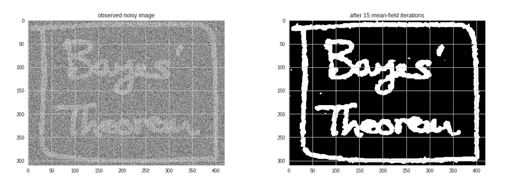
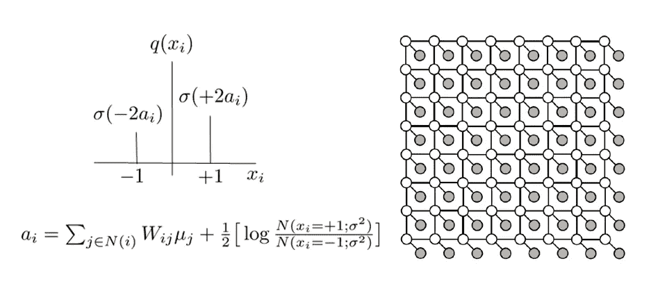
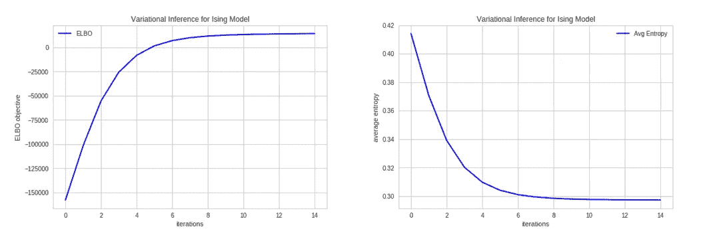

# 变分推理:伊辛模型

> 原文：<https://towardsdatascience.com/variational-inference-ising-model-6820d3d13f6a?source=collection_archive---------9----------------------->

## 在二值图像去噪的应用中

本文主要研究 Ising 模型的变分推理在二值图像去噪中的应用。

Noisy gray-scale image (left) and denoised binary image (right)

例如，在上图中，左边是一幅有噪声的灰度图像，右边是一幅去噪的二值图像。

伊辛模型是马尔可夫随机场(MRF)的一个例子，它起源于统计物理学。伊辛模型假设我们有一个节点网格，其中每个节点可以处于两种状态之一。在二进制图像的情况下，您可以将每个节点看作是一个黑色或白色的像素。每个节点的状态通过相互作用势依赖于相邻节点。在图像的情况下，这转化为平滑度约束，即像素喜欢与相邻像素具有相同的颜色。

在图像去噪问题中，我们假设我们有一个潜在真实图像的噪声像素观察的 2-D 网格，并且我们想要恢复真实图像。因此，我们可以将图像建模为网格:

Variational approximation (left) and the Ising model [1] (right)

上图显示了 Ising 模型[1](右)，其中阴影节点是{-1，+1}中二元潜在变量(无阴影节点)x _ i \的噪声观测值 y_i。左边的方程代表我们的变分近似，我们将在下面得到。

我们可以将联合分布写为:

其中，对于一组边 E 中的每对节点 x_s 和 x_t，相互作用势由ψ_ ST 表示，并且观察值 y_i 是具有等于σ平方的均值 x_i 和方差的高斯型。这里，w_st 是耦合强度，并且被假设为常数，并且等于 J>0，指示对于作为邻居的相同状态的偏好(即，当 x_s 和 x_t 都是+1 或-1 时，potential \Psi(x_s，x_t) = \exp\{x_s J x_t\}较高)。

变分推断背后的基本思想是选择接近原始分布 p(x)的近似分布 q(x ),其中距离通过 KL 散度来测量:

这将推理转化为优化问题，目标是最小化 KL 散度或最大化证据下限(ELBO)。我们可以导出 ELBO 如下:

在伊辛模型的应用中，我们有:

在*平均场*变分推断中，我们假设一个全因子近似 q(x):

可以证明[2]q(x _ I；最小化 KL 发散的μI 由下式给出:

其中 E_{-q_i}表示除 j=i 之外的所有 q_j 的期望值，为了计算 q_i(x_i)，我们只关心涉及 x_i 的项，也就是说，我们可以将它们分离如下:

其中 N(i)表示节点 I 的邻居，\mu_j 是二进制随机变量的平均值:

为了计算这个平均值，我们需要知道 q_j(x_j=+1)和 q_j(x_j=-1)的值。设 m_i = \sum_{j\in N(i)} w_ij mu_j 为邻居的平均值设 l_{i}^{+} = n(x _ I =+1；σ)和 l_{i}^{-} = n(x _ I =-1；sigma)，那么我们可以如下计算平均值:

换句话说，我们在迭代 k 时参数\mu_i 的平均场变分更新计算如下:

我们增加了一个学习率参数λ。既然我们得到了我们的变分更新，我们可以用 python 实现二值图像去噪。

ELBO objective (left) and average entropy (right)

上图显示了实验结果。注意左边的 ELBO 图是单调增加的，在大约 10 次平均场迭代后变平。右图显示了平均熵的减少:

由于随机初始化，我们期望平均熵在开始时很高。然而，随着迭代次数的增加，平均场更新收敛于与观测值及其邻居一致的 x_i 的二进制值，导致平均熵减小。

# 密码

实现基于平均场变分推理的二值图像去噪的所有代码可以在下面的 [ipython 笔记本](https://github.com/vsmolyakov/experiments_with_python/blob/master/chp02/mean_field_mrf.ipynb)中找到。

# 参考

[1] E. Sudderth，“CS242:概率图形模型”，【http://cs.brown.edu/courses/cs242/lectures/ 

[2] K. Murphy，“机器学习:概率视角”，麻省理工学院出版社，2012 年