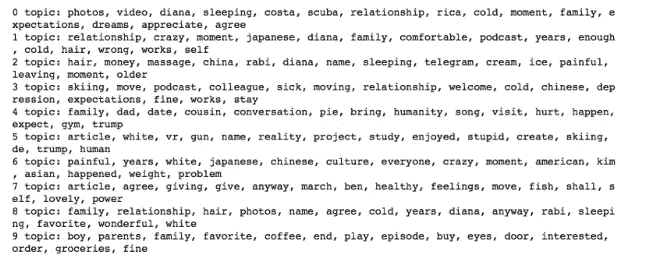
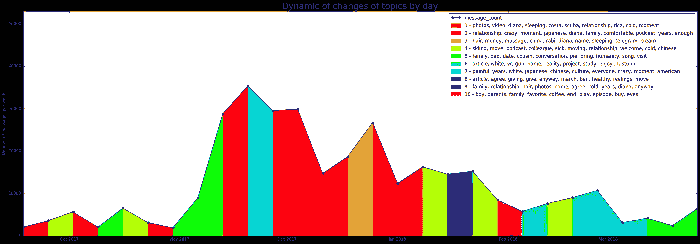

# 电报信息主题的变化

> 原文：<https://towardsdatascience.com/variations-of-topics-of-messages-on-telegram-16ca81f00169?source=collection_archive---------15----------------------->

Photo by Ketut Subiyanto: [https://www.pexels.com/photo/serious-woman-using-smartphone-4353614/](https://www.pexels.com/photo/serious-woman-using-smartphone-4353614/)

介绍

你有没有想过你的网上足迹对你的行为有什么影响？我最近读了塞思·斯蒂芬斯的书*，他在书中描述了基于搜索引擎和社交搜索查询等在线来源的数据对人类行为的见解。我发现这很有趣，因为有了互联网，数据科学家可以访问大量人的各种公共使用数据。随着我对*的深入阅读，我开始把我生活中的每一件事想象成一张图表，把对话想象成我头脑中的原始数据，也许我可以利用它们。**

*在我的脑海中，每个人都在撒谎，我很有兴趣看看在我自己使用的网站和应用程序中，我可以访问哪些类型的数据。因此，许多主要的社交网站和应用程序都有可以访问使用数据的 API。作为一名数据科学家，我发现一旦我学会了如何利用 API，这项技能就为各种探索打开了许多大门。通过使用 API，我获得了所有这些可能性，我受到启发，去做与 Stephens 在他的书中所做的类似的项目，但更多地与我自己的生活和兴趣相关。*

*大约在这个时候，在美国呆了一年后，我回到了哈萨克斯坦的家。即使我搬回了世界的另一端，我仍然想和我的一位名叫约书亚的美国密友保持联系。最后，我们每天通过即时通讯应用 Telegram 聊上几个小时。我们互相了解生活的最新情况，谈论政治、人际关系、旅行和许多其他事情。发了这么长时间短信，我突然意识到我们正在创建一个我个人非常熟悉的大数据集，我可能会出于兴趣对其进行分析。*

*该项目*

*第一步是访问 [Telegram 的 API](https://core.telegram.org) 。Telegram 的 API 允许访问我自己的使用数据。我还从一个朋友那里请求了聊天 id，以便访问双方的聊天数据。我用 Python 做了所有的工作，并用 [Jupyter Notebook](http://jupyter.org/) 作为这个项目的内核。在开始加载所有数据之前，我下载了所有需要的包。您可以在本文末尾的 GitHub 库中找到我的完整代码和一步一步的说明。*

*我的项目包括 4 个月的聊天数据。数据分两批下载。我总共处理了 17904 条信息。这些消息包括字符串、媒体内容、gif、贴纸和表情符号。*

**

**Final data saved in two batches**

*我首先删除了不是文本的信息，比如媒体和贴纸。这从数据集中筛选出了 2202 条信息，留下了我们之间发送的多达 15702 条短信。然后我用两个用户名来划分数据。我很惊讶我们每个人发的短信数量有这么大的差异。*

**

**Number of messages by usernames**

*然后，我努力排除停用词，如:语法冠词、连词和其他与我们谈话内容无关的语言的外围用法。*

***图表 1 —每天的消息数***

*第一个图表包括每天的邮件数量。令人惊讶的是，一天之内竟然有 350 条信息，大概是我醒着的时候每 3 分钟就有一条信息发出或收到。过去，当我们中的一个人在旅行或生病时，邮件数量为零。我还观察到，在我们开始打电话后的一月份，这一数字有所上升，这显然与我们更多地互相发短信的时间相吻合。一月中旬，当我回到美国，我们开始面对面交谈时，这个峰值再次下降。总的来说，图表的变化非常大，当我们处于相反的时区时，会观察到更高的计数。*

**

*Graph 1*

***图 2 —基于一天中时间的消息数量***

*下一张图显示了基于时间的平均消息交换数量。这张图没有图 1 变化大。图表上的时间是哈萨克时区(GMT+6)，当时我正在为一家美国公司远程工作，我的日程安排发生了重大变化。很明显，在凌晨 3 点到 5 点和下午 3 点到 7 点之间会有一个消息高峰。此外，平均数字从来不会接近零，这意味着在这四个月中，我们没有一天不发信息。*

**

*Graph 2*

***图书馆上的文字***

*[sci-kit-learn](http://scikit-learn.org/) 的一个最大的优点是，该软件包使用户能够使用网格搜索策略来找到特征提取组件和分类器的良好配置。在我的例子中，我使用 scikit-learn 将我的库中的单词划分为使用阈值较高和较低的单词。它还确定了不适用于阈值、与我们的对话主题无关或没有重要意义的单词(即“真的”)。我运行了四次这个测试，每次代码都会生成一组不同的相关单词，我称之为“主题”在本文中，我选择显示第三组结果，在所有四个测试中，它的单词分组对我来说最有意义。*

**

***主题***

*以下十个主题由具有较高阈值的单个单词组成。我称之为“话题”的那几组单词，是在我们的对话中频繁使用的、彼此紧密相关的单词。*

**

***图 3——每日话题变化动态***

*此图显示了每周的邮件数量(Y 轴)、时间轴(X 轴)，并按主题进行了颜色编码，每个主题都以不同的颜色显示。每个主题中的单词都在图例中明确标识。通过观察图表，人们可以看到我们的对话如何随着时间的推移在不同的高频词组之间移动，这显示了在这四个月中哪些话题与我们相关。*

**

***总结***

*这个简单的图表和数据分析让我对我和我朋友的信息历史有了更全面的了解，并成为我们之间有趣的讨论点。在一个充斥着小聊天框中的短信的生活中，很容易忘记所有关系的历史和发展，因为这些大量的数据隐藏在过去，并且在线性滚动界面中。通过做这个练习，我们可以带着更大的熟悉感和意识回顾我们的课文。*

*请随意查看我在 **GitHub 库中的全部代码。***

*[**艾索玛/最长-聊天-分析-**](https://github.com/AisOmar/Longest-chat-analysis-/blob/master/Telegram_analysis.ipynb)*

*[*最长——聊天——分析——这是我的第一个个人项目。我很好奇，分析了我和我朋友在…*github.com](https://github.com/AisOmar/Longest-chat-analysis-/blob/master/Telegram_analysis.ipynb)的聊天记录*