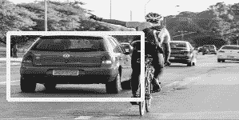
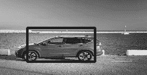
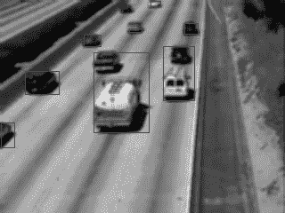

# 通过图像处理识别外部环境中的车辆

> 原文：<https://towardsdatascience.com/vehicle-recognition-in-external-environments-through-image-processing-87dd00237dc8?source=collection_archive---------2----------------------->

这是我 2015 年为伯南布哥大学做的科学研究的结果。

*这个研究项目旨在协助开发一个低成本的本地系统，不依赖于外部条件就能监控十字路口的车辆流量。使用数字图像处理技术来识别车辆，并在需要的情况下做出决策。在一个简化的方法中，提出了在城市环境中检测车辆的计算方法。本文中的解决方案已经用 VisualStudio C++实现，并使用 OpenCV 库来实现识别。针对两种类型的条目提出了解决方案:图像和视频。图像中侦察车辆的算法结果更接近本研究的目标。然而，还提出了一种在视频中使用识别算法的解决方案。*

在文献中有不同的方法探索车辆的检测和识别。可以在已处理的对象和初始数据库的对象之间进行比较，也可以获得优化场景减法和使用连续帧之间的对称差的结果。

还有混合方法，除了计算机视觉之外，还寻求其他方法来优化识别和检测，例如使用基于激光的传感器。

也可以使用感兴趣区域的分割和选择技术、车辆的检测和识别以及阴影的去除技术，集中于使用静态摄像机的方法，目的在于主动交通监控。在体积计数的方法中，我们可以突出那些使用静态监控摄像机的方法。

神经网络应用于车辆检测。但是神经网络有两个主要问题:不能保证达到全局最小值，第二个问题意味着它定义了代表真实世界的数据集，并且没有理想的神经网络模型。模糊逻辑测量用于检测车辆。光强度值用作漫射测量。当强度值落在某个范围内时，必须使用失真的测量来确定它是否是车辆。

首先，我使用基于级联分类器的 Haar 特征来检测对象。这个特性最初是由保罗·维奥拉提出的，后经雷纳·林哈特改进。一个分类器(即具有相似 Haar 特征的工作驱动分类器的级联)由特定对象(即人脸或汽车)的数百个样本视图组成，这些样本视图被称为正样本，它们的大小相同(例如，20x20)，负样本是相同大小的任意图像。

在分类器被训练以应用于感兴趣的区域(与训练期间使用的大小相同)之后。如果该区域可能显示对象(即面部/汽车)，则分类器产生“1”，否则产生“0”。要在图像中搜索对象，您可以在图像中移动搜索窗口，并使用分类器检查每个位置。分类器被设计成可以容易地“调整大小”,以便能够定位不同大小的感兴趣的对象，这比调整图像本身的大小更有效。因此，为了在图像中找到未知大小的物体，检查过程应该在不同的比例下进行几次。

几个分类器用于测试。有些被证明在某些特定位置对汽车有效，但没有一个被证明在正常交通情况下有效。

Vehicle Recognition using Haar feature

Vehicle Recognition using Haar feature

Vehicle Recognition using Haar feature

由于发现的分类器的结果不完全令人满意，因此需要训练一个分类器来满足这项工作的需要。但是没有用于训练分类器的数据库。有必要创建一个数据库，其中包含各种位置的汽车图像。

该项目的最初想法是开发一种工具来实时计算车辆的体积。然而，由于开发一个通用计数项目非常复杂，为了使实现可行，做了一些简化。这些简化涉及图像、风景和物体的获取。

图像采集:必须通过读取之前存储的视频文件来执行，因为算法没有足够的计算效率来处理实时视频。

场景:它最好是静态的，虽然系统能够很好地处理平滑的运动，但关键是摄像机的位置要确保它能够提供赛道的最佳视图。这种场景的选择旨在避免遮挡的发生，并简化图像分割和对象处理的过程。

对象:对对象进行了概括，即所有对象都被视为车辆。由于我们使用了特定的场景和视频，这是一个有效的概括，它允许更简单的识别过程。

OpenCV 库用于图像处理和分割。对于操作，使用了库的基本功能，允许图像的读取、访问、写入和呈现。

分割包括利用图像的某些属性的技术，以便根据要解决的问题将图像细分成组成图像的区域或对象。在这种情况下，将视频的每一帧细分成两种类型的区域:场景和运动物体。检测这些对象的简单方法是从当前帧中减去场景图像。

Original

MOG2

Binary Image

Result

在不同环境和更高分辨率的视频中的结果不如图 4、5、6 和 7 中呈现的结果令人满意。

作为这个算法的一个应用。提出了一种交通控制算法的组成。这种合成识别双向运动，选择两者中感兴趣的区域，并通过像素计数返回到交通流量更多的区域。计数可以根据地点、时间、车流量和各种其他情况而变化。最简单的解决方案是绘制信息图，并将其分为几类:密集流量、正常流量和少量流量，然后根据这些预定义的信息，做出释放或抑制流量的决定。

该系统在 VisualStudio C ++中开发，使用 Intel 的 OpenCV 库。使用的 OpenCV 版本是 2.4.10。实验结果在由单个摄像机制作的实时视频中进行了演示。测试是在英特尔酷睿 i5–2.60 GHz 笔记本电脑上进行的，该笔记本电脑配有 4，000 GB 内存和 Windows 8.1。