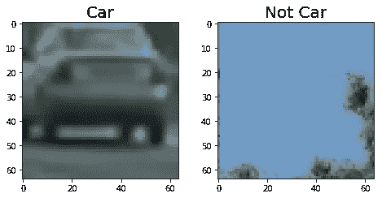

# 高速车辆以及如何追踪它们

> 原文：<https://towardsdatascience.com/velocious-vehicles-and-how-to-find-them-6e4a8b45f770?source=collection_archive---------8----------------------->

## 成为自动驾驶汽车工程师之路:第一部分

A view of [NVIDIA](https://www.nvidia.com/en-us/self-driving-cars/drive-px/)’s self driving car technology

毕业后，我把探索课堂上没有机会探索的话题作为自己的目标。我的目标是每天阅读两篇关于人工智能技术最新进展的文章(即机器学习、深度学习、人工智能在游戏中的应用，等等)。我一直在阅读关于 OpenCV 和自动驾驶汽车的文章，并在过去一个月的一些兼职项目中受到启发来实践 OpenCV。现在自动驾驶汽车很热门！大概还有至少 15 个其他帖子是关于爱好者是如何制作它们的。尽管如此，我很兴奋也很荣幸成为第 n 个分享我的尝试的人。在写了一个简短的车辆检测脚本后，我偶然看到了 Udacity 的无人驾驶汽车纳米学位项目,,我意识到我可以做更多的工作来改进算法…

Basic vehicle detection code

**我没有参加这个项目，所以我在这里完全靠自己。**我仍然认为用我从自己的研究中学到的东西来实现我自己的解决方案会很有趣！

# 数据和算法

自动驾驶汽车的目标是创造能够在任何可能的道路条件下自动驾驶的车辆，特别是在被高速司机包围的情况下。研究人员得出结论，使用 SVM 分类器，以下算法会产生快速且最优的结果:

*   通过将图像分解成区域来执行定向梯度直方图特征提取，并使用光梯度或边缘检测用局部对象来训练分类器。
*   对所有分辨率和大小的图片执行色彩空间转换和空间宁滨，以实现最佳图像处理。
*   用训练好的分类器实现滑动窗口算法在图像中搜索车辆。
*   估计并绘制检测到的车辆的最终包围盒。

使用的车辆数据集来自 [GTI 车辆图像数据库](http://www.gti.ssr.upm.es/data/Vehicle_database.html)，路测视频和图像来自 [KITTI vision 基准套件](http://www.cvlibs.net/datasets/kitti/raw_data.php?type=city)。Udacity 还发布了一个标签为[的数据集](https://github.com/udacity/self-driving-car/tree/master/annotations)，它可能会用于这个项目的后续组件。

# 数据准备

我从组织图像开始。我制作了列表，将所有标记的图像分组，然后为训练数据制作了额外的列表，以避免[过拟合](https://en.wikipedia.org/wiki/Overfitting)。这只是为了验证数据是否组织正确。

Side by side comparison between a vehicle and the road

Side by side comparison between a vehicle and an aerial image

# 特征抽出

梯度方向直方图(HOG)的思想是通过描述光强梯度或边缘分布方向来检测局部目标。通过将图像分解成更小的区域(单元)，每个单元生成一个梯度方向直方图，或者可以表示这些组合的像素单元边缘方向直方图。为了提高准确性，可以在图像的较大区域(称为块)中评估局部直方图，比较光强作为标准化的度量，然后使用该值(measure)标准化块中的所有细胞。

HOG feature extraction example.

但是，对于这个特定的分类任务，什么样的特征是有用的呢？让我们用一个例子来讨论这一点。例如，假设我们想要构建一个对象检测器来检测衬衫和外套上的按钮。纽扣是圆形的，通常有几个用于缝纫的孔。你可以在一个按钮的图像上运行一个边缘检测器，仅仅通过观察边缘图像就可以很容易地判断出这是不是一个按钮。在这种情况下，边缘信息是“有用的”,而颜色信息不是。此外，特征还需要具有辨别能力。例如，从图像中提取的良好特征应该能够区分按钮和其他圆形物体，如硬币和汽车轮胎。这就是如上所述的光强度有用的地方。

在 HOG 特征描述符中，梯度方向(定向梯度)的分布(直方图)被用作特征。图像的梯度是有用的，因为边缘和拐角(突然强度变化的区域)周围的梯度幅度很大，并且我们知道边缘和拐角比平坦区域包含更多关于物体形状的信息。因此，HOG 描述符特别适合于人体检测。

注意在 HOG 图像中检测到的车辆和道路边缘。这些相同的特征在下面的附加图像中突出显示:

Road and Vehicle HOG

Road and Vehicle features

Road and Vehicle HOG with lower resolution pictures

Road and Vehicle features with lower resolution pictures

# 训练分类器

对于分类器，我使用了线性[支持向量机](https://en.wikipedia.org/wiki/Support_vector_machine) (SVM)，这是一套用于分类、回归和离群点检测的监督学习方法。这是一个合适的分类器，因为我们已经标记了要处理的数据。

我存储了从车辆和非车辆图像中提取的特征，并将这些特征用于训练数据和测试数据。我使用了`scikit-learn`中的帮助函数来分割数据进行训练。

分类器达到了 0.9817 的精度。现在我们可以开始测试了！

# 形象化

滑动窗口是一个应用在照片上的盒子。它有一个特定的高度和宽度，这个盒子从上到下滑过一幅图像。对于每个位置，我们训练的分类器应用于该区域，并寻找所需的对象。

Sliding window example looking for a face, courtesy of [pyimagesearch.com](https://www.pyimagesearch.com/wp-content/uploads/2014/10/sliding_window_example.gif)

这是计算机视觉中的一种常见技术，因为我们将能够检测到**不同尺度和位置的物体，**特别是如果这在路上工作的话。

Bounding boxes drawn with a Sliding Window algorithm. It’s clear that there are some false positives

在上面的六幅测试图像中，分类器返回了肯定的检测结果，但是在道路的左侧有一些假阳性。一个建议的替代方法是尝试使用热图。热图背后的想法是，通过给值分配颜色，而不是简单地看图像，可以有效地可视化数据和模式。

## 热图

Heat map of detected vehicles

对于在边界框中发现的每个像素，添加热量并突出显示构成检测到的车辆的像素。映射和阈值算法计算汽车被检测到的次数。贴图中较亮的色调表示每个边界框中重复检测到的像素。因此我们增加了更多的热量。热图肯定更容易解读，尤其是在边界框更突出的情况下出现假阳性:

# 结果

Detection results

在应用检测算法之前，我使用了`imageio`和`moviepy`来平滑测试视频的帧。每个检测到的对象都存储在一个队列中。每次我们在剪辑的当前帧或后面的帧中检测到车辆时，我们都会检查是否在过去的帧中检测到类似的对象。如果我们这样做了，我们会添加检测到的对象，并在多个帧中增加对象的数量。下面的 gif 展示了一个成功的车辆检测程序示例:

Vehicle detection demo

# **结论**

当我第一次尝试这个项目时，我只使用了预先训练的车辆级联。我从最近的尝试中学到了很多，并且能够制作出一个假阳性更少的演示。使用传统的机器学习技术很有趣，所以我很乐意使用深度学习来实现一个解决方案(PyTorch 是我的堡垒，但在阅读了这篇[帖子](/building-a-toy-detector-with-tensorflow-object-detection-api-63c0fdf2ac95)后，我不得不尝试 Tensorflow 的对象检测 API)。我不会使用 Udacity 的确切课程，但我很高兴能继续构建这个项目。请继续关注未来组件的更多工作！