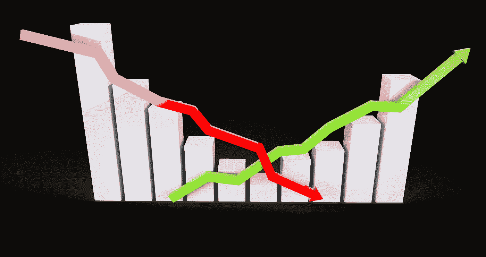

# 使用 Plotly 可视化经济数据

> 原文：<https://towardsdatascience.com/visualising-economic-data-using-plotly-a07f96f58160?source=collection_archive---------9----------------------->



因为我是一名经济学家，热爱编程和数据科学，所以我想把这些激情结合起来，做一些有趣的数据分析。这篇文章利用各种 python 库来抓取和可视化经济数据。我希望这能对你们中的一些人有用，并且你们能像我一样喜欢阅读这篇文章。

我需要做的第一件事是获取一些数据。既然维基百科是所有互联网知识的来源(不是！！)就从这里开始吧。我决定从下面的维基百科页面中抓取一个表格:[ [维基](http://(https://en.wikipedia.org/wiki/List_of_countries_by_GDP_(PPP)_per_capita)) ]。我认为观察世界上一些最富有和最贫穷的国家会很有趣。这张表是根据人均 GDP 对各国进行排名的。

在我继续讲下去之前，简单解释一下什么是人均 GDP 可能是个好主意(你会想当然地认为很多人并不真正讲“经济学”)。简单来说，它是衡量一个国家富裕程度的指标。它实质上是一年内在一个国家境内生产的所有商品和服务的价值除以人口。这给了我们一种描述该国人均财富水平的方法。这是一个非常重要的经济变量，通常用于比较不同国家和不同时期的财富水平。

一般来说，人均国内生产总值可以增加，原因如下。
1。国内生产总值增加
2。人口减少
3。两者的结合。

这一指标通常被认为比 GDP 更能反映一个国家的富裕程度。现在我们有了简单的经济学入门，让我们深入分析一下。正如我之前提到的，我将废弃维基百科上的数据，所以使用美丽的汤似乎是显而易见的。这个库极大地简化了从网页中提取数据的过程，是 python 中 web 抓取的首选库。

# 什么是 BeautifulSoup？

Beautiful soup 是一个 python 库，用于从 html 和 xml 文件中提取数据。这使得这个库对于从网页中提取信息非常有用。如果你想知道更多关于这个库是如何工作的，以及你可以用 beautiful soup 执行的各种任务的信息，请随意阅读[[文档](http://(https://www.crummy.com/software/BeautifulSoup/bs4/doc/))

为了使用漂亮的汤，有必要了解一些简单的 html 标签。对 html 有一点了解将会使我们更容易搜索到我们想要的数据。例如，维基百科在其网页上显示的表格中使用了表格标签。知道了这一点，我们就可以简单地解析 html，只寻找包含在这些标签中的信息。

首先，我需要导入分析所需的所有库。

```
import requestsfrom bs4 import BeautifulSoup​import matplotlib.pyplot as pltimport seaborn as sns%matplotlib inlinefrom bubbly.bubbly import bubbleplot​from plotly.offline import download_plotlyjs, init_notebook_mode, plot, iplotimport plotly as pyimport plotly.graph_objs as goinit_notebook_mode(connected=True) #do not miss this linefrom plotly import tools
```

现在我已经加载了库，我们准备开始分析。下面的代码允许我们将网页加载到我们的 Jupyter 笔记本中，并将其传递给 BeautifulSoup 类以创建一个 Soup 对象。

```
web_page=“[https://en.wikipedia.org/wiki/List_of_countries_by_GDP_(PPP)_per_capita](https://en.wikipedia.org/wiki/List_of_countries_by_GDP_(PPP)_per_capita)"req=requests.get(web_page)
page = req.text
soup = BeautifulSoup(page, ‘html.parser’)
soup.title
```

好了，看起来它工作了，我们可以在 soup 对象上使用一些函数并提取我们想要的数据。我之前提到过我们对表标记感兴趣。下面是从 wiki 页面提取所有表格的代码。

```
table = soup.find_all(“table”, “wikitable”)
len(table)from IPython.display import IFrame, HTML
HTML(str(table))
```

上面的代码返回一个列表，其中每个条目包含页面上的一个表。这个页面只有五个表，所以很容易得到我们需要的表，它恰好是列表中的第一个条目。我们还可以通过使用 IPython.display 中的 HTML 命令来确认它是否正确，该命令会打印出维基百科上显示的表格。

现在我们有了表格，接下来的问题就是得到国名和人均 GDP。要做到这一点，我们需要知道更多关于 HTML 表格的结构。特别要知道、和标签。它们分别代表表头、表行和单元格。好的，让我们试着提取一些数据。

```
GDP_PC = table[0]
table_rows = GDP_PC.find_all(‘tr’)
header = table_rows[1]table_rows[1].a.get_text()
```

这段代码查找所有指示表格行的 tr 标签。然后我们得到表格的标题，并打印出来，给出下面的结果。这对应于国家名称，我们使用 a.get_text()提取我们需要的名称。table_rows 中的每个索引对应一个国家，国家名位于标签中，对于索引的每个值都是相同的。

现在，我们需要做的就是遍历 table_rows，提取数据并添加到一个列表中。

```
countries = [table_rows[i].a.get_text() for i in range(len(table_rows))[1:]]
cols = [col.get_text() for col in header.find_all(‘th’)]
```

Python 有一个非常好的简洁的方法，使用列表理解来编码这类循环。注意我跳过了 table_rows 的第一个条目，因为它不对应于一个国家。我们还使用列表理解来提取列标题，这在以后会很有用。上面的代码相当于下面的 for 循环。

```
country = []
for i in range(len(table_rows))[1:]:
 country.append(table_rows[i].a.get_text())
```

接下来是标签。这是我们的人均 GDP 数据存储在表中的位置。然而，数据是相当混乱的，我们可以使用许多变通方法将正确的数据转换成正确的格式。让我们快速看一下其中一个数据点。

```
temp = GDP_PC.find_all(‘td’)
temp[5].get_text()
```

这给了我们' 114，430\n '。我们可以看到所有的数据都被定义为字符串
,每个单元格中都有逗号和换行符，所以我们需要稍后修复这个问题。首先，让我们集中精力将数据放入一个列表中。

```
temp = GDP_PC.find_all(‘td’)
GDP_per_capita = [temp[i].get_text() for i in range(len(temp)) if “,” in temp[i].get_text()]
GDP_per_capita = [i for i in GDP_per_capita if ‘\xa0’ not in i]temp_list = []
for i in range(len(temp)):
 temp_list.append(temp[i].get_text())
new_list = temp_list[-11:]numbers = [i for i in new_list if “\n” in i]for i in numbers:
 GDP_per_capita.append(i)rank = list(range(len(countries)))
```

上面的代码中有很多内容，让我们一步一步来看。我做的第一件事是找到 GDP_PC 中的所有单元格，并存储在一个临时变量中。
下一行循环遍历该变量，并获取包含逗号的文本。我这样做是因为大多数条目都是以千为单位的，因此包含一个逗号。然而，这种方法确实错过了最后四个条目，因为它们花费了数百美元，所以我必须创建一个解决方法，这就是 new_list 和 numbers 变量正在做的事情。最后，我将这些条目添加到人均 GDP 列表中，并生成一个 rank 列，其中只有从 1 到 192 的数字。这可能不是最有效的方法，可能有更好的方法，但它确实有效，所以我很满意。

在提取了排名、国家和人均 GDP 这三列列表后，我们需要将它们合并在一起，创建一个熊猫数据框。这将使绘制和分析数据更加简单。有一个名为 zip 的便捷函数允许我们创建两个独立的数据框。一个是最富有的 20 个国家，一个是最贫穷的 20 个国家。下面的代码实现了这一点。

```
data = zip(rank[0:21],countries[0:21], GDP_pc[0:21])
import pandas as pd
cols = [‘Rank’, ‘Country’, ‘GDP Per Capita’]
data1 = pd.DataFrame(list(data), columns = cols)data2 = zip(rank[-21:],countries[-21:], GDP_pc[-21:])
data2 = pd.DataFrame(list(data2), columns = cols)
```

我们现在有了熊猫数据框中排名前 20 和后 20 的国家。在我们绘制数据之前，我们需要做一些清理工作。数据目前被定义为字符串，所以我们需要解决这个问题，以便使用某些熊猫函数。下面的代码删除了 HTML 换行符“\n”、逗号，并将数据类型定义为 int。

```
data1['GDP Per Capita'] = data1['GDP Per Capita'].apply(lambda x: x.replace('\n', '')).astype(int)data2['GDP Per Capita'] = data1['GDP Per Capita'].apply(lambda x: x.replace(',', '')).astype(int)
```

我们终于准备好数据来创建一些好看的可视化。

# Plotly 简介

现在我们可以进入 Plotly 来创建我认为非常好的可视化。我真的很喜欢这个库，它足够简单，可以制作出非常互动的情节。如果你想知道你能创建什么样的图表，我鼓励你阅读文档[ [网站](https://plot.ly/)

下面的代码创建了一个简单的世界上最富有的 10 个国家的条形图。首先，我们将数据传递到。条形图创建一个条形图，x 轴表示国家名称，y 轴表示人均 GDP。然后，我们将它存储在一个列表中，并传递给 go。图形方法。这里的相同步骤适用于在 Plotly 中创建所有不同类型的地块。有些结果可能会让你吃惊，也可能不会。例如，排名前 10 位的国家中，不乏卡塔尔和科威特等高度依赖石油生产的国家，这些国家政府收入的大约 70%至 94%来自石油。这些国家中的许多往往人口相对较少，经济规模较大，因此根据这一标准(相对较少的人口分享了大量财富)，它们非常富有并不令人惊讶。

```
trace1 = go.Bar(
 x = data1.Country,
 y = data1[‘GDP Per Capita’])data = [trace1]
layout = go.Layout(
 title=’Top 20 countries ranked by GDP per Capita’)fig = go.Figure(data = data, layout = layout)
py.offline.iplot(fig)
```

很简单，对吧？现在对于最贫穷的国家来说。毫不奇怪，这些国家往往集中在非洲，那里人口增长迅速，经济落后于更发达的国家。

在快速了解了排名前 10 和后 10 的国家之后，让我们试着从整体上对世界进行更广泛的了解。做这件事的一个好方法是使用地图。在 Plotly 中，你可以创建 choropleth 地图，它基于一些变量对不同的区域进行着色。在我们的例子中，这是人均国内生产总值。人均 GDP 较高的国家会有较深的红色阴影。关于这段代码，需要注意的最重要的事情是传递到 locations 参数和 location mode 参数中的国家名称。这些必须匹配，情节才能起作用。你也可以使用国家代码，甚至经度和纬度来实现相同的情节，但我认为这可能是最简单的方法。请注意，Plotly 允许您放大特定区域以进行近距离观察，这是一个非常好的功能。

我们可以看到，最富裕的国家往往集中在北美和欧洲，而最贫穷的国家在非洲，用较浅的颜色表示。

```
data = [ dict(
 type=’choropleth’,
 locations = data_all[‘Country’],
 autocolorscale = True,
 z = data_all[‘GDP Per Capita’],
 locationmode = ‘country names’,
 marker = dict(
 line = dict (
 color = ‘rgb(255,255,255)’,
 width = 2
 )
 ),
 colorbar = dict(
 title = “Millions USD”
 )
 ) ]layout = dict(
 title = ‘Top Countries by GDP per capital’)fig = go.Figure(data = data, layout = layout)
py.offline.iplot(fig)
```

# 富裕国家的人更长寿吗

好了，现在我已经用 Plotly 展示了一些简单的情节，我想更进一步，创造一些真正酷的东西。有一个名为 bubbly 的非常好的库，它可以创建气泡图，并且有一些有趣的功能来增强您与图表的交互性。你可以用 Plotly 做到这一点，但是要达到想要的效果需要相当多的编码，而 bubbly 让它变得超级简单。此库归功于[[Aashitak](https://github.com/AashitaK/bubbly)]。还有一个漂亮的[ [kaggle](https://www.kaggle.com/aashita/guide-to-animated-bubble-charts-using-plotly) 内核]展示了这个库是如何工作的，绝对值得一试。

我想做的是创建一个气泡图，看看人均 GDP 和预期寿命。该图表还考虑了每个国家的人口以及该国位于哪个洲。我从世界银行网站上获得了所有的数据。下面是在使用 pandas 中读取数据的代码，我创建了一个国家、大陆和年份的唯一值的列表，这对处理数据很有用。事实证明，这是一个由 gapminder 基金会创造的非常著名的可视化。他们有一个非常好的工具来绘制这个和其他可用的图表[[在这里](https://www.gapminder.org/tools/#$state$marker$select@$geo=bgd&trailStartTime=2018;&$geo=bol&trailStartTime=2018;;;;&chart-type=bubbles)]，如果任何人
想看看的话。

我在这里使用的世界银行数据与 Kaggle 上的 gapminder_indicator 数据集(该图最初是基于该数据集)的格式完全不同。要使用 bubble 库，我们需要数据采用后者的格式，因此需要一些数据操作。我之所以使用世界银行的数据，是因为它的时间序列稍微长一点，我想了解更多最近的发展情况。下面的代码将数据集加载到中，并提取 gapminder 数据集中使用的相同国家。

```
gdp = pd.read_csv(“gdp_per_capota.csv”, engine = “python”)
life = pd.read_csv(“LifeExp.csv”, engine = “python”)
pop = pd.read_csv(“population.csv”, engine = “python”)
gapminder_indicators = pd.read_csv(“gapminder_indicators.csv”, engine = “python”)countries = gapminder_indicators.country.unique()
continents = gapminder_indicators.continent.unique()
years = gapminder_indicators.year.unique()[‘Country Name’,
 ‘1982’,
 ‘1987’,
 ‘1992’,
 ‘1997’,
 ‘2002’,
 ‘2007’,
 ‘2010’,
 ‘2013’,
 ‘2016’]# Filter countries first
gdp_new = gdp[gdp[‘Country Name’].isin(countries)]
life_new = life[life[‘Country Name’].isin(countries)]
pop_new = pop[pop[‘Country Name’].isin(countries)]# # Now filter years
years = [str(year) for year in years]
years = years[6:]
for i in [‘2010’, ‘2013’, ‘2016’]:
 years.append(i)years.insert(0,”Country Name”)gdp_new = gdp_new[years]
life_new = life_new[years]
pop_new = pop_new[years]
```

gapminder_indicator 数据集具有用于绘图的正确格式(长格式，见下文)的数据，因此本质上我们需要将三个数据集处理成相同的格式，并在我可以使用 bubbly 绘制它们之前将它们合并在一起。

```
 country      continent year  lifeExp  pop      gdpPercap
 Afghanistan  Asia     1952   28.801  8425333  779.445314 
 Afghanistan  Asia     1957   30.332  9240934  820.853030
 Afghanistan  Asia     1962   31.997  10267083 853.100710
 Afghanistan  Asia     1967   34.020  11537966 836.197138
 Afghanistan  Asia     1972   36.088  13079460 739.981106
```

世界银行数据集的格式不同，每年的人口被分配到不同的列(宽格式)。下面是我用来将世界银行数据转换成正确格式的代码。

```
Country name  1960      1961      1962
 Aruba        54211.0   55438.0   56225.0
 Afghanistan  8996351.0 9166764.0 9345868.0
 Angola       5643182.0 5753024.0 5866061.0
 Albania      1608800.0 1659800.0 1711319.0
 Andorra      13411.0   14375.0   15370.0 melted_gdp = pd.melt(gdp_new, id_vars = ["Country Name"], var_name = "Year", value_name = "Data")grouped_gdp = melted_gdp.groupby(["Country Name"]).apply(lambda x: x.sort_values(["Year"], ascending = True)).reset_index(drop=True)​melted_life = pd.melt(life_new, id_vars = ["Country Name"], var_name = "Year", value_name = "Data")grouped_life = melted_life.groupby(["Country Name"]).apply(lambda x: x.sort_values(["Year"], ascending = True)).reset_index(drop=True)​​melted_pop = pd.melt(pop_new, id_vars = ["Country Name"], var_name = "Year", value_name = "Data")grouped_pop = melted_pop.groupby(["Country Name"]).apply(lambda x: x.sort_values(["Year"], ascending = True)).reset_index(drop=True)​temp = pd.merge(grouped_gdp, grouped_life, on = ['Country Name', 'Year'], how = 'inner')temp = pd.merge(temp, grouped_pop, on = ['Country Name', 'Year'], how = 'inner')cols= ['Country Name', 'Year', 'Data_x', 'Data_y', 'Data']temp = temp[cols]​data = temp.copy()
```

让我解释一下我在这里做什么。melt 函数将所有年份列折叠成一行，并在值行中列出每年的值。然后，我按国家名称分组，并按年份对每一行进行排序，这样我就得到一个数据集，其中国家按字母顺序排序，年份按时间顺序排序。这与 gapminder_indicators 相同。然后，这些数据集是根据国家名称和年份合并的数据集。我认为你可以用一个 Pandas 函数来完成，但是我决定用一种更像手工的方式来完成，因为这是一种逐步练习如何操作数据的好方法。

我们现在需要做的另一件事是创建一个大陆列，它将国家映射到正确的大陆，因为这些信息将在绘图时使用。为此，我们使用 gapminder 数据集创建一个字典，然后将这个字典映射到我的合并数据集中的一个新列。

```
dictionary = dict(zip(gapminder_indicators[‘country’], gapminder_indicators[‘continent’]))
data[“continent”] = data[“Country Name”].map(dictionary)data.rename(columns = {‘Data_x’: ‘GDP_pc’, ‘Data_y’: ‘Life Expectancy’, ‘Data’: ‘Population’}, inplace=True)
```

最后，我们有一个完成的数据集，我们可以创建我们的图。我们使用 bubbly 库中的 bubbleplot 函数来完成这项工作。该函数创建了一个美丽的预期寿命与人均 GDP 的互动图，并根据该国人口绘制了泡沫的大小。气泡还被大陆着色，我们能够绘制所有这些跨时间的信息，这真的很好。最显著的变化是中国和印度，用最大的紫色气泡表示。在样本开始时，它们属于最贫穷的国家，预期寿命相对较低。然而，随着时间的推移，出现了向图表右上方的大幅移动，表明人均国内生产总值和预期寿命都有大幅增长。这很大程度上反映了我们所看到的中国在过去 20 年左右成为经济强国的情况。

从图表中还可以清楚地看出，人均国内生产总值和预期寿命之间存在正相关关系。随着一个增加，另一个也趋于增加。当然，这并没有告诉我们任何因果关系，也不清楚是因为富裕国家的预期寿命更长，还是因为富裕国家的预期寿命更长。这也许是一篇经济学研究论文的问题，而不是这篇博文。

这就是你如何使用漂亮的汤从互联网上提取数据，以及如何使用数据可视化来解释和揭示数据中的趋势，这些趋势在原始数据中看起来可能并不明显。

```
from bubbly.bubbly import bubbleplotfigure = bubbleplot(dataset=data, x_column=’GDP_pc’, y_column=’Life Expectancy’, 
 bubble_column=’Country Name’, time_column=’Year’, size_column=’Population’, color_column=’continent’, 
 x_title=”GDP per Capita”, y_title=”Life Expectancy”, title=’Gapminder Global Indicators’,
 x_logscale=True, scale_bubble=3, height=650)iplot(figure, config={‘scrollzoom’: True})
```

我的博文原文链接:[https://d poly . github . io/blog/2018/08/10/Economic-data-plot ly . html](https://dfoly.github.io/blog/2018/08/10/Economic-data-plotly.html)