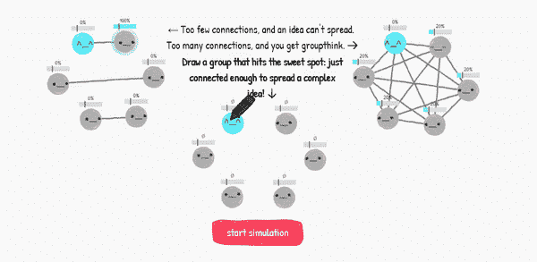
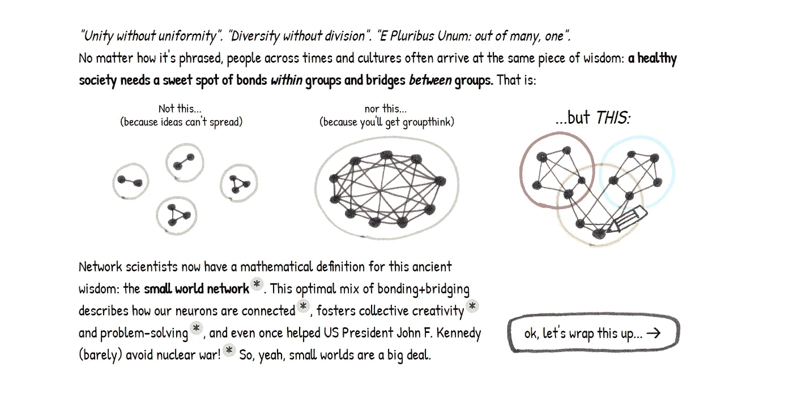
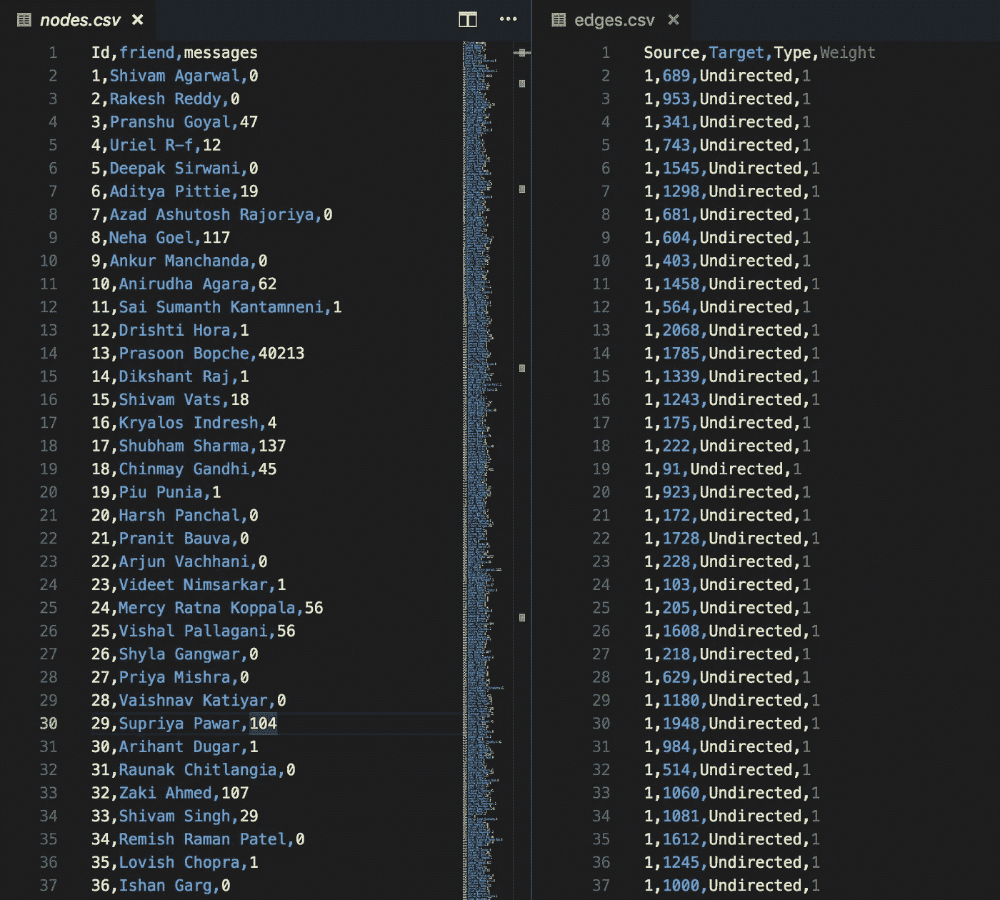
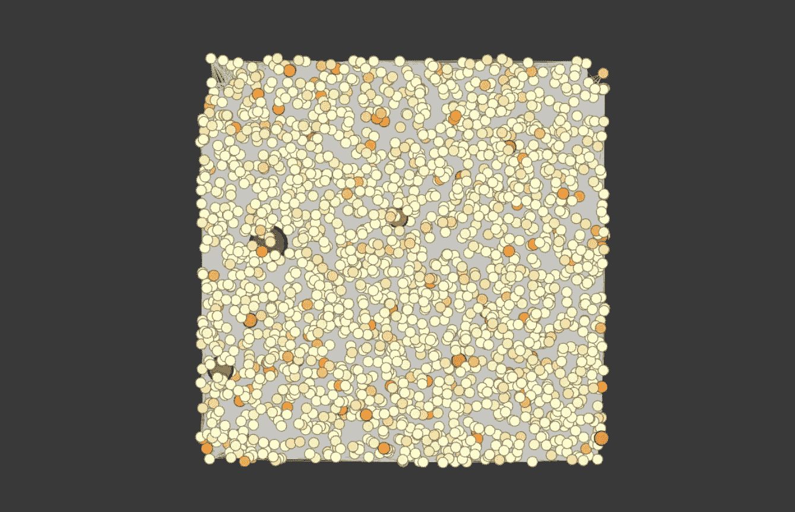
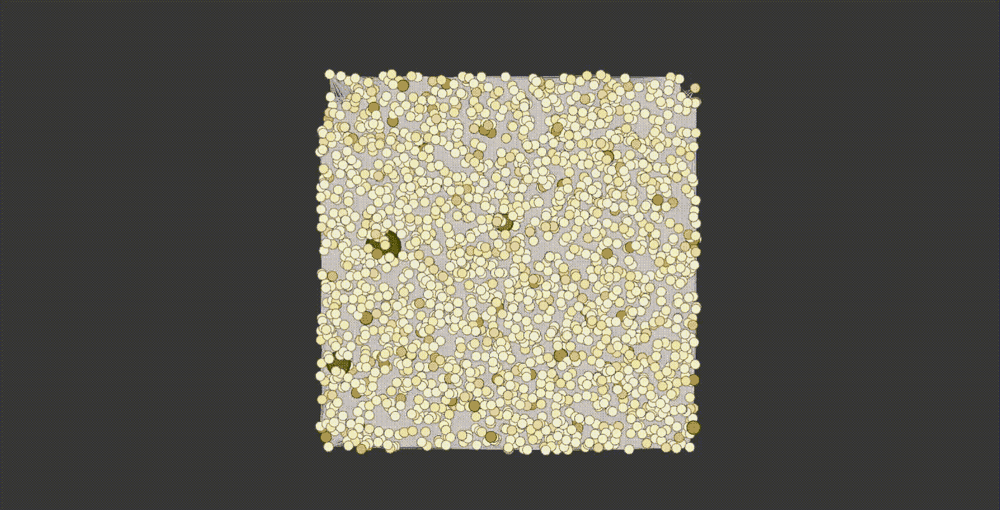
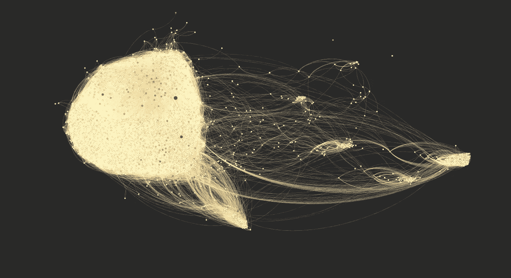

# 可视化我的脸书网络集群

> 原文：<https://towardsdatascience.com/visualising-my-facebook-network-clusters-346bac842a63?source=collection_archive---------4----------------------->

一个月前，我无意中发现了一个由 [@Nicky Case](https://twitter.com/ncasenmare?lang=en) 做的名为[群众的智慧和疯狂](https://ncase.me/crowds/)的杰出项目。这个互动游戏描述了信息、成瘾、假新闻和行为如何在人际网络中传播。我强烈建议你在进一步阅读之前尝试这个项目，因为它会帮助你理解上下文。

Crowds explains network theory concepts using mini DIY interactives

项目摘要出现在结论页之前。他们说——“**一个健康的社会需要群体内部的纽带*和*群体**之间的桥梁*”，并用一个有用的图表来说明。*

For healthy flow of ideas, one needs a mix between bridging and bonding in their network

这个项目让我们深入了解了两极分化的机制——既是孤立网络的一部分，又是超连接网络的一部分，这是如何让我们生活在泡沫中的——让我们更难获得与我们现有观点不一致的信息。

这些想法让我睡了几个晚上。我很好奇，想知道我是群体思维泡沫的一部分，还是一个孤立的网络。

所以我决定把我的脸书网络形象化——亲眼看看我在 2000 多个朋友的网络中处于什么位置。

# 以编程方式构建我的网络

脸书对数据不太友好，尤其是在剑桥分析事件之后。它不提供对提供用户连接的结构化列表的 API 的访问。Twitter 在数据访问方面更友好，但由于我在脸书比在 Twitter 上更活跃，它将是我现实生活网络的更好指标。

我使用 Selenium 作为 web 抓取工具来获取我所有 2000 多个朋友的列表，并将其存储为 JSON 文件。然后我有计划地访问了他们的个人资料，并搜集了我和他们共同的朋友的名单。

Scraping Facebook to get list of mutual connections of friends

经过 65 个小时的搜索和一次临时阻塞，我设法获得了我所有朋友的列表，以及我与他们共享的所有共同朋友的列表。

Structured list of mutual friends with every friend stored as JSON files

# 处理数据

现在我有 2000 多个 JSON 文件，每个朋友一个文件，其中包含我和他们有共同之处的朋友列表。我所需要做的就是将这个网络可视化——作为一个由 2000 个节点连接而成的图表。

我用了一个叫做 [Gephi](https://gephi.org/) 的开源软件来做这个。Gephi 需要两个文件来绘制网络——“节点”和“边”——前者列出了所有具有唯一 ID 的节点和关于每个节点的一些附加数据，后者列出了节点之间的所有连接以及关于连接的附加信息，例如方向性和权重。

我决定使用我与一个人交换的消息数量来包含在可视化中，以查看我的亲密朋友在网络中的位置。我用我的脸书档案数据来计算这个。

所有的数据，因此被提炼成两个简洁的文件— **nodes.csv** 和 **edges.csv**

Processed files ready to be visualized

# **可视化网络——终于！**

好了，现在是隆重亮相的时候了！

****鼓声****

A block made of 2000 ‘friends’

嗯。嗯，这有点违反气候。

所以我们在这里看到 2000 个不同颜色的点。节点越暗(越大)，我和节点代表的人互动越多。

这张 GIF 图有助于更好地解释。

Every node represents a friend — the connected nodes hightlight on hovering

现在，节点已经连接，但我们需要根据它们的连接程度将它们分组。一种方法是应用[力导向算法](https://www.wikiwand.com/en/Force-directed_graph_drawing)——Gephi 中的一种内置功能，模拟基于物理的网络转换，使连接的节点相互吸引，断开的节点相互排斥——从而根据它们的相互连接将它们排列在整齐的集群中。

我应该强调的是，没有额外的数据，如我的朋友来自哪里，他们的背景是什么，等等，被输入到这个模拟中。它将纯粹在网络互连的基础上工作。说得够多了，让我们来看看实际行动。

# 运行强制定向算法

我在这个视频中记录了整个模拟过程，如果你已经完成了，我强烈建议你观看其中的一部分。

我输入模拟的数据没有关于我朋友个人细节的信息，但该算法将我的网络排列成整齐的桶，准确地代表了我生活中的背景——按城市或工作场所排列。

# 从图表中得出的推论

Generated graph of my network

1.  **IIT·卡拉格普尔**在我的好友列表中占了 60%以上，由于其极其密集的相互联系，这使得我的网络非常容易受到群体思维的影响。难怪我的脸书反馈极度偏颇，大多与我自己的 *20 多岁的男性——印度——IIT——建筑*观点一致。
2.  有很高的 ***冗余度—*** 有是网络的整个区域，有我从未交往过的人脉很广的人。事实上，我在脸书上 50%的信息都是和 9 个朋友交流的。在我自己的“朋友圈”里，即使没有上千人，也有数百人实际上是陌生人。
3.  *——我的大多数亲密朋友都位于群集的交叉点——这意味着我们共享两个以上的子网络，因此我们的生活中有更多的“区域”交叉，这有助于更丰富的经历，从而更丰富的友谊。*
4.  *个体集群中有影响力的人位于子网络的中心:我的许多受欢迎的亲戚和大学生群体中的职位承担者由于与其他人的高联系而占据了网络的中心。*
5.  *我的网络的平均路径距离是 2.4，这意味着每个人与其他人的平均距离是 2.4。这意味着我的关系网或多或少是紧密相连的。*

# *那都是乡亲们！*

*我和麻省理工学院媒体实验室的 Judith Sirera 还制作了另一个数字工具，名为“与自己约会”([https://www . Media . MIT . edu/projects/A-Date-With-Yourself/overview/](https://www.media.mit.edu/projects/a-date-with-yourself/overview/))，它可以帮助你与过去的自己创造互动体验。*

# *源代码？*

**如果你喜欢我的工作，可以考虑通过* [*请我喝咖啡*](https://www.buymeacoffee.com/iashris) *来支持我的工作😋💝作为感谢，我会给你提供一个链接到这个项目的源代码与指示，使你自己的网络图🌟 💫✨**