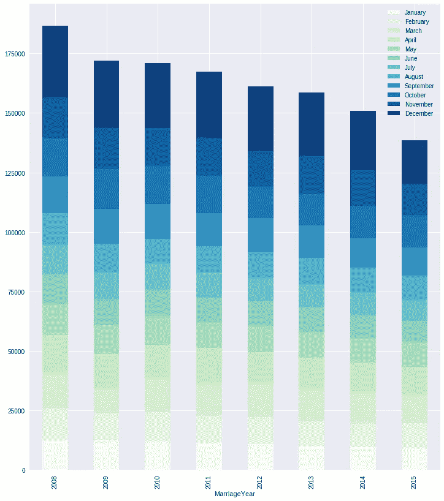
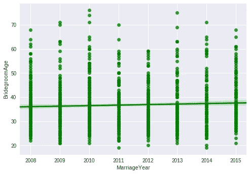
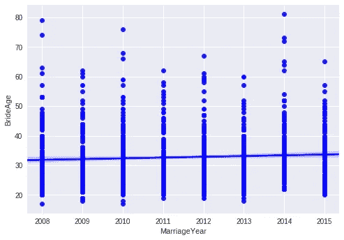

# 使用 Python 可视化南非婚姻数据

> 原文：<https://towardsdatascience.com/visualising-south-african-marriage-data-using-python-3f3887238ddb?source=collection_archive---------18----------------------->

数据可视化是一个非常重要的工具，可以发现影响特定市场、人群或用户和客户行为的趋势。在处理大数据时，这种价值尤其强大。可视化通过将数据转换为更直观的视觉效果，使数据更容易消化和解释，因为人类通常以视觉为导向。

有许多工具可以在这个过程中提供帮助，包括 Excel。然而，出于本文的目的，重点是使用 Python 来执行这种分析。Python 是一种理想的编程语言，通常用于可视化和数据分析，尤其是在与大型数据集交互时。

本文的目的只是向读者介绍从 URL 上传数据、清理数据(在本例中不需要太多清理工作)并以最合适的方式可视化数据的步骤。

**数据**

我决定查看 StatsSA 关于 2006 年至 2015 年间记录的民事婚姻数据。数据帧总共有 130 万个条目。该数据框架中的一些列包括:I .)province code-代表南非给定省份的代码。)MarriageMonth —表示给定月份的整数，iii。)BridegroomAge，四。新郎和新娘之间的年龄差距。我选择不看各省的婚姻状况，因为这些数字与每个省的人口规模相对应。

在这篇文章中，我们将只关注视觉化；从 2006 年到 2015 年，一年的结婚总数按月份和新郎新娘的平均结婚年龄来划分。

**按月份和年份可视化婚姻总数**

表示这种可视化的最佳方式之一是通过堆叠条形图，因为这是比较该数据集时间段内每月总结婚数的最直观方式，并且实现起来相对简单。

执行此分析的第一步包括从源获取此数据的 csv 格式，读取它并将其保存为 dataframe。

```
import pandas as pd
import numpy as np
import io
import requests
url = "https://data.code4sa.org/api/views/r4bb-fvka/rows.csv"
file=requests.get(url).content
c=pd.read_csv(io.StringIO(file.decode('utf-8')))
```

然后，您希望导入 python 库，这将允许您将数据绘制成可视化的图形。我还导入了一个库，它使我能够生成一个彩色地图，我将使用它来使读者更容易识别堆叠条形图中的不同月份。

```
import matplotlib.pyplot as plt
from matplotlib.colors import ListedColormap
```

下一步涉及实际的可视化。为了完成这项工作，我将数据按照我要计算的婚姻总数的列进行了分组；年和月。这将返回一个具有两个堆叠级别数据的数据框架，即一年被细分为几个月。然后，我开始分解这些数据。这个过程将月份转换成列，以便我将数据绘制成清晰的堆积条形图。

然后绘制数据，并根据与结婚月份整数相对应的月份重命名图例。

```
c.groupby(['MarriageYear', 'MarriageMonth']).size() \
 .unstack().plot.bar(stacked=True, colormap='GnBu', figsize=(12, 14))\
 .axes.legend(['January','February','March','April','May','June','July','August','September','October','November','December'])
```

**结果**

结果是一个漂亮的彩色堆积条形图，显示了 8 年来结婚人数的持续下降。



这一趋势表明，人们更倾向于在年底结婚，12 月是结婚的首选月份。

```
table = c.groupby(['MarriageYear', 'MarriageMonth']).size().unstack()
print("December:",sum(table[12]*100/table.values.sum()))
print("November - December:",(sum(table[12])+sum(table[11]))*100/table.values.sum())
```

事实上，2008 年至 2015 年间，16.09%和 25%的婚姻分别发生在 12 月和 11 月至 12 月。像六月和七月这样较冷的月份正好相反，六月的结婚率低至 6.3%，六月和七月为 12%。

**平均结婚年龄**

对于 2008 年至 2015 年之间的平均年龄组，使用 seaborn regplot 似乎是最合适的方式来表示这些数据，一个用于新娘，另一个用于新郎。Seaborn Regplot 类似于散点图，有一条线穿过代表移动平均值的数据。

我没有将所有 130 万个条目都绘制在这张图上，而是计算出了大约 1070 个合适的样本大小。

https://www.surveysystem.com/sscalc.htm[(置信水平- 99%，置信区间- 3)。](https://www.surveysystem.com/sscalc.htm)

```
*#average age of BrideGroom*
dfSample = c.sample(1070)
xdataSample, ydataSample = dfSample['MarriageYear'], dfSample['BridegroomAge']
sns.regplot(x=xdataSample,y=ydataSample, color ='g')
plt.show()
```



```
MarriageYear
2008    36.121894
2009    36.394938
2010    36.820361
2011    36.705663
2012    36.845890
2013    37.062966
2014    37.288561
2015    37.959784
Name: BridegroomAge, dtype: float64
```

2008 年，新郎新娘的平均结婚年龄为 36 岁，到 2015 年上升到 37.9 岁(可能受到异常值的影响)，而到 2015 年，平均年龄从 34 岁上升到 36 岁。

```
*#mean for bride*
dfSample = c.sample(1070)
xdataSample, ydataSample = dfSample['MarriageYear'], dfSample['BrideAge']
sns.regplot(x=xdataSample,y=ydataSample, color ='b')
plt.show()
```



新娘的平均年龄比新郎新娘小 4 到 5 岁，平均年龄从 31.7 岁开始，到 2015 年慢慢上升到 33.65 岁。初婚新娘的平均年龄从 29 岁开始，到 2015 年上升到 31 岁。