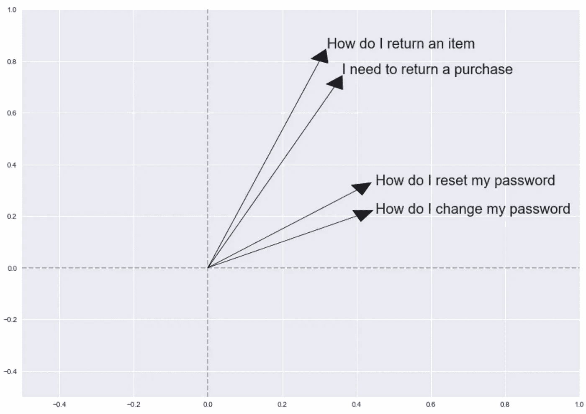
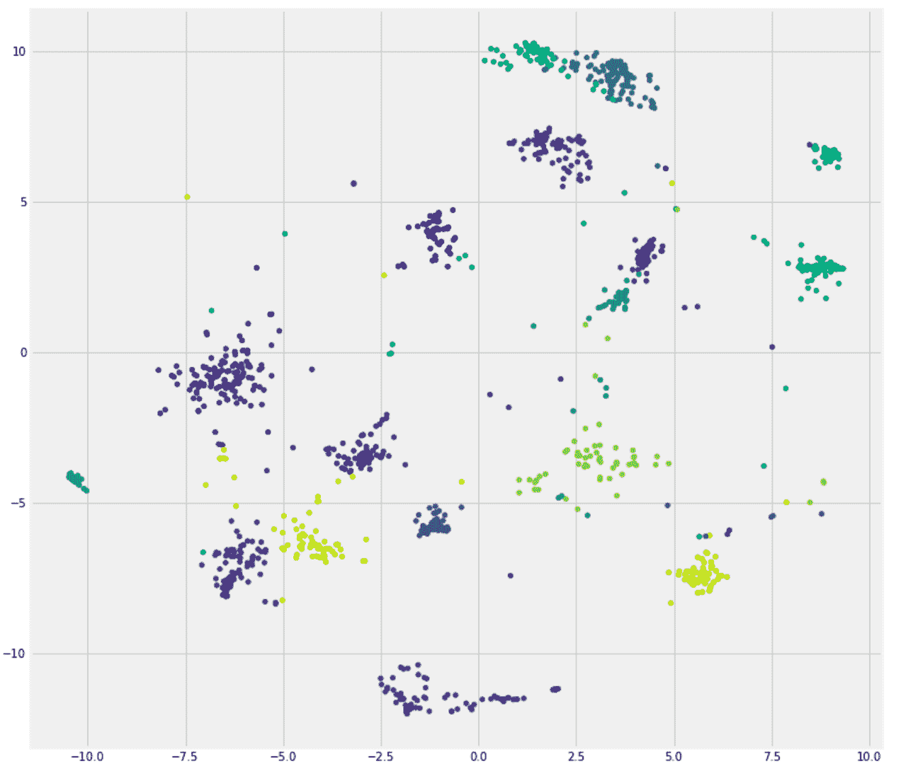

# 充分利用回答机器人:基于 t-SNE 的主题群可视化

> 原文：<https://towardsdatascience.com/visualising-topic-groups-using-t-sne-d44cbcd57ca?source=collection_archive---------4----------------------->

*最初发表于 Zendesk Engineering*

客户服务的世界充满了问题。在 [Zendesk](https://www.zendesk.com/) 我们提供一种叫做[支持](https://www.zendesk.com/support/)的产品，公司可以用它来处理这些问题。例如，当客户发送电子邮件时，公司代理可以使用支持来快速响应，从而(希望)带来积极的解决方案和幸福的关系。然而，人们通常会遇到类似的问题，因此我们也提供了一个名为 [Guide](https://www.zendesk.com/guide/) 的产品，用于发布常见问题的答案。

[答案机器人](https://www.zendesk.com/answer-bot/)是一个人工智能系统，它通过搜索在 Zendesk 指南中找到的答案来自动响应支持票。它通过摄取大量的文本数据来学习语言模型，然后用它来读取传入的门票。了解了收到的票证后，它会就哪些指南文章可能会回答最终用户的问题提出明智的建议。

## 把单词变成数字

驱动该系统的基础数学的一个有趣的结果是将指南文章和支持票转换成称为分布式表示或嵌入的数字向量。

举个例子，

```
*'How do I change my password'* → Answer Bot → [0.4, 3.35, 0.2, 5.04]
```

答案机器人真的很擅长把内容接近的票和文章分配给向量空间接近的向量。这在评估指南和支持中的内容范围时具有很大的实用价值，因为我们可以使用机器学习技术(如聚类)来识别主题。然后，我们可以用它来生成简单的可视化效果，让 Zendesk 客户鸟瞰:

1.  在其指南实例中呈现内容。
2.  他们在票证上看到的问题类型。

第二个是我们即将推出的产品 [Content Cues](https://support.zendesk.com/hc/en-us/community/topics/360000010907-Zendesk-Guide-EAP-Content-Cues-for-Guide-Enterprise) 的主要目标，该产品旨在帮助指导内容创建者根据他们的支持标签中发生的对话制作相关内容。

将 Answer Bot 产生的分布式表示可视化的困难在于它们是 100 维向量，这比我们习惯绘制的通常的 2 或 3 维向量要多得多。因此，虽然我们可以从数学上定义跨门票和文章的信息聚类，但没有一种自然的方式来将这些数据点投影到一个易于人类查看和解释的图上。

幸运的是，有一些强大的方法可以让我们将高维数据映射到低维空间。我们在这里选择使用的方法被称为 t 分布随机邻居嵌入，或 [t-SNE](http://www.jmlr.org/papers/volume9/vandermaaten08a/vandermaaten08a.pdf) 。

## t-SNE:一种可视化高维数据的有用技术

t-SNE 算法很有趣，因为它使用联合概率分布来描述数据点的接近程度。算法是这样的:

1.  [t 分布](https://en.wikipedia.org/wiki/Student%27s_t-distribution)用于产生描述高维点接近程度的联合概率分布。
2.  第二组低维数据点(对应于每个高维数据点)被随机初始化，并且 t 分布被用于创建另一个联合概率分布。
3.  梯度下降用于通过更新低维数据点的值来最小化两个分布之间的差异。

最终结果为我们提供了反映高维数据结构的数据点，并且能够绘制在 2D 或 3D 图上。

例如:

```
*'How do I change my password'* → Answer Bot → T-SNE → [0.65, 0.209] *'How do I reset my password'* →Answer Bot → T-SNE → [0.65, 0.319]*'How do I return an item'*     → Answer Bot → T-SNE → [0.32, 0.85]
*'I need to return a purchase'* → Answer Bot → T-SNE → [0.36, 0.75]
```



t-SNE can be used to project high dimensional data points in to low dimensional space while preserving their relative closeness.

## 可视化数据

在我们第一次通过时，我们决定将重点放在传入支持票证的内容上。我们采样了几千张票，用答案机器人把它们转换成 100 维向量，然后用 t-SNE 把它们投影到 2D 空间。


*100-Dimension Support tickets embedded into 2D space. Each point represents a unique ticket. The axis ticks can be ignored.* A quick note about the plot: We also ran the original data through a variant of the [KMeans](https://en.wikipedia.org/wiki/K-means_clustering) clustering algorithm, which we used to colour groups of dots within the plots. Purple dots represent point deemed outliers from clusters.

正如您所看到的，如果我们将来自给定帐户的所有样本支持票嵌入到同一个 2D 空间中，事情看起来很混乱，很难解释。我们可以看到一些票组的分离，但我们没有看到清晰分离的漂亮紧密的集群。因此，接下来，我们删除了离群点，以获得聚类数据的清晰图像。



*100-Dimension Support tickets embedded into 2D space with outlier points removed.*

尽管在移除异常数据点后，该图的可解释性显著提高，但该图看起来仍然有些杂乱。因此，为了让这个图更好看，我们在使用 t-SNE 的之前消除了异常值*。这产生了更加美观和可解释的结果。*


*Clusters are now clearly separated. Each of these clusters represent a group of related Support tickets that all talk about the same thing.*

## 调整情节

t-SNE 图的局部和全局聚类结构在很大程度上受两个参数的影响:困惑和迭代次数。困惑与分配联合概率的方式有关，迭代的次数就是算法运行的次数，以便最小化描述数据的联合概率分布之间的差异。为了更好地探索这两个参数的影响，请查看[如何有效地使用 t-SNE](https://distill.pub/2016/misread-tsne/)。

我们探索了改变困惑和迭代对审美和可解释性的影响，发现作者建议的默认设置通常效果最好。由于数据是在绘制之前采样的，我们能够将每个聚类的数据点数量限制在 100 个点，这在不同客户之间产生了相当一致的结果。一般来说，随着困惑的增加，集群的紧密度增加。


Grid comparison of t-SNE using a range of perplexity and iteration settings.

## 帮助公司成为客户想要的样子

如果你回想一下上面图中的每个点代表一张票的内容，就会发现一个深刻的效用。使用 t-SNE 来可视化支持票证，我们能够直观地捕获传入的支持票证数据流的结构，这为我们提供了向任何一个客户提出的问题的总体分布情况。对于 Zendesk Guide 平台来说，这是非常有价值的，因为它为我们提供了一种方法来帮助我们的客户弄清楚他们的客户在问什么。

如果我们的客户更了解他们的客户需要什么，那么他们可以提供更好的客户支持。在 Zendesk，这就是我们的全部。

*感谢以下朋友和同事对这篇博文的有益反馈:阿尔温·格里芬、安·丁、克里斯·豪斯勒、宋伊·谢、埃里克·帕克、迈克·莫蒂默*

# 延伸阅读:

*   范德马腾律师事务所。**使用基于树的算法加速 t-SNE。*机器学习研究杂志*15(10 月):3221–3245，2014。 [PDF](https://lvdmaaten.github.io/publications/papers/JMLR_2014.pdf) [ [补充材料](https://lvdmaaten.github.io/publications/misc/Supplement_JMLR_2014.pdf) ]**
*   范德马滕和辛顿。**使用 t-SNE 可视化高维数据**。*机器学习研究杂志*9(11 月):2579–2605，2008。[PDF](https://lvdmaaten.github.io/publications/papers/JMLR_2008.pdf)[补充材料](https://lvdmaaten.github.io/publications/misc/Supplement_JMLR_2008.pdf)[谈](https://www.youtube.com/watch?v=RJVL80Gg3lA&list=UUtXKDgv1AVoG88PLl8nGXmw)
*   [https://lvdmaaten.github.io/tsne/](https://lvdmaaten.github.io/tsne/)
*   (Sci-kit learn 实现)[https://github . com/Sci kit-learn/Sci kit-learn/blob/a 24 c8 b 46/sk learn/manifold/t _ SNE . py # L442](https://github.com/scikit-learn/scikit-learn/blob/a24c8b46/sklearn/manifold/t_sne.py#L442)