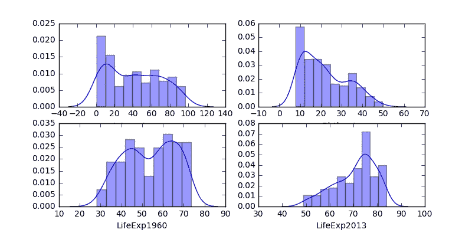
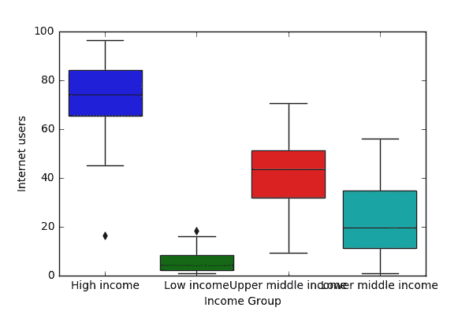
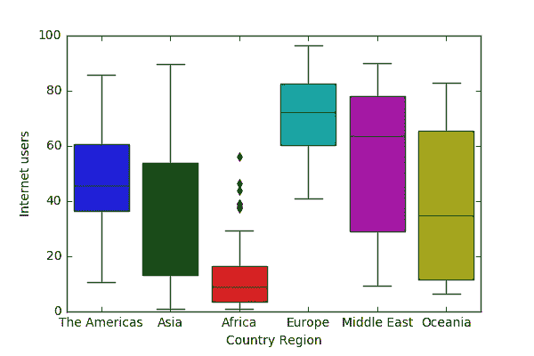
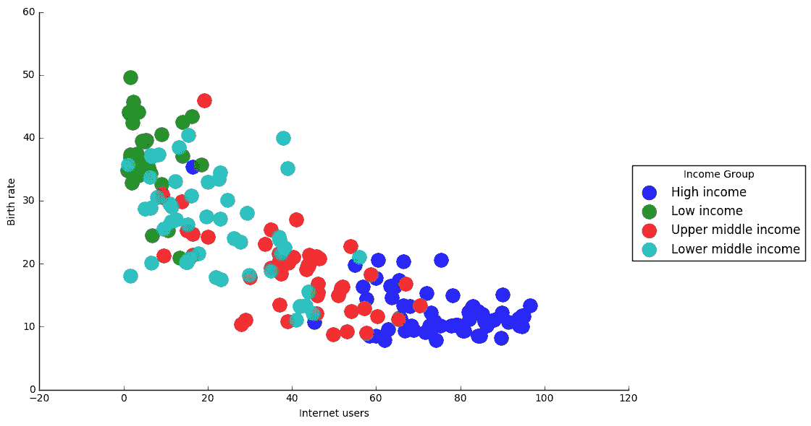
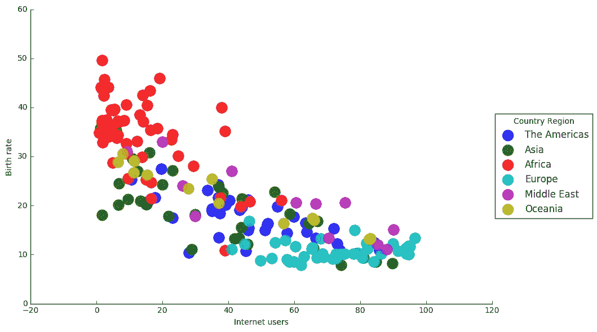
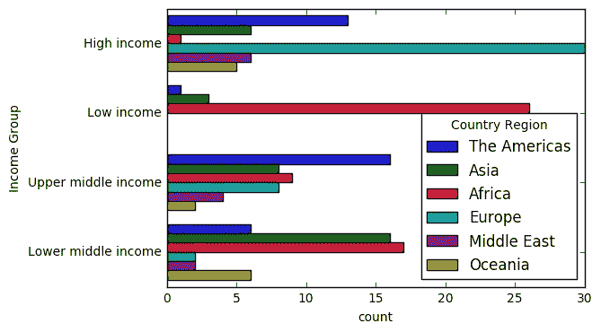
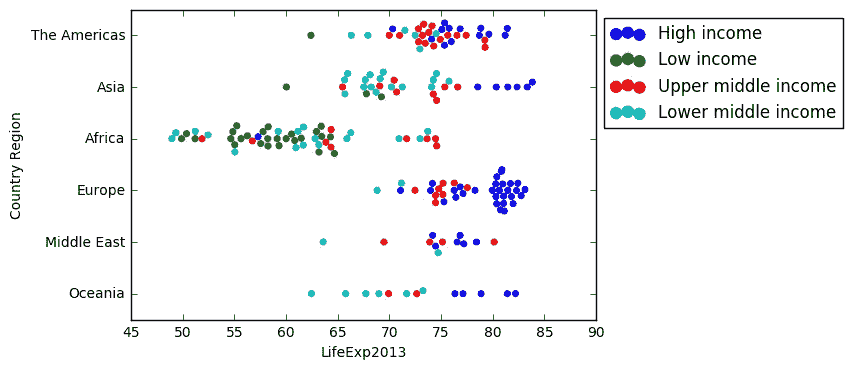

# 使用 Python 中的 Seaborn 可视化世界趋势

> 原文：<https://towardsdatascience.com/visualize-world-trends-using-seaborn-in-python-2e563e7d35da?source=collection_archive---------3----------------------->


研究和分析数据是任何数据科学工作的第一步。您需要获得关于数据的性质和分布的一般信息，以便相应地规划您的工作流。这就是我们所说的“一张图胜过千言万语”的可视化的来源。有了信息丰富的图表，更容易从数据中获得见解，也更容易将见解传达给其他人。

在本帖中，我们将看到如何使用丰富的可视化来获得关于世界趋势数据的见解。该数据集包含了 1960 年和 2013 年的国家名称、国家代码、互联网用户统计、出生率和预期寿命。数据集和代码可以在 github 链接中找到

[](https://github.com/sambit9238/DataScience/blob/master/SeabornPlotsOnWorldTrendSurvey.ipynb) [## sambit 9238/数据科学

### 在 GitHub 上创建一个帐户，为数据科学的发展做出贡献。

github.com](https://github.com/sambit9238/DataScience/blob/master/SeabornPlotsOnWorldTrendSurvey.ipynb) 

在分析数据之前，我们需要首先导入所有需要的依赖项。为了丰富的可视化，我们将在这里使用 seaborn，它在 matplotlib 库上工作，以提供更好的和信息丰富的情节。

```
import numpy as np
import pandas as pd
import matplotlib.pyplot as plt
import seaborn as sns
```

这里我用的是 python 3.5，numpy 1.13，pandas 0.18，matplotlib 1.5，seaborn 0.8，statsmodel 0.8.0。在做任何事情的时候，我总是面临一个问题，由于软件包中的一些更新或版本兼容性等原因，我会收到很多反对警告。在编码时，这些可能看起来令人沮丧。让我们忽略所有的警告，这样它就不会显示在屏幕上。

```
import warnings
warnings.filterwarnings("ignore")
```

现在首先使用 pandas 的 read_csv 函数将数据加载到数据框中。

```
df = pd.read_csv("world_trend_survey.csv")
df.head() #to show top 5 rows
```

# 输出-


我们可以用 Seaborn 的分布图来看看 1960 年和 2013 年的互联网用户数、出生率、平均寿命和平均寿命的数据分布。为了让两个情节并排，我们可以为两个要绘制的次要情节创建一个次要情节框架。

```
f, ax = plt.subplots(2,2,figsize=(8,4))
vis1 = sns.distplot(df["Internet users"],bins=10, ax= ax[0][0])
vis2 = sns.distplot(df["Birth rate"],bins=10, ax=ax[0][1])
vis3 = sns.distplot(df["LifeExp1960"],bins=10, ax=ax[1][0])
vis4 = sns.distplot(df["LifeExp2013"],bins=10, ax=ax[1][1])
```

情节看起来像-



在平均预期寿命上可以看到一个有趣的分布。在 1960 年，数据分布是均匀的，而在 2013 年，它类似于正态分布。此外，我们可以绘制收入群体和互联网用户之间的箱线图，以了解他们之间的相互关系。通过首先使其成为图形对象，可以将打印的图形保存到本地文件。

```
vis5 = sns.boxplot(data = df, x = "Income Group", y = "Birth rate")
fig = vis5.get_figure()
fig.savefig("fig1.png")
```

情节看起来像-



Income Group vs Internet Users

从图中很明显，互联网的使用随着个人收入的增加而增加。通过绘制收入群体与出生率、国家地区与互联网用户、国家地区与出生率的图表，可以得出类似的见解。



Country Region vs Internet Users

在绘制了这四幅图之后，看起来互联网用户的数量和出生率之间有关系。让我们画一个共同的图来看看他们的关系。

```
vis6 = sns.jointplot(data = df, x = "Internet users", y = "Birth rate", kind='kde') #here kde means kernel density plots
```

这里，皮尔逊系数-0.82 意味着它与负斜率成线性关系。p 值< 0.001 表示该信息在统计学上高度显著。


Internet Users vs Birth Rate

从图中可以看出，当人们更多地使用互联网时，他们可能没有太多的时间生孩子。所以，高收入人群的出生率更低，这很直观，因为他们会有更多的意识。从这些图中也可以得出类似的其他见解。为了使这些结论更有说服力，让我们绘制 2D 线性图:

```
vis7 = sns.lmplot(data = df, x = "Internet users", y = "Birth rate",fit_reg=False, hue = "Income Group",size = 6, aspect=1.5, scatter_kws = {'s':200}, )
```

[此处](https://seaborn.pydata.org/generated/seaborn.lmplot.html),“色调”用于为不同类别的标记提供不同的颜色，“纵横比”是长度和宽度之间的纵横比,“scatter_kws”是散点图的关键字参数，散点图从 matplotlib 调用。“s”表示此处标记大小设置为 200，以使绘图更具信息性。



Internet Users vs Birth Rate

从这里很明显，低收入群体出生率高，互联网使用率低。这与高收入群体完全相反。其中，中低收入群体和中高收入群体的结果差异很大。也许国家地区因素在这里也起了作用。让我们绘制国家地区的统计数据。

```
vis8= sns.lmplot(data = df, x = "Internet users", y = "Birth rate",fit_reg=False,\
                  hue = "Country Region",\
                 size = 6, aspect=1.5, scatter_kws = {'s':200}, )
```



Internet Users vs Birth Rate

由此可见，国家地区对出生率起着重要作用。在欧洲地区，互联网的使用情况各不相同，但出生率却相当一致。在非洲地区，大多数国家出生率很高，互联网使用率很低。最有趣的结果是在亚洲地区获得的。在这里，结果是高度多样化的，因为它是中等收入群体。可以想象，也许亚洲地区的大部分人口属于中等收入群体。所以，让我们一张一张地来了解全国各地区的收入群体分布情况。

```
sns.countplot(y="Income Group", hue="Country Region", data=df);
```



Income Group

从上图可以看出，非洲对高收入群体的贡献几乎为零，而对低收入群体的贡献最大，这与欧洲的情况正好相反。最有趣的情况是亚洲地区。收入群体似乎几乎是均匀分布。

现在来看看不同人口统计中的预期寿命状况，让我们使用蜂群图。

```
vis9 = sns.swarmplot(x="LifeExp1960", y="Country Region", hue="Income Group", data=df)
vis9.legend_.remove()
plt.legend(loc="upper left", bbox_to_anchor=(1,1))
plt.show()
```


Life Expectancy at 1960 vs Country Region

从上图可以看出，在 1960 年，收入是影响预期寿命的一个重要因素。收入越高，预期寿命越高。但是乡村地区也起着很大的作用。从中东和大洋洲可以看出，高收入人群的预期寿命也较低。让我们看看 2013 年的趋势变化。

```
vis10 = sns.swarmplot(x="LifeExp2013", y="Country Region", hue="Income Group", data=df)
vis10.legend_.remove()
plt.legend(loc="upper left", bbox_to_anchor=(1,1))
plt.show()
```



Life Expectancy at 2013 vs Country Region

在 2013 年，情况似乎与 1960 年没什么不同。每个地区的预期寿命都有所提高，特别是高收入群体和中上收入群体。但是非洲地区似乎仍然处于特权之下。