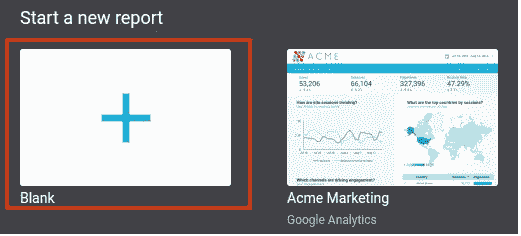
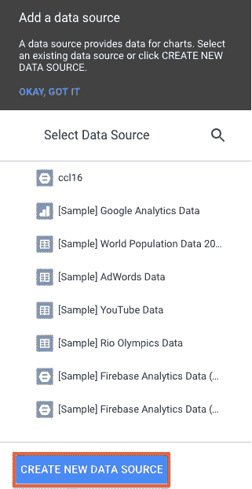
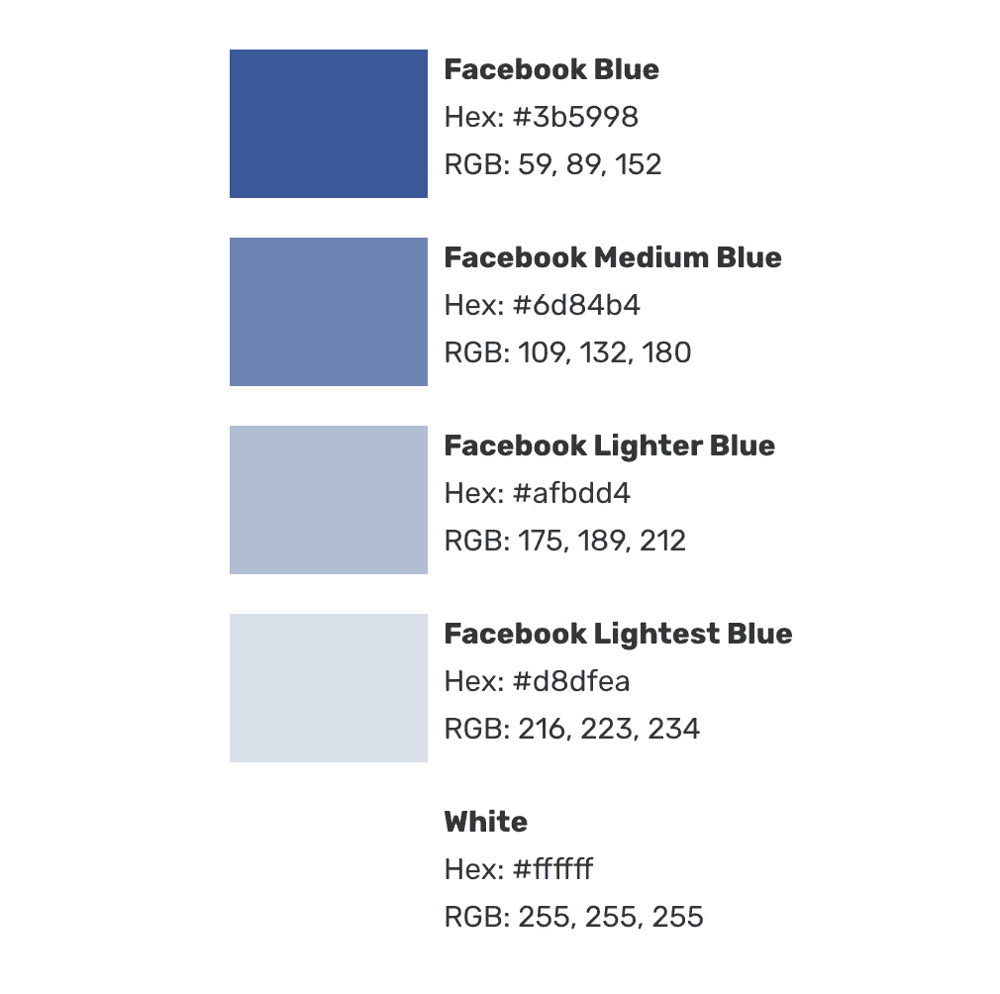
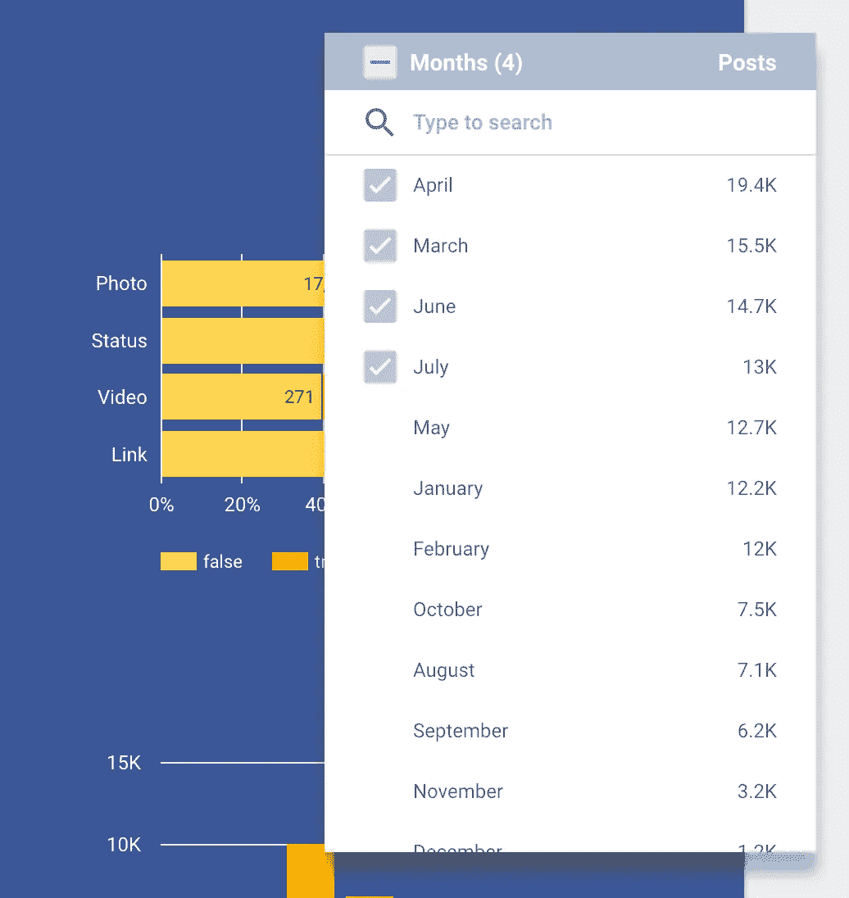
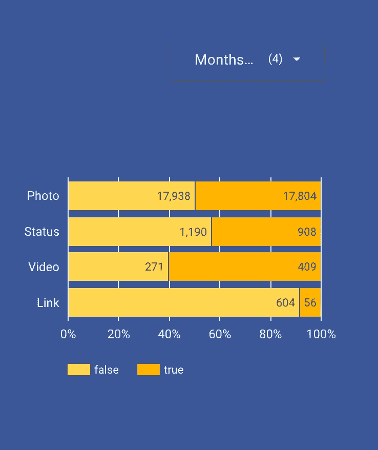
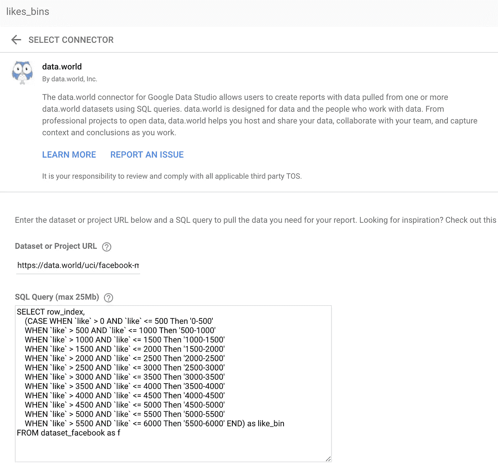
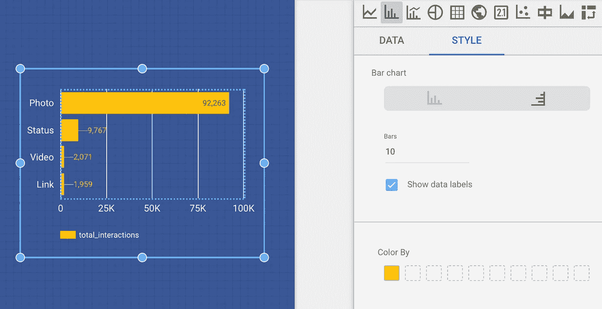
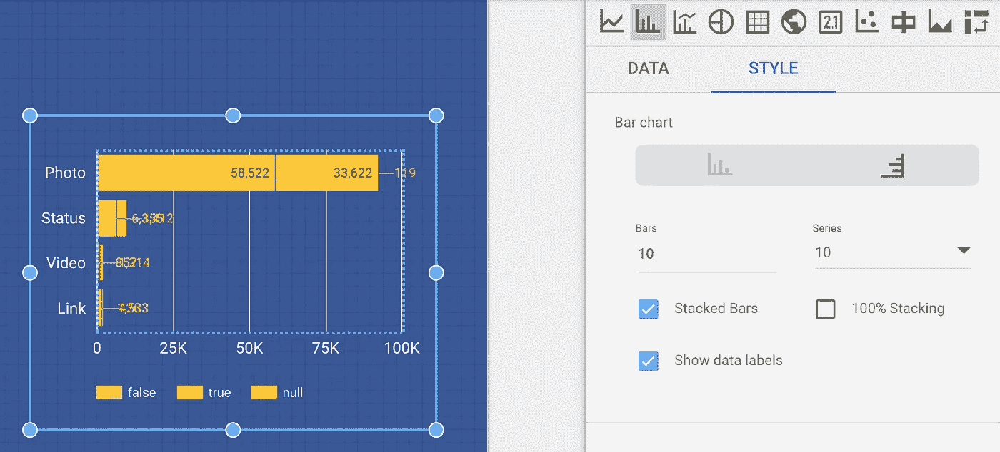
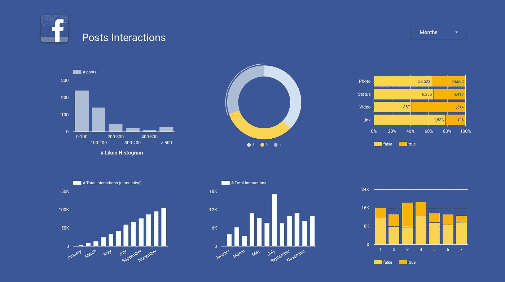

# 使用 Google Data Studio 可视化您的数据

> 原文：<https://towardsdatascience.com/visualize-your-data-with-google-data-studio-609c38247905?source=collection_archive---------4----------------------->

在努力用我珍贵的数据创建一个简单、互动和可访问的**仪表板**时，我撞见了[数据工作室](http://datastudio.google.com)并坠入爱河。

# 基础知识

## 1.创建仪表板



## 2.添加数据源



## 连接器

创建新数据源时，您可以使用 Data Studio 连接器或探索社区连接器，如 data.world、facebook ads、salesforce 等。


Available Connectors

## 3.构建图表


Available Charts

你可以建造

*   时间序列图表
*   条形图
*   组合图
*   圆形分格统计图表
*   桌子
*   地理图
*   记分卡片
*   分散
*   项目符号图
*   对比图
*   数据透视表

现在让我们学习一些技巧和窍门


# 掌握谷歌数据工作室

我们将构建一个很酷的仪表板，并展示 Data Studio 的一些隐藏功能。

我们将使用来自 [data.world](https://data.world/) 的**脸书指标** **数据集**，欢迎[亲自探索](https://data.world/uci/facebook-metrics/workspace/file?filename=dataset_Facebook.csv)。
每个原则都适用于任何其他连接器，特别是 BigQuery 这种常见的数据源。

# 预赛

## 了解你的客户

您的客户是将要使用仪表板的一群人，无论他们是经理、R&D 团队还是您应该与他们会面的其他公司，他们了解您的数据如何能够让他们受益，并且**定义指标**。

比方说，脸书的 R&D 正在向 Facebook 页面发布一项新功能。该团队对帖子互动感兴趣，特别是付费和非付费页面之间的差异。

## 定义指标

我喜欢从目标开始，所以在我们构建仪表板之前，我们应该定义我们想要可视化的指标和 KPI。

我们一起设定并定义了这些是我们在发布新的付费功能期间想要遵循的指标。

1.  随着时间的推移相互作用
2.  喜欢分销
3.  按组列出的职位类型(有偿与无偿)
4.  互动的季节性(每周和每年)

## 塑造您的数据

设置度量标准后，我们通常需要在可视化数据之前转换数据——可能是 tablify(强制关系模式)、反规范化和创建自定义视图。

我们的数据已经被收集和预处理，我们剩下的唯一事情是使用 data.world *特殊列*添加一个 id 列。

```
SELECT row_index, dataset_facebook.*
FROM dataset_facebook
```


data.world Data Connector

# 仪表板

## 主题

我建议使用你公司的颜色作为仪表板主题，这是时候设置你的主要和次要颜色，你的图表托盘和字体。
你可以利用你的 UX 设计师来帮助你获得公司的托盘颜色和与仪表板的最终结构。



Setting a Theme

## 设计

这是一个好主意，添加你的标志作为一个图像，添加一个页面标题，并考虑每个页面的一般结构。


General Structure

# 数据

## 过滤数据

有时您不想显示所有的数据，无论您想基于多个条件过滤空值还是某些值，您可以简单地创建一个过滤器。


Filter Nulls

## 添加动态过滤器

我们可以创建基于日期的过滤器或基于数据的过滤器。由于我们没有日期时间列，所以让我们使用月份列来过滤帖子。



Filter Posts by Month

## 自定义查询

让我们用帖子点赞的宁滨创建一个自定义的 data.world 查询



你可以使用 BigQuery 做同样的事情，这里是官方教程。

# 图表

## 柱状图

构建直方图需要宁滨和行数。
宁滨可以通过创建自定义字段或自定义查询来实现，正如我们在上面所学的那样。

宁滨可以通过创建自定义字段或自定义查询来实现，正如我们在上面所学的那样。

在我们得到一个索引列和一个宁滨列之后，剩下的工作就是设置宁滨列的维度和索引列的计数。

我建议添加文本来明确说明直方图的维度。


Binning → Histogram

## 饼图

饼图是显示类别如何构成整体的好方法。

在 google data studio 中构建饼图时，您可以控制圆环的宽度、颜色和图例位置，以创建简洁的设计。


Designing Pie Charts

## 水平条形图

水平图表是我最喜欢的比较类别的方法。
创建水平条形图:

1.  创建条形图
2.  设置尺寸和度量
3.  样式→水平
4.  勾选显示数据标签



Horizontal Bar Chart

## 堆积条形图

堆积条形图是比较不同组之间类别的好方法，例如付费页面和非付费页面:

1.  创建一个**水平**条形图
2.  添加另一个维度
3.  勾选堆叠条形图
4.  可选:100%堆叠



Stacked Bar Chart


100% Stacked Bar Chart

# 警告

*   不支持跨数据源操作，例如连接。
    【编辑:自 2018 年 7 月起，可选择加入或[【混合】数据源](https://support.google.com/datastudio/answer/9061421?hl=en)
*   最适合谷歌云平台用户的有限连接器。更多连接器和灵活性，请查看[图](https://plot.ly)和[表](https://www.tableau.com/)。

# 结论

当开始使用 Google Data Studio 时，您会期望简单性伴随着有限的功能。

我希望我展示了有很大的回旋余地，就性价比而言，我认为 Data Studio 是一个很好的选择。

# 行动呼吁

取一个简单的 csv 文件或使用现有数据集的 [data.world 连接器](https://data.world/integrations/datastudio)并试用 [Google Data Studio](http://datastudio.google.com) 。

它是免费的、简单的、可分享的。



Final Dashboard

如果你喜欢这篇文章，请按下鼓掌键👏🏽如果你对接下来的帖子感兴趣，一定要关注我

【中:】[**https://medium.com/@talperetz24**](https://medium.com/@talperetz24) **推特:**[**https://twitter.com/talperetz24**](https://twitter.com/talperetz24) **领英:**[**https://www.linkedin.com/in/tal-per/**](https://www.linkedin.com/in/tal-per/)