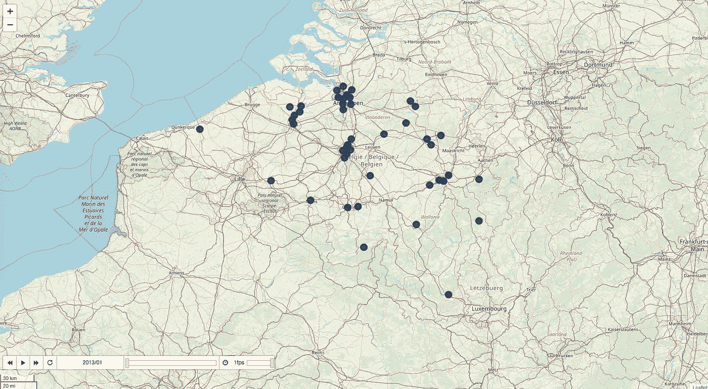
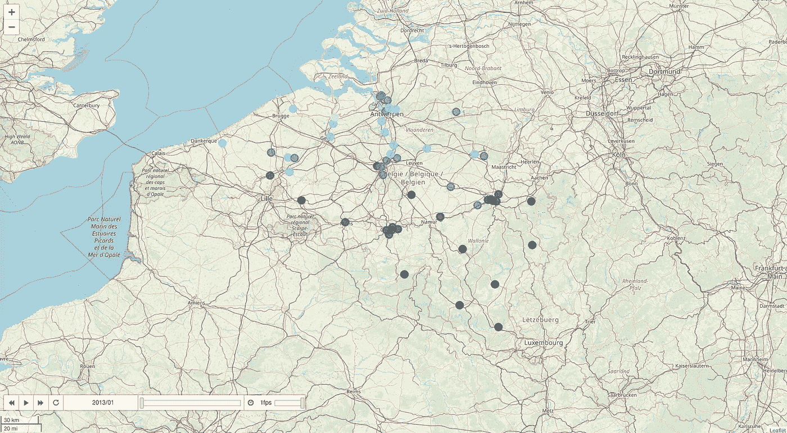

# 用树叶地图可视化空气污染

> 原文：<https://towardsdatascience.com/visualizing-air-pollution-with-folium-maps-4ce1a1880677?source=collection_archive---------6----------------------->


Photo by [Andrew Stutesman](https://unsplash.com/@drewmark?utm_source=medium&utm_medium=referral) on [Unsplash](https://unsplash.com?utm_source=medium&utm_medium=referral)

在我之前关于预测空气污染的文章中，我研究了使用递归神经网络(RNN 和 LSTM)预测比利时的空气污染。

[](/forecasting-air-pollution-with-recurrent-neural-networks-ffb095763a5c) [## 用递归神经网络预测空气污染

### 在 Curieuze Neuzen 的公民科学项目之后，我想了解更多关于空气污染的知识，看看我是否可以…

towardsdatascience.com](/forecasting-air-pollution-with-recurrent-neural-networks-ffb095763a5c) 

作为一个小项目，我认为在地图上绘制一段时间内的空气污染会很有趣。[叶子包](http://python-visualization.github.io/folium/)是一个很好的工具。

我们将绘制比利时 6 种污染物的空气污染图:

*   **臭氧**
*   **二氧化氮**
*   **一氧化碳**
*   **二氧化硫**
*   **颗粒物质(PM10)**
*   **苯(C6H6)**

这些数据是从[欧洲环境署](https://www.eea.europa.eu/data-and-maps/data/aqereporting-2/be)的网站上下载的。如果你想使用其他欧洲国家的数据，我鼓励你访问他们的网站。它有许多欧盟国家的数据集，并且有很好的文档记录。

我们将使用的数据集是:

*   BE_ *<污染物 _ ID>*_ 2013–2015 _ aggregated _ time series . CSV
*   BE _ 2013–2015 _ metadata . CSV

污染物 id 在 [EEA 的空气污染物词汇](http://dd.eionet.europa.eu/vocabulary/aq/pollutant)中描述。

*   1 =二氧化硫
*   5 =颗粒物质
*   7 =臭氧
*   8 =二氧化氮
*   10 =一氧化碳
*   20 =苯

# 项目设置

## 导入包

```
**from** **pathlib** **import** Path
**import** **pandas** **as** **pd**
**import** **numpy** **as** **np**

**import** **seaborn** **as** **sns**
**import** **folium**
**from** **folium.plugins** **import** TimestampedGeoJson

project_dir = Path('/Users/bertcarremans/Data Science/Projecten/air_pollution_forecasting')
```

## 空气污染物

我们将制作一本空气污染物及其数据集编号、科学符号、名称和垃圾箱边缘的字典。垃圾箱边缘基于维基百科页面上的比例。

```
pollutants = {
    1: {
        'notation' : 'SO2',
        'name' :'Sulphur dioxide',
        'bin_edges' : np.array([15,30,45,60,80,100,125,165,250])
    },
    5: {
        'notation' : 'PM10',
        'name' :'Particulate matter < 10 µm',
        'bin_edges' : np.array([10,20,30,40,50,70,100,150,200])
    },
    7: {'notation' : 'O3',
        'name' :'Ozone',
        'bin_edges' : np.array([30,50,70,90,110,145,180,240,360])
    },
    8: {'notation' : 'NO2',
        'name' :'Nitrogen dioxide',
        'bin_edges' : np.array([25,45,60,80,110,150,200,270,400])
    },
    10: {'notation' : 'CO',
        'name' :'Carbon monoxide',
         'bin_edges' : np.array([1.4,2.1,2.8,3.6,4.5,5.2,6.6,8.4,13.7])
    },
    20: {'notation' : 'C6H6',
        'name' :'Benzene',
         'bin_edges' : np.array([0.5,1.0,1.25,1.5,2.75,3.5,5.0,7.5,10.0])
    }
}
```

## 加载元数据

在元数据中，我们有每个采样点的**坐标**。我们需要这些信息在地图上标出取样点。

```
meta = pd.read_csv(project_dir / 'data/raw/BE_2013-2015_metadata.csv', sep='**\t**')
```

## 彩色温标

有 10 个装订边，我们将使用不同的颜色。这些颜色是用 [ColorBrewer](http://colorbrewer2.org/#type=diverging&scheme=RdBu&n=10) 创造的。

```
color_scale = np.array(['#053061','#2166ac','#4393c3','#92c5de','#d1e5f0','#fddbc7','#f4a582','#d6604d','#b2182b','#67001f'])
sns.palplot(sns.color_palette(color_scale))
```


# 数据准备

## 加载时间序列数据

我们将日期变量转换为日期时间。这样我们就可以很容易地用它们来切割熊猫的数据帧。

```
**def** load_data(pollutant_ID):
    print('> Loading data...')
    date_vars = ['DatetimeBegin','DatetimeEnd']
    filename = 'data/raw/BE_' + str(pollutant_ID) + '_2013-2015_aggregated_timeseries.csv'
    agg_ts = pd.read_csv(project_dir / filename, sep='**\t**', parse_dates=date_vars, date_parser=pd.to_datetime)
    **return** agg_ts
```

## 数据清理

我们将对数据进行一些基本的清理。关于我们为什么做这些特殊的清洁行动的更多信息，你可以阅读我之前关于预测空气污染的文章。

*   仅保留 P1D 的数据聚合过程的记录，以拥有每日数据
*   删除计数为 UnitOfAirPollutionLevel 的记录
*   移除可视化中多余的变量
*   移除少于 1000 个测量日的采样点
*   插入缺少的日期并用下一个有效日期的值输入 AirpollutionLevel

```
**def** clean_data(df):
    print('> Cleaning data...')
    df = df.loc[df.DataAggregationProcess=='P1D', :] 
    df = df.loc[df.UnitOfAirPollutionLevel!='count', :]
    ser_avail_days = df.groupby('SamplingPoint').nunique()['DatetimeBegin']
    df = df.loc[df.SamplingPoint.isin(ser_avail_days[ser_avail_days.values >= 1000].index), :]
    vars_to_drop = ['AirPollutant','AirPollutantCode','Countrycode','Namespace','TimeCoverage','Validity','Verification','AirQualityStation',
               'AirQualityStationEoICode','DataAggregationProcess','UnitOfAirPollutionLevel', 'DatetimeEnd', 'AirQualityNetwork',
               'DataCapture', 'DataCoverage']
    df.drop(columns=vars_to_drop, axis='columns', inplace=**True**)

    dates = list(pd.period_range(min(df.DatetimeBegin), max(df.DatetimeBegin), freq='D').values)
    samplingpoints = list(df.SamplingPoint.unique())
    new_idx = []
    **for** sp **in** samplingpoints:
        **for** d **in** dates:
            new_idx.append((sp, np.datetime64(d)))

    df.set_index(keys=['SamplingPoint', 'DatetimeBegin'], inplace=**True**)
    df.sort_index(inplace=**True**)
    df = df.reindex(new_idx)
    df['AirPollutionLevel'] = df.groupby(level=0).AirPollutionLevel.bfill().fillna(0)
    **return** df
```

## 绘制空气污染随时间的变化图

加载所有采样点的所有日期对于地图来说太过繁重。因此，我们将在每月的最后一天**对数据进行重新取样**。

**备注**:我们在笔记本中使用的箱边缘通常应用于 O3、NO2 和 CO 的(半)小时平均值。在我们在笔记本中使用的数据集中，我们只有日平均值。由于本笔记本只是为了说明如何在地图上绘制时间序列数据，我们将继续使用日平均值。然而，在欧洲经济区网站上，你也可以下载每小时的平均值。

```
**def** color_coding(poll, bin_edges):    
    idx = np.digitize(poll, bin_edges, right=**True**)
    **return** color_scale[idx]

**def** prepare_data(df, pollutant_ID):
    print('> Preparing data...')
    df = df.reset_index().merge(meta, how='inner', on='SamplingPoint').set_index('DatetimeBegin')
    df = df.loc[:, ['SamplingPoint','Latitude', 'Longitude', 'AirPollutionLevel']]
    df = df.groupby('SamplingPoint', group_keys=**False**).resample(rule='M').last().reset_index()
    df['color'] = df.AirPollutionLevel.apply(color_coding, bin_edges=pollutants[pollutant_ID]['bin_edges'])
    **return** df
```

为了显示污染随时间的演变，我们将使用 leav 的**timestampgeojson**[插件。此插件需要 geojson 输入功能。为了转换 dataframe 的数据，我创建了一个小函数**create _ geo JSON _ features**来完成这项工作。](https://python-visualization.github.io/folium/plugins.html)

```
**def** create_geojson_features(df):
    print('> Creating GeoJSON features...')
    features = []
    **for** _, row **in** df.iterrows():
        feature = {
            'type': 'Feature',
            'geometry': {
                'type':'Point', 
                'coordinates':[row['Longitude'],row['Latitude']]
            },
            'properties': {
                'time': row['DatetimeBegin'].date().__str__(),
                'style': {'color' : row['color']},
                'icon': 'circle',
                'iconstyle':{
                    'fillColor': row['color'],
                    'fillOpacity': 0.8,
                    'stroke': 'true',
                    'radius': 7
                }
            }
        }
        features.append(feature)
    **return** features
```

在此之后，输入要素被创建，我们可以创建一个地图，它们将被添加。TimestampedGeoJson 插件为时间滑块提供了一些简洁的选项，这些选项是不言自明的。

```
**def** make_map(features):
    print('> Making map...')
    coords_belgium=[50.5039, 4.4699]
    pollution_map = folium.Map(location=coords_belgium, control_scale=**True**, zoom_start=8)

    TimestampedGeoJson(
        {'type': 'FeatureCollection',
        'features': features}
        , period='P1M'
        , add_last_point=**True**
        , auto_play=**False**
        , loop=**False**
        , max_speed=1
        , loop_button=**True**
        , date_options='YYYY/MM'
        , time_slider_drag_update=**True**
    ).add_to(pollution_map)
    print('> Done.')
    **return** pollution_map**def** plot_pollutant(pollutant_ID):
    print('Mapping **{}** pollution in Belgium in 2013-2015'.format(pollutants[pollutant_ID]['name']))
    df = load_data(pollutant_ID)
    df = clean_data(df)
    df = prepare_data(df, pollutant_ID)
    features = create_geojson_features(df)
    **return** make_map(features), df
```

下面我们展示了每种空气污染物的分布图。你可以点击图片进入带有交互式地图的网页。点击*播放*按钮，可以看到空气污染物随时间的演变。

## 二氧化硫

```
pollution_map, df = plot_pollutant(1)
pollution_map.save('../output/pollution_so2.html')
pollution_map
```

[](http://bertcarremans.be/pollution_so2.html)

Link to interactive map: https://bertcarremans.github.io/air_pollution_viz/pollution_so2.html

## 颗粒物质

```
pollution_map, df = plot_pollutant(5)
pollution_map.save('../output/pollution_pm.html')
pollution_map
```

[](http://bertcarremans.be/pollution_pm.html)

Link to interactive map: [https://bertcarremans.github.io/air_pollution_viz/pollution_pm.html](https://bertcarremans.github.io/air_pollution_viz/pollution_so2.html)

其他可视化可在以下位置找到:

*   [https://bertcarremans . github . io/air _ pollution _ viz/pollution _ c6h 6 . html](https://bertcarremans.github.io/air_pollution_viz/pollution_c6h6.html)
*   [https://bertcarremans . github . io/air _ pollution _ viz/pollution _ co . html](https://bertcarremans.github.io/air_pollution_viz/pollution_co.html)
*   [https://bertcarremans . github . io/air _ pollution _ viz/pollution _ NO2 . html](https://bertcarremans.github.io/air_pollution_viz/pollution_no2.html)
*   [https://bertcarremans . github . io/air _ pollution _ viz/pollution _ O3 . html](https://bertcarremans.github.io/air_pollution_viz/pollution_o3.html)

# 结论

通过这个故事，我想展示使用 leav 在地图上可视化时间序列数据是多么容易。所有污染物的地图和 Jupyter 笔记本可以在 [GitHub](https://github.com/bertcarremans/air_pollution_forecasting/blob/master/notebooks/Visualizing%20Air%20Pollution%20in%20Belgium.ipynb) 中找到。请随意重复使用它来绘制你祖国的空气污染图。