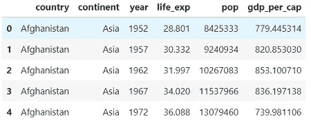
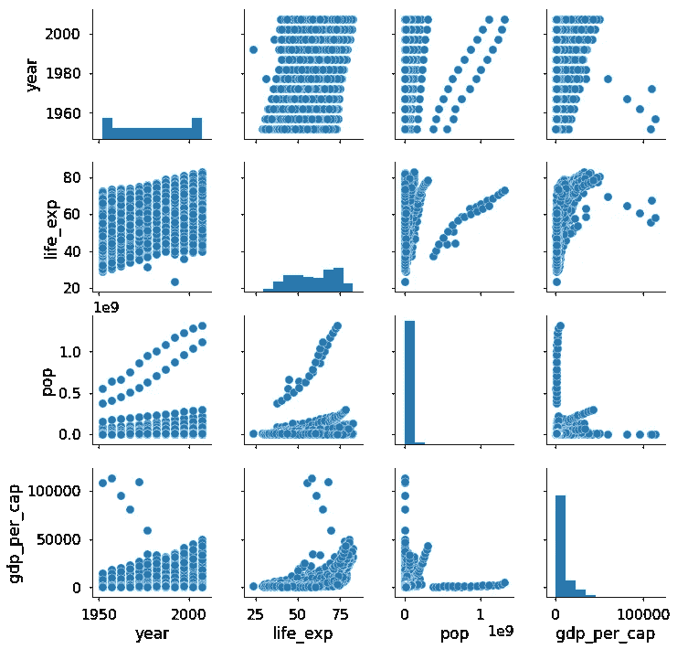
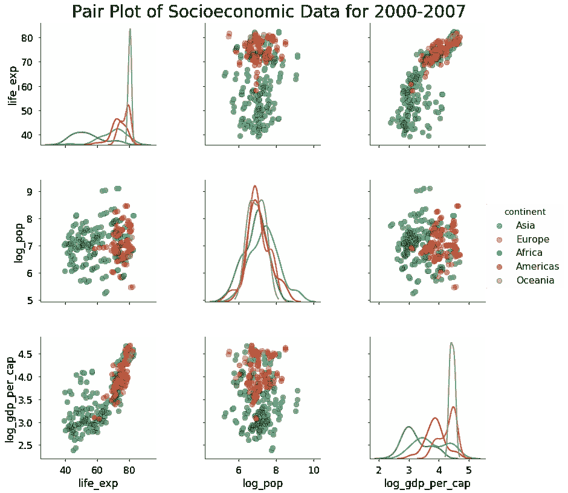
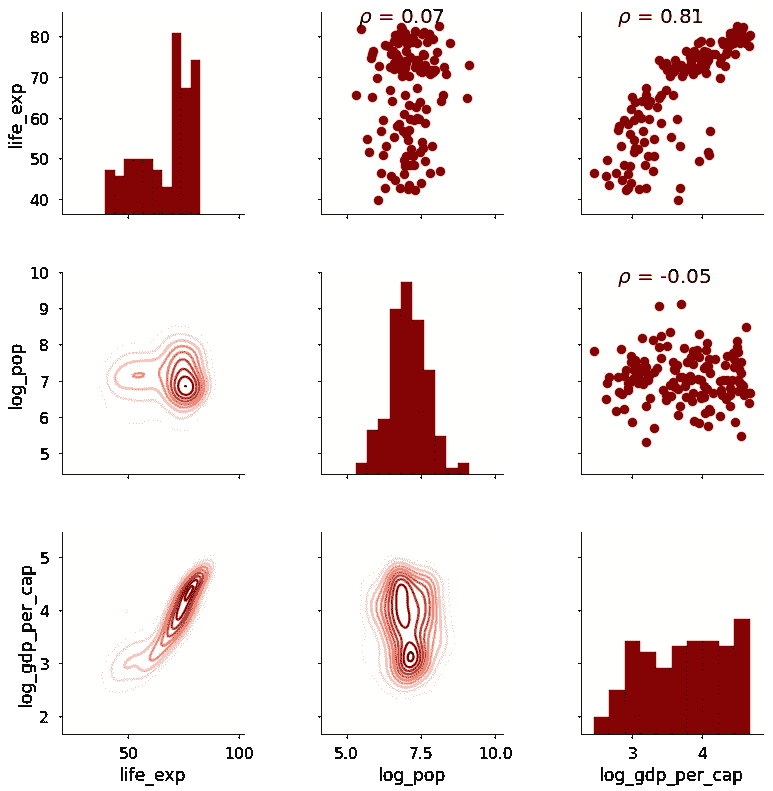
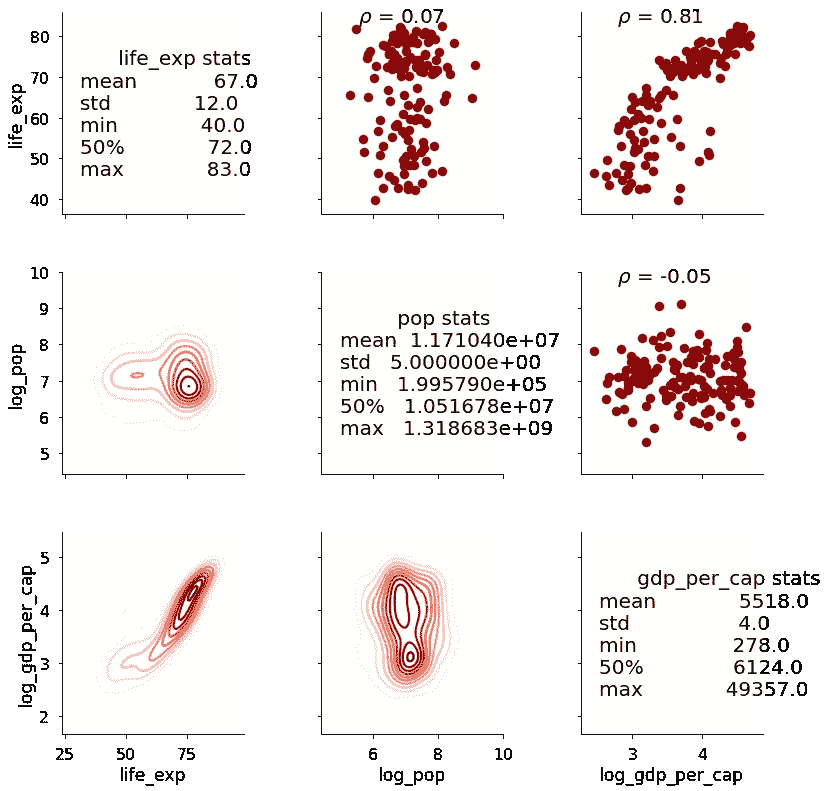

# 使用 Python 中的 Pairs 图可视化数据

> 原文：<https://towardsdatascience.com/visualizing-data-with-pair-plots-in-python-f228cf529166?source=collection_archive---------0----------------------->


**如何快速创建强大的探索性数据分析可视化**

一旦你有了一个干净的数据集，下一步就是探索性数据分析(EDA)。 [EDA](https://en.wikipedia.org/wiki/Exploratory_data_analysis) 是找出数据能告诉我们什么的过程，我们使用 EDA 来寻找模式、关系或异常，以便为后续分析提供信息。虽然 EDA 中有大量方法可以使用，但最有效的开始工具之一是 pairs 图(也称为散点图矩阵)。一个[对图](https://vita.had.co.nz/papers/gpp.pdf)允许我们看到单个变量的分布和两个变量之间的关系。结对图是确定后续分析趋势的一个很好的方法，幸运的是，它很容易在 Python 中实现！

在本文中，我们将通过使用 [seaborn 可视化库](https://seaborn.pydata.org/)在 Python 中启动和运行 pairs 绘图。我们将了解如何创建默认的 pairs 图来快速检查我们的数据，以及如何定制可视化以获得更深入的见解。这个项目的代码可以从 GitHub 上的 [Jupyter 笔记本中获得。我们将探索一个真实世界的数据集，由](https://github.com/WillKoehrsen/Data-Analysis/blob/master/pairplots/Pair%20Plots.ipynb) [GapMinder](https://www.gapminder.org/) 收集的国家级社会经济数据组成。

# Seaborn 的 Pairs 地块

要开始，我们需要知道我们有什么数据。我们可以把社会经济数据作为一个熊猫的数据框架来加载，然后看看这些列:



数据的每一行代表一个国家在一年中的观察，列保存变量(这种格式的数据称为[整齐数据](https://en.wikipedia.org/wiki/Tidy_data))。有 2 个分类列(国家和洲)和 4 个数字列。这几列是不言自明的:`life_exp`是出生时的预期寿命，单位是年，`pop`是人口，`gdp_per_cap`是人均国内生产总值，单位是国际货币。

seaborn 中的缺省 pairs 图只绘制数字列，尽管稍后我们将使用分类变量进行着色。创建默认的 pairs 图很简单:我们加载 seaborn 库并调用`pairplot`函数，向它传递我们的 dataframe:

```
# Seaborn visualization library
import seaborn as sns# Create the default pairplot
sns.pairplot(df)
```



我仍然很惊讶，一行简单的代码给了我们整个情节！pairs 图基于两个基本图形，直方图和散点图。对角线上的直方图允许我们看到单个变量的分布，而上下三角形上的散点图显示了两个变量之间的关系(或缺乏关系)。例如，第二行最左边的图显示了 life_exp 与 year 的散点图。

默认配对图本身常常给我们提供有价值的见解。我们看到预期寿命和人均国内生产总值正相关，表明高收入国家的人们往往更长寿(尽管这当然不能证明一个导致另一个)。(谢天谢地)随着时间的推移，世界范围内的预期寿命似乎也在上升。从直方图中，我们了解到人口和 gdp 变量严重右偏。为了在未来的图中更好地显示这些变量，我们可以通过取这些值的对数来转换这些列:

```
# Take the log of population and gdp_per_capita
df['log_pop'] = np.log10(df['pop'])
df['log_gdp_per_cap'] = np.log10(df['gdp_per_cap']) # Drop the non-transformed columns
df = df.drop(columns = ['pop', 'gdp_per_cap'])
```

虽然该图本身在分析中是有用的，但我们可以通过根据分类变量(如洲)给图形着色来使其更有价值。这在 seaborn 也是极其简单的！我们需要做的就是在`sns.pairplot`函数调用中使用`hue`关键字:

```
sns.pairplot(df, hue = 'continent')
```


现在我们看到大洋洲和欧洲的预期寿命最长，亚洲人口最多。请注意，我们对人口和 gdp 的对数转换使这些变量呈正态分布，从而更全面地表示了这些值。

这个图表提供了更多的信息，但是仍然有一些问题:我倾向于不去发现堆叠的直方图，像对角线上的那样，是很容易解释的。一个更好的显示来自多个类别的单变量分布的方法是密度图。我们可以在函数调用中将直方图换成密度图。在此过程中，我们将向散点图传递一些关键字，以更改点的透明度、大小和边缘颜色。

```
# Create a pair plot colored by continent with a density plot of the # diagonal and format the scatter plots.sns.pairplot(df, hue = 'continent', diag_kind = 'kde',
             plot_kws = {'alpha': 0.6, 's': 80, 'edgecolor': 'k'},
             size = 4)
```


对角线上的密度图比堆积的柱状图更容易比较各大洲之间的分布。改变散点图的透明度增加了可读性，因为这些图上有相当多的重叠([称为过度绘制](http://mail.perceptualedge.com/articles/visual_business_intelligence/over-plotting_in_graphs.pdf))。

作为默认配对图的最后一个例子，让我们通过只绘制 2000 年以后的年份来减少混乱。我们仍将按洲进行着色，但现在我们不会绘制年份列。为了限制绘制的列，我们向函数传递一个列表`vars`。为了明确剧情，我们还可以加一个标题。

```
# Plot colored by continent for years 2000-2007
sns.pairplot(df[df['year'] >= 2000], 
             vars = ['life_exp', 'log_pop', 'log_gdp_per_cap'], 
             hue = 'continent', diag_kind = 'kde', 
             plot_kws = {'alpha': 0.6, 's': 80, 'edgecolor': 'k'},
             size = 4);# Title 
plt.suptitle('Pair Plot of Socioeconomic Data for 2000-2007', 
             size = 28);
```



这看起来越来越好了！如果我们要做建模，我们可以使用这些图中的信息来通知我们的选择。例如，我们知道 log_gdp_per_cap 与 life_exp 正相关，因此我们可以创建一个线性模型来量化这种关系。在这篇文章中，我们将坚持绘图，如果我们想进一步探索我们的数据，我们可以使用 PairGrid 类定制 pairplots。

# 使用 PairGrid 进行定制

与`sns.pairplot`函数相反，`sns.PairGrid`是一个类，这意味着它不会自动为我们填充图形。相反，我们创建一个类实例，然后将特定的函数映射到网格的不同部分。为了用我们的数据创建一个 PairGrid 实例，我们使用下面的代码，它也限制了我们将显示的变量:

```
# Create an instance of the PairGrid class.
grid = sns.PairGrid(data= df_log[df_log['year'] == 2007],
                    vars = ['life_exp', 'log_pop', 
                    'log_gdp_per_cap'], size = 4)
```

如果我们要显示它，我们将得到一个空白的图形，因为我们没有将任何函数映射到网格部分。PairGrid 需要填写三个网格部分:上三角形、下三角形和对角线。为了将图映射到这些部分，我们在部分上使用`grid.map` 方法。例如，为了将散点图映射到上面的三角形，我们使用:

```
# Map a scatter plot to the upper triangle
grid = grid.map_upper(plt.scatter, color = 'darkred')
```

`map_upper`方法接受任何接受两个变量数组(比如`plt.scatter`)和相关关键字(比如`color`)的函数。`map_lower`方法是完全相同的，但是填充网格的下三角形。`map_diag`略有不同，因为它接受一个接受单个数组的函数(记住对角线只显示一个变量)。一个例子是`plt.hist`，我们用它来填充下面的对角线部分:

```
# Map a histogram to the diagonal
grid = grid.map_diag(plt.hist, bins = 10, color = 'darkred', 
                     edgecolor = 'k')# Map a density plot to the lower triangle
grid = grid.map_lower(sns.kdeplot, cmap = 'Reds')
```

在这种情况下，我们在下面的三角形上使用二维(密度图)的核密度估计。综上所述，这段代码给出了以下情节:


当我们想要创建自定义函数来将不同的信息映射到绘图上时，使用 PairGrid 类的真正好处就来了。例如，我可能想要将两个变量之间的[皮尔逊相关系数](http://www.statisticshowto.com/probability-and-statistics/correlation-coefficient-formula/)添加到散点图上。为此，我将编写一个接受两个数组的函数，计算统计数据，然后将其绘制在图上。下面的代码显示了这是如何做到的(归功于这个[堆栈溢出答案](https://stackoverflow.com/questions/30942577/seaborn-correlation-coefficient-on-pairgrid)):

我们的新函数被映射到上面的三角形，因为我们需要两个数组来计算相关系数(还要注意，我们可以将多个函数映射到网格部分)。这会产生以下情节:



相关系数现在出现在散点图上方。这是一个相对简单的例子，但是我们可以使用 PairGrid 将任何函数映射到图上。我们可以根据需要添加尽可能多的信息，前提是我们能想出如何编写这个函数！作为最后一个例子，这里是一个在对角线上显示汇总统计数据的图，而不是一个图。



这需要一点清理，但它表明了总体思路；除了使用库中任何现有的函数(如`matplotlib`)将数据映射到图形上，我们还可以编写自己的函数来显示定制信息。

# 结论

Pairs 图是快速探索数据集中的分布和关系的强大工具。Seaborn 提供了一个简单的默认方法来制作 pair plots，可以通过 Pair Grid 类对其进行定制和扩展。在一个数据分析项目中，价值的主要部分通常不是来自华而不实的机器学习，而是直接的数据可视化。pairs 图为我们提供了对数据的全面的初步观察，是数据分析项目的一个很好的起点。

我欢迎反馈和建设性的批评，可以通过 Twitter [@koehrsen_will](http://twitter.com/koehrsen_will) 联系到我。