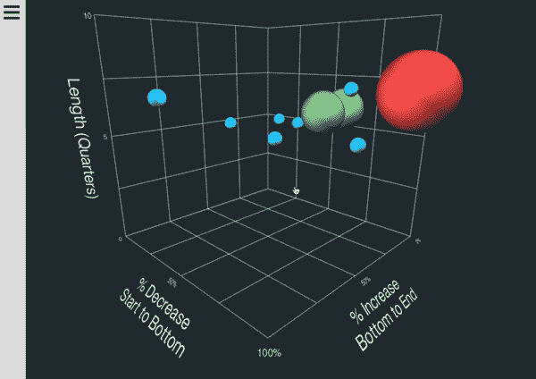
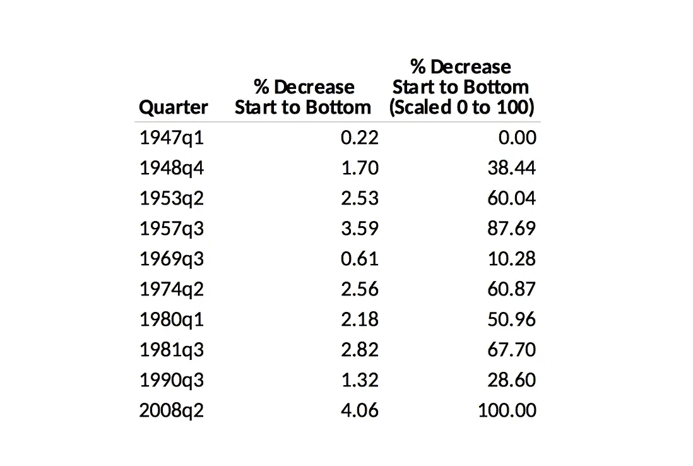

# 用熊猫和三个 js 可视化衰退

> 原文：<https://towardsdatascience.com/visualizing-recessions-with-pandas-and-three-js-2df3f514dc44?source=collection_archive---------17----------------------->

Just a gif. Scroll down to the CodePen for the interactive version.

美国经济衰退的严重程度如何比较？严重程度如何衡量？这些是我在与 [Christopher Brooks](https://twitter.com/cab938) 一起为最后一个项目[Python 数据科学导论](https://www.coursera.org/learn/python-data-analysis)识别经济衰退后考虑的问题。下面这篇文章概述了在分析 [pandas](https://pandas.pydata.org/) 中的数据并使用 [three.js](https://threejs.org/) 将其可视化的过程中获得的一些关键经验。我将重点介绍:

*   使用向量计算减少不透明 for 循环
*   使用特征缩放更好地理解数据点之间的差异，否则很难区分
*   三维可视化数据的挑战和一些未解决的问题

但是在你不得不读太多之前，这里有一个可视化的东西，这样你就可以自己看了。四处拖动以更改视角。点击球体来显示它们的工具提示。它们也是可拖动的，因为图表很容易变得混乱。

# 简单的矢量

第一步是识别 1947 年至 2016 年间的衰退。很自然地，我对自己说，“让我们从一个 for 循环开始，看看我能走多远。”但是事情失去了控制。很快。

既然发现衰退取决于季度差异，我想为什么不直接研究差异呢？这就是矢量派上用场的地方。首先，我从一个向量开始，从一个季度的 GDP 开始，然后加上接下来几个季度的 GDP。这是 1981 年第三季度的情况:

接下来，我从第一个向量中创建了一个 GDP 季度间差异的向量:

现在我们开始工作了！迭代差异变得更加直接，这在处理不仅仅是两个季度下降然后两个季度上升的衰退时特别有用。如上图所示，始于 1981 年第三季度的衰退就是一个过山车的例子。

# 特征缩放

用 [three.js](https://threejs.org/) 在三维空间中可视化日期似乎很有希望，但是数据一加载进来，我就遇到了阻碍。每个维度都有不同范围的值，这使得进行比较变得困难。用一个公认的粗略类比来说，我如何才能举起一个放大镜来观察每一个维度，照亮交互的微观世界，同时又不遮挡其他所需放大镜的视野？

对于每个特性，我需要在一个更容易理解的范围内扩展值。下面是一个例子:

衡量衰退严重程度的一个标准是从开始到结束的跌幅。由于我对原始值本身不感兴趣，而是对每个值在集合中的位置更感兴趣，所以我将它们扩展到 0 到 100 的范围内。幸运的是， [scikit-learn](http://scikit-learn.org/stable/modules/generated/sklearn.preprocessing.MinMaxScaler.html) 有一个工具可以做到这一点。这最终造成了双重打击，因为它既有助于分析，又因为相同的缩放范围(0 到 100)可以用于多个维度，提供了一种将数据输入 three.js 的一致方法。

然而，它回避了以下问题:像这样扩展数据有帮助吗？一方面，我失去了背景。我不知道原始值是多少，也不知道它们在什么范围内。上表中的原始数据具有跨越 4%范围的值，这与 40%或 400%大不相同。因此，这种方法肯定会被用来混淆大局，扭曲特定关系的重要性。另一方面，我确实发现放大并突出各种比较很有帮助。回想起来，上面的可视化可能更适合与每个指标更直观的显示一起使用。但是，活到老，学到老。

# 多个优先级，一个用户界面

切换到 UI，我发现使用三维工具提供了一些竞争优先权，特别是工具提示。以下是我试图实现的目标:

*   摇动相机，从不同角度查看数据点和其他图表元素。
*   确定每个数据点的年份和季度。
*   将工具提示和它的数据点连接起来，这样你的眼睛就不用看页面上其他地方的断开列表了。
*   保持 UI 整洁，同时提供有用的见解。
*   使用颜色来配对元素并传达优先级。

我创建的可视化只需要容纳 10 个数据点，我觉得如果所有 10 个工具提示都打开，我的方法几乎不起作用。那么，如果图表包含数百个数据点，该怎么办呢？怎么可能看出每一张是哪一年的？我没有这些问题的答案，但是我猜想没有一个形象化的东西可以统治所有的问题。即使只需要 10 个数据点，也需要从多个角度来了解，这可能需要各种图表来完成工作。

# 结论

感谢您的阅读，如果您想亲自查看代码或了解我的方法的更多细节，请随意查看[回购](https://github.com/colepacak/recessions)。