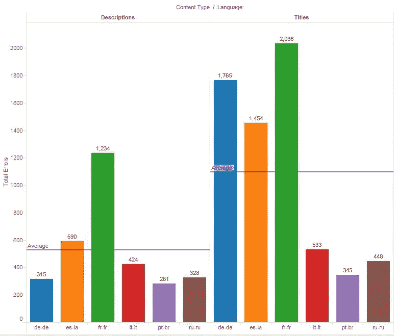
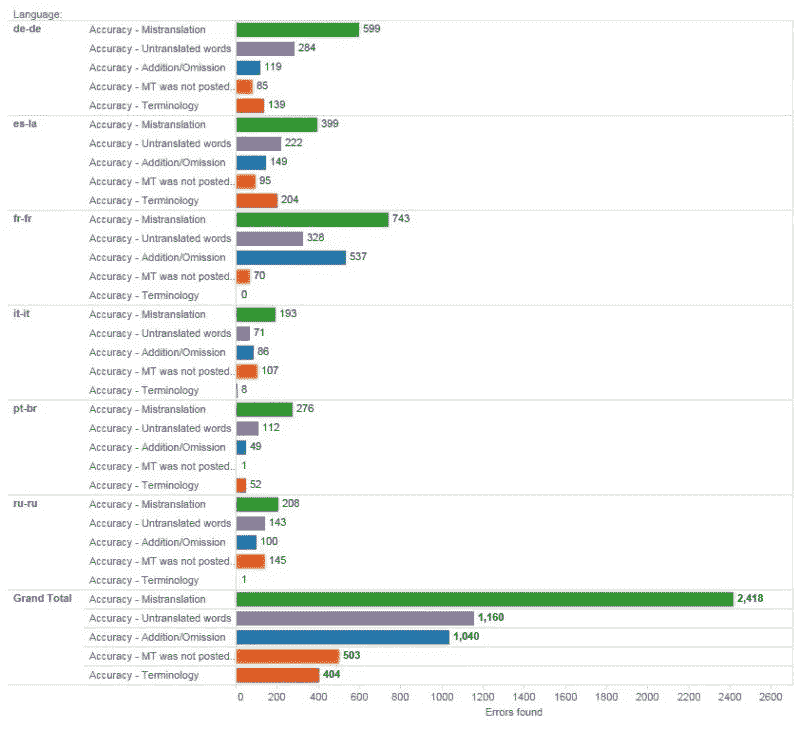
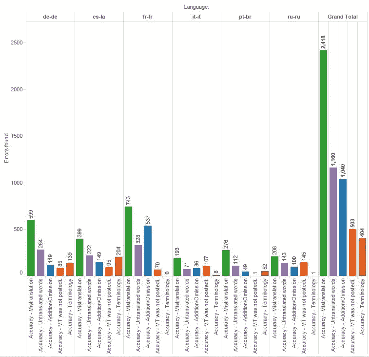
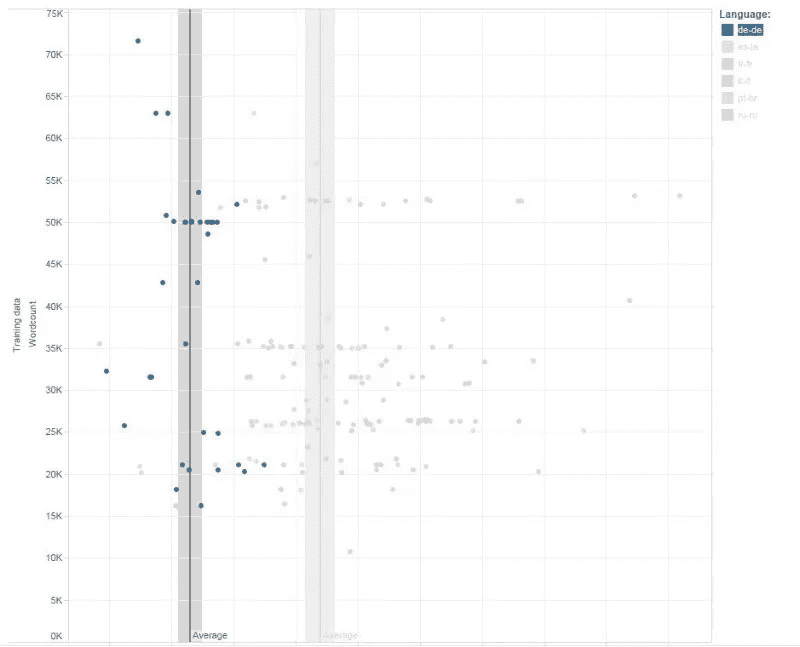

# 可视化翻译质量数据

> 原文：<https://towardsdatascience.com/visualizing-translation-quality-data-a2be30788bfe?source=collection_archive---------3----------------------->

# 没有知识不是力量

毫无疑问，我们正生活在信息时代最激动人心的日子里。电脑越来越快，智能手机无处不在。惊人的多样化来源每天都会产生大量的数据。为语言服务购买者和提供者收集数据肯定比以往任何时候都容易，但看起来本地化行业并没有做很多工作来利用所有这些信息。总的来说，当然，除了少数例外，这个行业似乎错过了这一点，没有充分利用，或者至少试图理解，所有这些每天产生的精彩信息。

也许问题在于，太多的信息可能很难理解，甚至会让人感到不知所措。准确地说，这就是数据可视化的优势。

在这一系列文章中，我将介绍三种不同的工具，您可以使用它们来可视化您的翻译质量数据:Tableau、TAUS DQF 和 Excel。本文是第 1 部分，将只关注一般信息和表格。

# 数据可视化的案例

也许数据可视化最重要的一点是，它允许你以一种非常自然的方式吸收信息。在表格中很难理解的大量信息，在一个漂亮的图表中呈现和总结时突然变得有意义。模式和趋势可能变得更容易发现，有时甚至是显而易见的。相关性可能会突然出现，给你急需的业务或战略优势，让你有效地根据你的信息采取行动。

这如何应用于翻译/本地化实践？嗯，有很多信息可以测量和分析，例如:

*   生产力，
*   供应商表现，
*   MT 系统性能，
*   工具性能，
*   财务状况，
*   流程效率等…

在易贝，我们使用数据可视化来跟踪供应商的表现、不同语言组合的机器翻译输出质量、机器翻译输出中发现的问题类型的详细信息、我们在供应商的交付物中发现的问题类型等等。

# 钥匙

让我们花一分钟的时间来检查使可视化有效的必要条件。你会注意到，我绝不是这方面的专家，但根据我的经验和研究，以下是需要考虑的要点:

**首先要明确**。你想用图表找出什么？你想引起人们对什么的注意？你在说什么呀传递明确的信息是当务之急。

要有选择性**:不要仅仅因为。仔细计划你想要包含的数据点，评估它们是否有助于你的信息的主要目的。这可能很难做到，尤其是当你有太多信息的时候——你可能会想添加一些没有任何价值的信息。**

**记住你的听众，保持**相关性**。塑造你的信息来回答他们可能有的问题。丢弃任何他们认为不必要的信息。项目经理可能对财务和按时交付的百分比感兴趣，工程师可能对流程效率感兴趣，而语言经理可能关注质量和语言表现。**

**思考一下呈现信息的最佳方式，以及如何突出最重要的信息。包含趋势、突出模式并使有意义的相关性显而易见通常是个好主意。**

# **（舞台上由人扮的）静态画面**

**Tableau 可能是最流行的可视化程序之一。这个概念很简单:Tableau 可以从一个简单的 Excel 文件或数据库(以及其他几个选项)中读取数据，解析它，并将信息转化为维度和度量。这是最棒的部分:你可以简单地将这些维度和度量拖放到列和行上，Tableau 会为你生成图表(或者他们喜欢称之为*视图*)。自动地。毫不费力。**

**它还提供了一系列令人惊叹的图表选项和定制选项，当你开始使用该软件时，这些选项可能会让人不知所措，但一旦你掌握了其中的窍门，就完全有意义了。**

**让我们来看一些例子***:**

*   **这张图表以一种非常简单的方式展示了我们目前正在处理的两种[内容类型](https://www.linkedin.com/pulse/ebay-mt-language-specialists-series-types-content-tatyana-badeka)的供应商表现，即标题和描述。很明显，供应商 2 可能是描述的最佳选择，而供应商 5 在标题方面表现不佳。**

****

*   **现在，假设我们想要分析不同语言的后期编辑是如何工作的，同样是基于内容类型。我们可以看一下评审人员为他们每个人发现了多少错误。**

**这里很明显，德国的后期编辑在描述方面做得很好，但他们在标题方面很吃力，因为蓝色列的位置有很大的差异。我们还可以看到，西班牙语和法语似乎高于误差平均值。意大利语、葡萄牙语和俄语从一种内容类型到另一种内容类型没有显示出重大变化。**

****

**c)现在，我们想更深入地了解审核人员发现的错误，为此，我们将按语言查看不同类型的错误。看这张图表，似乎最大的问题是误译。这是一个很好的提示，可以尝试找出为什么会发生这种情况:来源太复杂了吗？后期编辑做的研究不够吗？我们是否提供了正确的参考资料？另一方面，数据似乎表明术语并不是一个大问题。我们可以推断我们的术语表可能是好的，我们的工具显示正确的术语表匹配，我们的翻译是主题专家。**

**例如，我们也可以看到法语比意大利语有更多的问题。**

****

**Tableau 将很容易让你交换你的列和行来改变数据的显示方式。在下面的例子中，重点是错误类别，而不是发现的错误数量。然而，在这个视图中我不喜欢的是错误类别的名称是垂直的，难以阅读——可以旋转它们，但这会使图表变得更宽。**

**您可以尝试创建一个视图，以尽可能最好的方式准确显示您想要的内容，这有很多选项。**

****

*   **一个非常简单的方法，可以根据处理的字数快速查看最忙的月份。**

****

*   **现在，我们想看看[编辑距离](https://www.linkedin.com/pulse/ebay-mt-language-specialists-series-edit-distance-silvio-picinini?trk=prof-post) —分析这些信息可以帮助我们计算出，例如，按语言的机器翻译性能，考虑到较小的编辑距离意味着较少的后期编辑工作。我还将包括字数，以查看上下文中的编辑距离。**

**我可以让 Tableau 在图表中画一条线来显示所有语言的平均编辑距离。**

**蓝点表示德语是编辑距离最低的语言，平均为 21.15。这可能表明我的 DE 输出是好的，或者至少比语言的其他部分更好。意大利语的红点到处都是，这可能表明我的 IT MT 输出质量不一致——与葡萄牙语正好相反，大多数紫色点集中在图表的中心。**

****

*   **在这个最后的例子中，让我们假设我们想要看到我们的评论者覆盖了多少内容；理想情况下，他们应该审查 50%的总字数。在这里，我们可以看到，按照语言，我们已经处理了多少单词，复习了多少单词。您可以很快看到法语单词数是俄语单词数的两倍。你还可以很容易地注意到，FR reviewer 没有覆盖其他人那么多。这可能表明您需要另一个审核人，或者当前审核人表现不佳。相比之下，葡萄牙语的总字数和评论字数之间的差异很小。如果我们只需要审核 50%的内容，PT reviewer 就覆盖太多了。**