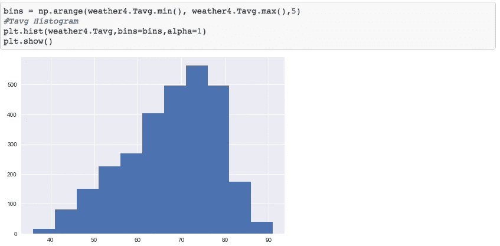
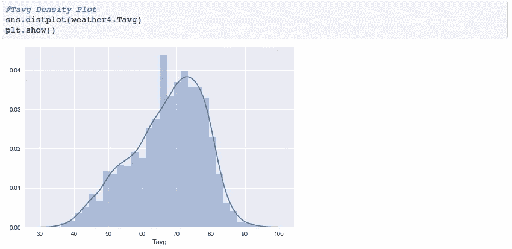
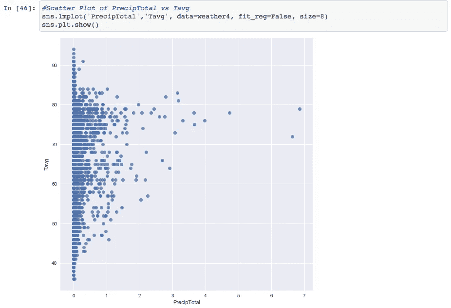
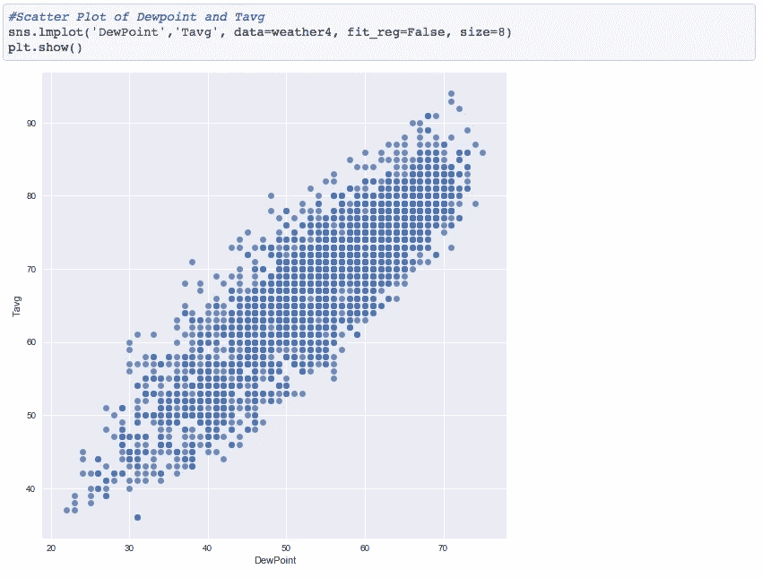
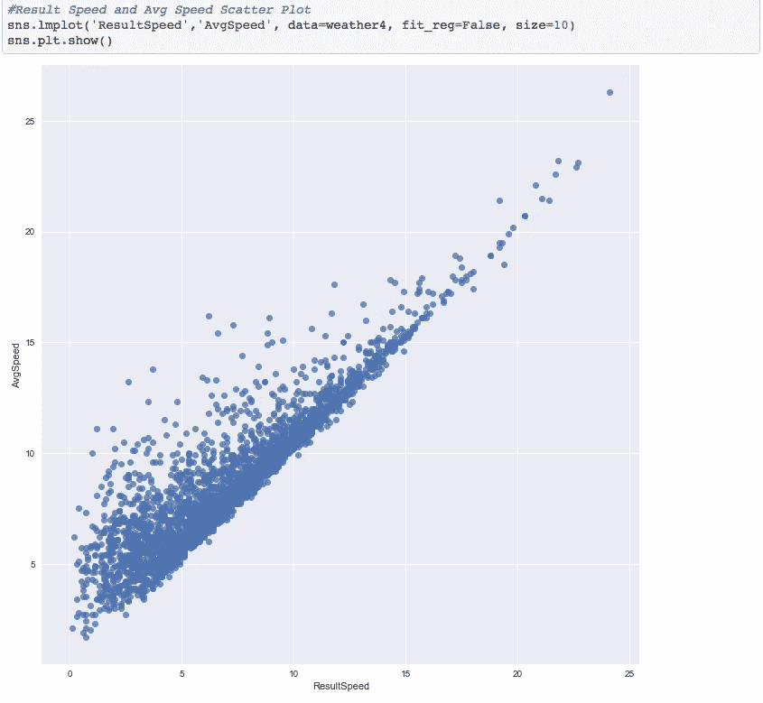
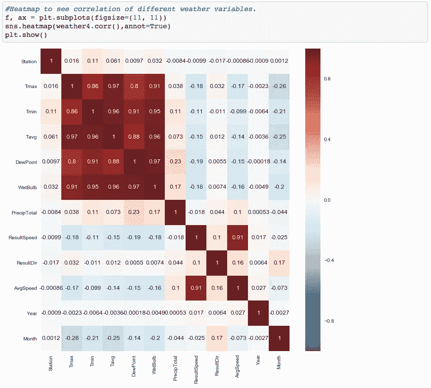

# 可视化您的探索性数据分析

> 原文：<https://towardsdatascience.com/visualizing-your-exploratory-data-analysis-d2d6c2e3b30e?source=collection_archive---------0----------------------->

也许生活在数据科学世界的人和不生活在数据科学世界的人之间最大的差异之一是翻译数据以便每个人都能理解它的能力。数据科学家向业外人士展示数据分析的最佳方式之一是生成可视化效果。在我作为一名数据科学家的短暂时间里，很明显只有两种情况可以生成可视化。第一次是在探索性数据分析(EDA)期间，您最初接收数据，对其进行清理、排序，并创建您喜欢的任何其他要素，以获得干净完整的数据集。从这一点上，您可以开始看到某些变量之间的关系、特征之间的相关性(如果有的话)，并生成更多的可视化效果，以便更好地显示手头的数据。另一种情况通常发生在分析结束时，此时您可能希望直观地看到您的模型预测与 EDA 可视化的预测相比如何，或者查看您的推断现在是否能够做出新的发现或 EDA 中显示的数据的延续。

这篇文章将关注可视化的第一个机会，EDA。在此之前，我们深入到视觉化，因为理解你将要做的事情的定义是关键。EDA 是一种数据分析方法，它使用各种技术，主要是可视化技术，以:最大限度地提高洞察力，揭示底层结构，检查异常值，测试假设，并确定最佳因素。这是一种分析数据的方法，它延迟了应该使用哪种模型的通常假设，而是让数据自己说话。

根据我的经验，目前为止我遇到的最好的可视化库是 [matplotlib](https://matplotlib.org) 、 [seaborn](http://seaborn.pydata.org) 和 [Tableau](https://www.tableau.com) 应用程序。每一个都提供了一套独特的工具。

我将使用的两组数据来自 Kaggle 竞赛，用于预测大芝加哥地区捕蚊器中西尼罗病毒(WNV)的情况。我将向您展示一些使用 Seaborn 和 Matplotlib 在天气数据集上完成的初始 EDA。我还想指出，虽然你将看到的可视化是我的， [Ira Rickman](http://irickman.github.io) ，Michael Costa 和 Kristina Schendt 也参与了这个项目。我将用来显示 Tableau 使用情况的另一个数据集使用了关于美国大规模枪击事件的[斯坦福大学图书馆](https://library.stanford.edu/projects/mass-shootings-america)，我目前正在将其用于一个单独的项目，稍后将有一个完整的博客专门讨论这个项目。

虽然很容易创建一些最有价值的类型，但在进行 EDA 时，可以生成两种图表:直方图和散点图。直方图允许我们看到特定变量的分布，而散点图允许我们看到两个或更多变量之间的关系。在我探索 WNV 天气数据的整个过程中，这些图是至关重要的，即使它们的使用可能看起来是多余的。EDA 的目的是以你知道的每一种方式探索数据。

下面的两个直方图向我们展示了平均温度在数据时间段内的分布和频率。正如您所看到的，它的范围从 40 度到 90 度左右，最常见的平均温度在 70 度左右，即使不知道数据的任何其他信息，您也可以假设数据收集的时间段是从春天到初秋。

您还会看到 Matplotlib 和 Seaborn 之间的巨大差异。第一个图形是使用 Matplotlib 创建的，需要(也很好地允许)大量的代码来设置，并且受限于您在其上放置的参数。第二个是 Seaborns 版本的直方图，称为密度图。正如您所看到的，它的设置要容易得多，因为它为您设置了箱和其他参数，并为您提供了整个数据分布的清晰线条。然而，由于它没有排除任何可能的异常值，这降低了我们关注数据主要部分的能力。

Matplotlib Average Temperature Histogram

Seaborn Average Temperature Density Plot

下面是使用 Seaborn 生成的四个非常不同的散点图示例。

第一张图比较了平均温度和风速的数据点。虽然起初，它看起来太大，是一个杂乱无章的散点图，但它仍然为我们提供了一些关键信息。总的来说，它向我们表明，这两个变量之间似乎几乎没有相关性，同时也表明，大多数数据点的温度在 55 至 85 度之间，风速在 1 至 12 英里每小时之间。我们还可以看到，随着温度的降低，风速超过每小时 15 英里的次数会增加，这与温度向相反方向变化的情况相反。

Wind Speed vs Average Temperature

我们的第二个散点图比较了平均温度和总降水量，虽然就图表而言，它似乎有点不清楚，但它继续为我们的数据提供了有价值的信息。从该图中可以得出两个主要结论:该数据集中的大部分时间几乎没有降水，这向我们揭示了一些偏远的数据点，那里的降雨量接近 7 英寸。

Precipitation Total vs Average Temperature

我们最后的两个露点与平均温度和平均风速与最大风速的散点图和其他散点图一样，揭示了我们对数据的重要理解。第一次，我们看到两个图，它们的变量似乎都有很强的相关性和积极的趋势。我们可以在第一张图中看到，随着温度的升高，露点也会升高，这并不奇怪，因为露点与湿度直接相关，但由于这张图，我的数据告诉我要进一步研究这个问题。如果没有这个情节我可能不会做这个调查。不出所料，我们的第二张图通过比较平均和最大风速，向我们展示了我们迄今为止最强的相关性，而不仅仅是将一个特征与其自身进行比较。然而，即使在其明显的冗余中，它也向我们展示了一些罕见的情况，可能是异常值，风速超过每小时 20 英里。

DewPoint vs Average Temperature

Wind Speed vs Average Wind Speed

下面是我在 Seaborn 图书馆最喜欢的图表之一，[热图](https://seaborn.pydata.org/generated/seaborn.heatmap.html)。这不仅为我们提供了每个变量之间相关性的数值，还为我们提供了一个易于理解的可视化表示，其中暗红色表示高度相关，深蓝表示不相关或负相关。这是创建最简单的图之一，但也是最具信息量的图之一，可以指导我们生成其他图来调查它带来的数字。需要注意的是，由于它是比较数据集中每个变量之间的相关性，因此根据变量的数量、观察值和计算机的处理能力，它需要一些时间来处理。

Seabron Correlation Heatmap of Weather Variables

另一个很棒的工具是 Tableau，它最基本的功能是一个点击应用程序，可以创建一个很棒的可视化世界。我发现它在比较多个地理区域的事件时特别有用。如前所述，我目前正在从事一个涉及美国大规模枪击事件的项目，因此我目前正在运行我的 EDA。以下是我到目前为止能够生成的一些非常容易解释和创建的 Tableau 图表。

下图向我们展示了从 1966 年到 2016 年美国大陆的每一次枪击事件的地点，颜色的深浅根据每个地点的受伤或死亡人数而变化。颜色越深，数字越高。我们几乎可以立即看到，大多数事件发生在人口密集区或其附近，伤亡人数最多的地区是南加州、丹佛地区、德克萨斯州中部、弗吉尼亚州西部和康涅狄格州。然而，值得注意的是，对于其中的一些地方，像奥罗拉、桑迪胡克、弗吉尼亚理工大学或德克萨斯大学这样的突发事件将它们推到了不幸的境地。

Locations of US Shootings 1966–2016, Total Number of Victims

我们的第二张图表也向我们展示了这些事件发生的地点，但这次我们不是统计受害者人数，而是查看枪手被诊断患有精神健康疾病的案例密度。虽然我们可以看到一些类似的枪击和精神疾病事件的发生中心，但它也揭示了这些行为的肇事者中有惊人数量的人很可能有预先存在的精神健康问题。

Locations of US Shootings 1966–2016, Number of Shooters with Diagnosed Mental Health Illnesses

正如你从 WNV 和美国枪击案中看到的，即使是最简单或最丑陋的图表也能为你提供关于数据的重要信息。无论是揭示异常值、趋势、相关性，还是在数据的兔子洞里增加阴谋，EDA 都允许数据显示它自己，并让我们在它完成后进行分析。