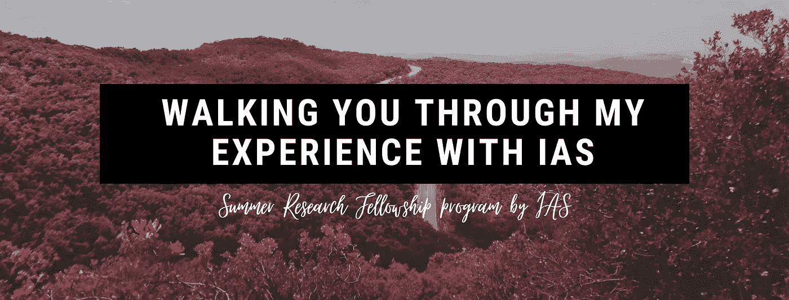
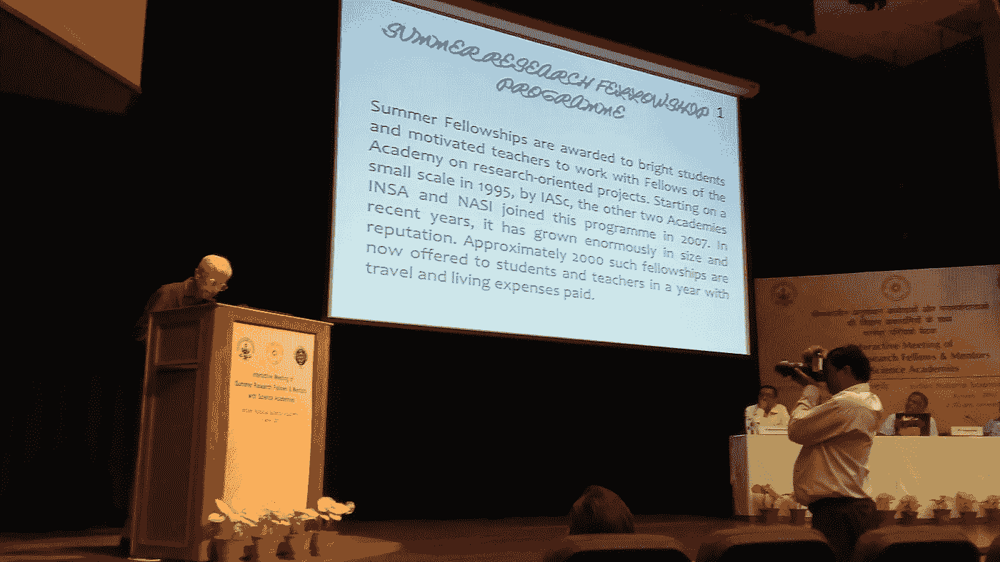

# 向您介绍我使用 IAS 的经历

> 原文：<https://towardsdatascience.com/walking-you-through-my-experience-with-ias-5cfc6f9e926a?source=collection_archive---------11----------------------->

## 科技生活

## IAS 的夏季研究奖学金项目是由不同知名大学的教授指导的研究项目

好吧，你们所有人都应该知道享有盛誉的 IAS 夏季研究奖学金。这是每个理科生的梦想。这是一个夏季研究奖学金，提供给全印度的精选学生。

**暑期研究奖学金项目(SRFP)** 由印度科学院提供，是一种在印度的暑期沉浸式体验，是对学年期间发生的研究活动的补充。通常，这是一个竞争激烈的本科生项目，由学院的教职员工(通常是印度理工学院、印度理工学院、印度理工学院和印度其他知名学院)监督，他们为本科生的研究工作提供总体指导。该奖学金为期至少 8 周。研究领域变化很大，可以来自任何艺术或科学学科。

> 在这个项目中，学生可以在不同著名大学教授的指导下，在各自感兴趣的领域进行研究。

与其他人不同，我希望在这个著名的研究团队下从事图像和模式识别方面的工作。结果预计将于 2017 年 2 月 28 日公布。我像往常一样焦虑，希望能在获奖者中找到自己的名字。虽然我成功的可能性很小，但我还是抱最大的希望。但是，如果愿望是马，乞丐会骑。唉！我的名字不在那里。那天我彻底地看了几遍清单，我完全失望了。

尽管由于我的平均绩点只有 8.5，机会很少，我还是浏览了所有在信号和图像处理领域工作的教授的资料。我列出了大约 30 名教授的候选名单，仔细阅读了他们的研究论文。虽然我不能理解其中的重要部分，但我能够理解他们研究领域的要点。这帮助我提交了一份关于最新技术趋势的报告，这也得到了许多前辈和讲师的验证。由于我有一些 OpenCV 和图像处理的经验，我有点期待被选中。

但是，我继续前进，申请了 RGSoC *(一个面向女生的开源竞赛)*。我为此花了整整两个月的时间，但我的团队还是没有入选。学期即将结束，我手里没有实习机会。我很担心，不知道接下来会发生什么。我开始申请当地的实习，我完全沮丧。

我一点也不知道第二批入选名单还没有公布。5 月 2 日，我收到了一个学长发来的“刚果”消息，以及一个 IAS 第二次选拔结果列表的链接。还有维奥拉。我找到了我的名字。安妮莎·斯温……那是我的名字。我简直不敢相信自己的眼睛。这些证件与我的相匹配！我被选中在德里大学的 Geetika Jain Saxena 博士的指导下研究图像处理。

拿到确认邮件后，我和导师取得了联系，询问了要做的工作细节。令我完全惊讶的是，我的兴趣领域与她的专业领域完全相关。再次出现的问题是住宿。住宿名单只公布给在第一次选择名单中获得奖学金的人。我进退两难。是否会有住宿？我向我的导游寻求帮助，她好心地为我的住宿问题联系了宿舍管理员。我在 IIT 德里得到了 IAS 提供的住宿，但是我决定留在德里大学的校园里。

Summer Research Fellow Meet (INSA,Delhi)

一切都是固定的。我向班加罗尔的学院发出了录取通知书，并于 2017 年 5 月 26 日踏上了前往德里的旅程。我于 2017 年 5 月 29 日正式加入该协会。在第一次与我的向导见面时，有人问我以前的工作经历，她向我介绍了其他一些将要带领 t 走过这段漫长旅程的教师。

之后，我被分配了第一周的任务，即对图像的基本操作。在整个实习期间，我尽力在特定的时间内完成分配的任务。这项工作最好的部分是深入研究该项目的理论方面，以及研究背后的物理和数学概念。在正确的指导和极大的热情下，在加入的前 4 周，我用 OpenCV 和 Python 完成了项目的第一部分，即人脸识别。在那之后，我准备好了第二次体验微软 Kinect。我在 Kinect 和 C#领域完全是一只新蜜蜂。尽管花了更多的时间来熟悉 Kinect 的硬件和软件平台，但这确实是一次令人兴奋的学习经历。在为数据库创建收集数据时，外面的人很有帮助，最后，我们有了 10 个主题的 32 个特征的数据。对我来说最困难的部分是数据挖掘。然而，最终我们能够分析数据，并实现了 89%的人脸识别准确率和 65%的步态识别准确率。我于 2017 年 5 月 25 日成功完成了这个为期 57 天的项目。

data extraction from kinect

我想对所有为我提供完成这个项目的可能性的人表示最深切的感谢。然而，如果没有我的导师和印度科学院的支持和帮助，这是不可能的。我谨向他们所有人表示诚挚的感谢。我非常感谢 Geetika Jain Saxena 博士的指导和不断监督。此外，还要感谢 Amit Pundir 教授博士为我们提供了必要的信息和对项目未来的见解。

我还要感谢 Rajshekhar Mukherjee 先生对完成该项目的支持。我想对我的父母和 Maharaja Agrasen 学院(德里大学)的成员表示感谢，感谢他们的合作和鼓励，帮助我完成了这个项目。我要特别感谢印度科学院给我这个机会。我还要感谢和赞赏我开发这个项目的同事们，以及那些愿意用他们的能力帮助我的人们。

我的 IAS 团契之旅既激动人心又鼓舞人心。这一经历将永远伴随着我，并将激励我在未来几年深入研究图像处理和机器学习领域。

> *在下面的评论区让我知道你对这篇文章的想法，如果你想和我联系，我在这里->*[*Twitter*](https://twitter.com/anishaswain)*或*[*Linkedin*](https://www.linkedin.com/in/anisha1234)*或*[*insta gram*](https://www.instagram.com/anisha_swain_/)