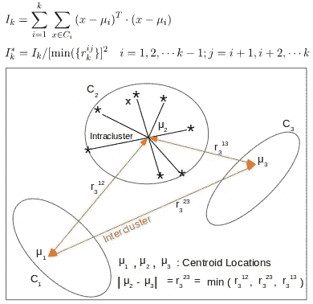
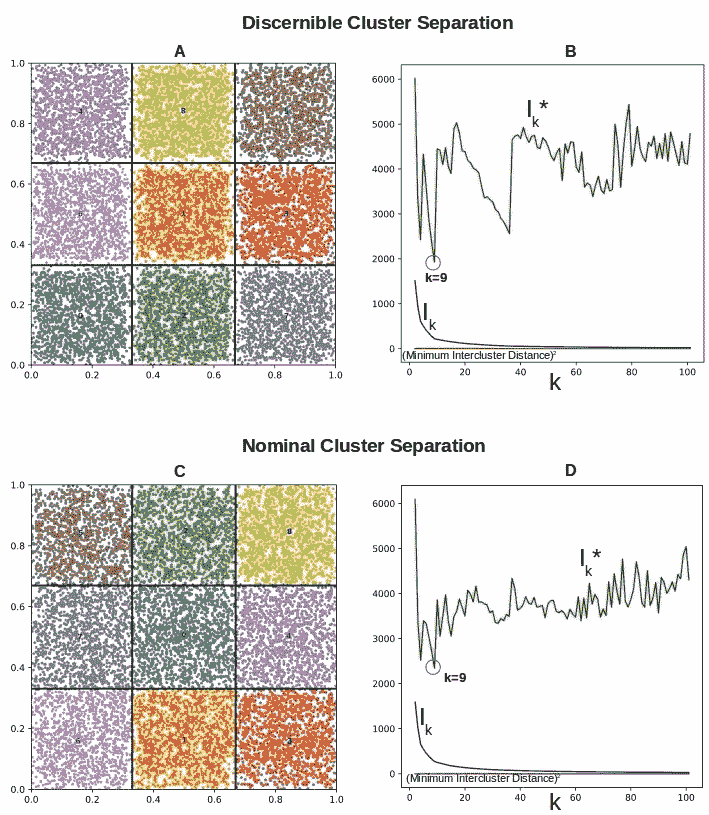
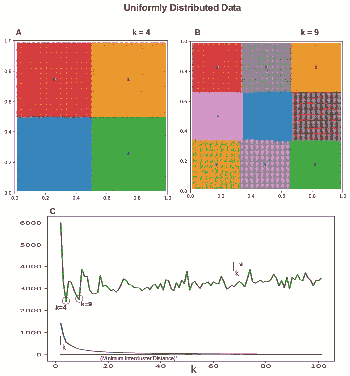

# 想要集群？你要几个？

> 原文：<https://towardsdatascience.com/want-clusters-how-many-will-you-have-8737f4ba9bf2?source=collection_archive---------18----------------------->

## K-Means 会给你你想要的所有聚类。惯性和最小簇间距离的比率似乎在最佳 K 处具有可检测的局部最小值

好吧，那是开玩笑，我道歉！但这是我们在开始分组工作之前应该问自己的问题。聚类取决于距离的概念。预期一个群集的成员到该群集的质心的距离*比到其他群集的质心的距离*更近。给定一些数据点，以及一种计算它们之间距离的方法，*似乎*计算机程序应该能够通过足够的数据处理来做到这一点。但是我们必须小心行事。假设这种练习是无监督的，则该算法没有关于数据在特征空间中如何分布的先验知识。但愿不会，如果数据是均匀分布的，那么就没有希望实现任何有意义的集群。或者更糟的是，我们将拥有与数据点数量一样多的聚类，而我们将一无所获。这里探讨的想法是检查数据本身是否能为我们指出一个可以指示最佳集群数量的指标。这正是这篇文章的重点。

我们在已知的集群中使用合成的数字向量，因此我们可以评估这种方法。我们坚持二维，因为我们希望可视化所获得的集群，并说服自己，它似乎是可行的。 [K-means](http://scikit-learn.org/stable/modules/generated/sklearn.cluster.KMeans.html#sklearn.cluster.KMeans) 在 [SciKit](http://jmlr.csail.mit.edu/papers/v12/pedregosa11a.html) 中的实现是这里所有模拟的驱动程序。这里所有模拟的源代码可以从 [github](https://github.com/ashokc/Choosing-the-Optimal-Number-of-Clusters-for-K-Means) 下载。

## 1.优化 K-means 中的 *K*

流行的 [K-means](http://scikit-learn.org/stable/modules/generated/sklearn.cluster.KMeans.html#sklearn.cluster.KMeans) 方法将 *n* 个数据点分成 *k* 个簇，其中 *k* 被指定为输入。K-means 通过要求最小化每个聚类中的数据点到该聚类的质心的距离的平方和来识别这些 *k* 聚类。利用 *C_i* 作为具有簇的*， *x* 作为该簇中的任何数据向量/点，并且 *μ_i* 作为该簇的质心向量/点，K-means 最小化由下式定义的 *k* 簇 *I_k* 的总惯性:*

Equation 1

图 1 用一个 3 集群的例子说明了这一点。K-means 正确地试图使 *k* 簇尽可能紧密，但是什么是 *k* 的最佳值是个问题。 *I_k* 等辅助信息能告诉我们我们的 *k* 是不是最好的吗？

Figure 1\. K-means minimizes the overall inertia *Ik* of the k clusters. For k = n, *Ik* would be the absolute minimum at zero. But that is of no value. *Ik** couples that criteria with maximizing the minimum intracluster separation. The k that minimizes *Ik** is likely the optimal k for k << n.

让我们考虑以下论点。

*   当 *k* 等于数据点 *n* 的数量时，每个数据点都是其自己的聚类，并且 *I_k* 将等于零——其最小可能值。所以很明显使 *I_k* 最小的 *k* 不是最优的 *k* 。

Equation 2

*   随着 k 的增加，星团间的距离将会减小。因此最小簇间距离的倒数将增加。用 *r_k^ij* 作为模拟 *k* 簇时簇 *i* 和簇 *j* 之间的距离，

Equation 3

结合等式 2 和 3，我们定义了新的度量 *I_k* *

Equation 4

因此，我们基本上使用簇间距离作为对 *I_k.* 的平衡，它们都随着 k 的增加而减少，但是根据模拟，它们的比率表现得更好，并且对于 *k < < n* 具有局部最小值。

> 让我们非常清楚，我们只是在谈论一个局部最小值，它可以通过从小 k 值到大 k 值的模拟来检测。随着 k 向着***n****数据点的总数增加，当每个数据点成为其自己的聚类时，将达到 **0** 的全局最小值。*

## *2.完美聚类的数据集*

*为了了解这一指标的用处，我们假设在二维空间中有 14400 个点，在一个 3x3 的网格中分成 9 个不同的簇。每个聚类有 1600 个点均匀分布在 40x40 的网格上。参见下面的图 2。*

**

*Figure 2\. K-means on perfectly clustered data with 9 actual clusters. (A -C). K-means will split the data into as many clusters as we ask it to. The dark grid lines show the actual separation boundaries. The numbers indicate the centroid locations of the clusters that K-means has found (D) Both the inertia and the minimum intercluster distance decrease as k increases (E) I_k* has a detectable minimum at k=9 that we can use to pick the right number of clusters (F) The inertia is driven to zero as k increases to 144000, whereas the intercluster distance reaches a constant value.*

*当我们运行 K-means 且 K*= 9 时，我们得到了正确的聚类识别，如图 2B 所示。图中的数字是质心的位置，正如我们的数据所示，它们正好在每个星团的中心。当 K-means 在图 2A 中以 *k* =5 运行时，它将真实聚类分成片段，甚至将它们与来自其他真实聚类的片段相结合，以识别它所找到的聚类。图 2C 显示了使用 *k* =23 运行 K-means 时的情况，我们看到数据以各种方式被拆分。**

**这里的要点是，K-means 会将数据分成您要求的任意多个聚类。但是图 2D 显示了度量 *I_k* *甚至在惯性 *I_k* 和最小集群间距离 *min{r_k^ij}* 随着 *k* 增加而稳定减小时也是如此。放大小的 *k* ，图 2E 显示我们确实在 *k=9* 有一个确定的局部最小值。还有其他局部最小值，但它们都更高。放大更大的 *k* ，图 2F 显示最小的簇间距离接近单个点的分离距离，而 *I_k* (因此 *I_k* *)下降到零。**

****

**Figure 3\. The internal structure of the clusters is not a barrier to detecting the optimal k as the k that minimizes *I_k****

**集群的性质没有什么特别之处，允许/不允许检测这个指标。上面的图 3 显示了一个类似的练习，其中数据以螺旋形式聚集，并且指标并未因此而变差，如图 3E 所示，其中当 k = 9 时，获得了 *I_k* *的清晰局部最小值。**

## **3.松散聚集的数据集**

**所以这对于完美的聚类数据集来说效果很好。对于聚类没有很好分离的数据，它将如何处理？让我们考虑一个和以前一样大小的数据集，但是在数据点的位置中加入了一些随机误差，所以聚类不是那么清晰。**

****

**Figure 4\. ( A-B). The clusters are visibly separable. *Ik** has a clear local minimum at k=9, that is 20% smaller than the nearest local minimum at k=4 (C-D) The cluster separation is blurred. *I_k** does show a local minimum at *k*=9, that is only about 7% smaller than the closest local minimum at k=4**

**在上面的 4A 图中，即使没有网格线的帮助，我们也能直观地分辨出星团。在图 4C 中没有这么多，我们在群集之间只看到一个细长的无数据区。我们让 K-means 在这里工作来检测这些集群。图 4B 和 4D 显示在两种情况下， *I_k** 在 *k* =9 处具有局部最小值。这个最小值在图 4B 中比在图 4D 中更明显。当然，考虑到后者的弥散群边界，这是可以预料的。**

## **4.统一的情况:没有集群**

**最后，我们看一下数据均匀分布的情况，这样就没有聚类了。但是我们知道，K-means 无论如何都会得出 *k* 簇。能否帮助我们发现这种情况，并得出数据不可聚类的结论？参见下面的图 5，我们在 120x120 的网格上均匀分布了 14400 个数据点。**

****

**Figure 5\. When the data is uniformly distributed, there are no real clusters. (A-B) K-means clusters with k=4 and k=9\. © The lack of clear local minima for *Ik** and the near constant nature of *Ik** is an indication of unclusterable data.**

**与图 2 至图 4 不同，图 4C 中的 *I_k* *的度量没有显示明显的局部最小值， *I_k* *在很大程度上不会随着 k 的增加而变化。对于较大的 *k* ，它最终会变为零，就像其他图中一样，但是对于*k<n*而言， *I_k* *比其他情况更平坦。这可能是决定底层数据没有聚集的线索。**

## **5.结论和后续步骤**

**这篇文章是我们真正想要得到的东西的先驱——即文本聚类。这里，我们建立了一个合理的标准来检测使用 K-means 时的最佳聚类数。证据是经验性的，我们没有证据证明它在所有情况下都有效，尤其是在有噪声的高维空间。文本是橡胶与长向量、上下文问题以及构建这些向量的任何方法相遇的地方。应该很有意思。**

***原载于 2018 年 11 月 5 日*[*【xplordat.com】*](http://xplordat.com/2018/09/27/word-embeddings-and-document-vectors-part-1-similarity/)*。***