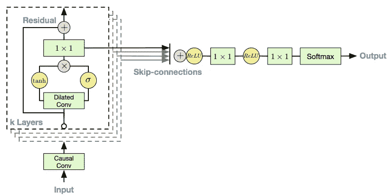
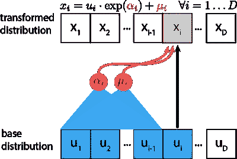
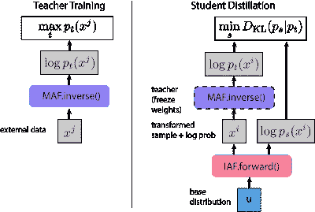

# WaveNet:谷歌助手的语音合成器。

> 原文：<https://towardsdatascience.com/wavenet-google-assistants-voice-synthesizer-a168e9af13b1?source=collection_archive---------1----------------------->

Sundar Pichai, CEO of Google, presents improvements in Google Assistant’s Voice after WaveNet at the I/O conference on May 8, 2018 in Mountain View, California.

> 有没有想过机器合成人类声音的可能性，听起来几乎像人类一样自然？WaveNet 使之成为可能。

# 语音合成。串联的。参数化。DL。

让机器合成类似人类的语音(文本到语音)的想法由来已久。在深度学习出现之前，有两种主要的方法来构建语音合成系统，即*拼接*和*参数化*。

*在拼接 TTS 中，其思想是从说话者那里收集一长串句子的语音记录，将这些记录分割成单元，并尝试将对应于新呈现文本的单元拼接起来，以产生其语音。*由拼接 TTS 产生的语音对于已经存在于原始收集的录音中的文本部分来说听起来很自然，但是对于以前没有见过的文本部分来说，听起来有点失真。除此之外，修改声音将需要我们在一个全新的录音集合上完成所有这些工作。*而在参数化 TTS 中，想法是使用参数化物理模型(本质上是函数)来模拟人类的声道，并使用记录的语音来调整这些参数。*参数化 TTS 合成的语音听起来比拼接 TTS 更不自然，但通过调整模型中的某些参数来修改语音更容易。

最近，随着 WaveNet 的到来，我们有可能以端到端的方式(从音频记录本身)生成原始音频样本，轻松修改语音，更重要的是，与现有方法相比，听起来明显更自然。这一切都要归功于深度学习的出现。

# WaveNet。为什么这么激动？

为了在 WaveNet 和现有的语音合成方法之间进行比较，进行了主观的 *5 级* *平均意见得分(MOS)测试*。在 MOS 测试中，向受试者(人类)呈现从任一语音合成系统生成的语音样本，并要求他们以五分制评分(1:差，2:差，3:一般，4:好，5:优秀)对语音样本的自然度进行评级。

Subjective 5-scale mean opinion scores of speech samples from LSTM-RNN-based statistical Parametric, HMM-driven unit selection Concatenative, and WaveNet-based speech synthesizers.

从条形图中可以清楚地看到，WaveNet 在 5 级 MOS 测试中获得了 4.0 以上的自然度，明显优于其他基线系统，非常接近真实的人类语音。务必在 [DeepMind 的博客](https://deepmind.com/blog/wavenet-generative-model-raw-audio/)上查看语音样本，以了解这些方法合成的语音在自然度上的差异！除了能够生成音频样本作为输出， *WaveNet 可以很容易地根据各种语音特征，如文本，说话人身份等，以产生符合我们要求的语音。这才是更令人兴奋的地方。*

# Wavenet。生成模型。

生成模型。那是什么？*给定一般的未标记数据点，生成模型试图学习什么概率分布生成那些数据点，目的是通过利用学习到的分布生成新的数据点(类似于输入数据点)。生成模型可以以不同的方式对概率分布建模，隐式地(具有易处理的或近似的密度)或显式地。*当我们说生成模型显式地模拟概率分布时，我们的意思是我们显式地定义概率分布，并尝试根据输入的未标记数据点来调整该分布。与此相反，隐式生成模型学习概率分布，该概率分布可以直接用于采样新的数据点，而不需要显式定义它。GANs(生成对抗网络)是目前深度学习的圣杯，属于隐式生成模型的范畴。*而 WaveNet 及其同类 Pixel CNN/RNNs 是显式生成模型。*

WaveNet 如何对概率分布进行显式建模？ *WaveNet 试图将数据流* ***X*** *的联合概率分布建模为流中每个元素* ***Xt*** *的逐元素条件分布的乘积。*因此对于一个原始音频波形 ***X = {X1，X2，X3 … XT}，*** 联合概率因式分解如下:

因此，每个音频样本 ***Xt*** 以所有先前时间步的样本为条件。这看起来是不是类似于时间序列预测模型，其中一个时间步长的观测值取决于之前时间步长的观测值(这就是我们试图使用这些条件分布项建模的内容)？*其实 WaveNet 是一个自回归模型。*

我们应该如何继续对这些条件分布项建模？作为强大的非线性序列模型，RNNs 或 LSTMs 是最明显的选择。实际上，像素 RNN 利用相同的想法来生成看起来类似于输入图像的合成图像。我们可以用这个想法来产生合成语音吗？语音采样频率至少为 16KHz，这意味着每秒钟至少有 16000 个样本。rnn 或 LSTMs 不能模拟如此长的(大约 10，000 个时间步长的)时间相关性，因为它们最多可以模拟 100 个时间步长的时间相关性，因此它们不太适合语音合成。 *此外，训练 rnn、LSTMs 将会非常慢，因为由于它们固有的顺序性质，它们不能被并行化。*我们可以用 CNN 来处理这个问题吗？等等，CNN？怎么会？类似于像素 CNN 中已经采用的想法。

# CNN。因果关系。扩张了。

我们为什么要尝试 CNN？*与 rnn 或 LSTMs 相比，CNN 通常训练得更快，尤其是当应用于长的 1-D 序列时，因为与掩模或滤波器的每个卷积位置相关的操作可以以并行和独立的方式执行。*更快的训练。听起来不错！自回归(一个时间步长的输出仅依赖于先前时间步长的输出，而不依赖于未来时间步长的输出)属性如何？这就是因果卷积发挥作用的地方。 *1-D 因果卷积可以通过用适当数量的零对要执行卷积的输入 1-D 序列进行左填充，然后执行有效的卷积来容易地实现。*与 RNNs 或 LSTMs 相比，因果卷积将允许我们对更长的时间依赖性进行建模(允许我们指定回看长度)。

Causal Convolutions to make sure that the *model cannot violate the ordering in which we model the data.*

太好了！我们已经轻松地解决了自回归违规。但是，如何管理数千个样本的订单的回顾长度呢(因此，我们的模型在得出关于当前时间步长的输出的结论之前，至少要回顾一秒钟的音频)？我想到的最简单的事情就是将滤波器的尺寸增加到足够大，以使回看长度适当，但这真的有帮助吗？在我看来，这样做将减少模型的非线性，这反过来将使我们的模型难以学习复杂的时间依赖性，从而限制我们模型的性能。你可能想到的下一件事是增加神经网络的层数。可能会有帮助。但是，这在计算上是不可行的，因为感受野的大小或输出中时间步长的回望长度随着模型中隐藏层的数量而线性增加，并且对于我们来说，具有几千个隐藏层的模型在计算上是不明智的。现在，我们不得不限制隐藏层的数量和过滤器的大小，同时增加回看长度？我们将如何着手做这件事？扩张的脑回会帮助我们。

*扩张卷积试图通过在大于其长度的区域上应用过滤器并以一定的步长跳过输入值来增加回望长度或感受野大小*。它相当于从原始滤波器通过用零扩展而得到的更大滤波器的卷积，但效率明显更高。在 WaveNet 中，多个扩大的卷积层一层一层堆叠起来，只有几层就有非常大的感受野。扩张因子的指数增加(加倍)导致感受野随深度的指数增长。

Stack of dilated causal convolutional layers: Doubling the dilation factor with each layer results in O(2^n) receptive field growth.

# Softmax 分布。Mu-law 压扩。

*为了对条件概率建模，WaveNet 采用 softmax(分类)分布而不是其他混合模型，因为分类分布更灵活，并且可以更容易地对任意分布建模，因为它不对它们的形状进行假设。*原始音频通常存储为一系列 16 位整数值(32，768 至 32，767)，使用 softmax 层输出概率分布将要求我们的模型在每个时间步长输出 65，535 个值。这不是会拖慢我们的模型吗？肯定会的。对此我们能做些什么？减少位深度在这里是可行的。如果我们继续使用线性位深度(除以 256 ),减少将对低振幅样本产生比高振幅样本更大的影响。假设一个 16 位样本的原始值为 32767，这是可能的最大正值。转换为 8 位后，样本值变为 127 (32767/256 = 127，余数为 255)，舍入误差为 255/32768。这是小于 1%的量化误差。但与最低幅度 16 位样本(0 至 255 之间)的误差相比。当减少到比特深度 8 时，它们都舍入到零，这是 100%的误差。*关键在于，对于线性位深度缩减方法，向下舍入对低振幅样本的影响比对高振幅样本的影响更大。*如果我们能够重新分配样本值，使得在较低幅度处有更多的量化级别，而在较高幅度处有更少的量化级别，则可以减少这种量化误差。这就是为什么在 WaveNet 中使用 Mu-law 压扩(一种非线性量化)而不是简单的线性量化。

Expression to carry out Mu-law companding results in a better (sounds similar to original audio) reconstructed output than linear quantization.

在上面的表达式中，1 < ***Xt*** < 1(从 32，768…32，767 到 1…1 重新采样的不同时间步长的音频采样)和= 255。*这将使模型在每个时间步只输出 256 个值，而不是 65，535 个值，从而加快训练和推理。*

# 门控激活。跳过和剩余连接。

非线性激活函数在任何深度学习模型中都是必不可少的，以学习输出和输入之间的复杂关系。 *RELU 最初在 WaveNet 中使用，但在进行实验后，发现具有 sigmoid 激活的非线性双曲正切门控(受 Pixel CNN 启发)更适合 WaveNet。*

Expression for gated activation function used in WaveNet.

在上面的表达式中， ***W*** 表示可学习的滤波器， ******* 表示卷积算子，圈起来的点表示逐元素的乘法。*剩余连接(将底层的输出添加到上层的输出)和跳过连接(将底层的输出直接添加到输出层)已被发现在减少神经网络的收敛时间和训练更深的网络方面是有用的。*因此，在 WaveNet 的架构中采用了它们，如下图所示。

WaveNet’s architecture: showing gated activation function, skip connections and residual connections.

# 调理。本地的。全球。

我们还没有讨论如何根据各种特征，如说话者身份、相应的文本等来调节输出语音。 *WaveNet 的输出语音可以以两种方式进行调节:全局调节，单个特征偏置所有时间步长的输出，如说话人身份或局部调节，具有多个特征，实际上是不同时间序列的特征，其偏置不同时间步长的输出，如语音的底层文本。*如果我们更正式地表达这一点，那么这将意味着在实际模型中的条件分布项中引入新的参数(局部调节中的 ***Ht*** 和全局调节中的 ***H*** )。

Modified conditional distribution term, after introduction of a conditioning input.

在局部调节中，调节输入的时间序列可能比音频的时间序列长度短，对于局部调节，要求两个时间序列的长度必须相同。*为了匹配长度，我们可以使用转置 CNN(一种可学习的上采样方案)或其他上采样方案来增加条件输入的长度。*

Expression after introduction of the bias term h.

在上面的表达式中， ***V*** 是可学习的线性投影，其本质上服务于两个目的:变换*以校正尺寸和学习用于偏置输出的正确权重。*

# *很棒的模型。快速训练。推理慢？*

*WaveNet 的架构，无论我们到目前为止谈论了什么，都很好地捕捉了复杂的时间依赖性和条件。除此之外，由于高度并行化，它在训练时真的很快。但是推论呢？*由于一个时间步长的输出依赖于前一个时间步长的输出，因此对新音频的采样本质上是连续的。*产生 1 秒钟的输出大约需要 1 分钟的 GPU 时间。如果谷歌在他们的助手上部署了这种模式，那么像“嘿，谷歌！天气怎么样？”。那他们是如何提高推断时间的呢？IAF 就是答案。*

# *使流量正常化。IAF。*

*正常化流程？*标准化流程是一系列转换，它学习从简单概率密度(如高斯分布)到丰富复杂分布的映射(双射)。*假设你从概率分布 ***q(z)*** 和概率分布 ***q(x)*** 中采样了足够多的点，那么可以使用归一化流来学习变换，该变换将从***【q(x)***中采样的点映射到其在分布 ***q(z)*** 中的对应映射。这是怎么做到的？让我们考虑一个变换 ***f*** ，一个可逆且平滑的映射。如果我们用这种映射来变换一个随机变量****【q(z)***，那么得到的随机变量***【z’*******= f(z)***有一个分布***【q(z’***:***

****

**为了直观地了解我们是如何得到这个变换后的随机变量分布的表达式的，请查看 Eric Jang 的博客文章。一次变身 ***f*** 够吗？*事实上，我们可以通过组合几个简单的变换，并连续应用上述表达式来构造任意复杂的密度。*通过一系列*变换 ***fk*** 连续变换一个随机变量*z0***Q0***得到的密度 ***qK(z)*** 为:****

****

**这些变换 ***fi 的*** 中的每一个都可以容易地使用矩阵乘法(具有可学习的值)来建模，之后是诸如 ReLU 的非线性。然后，想法是用您最喜欢的优化算法更新变换的可学习参数，通过在变换的概率分布 ***qK(z)下优化从***【q(x)***采样的点的似然性(对数似然性)。*** 这将使分布*与 ***q(x)*** 非常相似，从而学习从 ***q(z)*** 到 ***q(x)*** 的适当映射。***

****

**Distribution flows through a sequence of invertible transforms.**

**规范化流程的想法如何帮助我们进行快速推理？请记住，WaveNet 是一个生成模型，除了尝试学习会产生训练数据的概率分布之外什么也不做，因为它是一个显式定义的生成模型(具有易处理的密度)，所以我们可以很容易地学习一个变换，该变换可以将点从简单分布(如高斯分布)映射到 WaveNet 学习的复杂分类分布。如果学习到的标准化流程具有快速推理方案，那么我们在 WaveNet 中的慢速推理问题可以很容易地得到解决。IAF(逆自回归流)可以很好的适合这个思路。**

**在 IAF 中，想法是首先从***z∞Logistic(0，I)*** 中抽取随机样本，然后对抽取的样本应用以下变换，**

****

**A simple scale and shift transform on zt where scaling factor (s) and shifting factor (µ) are computed by using learnable parameters (θ) and values in input sample *z* from previous time-steps.**

**为了输出时间步长 ***xt*** 的正确分布，逆自回归流可以隐式地推断它在先前时间步长 ***x1，.。。，XT 1*基于噪声输入 ***z1，.。。，ZT 1***，允许其并行输出所有 ***xt*** 给定的 ***zt*** 。下图会让事情变得更清楚(注意变化的符号)。****

****

**In Inverse Autoregressive Flow, outputs at different time-steps can be computed in parallel because the output of a time-step isn’t dependent on the output of previous time steps.**

**太好了！IAF 具有快速推理方案(甚至可以并行计算易处理的条件概率)，但是它们训练起来较慢。为什么？因为如果给我们一个新的数据点，并要求我们评估密度，我们需要恢复*，这个过程本来就是连续的，速度很慢。并行 WaveNet 利用了这一事实，提出了使用简单 WaveNet(教师 WaveNet)训练 IAF(学生 WaveNet)的概念。***

# ***平行。更快。WaveNet。***

***在并行 WaveNet 中，想法是利用 IAF 具有快速推理方案的事实。因此，在第一阶段，我们训练出一个简单的 WaveNet 模型(我们称之为教师培训)。在第二阶段，我们冻结教师 WaveNet 的权重，并利用它来训练一个 IAF(学生蒸馏)。其思想是首先从***z∞Logistic(0，I)*** 中抽取一个随机样本，以并行方式通过 IAF。这将为我们提供转换分布的要点以及相关的条件概率。想法是在简单的教师波网上传递变换分布中的这个点，这将产生关于已经训练的教师波网的条件概率。然后，我们尝试最小化从任一模型接收的条件概率之间的 KL-散度。这将允许 IAF(学生 WaveNet)学习与其教师几乎相似的概率分布，并且结果验证了这一事实，因为从教师和学生 WaveNet 接收的输出之间的 5-标度 MOS 分数几乎可以忽略不计。***

****

**Parallel WaveNet’s training procedure.**

**这样部署够快吗？是的，它是。*事实上，它能够以超过实时 20 倍的速度生成语音样本。*但是还有一个问题，每次我们需要重新训练我们的模型时，我们会先训练老师的 WaveNet，然后再训练学生的 WaveNet。此外，学生 WaveNet 的表现在很大程度上取决于教师 WaveNet 的培训程度。但总的来说，去部署还是不错的。**

# **“空谈是廉价的。给我看看代码。”**

**在线上有许多简单 WaveNet 的实现。对于并行实现，我还没有找到一个。**

1.  **[在 Keras 中实施](https://github.com/usernaamee/keras-wavenet)**
2.  **[py torch 中的实现](https://github.com/r9y9/wavenet_vocoder)**
3.  **[tensor flow 中的实现](https://github.com/ibab/tensorflow-wavenet)(这是网上引用最多的一个)**

# **参考资料:**

1.  **[音频压缩扩展](http://digitalsoundandmusic.com/5-3-8-algorithms-for-audio-companding-and-compression/)。**
2.  **[NLP 任务中的卷积层](http://www.wildml.com/2015/11/understanding-convolutional-neural-networks-for-nlp/)。**
3.  **[扩张的脑回](https://arxiv.org/pdf/1511.07122.pdf)。**
4.  **规范流程:Eric Jang 的教程- [第 1 部分](https://blog.evjang.com/2018/01/nf1.html)，[第 2 部分](https://blog.evjang.com/2018/01/nf2.html)。[变分推理与规范化流程(论文)](https://arxiv.org/pdf/1505.05770.pdf)。**
5.  **[深度语音:实时神经文本到语音转换(Paper)](https://arxiv.org/pdf/1702.07825.pdf) :附录对于理解 WaveNet 相当有用。**
6.  **[wave net:raw 音频(纸张)的生成模型](https://arxiv.org/pdf/1609.03499.pdf)。**
7.  **P [平行波网:快速高保真语音合成(论文)](https://arxiv.org/pdf/1711.10433.pdf)。**
8.  **[PixelCNN，Wavenet &变分自动编码器—圣地亚哥 Pascual — UPC 2017。](https://www.youtube.com/watch?v=FeJT8ejgsL0)**