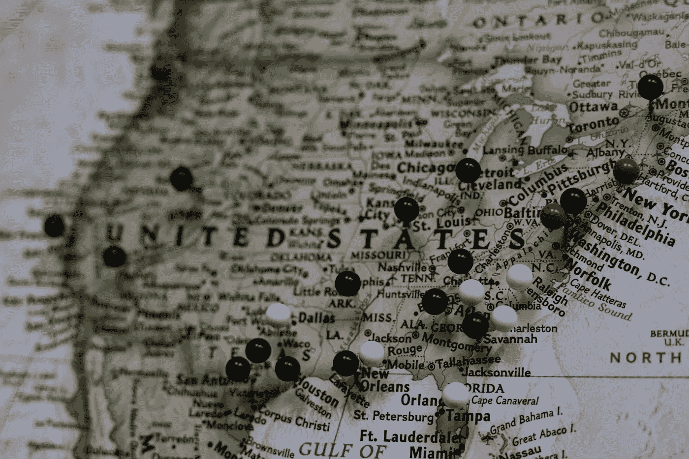
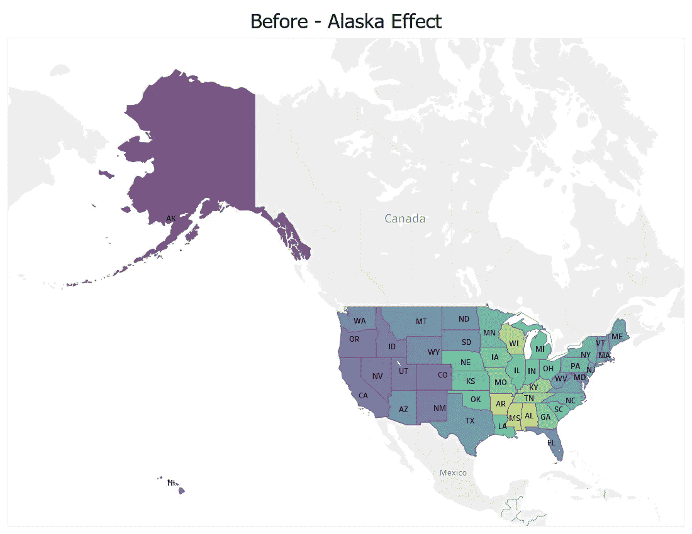
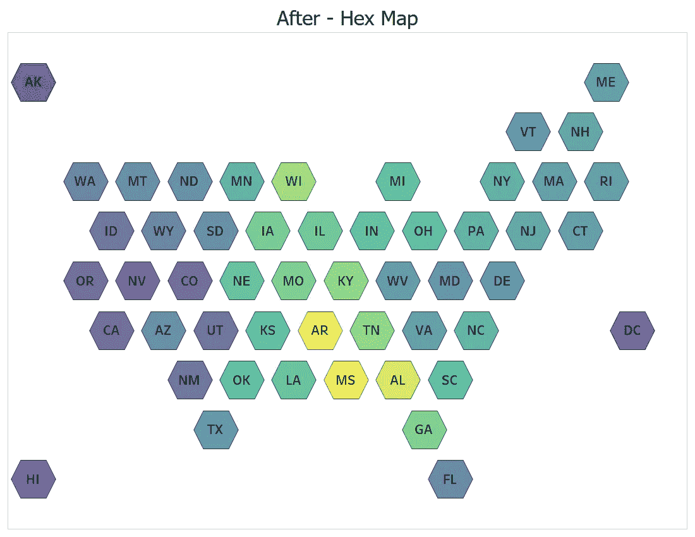
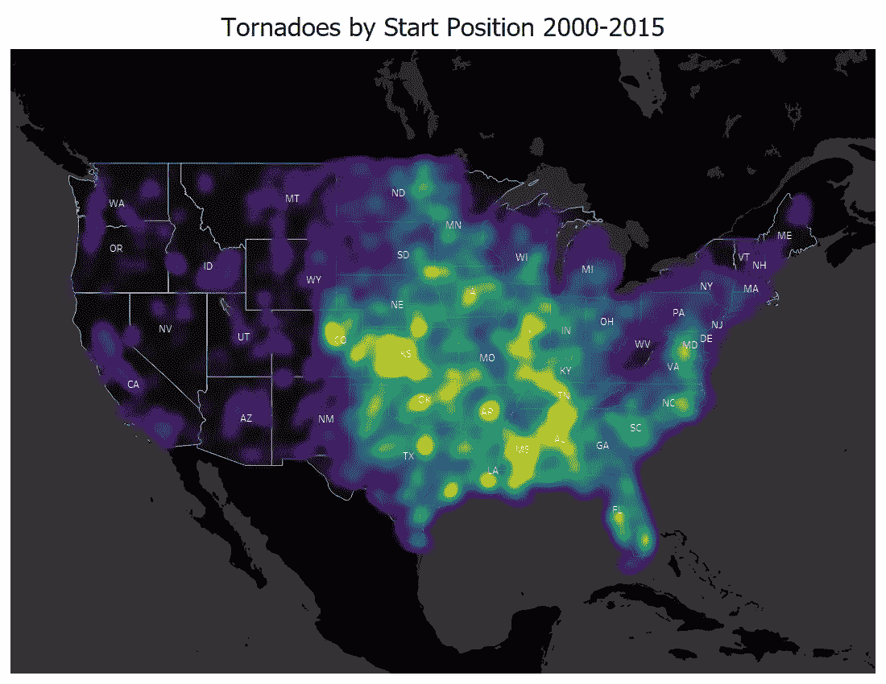

# 改善地图可视化的方法

> 原文：<https://towardsdatascience.com/ways-to-improve-a-map-visualization-ba3dc083b3cb?source=collection_archive---------10----------------------->

## 如何让地图可视化更上一层楼？

Photo by [Joey Csunyo](https://unsplash.com/photos/NwGMe-NuDm0?utm_source=unsplash&utm_medium=referral&utm_content=creditCopyText) on [Unsplash](https://unsplash.com/search/photos/united-states?utm_source=unsplash&utm_medium=referral&utm_content=creditCopyText)

首先，我将介绍为什么使用地图可视化数据通常会吸引观众的两个原因。然后，我将介绍三个技巧，帮助您在构建地图可视化时从优秀过渡到卓越。

# 为什么要使用地图进行数据可视化？

**它将为你的数据提供重要的背景。**

让我们从一个假设的场景开始。这是你工作的第一周，你的任务是向公司老板汇报每月的销售业绩。财务部的罗恩会把数据发给你，你会把一些幻灯片放在一起。应该是小菜一碟。如果你打开数据文件，只有一个数字呢？

就我个人而言，我希望财务部的罗恩对新员工开了一个有趣的玩笑。你知道我要去哪里吗？数据需要上下文才能为受众提供价值。销售额与上月相比是上升还是下降？谁是我们的顶级销售代表？销售收入如何与利润挂钩？不管你公司的老板有多好——如果这是你在会议上唯一带去的东西，那很可能不会有好结果。

还记得那些 [**五个 w**](https://en.wikipedia.org/wiki/Five_Ws#cite_note-3)吗？谁，什么，**哪里**，什么时候，为什么。这个列表是为了帮助记者们在构思故事之前弄清楚一个主题的重要背景。它之所以有效，是因为它们也是观众想知道的东西。从这个意义上说，做记者和用数据交流没有太大区别。在您构思数据故事之前，请尝试在地图上绘制数据。这样可以快速求解出**在哪里**。

从年轻时开始，我们都接触过地理概念。

数据可视化设计师 Ryan Sleeper 在他的书《实用的 Tableau》中写道，“地图的力量来自于它们固有的利用用户多年来构建的模式的能力。”

这是一个巨大的优势，因为观众可以快速理解地图可视化。理解可视化设计的努力越少，就越能专注于可视化中的数据所表达的内容。你解码第一张图片和第二张图片需要多长时间？

Visualization: Shelby Temple, made with Tableau; data: Tableau Sample Superstore

Visualization: Shelby Temple, made with Tableau; data: Tableau Sample Superstore

将地理学引入数据可视化还有很多原因，但我认为这足以证明这种类型的可视化有显著的优势。如前所述，让我们来看看如何让地图可视化更上一层楼的一些技巧。

# **1。使用绿色或岩浆色**

当选择数据可视化的颜色时，我注意到人们经常选择最吸引他们的颜色。不幸的是，这不是最好的方法——因为对你有吸引力的可能对其他人没有吸引力。

数据可视化需要有最能引起观众共鸣的颜色。此外，它应该导致快速和准确的决策。使用某些调色板(如 Jet，Python 包 Matplotlib 的旧默认调色板)会导致决策速度变慢且不准确。

不用担心，Nathaniel Smith 和 Stefan van der Walt 已经创建了开放源代码调色板，这些调色板丰富多彩，漂亮，可供色盲观众使用，现在研究支持成为快速准确决策的有效调色板。

Visualization: Shelby Temple, made with Tableau; Inspired by work of Jacob Olsufka; Data: Temperature data from MarkieAnn Packer

Jet 的缺点是在感觉上不一致或对色盲不友好。根据颜色范围加热，容易洗掉。

如果你想了解更多关于色彩理论和绿色的发展，这个来自创作者的视频 既有娱乐性又有知识性。

此外，这里是 [**的一篇文章**](https://idl.cs.washington.edu/files/2018-QuantitativeColor-CHI.pdf) ，Viridis 与其他常见调色板进行了测试，在速度和决策准确性方面表现良好。

快速感谢 Ben Jones，他的 [**Tweet**](https://twitter.com/dataremixed/status/1001866224081367045?lang=en) 最初引起了我对这些调色板的注意。

# **2。使用六边形瓷砖网格图**

Hex 平铺网格地图是最近创建的，作为对平铺网格地图的改进。创建平铺网格地图是为了处理一些问题，例如试图创建一幅美国与阿拉斯加和罗德岛的地图。阿拉斯加需要太多的视觉地产，而罗德岛经常迷路。在这里，我画出了各州平均龙卷风路径长度。

Visualization: Shelby Temple, made with Tableau; data: [https://www.ncdc.noaa.gov/stormevents/](https://www.ncdc.noaa.gov/stormevents/)

Visualization: Shelby Temple, made with Tableau; Inspired by work of Matt Chambers; data: [https://www.ncdc.noaa.gov/stormevents/](https://www.ncdc.noaa.gov/stormevents/)

这些地图很像美国的参议院，每个地区都有平等的(视觉)代表。罗德岛现在和阿拉斯加一样大，但是这个位置仍然让观众明白他们正在看美国的可视化地图。

六边形栅格地图通过允许相同距离的更多相邻形状而改进了平铺地图。距正方形瓷砖中心的距离仅在上、下、左和右是相同的。对角方块的中心距离更远。在六边形栅格地图中，您可以将更多的图块放在一起，从而提高地图的方向准确性。

我通过 Matt Chambers ( [**，他在 Tableau**](https://www.sirvizalot.com/2015/11/hex-tile-maps-in-tableau.html) )到 2015 年在 NPR 从事数据新闻工作的 Danny DeBellus、Alyson Hurt 和 Brian Boyer，追踪了作为数据可视化的 hex grid map 的创建。这里是 [**那条**](http://blog.apps.npr.org/2015/05/11/hex-tile-maps.html) 。

# **3。去掉边框，增加密度**

国家、州、城市和邮政编码非常有用，因为它们提供了一种一致的分层方式来按地理位置浏览数据。

然而，许多空间现象并不局限于这些人为的边界。一个入室抢劫犯会不会走到一个邮政编码的边界，耸耸肩，然后说，“哎呀！我猜是时候转身了。”—可能不会。

像强盗一样，龙卷风也不在乎邮政编码。这使得它成为密度热图的绝佳候选。

Visualization: Shelby Temple, made with Tableau; data: [https://www.ncdc.noaa.gov/stormevents/](https://www.ncdc.noaa.gov/stormevents/)

密度图通过聚类来可视化数据。这允许对任何新兴模式的真正理解，因为它们不局限于想象中的人为边界。

我看到这个问题发生的一个常见例子是按州查看数据。圣路易斯位于伊利诺伊州和密苏里州的交界处。按州查看您的数据会将这个大都市切成两半，该区域的任何模式或趋势都可能丢失。

# 结论

这些是我最喜欢的改进地图的方法。如果你正在寻找更多，我建议检查一下****[**使用距离或半径过滤器**](https://medium.com/data-distilled/easy-radius-maps-in-tableau-a13b6f17471f) 和 [**归一化人口数据**](https://www.ryansleeper.com/how-to-turn-data-normalization-on-off-tableau/) 。****

****留给你最后一张可以欣赏的地图！****