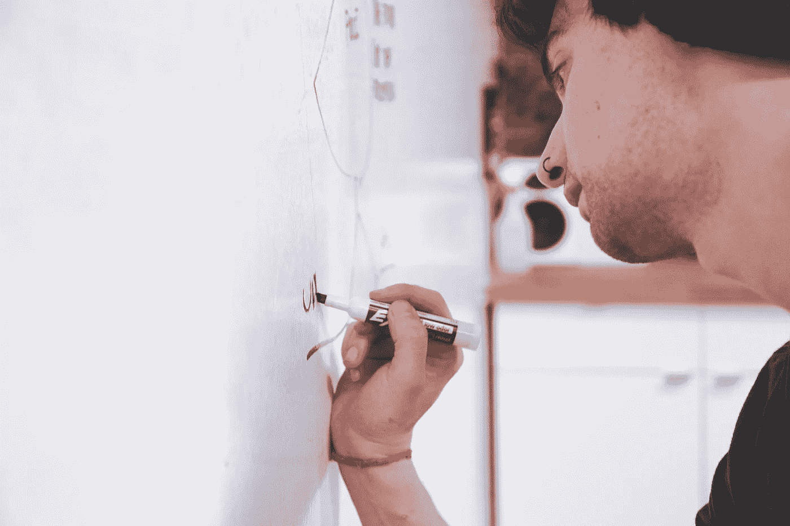

# “…我们已经不在堪萨斯了”——采访中的挣扎

> 原文：<https://towardsdatascience.com/we-arent-in-kansas-anymore-interviewing-struggles-f036d4a9fc9a?source=collection_archive---------5----------------------->

欢迎回来！这是我如何从地球科学职业转向数据科学系列的第五篇。

读者现在应该对我为你的第一份数据科学工作找工作的方法和哲学有了一个坚实的理解。现在，让我们进入“典型的”数据科学面试的面试准备和形式部分。

你应该知道如何申请，如何让你的名字出现在简历上。希望你在几个公司的系统中有一些推荐。很快，你就要参加面试了。开始准备面试永远不会太早。

与石油和天然气行业相比，面试“技术”行业中需要任何编码技能的技术职位是一件非常不同的事情。

例如，对于我在(超级)大型石油公司的职位，流程包括:

1.  校园面试——技术和软技能，以确保我在基础知识上是坚定的，并有逻辑思维流程
2.  现场面试—包括技术部分和软技能部分。还要求我提交论文。
3.  报价阶段/谈判

数据科学相关职位的面试通常有 4-5 个步骤:

1.  人力资源电话筛选——这基本上是为了验证你是否适合这个职位。它本质上不应该是技术性的，但要准备好谈论你以前的工作与数据科学的关系。对我来说，这通常包括描述我在石油和天然气领域帮助支持的地质统计模型，以及这些模型与手头角色的关系。这些通常是简短的谈话，平均 30 分钟左右。
2.  技术电话筛选——通常由招聘经理或高级个人贡献者进行。这可以有一个技术编码部分(通过在线界面或口头)，技术建模部分(方法，解释等)。)和商业敏锐度组件(解决问题的方法、KPI 等)。).这些可能长达(或超过)一小时。有时候你也会得到一个很傻的脑筋急转弯来“热身”。
3.  案例研究/项目(可选。)—为了进一步建立技能，许多(但不是全部)公司会给出一个简短的案例研究或项目，要求候选人展示他们拥有的技能和能够完成的事情。这可能需要一些时间，取决于你的分析有多深入，以及你的编码能力有多强。有时你要在一定的时间内交上来并被评分，有时你要在现场面试中展示你的发现。
4.  现场面试——类似于其他行业的面试，通常是半天到一整天(通常，但不总是)的午餐时间。包括编码块(在“可怕的”白板上)、机器学习原理、软技能、逻辑谜题、工作流程和业务问题/敏锐度。
5.  报价阶段/谈判

对于经验丰富的专业人士来说，前三个阶段通常很容易准备。它们与其他行业和职业非常相似。请注意，你必须详细解释支持你的项目的职责，而且电话那头的人可能对石油和天然气行业的内部运作一无所知*。*

让招聘人员或招聘经理不知道你的职业会对你有利。请详细解释你和你的家人或朋友一起做的事情，他们都不在能源行业。我发现向他人扩展我们的谋生知识真的很有趣。见鬼，考虑到这个博客系列的创建，我仍然从谈论它中获得快乐！

出于不同的原因，第 4 和第 5 阶段对我们来说是摆脱石油和天然气的棘手阶段。

我将从简单的第五阶段开始。

要约和谈判对任何求职者来说都是困难的。你真的想获得你的第一份数据科学工作，我们大多数人也需要进行现实检查。 ***石油天然气行业涨工资*** 。我已经说过了，这并不是说你再也挣不到你曾经挣过的工资，但很可能不会是你的 ***第一*** 数据科学职位。

我个人转向数据科学是为了更好的生活质量和解决有趣的问题。在我优先考虑的事情中，基本工资排在后面。如果薪水是你最想要/最需要的，你可能会失望。

很多时候，你会被追问在前任雇主那里挣了多少钱。转移，转移，转移！在美国，法律不要求你提供这些信息，你以前的雇主也不能透露。

我总是全面地看待每个机会，这真的取决于工作要求和责任，以及我对公司的价值。如果角色和职责很重要，我会拿较低的薪水，但是，不太重要的职责，过高的薪水可能会通过。

谈判更难建议。有些公司的基本工资有很大的浮动空间，有些则没有。意识到这一点，如果这是一份梦寐以求的工作，而且薪水很低，就协商其他事情。假期、职称、奖金和晋升时间表都可以商量。发挥创造力，从他人那里获得关于如何进入谈判阶段的想法。

最难准备的阶段是 ***阶段 4*** 。

现场面试。*在软件工程领域(特别是破解编码面试)已经有了一本书又一本书，老实说，许多数据科学面试在编码方面与软件工程面试没有太大区别。*

*不要缩短准备现场面试的时间。在网上练习，和当地小组一起练习(如果有的话)，练习，练习，再练习！*

**

*转向数据科学的地球科学家应该将他们的努力集中在三个基本领域*:**

1.  **编码实践——实践常见的算法和技术，动态地改进您的代码。不要在面试中一开始就找到最佳解决方案。总是从你的 MVP(最小可行产品)代码开始，并在时间允许的情况下进行优化。让面试官带你走向优化。**
2.  **谜题练习——不管你喜不喜欢，许多公司仍然喜欢猜谜语。"加利福尼亚州有多少个斯博克岛？"这些都是愚蠢的问题，但是旨在让你在处理问题时更有逻辑。这就像一个面试官递给我们一块石头，在告诉他们这是一块花岗岩之前，解释一下你看到了什么。“我看到钾长石、石英和黑云母。它是一种长英质侵入火成岩，具有明显的结构。我推断它最有可能是花岗岩。”好吧，用这个类似的逻辑来解释这个谜语。**
3.  **概率和统计——练习基本的 101 级概率和统计。包括贝叶斯定理、组合学、回归、常见的机器学习算法(决策树、森林、SVM、NLP、神经网络)。你不需要成为机器学习的大师，但是要知道每种算法的基本功能，以及在面试阶段什么时候使用它们*。***

***我很幸运有我的激励社区通过模拟面试来帮助准备面试过程。我鼓励其他人找到当地的小组或创建他们来帮助练习面试策略。***

***最后一个小贴士是做好“失败”的准备。你不会每次面试都成功，也不会每次现场都表现出色。我经历了惨痛的教训。***

***拒绝是 ***硬*** 。***

**找工作就像约会。你在讨好潜在的雇主，因为他们和你在一起。有时候事情并不顺利…**

**你认为你已经搞定了，但还是被拒绝了。你可能认为你悲惨地失败了，然而却被置于谈判阶段。只要你对事物保持幽默感，并坚持不懈，你会找到一个适合你职业抱负的人。**

**就我个人而言，为我的第一份数据科学工作找到最合适的角色比我预期的要长。我一路上跌跌撞撞，受了点伤。然而，我确实获得了一个很好的机会。其中，我将在我的旅程的下一集描述。**

**在我的职业支点系列中补上或回顾以前的条目:[为什么地球科学家成为优秀的数据科学家](https://medium.com/towards-data-science/career-change-wait-what-3c687f05fc49)、[填补知识空白](https://medium.com/towards-data-science/galvanizing-my-skills-a4b4d1175cb4)、[构建求职框架](https://medium.com/towards-data-science/framing-the-hunt-913f9a0eae6a)和[解读工作描述](https://medium.com/towards-data-science/job-postings-a-riddle-86f77ac610d5)。**

**继续第 6-8 集，[为什么咨询](https://medium.com/@stefbernosky/consulting-why-consulting-b8a22243ff89)，[我的第一个咨询项目](https://medium.com/towards-data-science/consulting-trial-by-fire-c33a24e65a59)和[寻找未经加工的钻石](https://medium.com/@stefbernosky/diamonds-in-the-rough-call-to-action-90c01e0952ed)。**