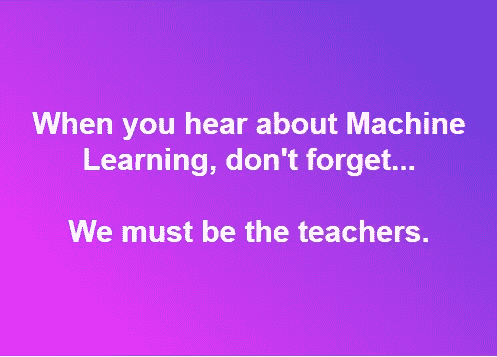

# 我们必须是老师

> 原文：<https://towardsdatascience.com/we-must-be-the-teachers-e6baaf9dd02a?source=collection_archive---------7----------------------->

“机器学习是人工智能(AI)的一种应用，它为系统提供了自动学习和根据经验改进的能力，而无需显式编程。”~ [什么是机器学习？](http://www.expertsystem.com/machine-learning-definition/)

关于机器学习，以及它有望提供超出编程范围的洞察力，人们既兴奋又有些担忧。特别是当结合今天可用的海量数据时，人们预计人工智能将最终提供大数据长期以来承诺的好处。

但是许多想使用机器学习的人误解了它的优点和缺点。在与许多人谈论机器学习在当前状态和过去更有限的技术中的前景、危险和失败时，我想起了阿瑟·c·克拉克的名言，“任何足够先进的技术都与魔法没有区别。”

作为人类，我们倾向于用魔法来看待无法解释的事情。但是，尽管它很复杂，机器学习不是魔法，这样对待它将大大降低它实现承诺的机会。它可以用来检测趋势和相关性，但它不能挥舞魔杖，召唤出我们认为理所当然的数据关系和隐含意义。

如果我们抛弃 AI 是魔法的想法，我们可以开始将机器学习视为与其他类似过程相关的过程。当我们想让我们的孩子学习时，我们不会简单地把他们留在图书馆里，然后抱最好的希望。我们引导他们找到最合适的资源。我们纠正他们的错误。我们回答他们的问题，并提出我们自己的问题来激发他们的思考。我们是他们的老师。

简而言之，如果我们想了解如何最好地完成机器学习，我们需要了解教育策略。虽然机器的学习方式与儿童不完全相同，但也有相似之处。我们应该注意两者的相同点和不同点来指导我们的机器教学。

孩子们的优势在于，他们可以通过与父母、老师和同龄人之间越来越复杂的反馈回路进行学习。我们不能用机器复制这一点，但我们可以提供反馈。IBM Watson 并不是通过被灌输一本百科全书而学会在《危险边缘》中获胜的，尽管毫无疑问它被灌输了很多。它通过输入问题并纠正答案来学习。

我们不能简单地把数据转储进去，然后希望建立正确的连接。我们需要投入更少的资金，尝试我们希望得到答案的问题，并给出反馈。在《国王和我》中，安娜唱道“……如果你成为一名教师。你的学生会教你。”正是如此，当我们从人工智能那里得到答案时，我们必须学会如何提出问题来引出我们想要的答案，以及我们需要向系统提供哪些额外的信息，以便它可以回答我们可能会问的各种问题。

机器在快速吸收大量数据的能力方面具有优势，这既带来了机遇，也带来了威胁。对于孩子，我们有时间去识别他们什么时候会朝着一个意想不到的、不受欢迎的方向发展。对于机器来说，如果学到了错误的教训，不重新开始就很难忘记它们。

这给我们带来了我们必须教给孩子和机器的最重要的一课。我们不能假设学习会灌输价值观。当人工智能被灌输了大量的社交媒体内容时，它首先学到的一些东西是种族主义和不容忍。虽然你可能不认为你的公司的数据集会朝着这个方向发展，但它们很可能会比你想象的更黑暗。

让我们假设你的公司是一个利润驱动的企业。理论上，这意味着所做的决策应该完全由最小化成本、最大化利润和支持底线的动机驱动。但是除了在最极端的情况下，人们会考虑很多其他因素。他们权衡客户的良好意愿、员工的福祉以及某项决策的社会影响。他们有价值观，这些价值观以成千上万种大大小小的方式与底线相平衡。

但是机器就像孩子一样，只学习教给他们的东西。如果你的人工智能每次回答一个问题时都向它提供反馈，但你的唯一标准是它是否实现了利润最大化，那么如果它后来提出了令人震惊的建议，不要感到惊讶。您必须构建数据来支持基于价值的决策，并鼓励对这些决策进行加权。

举个简单的例子，如果你不提供任何关于不同产品类型的环境影响(例如，包装或能源使用)的数据，人工智能就无法在决策中权衡这些因素。同样，如果当人工智能推荐环保选择时，你不提供虚拟的赞美，它就不会学会重视这些选择。

机器学习不是魔法。虽然它可能会提供你从来没有考虑过的精彩想法和见解，但它只能与输入和价值观以及它所学到的教训一起工作。我们必须是老师。认真对待你在指导和教授你的人工智能中的角色，就像对待孩子一样，当它显示出你灌输的智慧、知识和价值观时，你的回报就会到来。