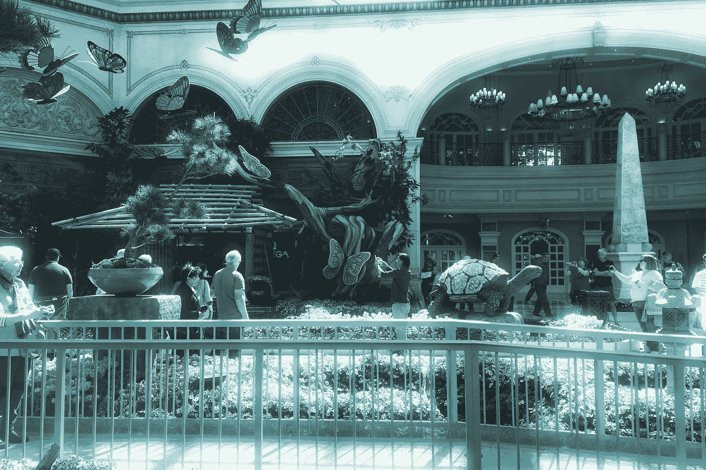

# 每周精选

> 原文：<https://towardsdatascience.com/weekly-selection-49ce988c7ee7?source=collection_archive---------7----------------------->

# [ResNet 及其变体概述](https://medium.com/towards-data-science/an-overview-of-resnet-and-its-variants-5281e2f56035)

由[冯文森](https://medium.com/u/37179d64771?source=post_page-----49ce988c7ee7--------------------------------) — 11 分钟阅读。

在 AlexNet [1]在 LSVRC2012 分类大赛上取得辉煌胜利之后，deep Residual Network [2]可以说是过去几年中计算机视觉/深度学习社区中最具开创性的工作。

# [我对当今优秀数据科学家的两点看法？](https://medium.com/towards-data-science/my-two-cents-on-what-makes-a-good-data-scientist-nowadays-fea67931766a)

通过 [Dat Tran](https://medium.com/u/4ff6d2f67626?source=post_page-----49ce988c7ee7--------------------------------) — 6 分钟读取。

我的父母最近问我，我为了重新生活做些什么。过去，这并不容易解释，因为数据科学不是一个定义明确的领域。甚至当我在埃森哲开始我的第一份工作时，我几乎不知道我到底在做什么。当然有一些定义，比如:

# [用机器学习预测逻辑的歌词](https://medium.com/towards-data-science/predicting-logics-lyrics-with-machine-learning-9e42aff63730)

由汉斯·卡明 — 9 分钟读完。

这个实现的关键是创建一个[二元模型](https://en.wikipedia.org/wiki/Bigram) [马尔可夫链](https://en.wikipedia.org/wiki/Markov_chain)来表示英语。更具体地说，我们的链将是一个 dictionary 对象，其中每个键都是一个惟一的元组，由一个单词及其后面的单词组成。

# [构建贝叶斯深度学习分类器](https://medium.com/towards-data-science/building-a-bayesian-deep-learning-classifier-ece1845bc09)

由[凯尔·多尔曼](https://medium.com/u/c07ddc3ee501?source=post_page-----49ce988c7ee7--------------------------------) — 19 分钟读完。

在这篇博客文章中，我将教你如何使用 [Keras](https://keras.io/) 和 [tensorflow](https://www.tensorflow.org/) 来训练贝叶斯深度学习分类器。

# [使用 TensorFlow 进行基因组变异调用的简单卷积神经网络](https://medium.com/towards-data-science/simple-convolution-neural-network-for-genomic-variant-calling-with-tensorflow-c085dbc2026f)

由[杰森钦](https://medium.com/u/13664b3c6869?source=post_page-----49ce988c7ee7--------------------------------) — 10 分钟阅读。

毫无疑问，使用深度神经网络的最新进展的快速发展已经改变了我们可以解决从图像识别到基因组学的各种问题的方式。

# [最佳书架:用 D3.js 改编真实世界对象的数据可视化](https://medium.com/towards-data-science/best-bookshelf-data-visualization-adapting-real-world-objects-with-d3-js-ca420b5d79cc)

到[谭永金](https://medium.com/u/2a6e12b11852?source=post_page-----49ce988c7ee7--------------------------------) — 8 分钟读完。

当你听到“数据可视化”时，第一个想到的视觉形式是什么？条形图还是折线图？一些更奇特的东西，比如热图或者定向网络？

# [这是玉米卷吗？自定义视觉的机器学习实验](https://medium.com/towards-data-science/is-this-a-taco-a-machine-learning-experiment-with-custom-vision-d33291a36b9c)

通过 [Elisha Terada](https://medium.com/u/3f67ef3dbd99?source=post_page-----49ce988c7ee7--------------------------------) — 5 分钟阅读。

想知道如何获得机器学习(ML)吗？那么，现在你可以通过云端提供的机器学习服务，称为功能即服务(FaaS)。

# [黄画的蒙特利尔:神经风格网络](https://medium.com/towards-data-science/montreal-painted-by-huang-gongwang-neural-style-networks-ec1697b2ac54)

由 Gabriel Tseng — 6 分钟读取。

最近，CNN([卷积神经网络](https://www.wikiwand.com/en/Convolutional_neural_network))的一个非常酷的应用是设计神经网络；这些包括分离一个图像的风格，另一个图像的内容，并把它们结合起来。

# [机器学习在让 EHR 物有所值中的作用](https://medium.com/towards-data-science/the-role-of-machine-learning-in-making-ehrs-worth-it-3d22ece8ede5)

伦纳德·达沃利奥博士——5 分钟阅读。

华尔街日报发表的一篇名为“关掉电脑，倾听病人的声音”的专栏文章将一个关键的医疗保健问题推到了全国讨论的前沿

# [深度神经网络能作曲吗？](https://medium.com/towards-data-science/can-a-deep-neural-network-compose-music-f89b6ba4978d)

由[贾斯汀·斯韦利亚托](https://medium.com/u/cb871ad67ac7?source=post_page-----49ce988c7ee7--------------------------------) — 9 分钟阅读。

当我去年九月开始读研时，我想尽快投入到深度学习的热潮中。

# [关于神经网络和深度学习](https://medium.com/towards-data-science/about-neural-networks-and-deep-learning-8615fe366e37)

由 Pranjal Srivastava — 19 分钟阅读。

现代计算机的数字运算和数据处理能力令人惊叹。但是，如果我告诉你，与人脑相比，这些都不算什么呢？

# [释放流程挖掘的价值](https://medium.com/towards-data-science/unleash-the-value-of-process-mining-4e3b5af4e9d8)

托马斯·菲拉雷(Thomas Filaire)—10 分钟阅读。

本文的目的是向读者介绍**流程挖掘**，这是一种创新的分析方法**以客观和详尽的方式**了解任何流程。