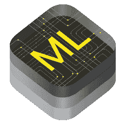

# 欢迎核心 ML

> 原文：<https://towardsdatascience.com/welcoming-core-ml-8ba325227a28?source=collection_archive---------3----------------------->

在 WWDC17 主题演讲之后，我的朋友 Aleph 和我对新的核心 ML 框架感到非常兴奋。然后我们开始四处玩耍，并决定分享一些我们在这里做的事情。

借助 **Core ML** ，您可以为您的应用提供机器学习功能，该功能可在本地运行并针对设备性能进行优化，从而最大限度地减少内存占用和功耗。

核心 ML 支持许多机器学习模型(神经网络、树集成、支持向量机和广义线性模型)。模型应该是核心 ML 模型格式(具有. ML model 文件扩展名的模型) *1* 。

在我们的例子中，我们将使用一个著名的模型 [VGG16](https://arxiv.org/abs/1409.1556) ，它用于对图像进行分类，幸运的是，它是 [Core ML](https://developer.apple.com/machine-learning/) 中可用的预训练模型之一。

⚠️ **重要**:如果你真的想实现一个计算机视觉应用，也许你应该检查一下新的[视觉框架](https://developer.apple.com/documentation/vision)。在这篇文章中，我们想展示的是，你可以如何轻松地使用预训练模型，通过机器学习使你的应用程序更加强大。

# 下载模型

在我们的示例中，我们将使用。 *mlmodel* 格式。然而，如果你在一个不同的框架中训练你的模型，比如 Keras，你可以使用 [Core ML Tools](https://pypi.python.org/pypi/coremltools) 将其转换成合适的格式。关于我们的教程，你可以在这里下载 VGG 模型。

下载完“VGG16.mlmodel”文件后，只需将它放在文件旁边，就可以将其添加到项目中。

# 应用程序设置

我们将在示例中创建的应用程序非常简单，因此每个人都可以跟着做。如果你想看一些不那么简单的东西，看看 [Aleph](https://github.com/alaphao) 的[这个回购](https://github.com/alaphao/CoreMLExample)。

我们的应用程序将有一个图像视图，显示要分类的图像，一个用户可以点击以选择另一张图片的栏按钮，以及一个显示模型给出的分类的标签。

当用户点击“+”按钮时，我们呈现一个带有“库”和“相机”选项的动作表。选择其中之一后，图像拾取控制器出现。

图像拾取器委托方法非常简单。在“didCancel”中，我们简单地称之为“dissolve()”。在“didFinishWithMediaType”中，我们从“info”字典中获取图像，并将其传递给我们的“classify(image: UIImage)”方法。

# 预处理

首先，我们需要缩放图像，因为我们的模型接收的输入必须是 224x224。调整大小后，我们需要从图像数据中创建一个“CVPixelBuffer”。“CVPixelBuffer”是我们的模型期望作为参数的类型。

# “核心 ML”部分

一旦我们在“CVPixelBuffer”中有了图像数据，我们就可以将它传递给我们的模型，代码再简单不过了。

为了做到这一点，我们将在“viewDidLoad()”中创建我们的“VGG16”模型，并且在我们的“classify()”方法中，我们需要做的就是在我们的模型上调用“prediction()”。该方法将返回一个“VGG16Output ”,从中可以获取一个字符串形式的“classLabel”属性。

# 最后

嗯，正如你所看到的，核心 ML 框架是一个非常强大和易于使用的工具，使我们的应用程序更加智能。你可以想到所有疯狂的想法，自然语言处理，计算机视觉和其他惊人的领域可以让你的应用程序做到这一点。

如果你有任何建议，请告诉我们。

另外，如果你想分享你是如何计划在你的应用中使用 Core ML 的，我们很高兴听到你的想法！

1 参见[将核心 ML 模型集成到您的应用中](https://developer.apple.com/documentation/coreml/integrating_a_core_ml_model_into_your_app)

很快会有一个关于这个的帖子！WWDC 现在很疯狂，所以当我们有时间一起玩 keras 和 Core ML 时，我们肯定会在这里分享结果。