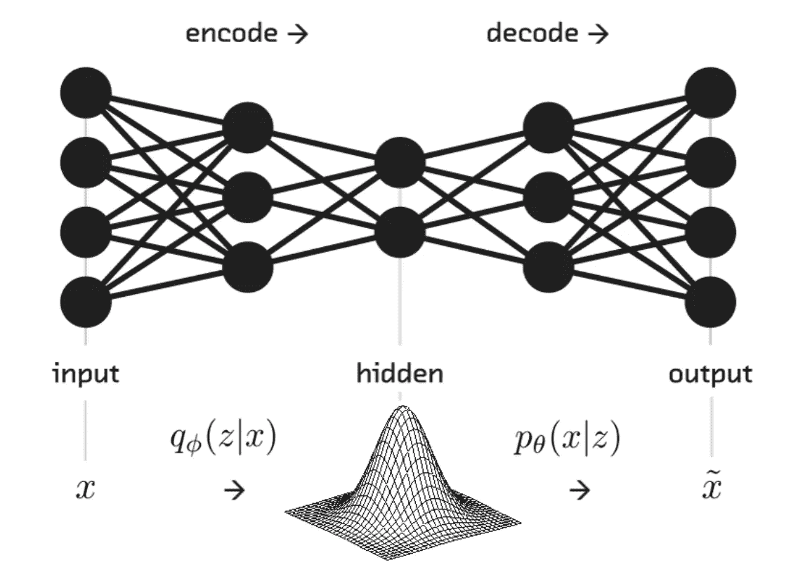
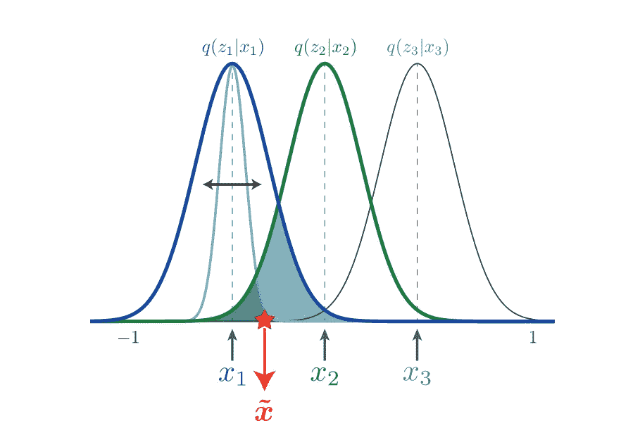

# 我们编织了一张多么解开的网:VAEs 中的表征学习。1)

> 原文：<https://towardsdatascience.com/what-a-disentangled-net-we-weave-representation-learning-in-vaes-pt-1-9e5dbc205bd1?source=collection_archive---------1----------------------->

这是一个举世公认的真理:没有标签的数据一定需要无监督学习。

除了油嘴滑舌，人们普遍认为监督学习有着有意义的缺点:标签成本高、噪音大，并且将你的问题引向实现某种程度上人为的目标，而不是简单地以更中立的方式学习数据的有意义轮廓。然而，它们确实给了我们学习中非常有价值的东西:一个最大化的简单目标。所有现代神经网络系统都是建立在梯度下降基础上的，梯度下降修改参数值以优化结果。在无监督学习的背景下，你到底想让模型为了什么而优化自己的问题就不那么清楚了。

无监督学习的一个常见策略是生成模型，其思想是:你应该给模型一个从给定分布中产生样本的任务，因为在该任务中表现良好需要模型隐式地学习该分布。如果你想到人类的术语，这种直觉是有道理的:例如，如果我们想测试一个孩子是否理解“房子”这一类别，我们可能会不断地要求他们画一所房子，如果他们能够多次画同样的房子，或者画不符合这一类别的东西，比如烤面包机，我们可能会合理地假设他们理解什么标准使一些东西本质上像房子。

生成式建模最常用的两种方法是生成式对抗网络(GANs)和变分自动编码器(VAEs)。

GANs 的工作原理是引入噪声(z ),并使用生成器神经网络将 z 转换为数据的传真版本(X-hat)。然后，鉴别器将该数据与真实示例(X)进行比较，生成器学习创建鉴别器更有可能归类为真实的假图像。乍一看，z 在这一切中的作用可能并不明显。如果这种噪声没有增加任何信息价值，我们为什么需要它作为我们的输入呢？答案是*它允许我们采样*。生成式建模的一个重要方面是，我们不只是想要一个可以从有问题的分布中生成一个示例的模型，而是一个我们可以重复绘制并每次获得不同输出的模型。由于发生器仅由矩阵组成，满足这一采样标准要求至少部分网络设置是随机的。在 GAN 中，当我们遍历 z 噪声空间时，根据发生器在给定每个 z 样本作为输入时产生的 X，我们会从分布中获得不同的图形。此外，因为我们决定并控制我们使用的分布 z，所以在模型训练后很容易进行采样:我们只需从相同的选择分布中采样 z 值，并且知道，在预期中，我们得到的采样 z 将来自生成器已经学会使用该 z 产生真实输出的区域。

# 可变自动编码器速成班

VAEs——这将是本文其余部分的重点——具有类似的结构，尽管在两个主要方面有所不同。

1.  VAEs 不只是将随机抽取的 *z* 映射到图像中，而是将特定的 X 作为输入，学习一种编码器，将 Q(z|X)从该 X 映射到压缩代码 *z* 。该代码有望包含重建 X 所需的信息，通过解码器 P(X| *z* )运行，以预测特定的 X 再次返回。
2.  VAEs 不是使用神经网络来生成真实 X 和生成/重构 X 之间的损失，而是通常使用逐像素损失函数来测量重构 X 和原始 X 之间的像素距离。

就本文的目的而言，第一个是最显著的区别:事实上，在 VAE 中，您不仅仅关心产生看起来像是来自数据分布整体的东西，您还关心再现作为输入给您的特定图像(或者一般来说，来自数据分布的观察)。因此，你的 *z* 分布，对于 GANs 来说只是一个有用的随机性来源，通常需要对可用于特定图像重建的信息进行编码。理论是:由于 z 是一个低维向量，网络被迫学习输入图像的压缩和信息表示。

然而，我们现在回到我们之前用 GANs 概述的标准:在我们训练了模型之后，需要能够从模型中取样。此外，为了有效地进行采样，您需要能够在训练后对给定的 *z* 进行采样，并高度确信 *z* 空间的该区域对应于实际输出。

这样做的一种方式，也是 VAEs 通常使用的方式，是激励网络将它编码的 *z* 值推出 X，即 Q( *z* |X)，以接近某个先验 p( *z* ，这通常是一个维度独立的多元高斯。这也被称为“各向同性”高斯。这听起来很专业，也很复杂，但是从视觉角度来看，事实并非如此。在二维空间中，每个维度的方差都等于 1，维度之间没有协方差，高斯看起来就像一个圆，以 0 为中心。在更高维度中，它是一个球体(或超球体)。

这两个元素组合成以下目标函数:

在这个目标中，第一项对应于**重建损失**(也称为数据似然损失)，并在概念上映射到“我的模型在生成与数据分布相似的东西方面有多好”。第二项是网络为每个 X 编码的 q( *z* |X)值与先验分布 p( *z* )之间的 KL 散度。因为当两个分布相等时 KL 散度最低，所以这一项向更集中在先前多元高斯空间中的 *z* 值推进。这个术语通常被称为**正则化术语。**

然而，特别是 vae 并不仅仅或者甚至主要用作生成模型；他们的主要用途是作为代表学习者。我们的意思是，vae 经常被用于创建低维编码分布(前面提到的 *z* )，建模者希望，由于瓶颈和重构结构，它已经被迫学习数据中有意义的概念。其逻辑本质上是:如果你传输信息的带宽有限，你会优先使用它来描述你试图传输的数据的最显著的方面。

这是有价值的，因为人们普遍认为深度网络的许多价值在于它们作为习得特征提取器的能力:系统可以接受高维输入，并从中生成更多语义上有意义的特征。如果一个无监督的系统可以实现类似的目标，即通过使用大量的标记数据来创建高度信息化的压缩特征表示，那么就有很好的理由相信一个高性能的模型可以使用这些特征来训练，并且只需要少量的标记数据。

这听起来很棒:一个简单的、基于概率的解决我们无人监督学习困境的方法。但是，没那么快。

尽管这种技术很有前途，但在实践中，试图使用 VAEs 作为表征学习器的研究人员面临两个主要困难:纠缠码和忽略码。这篇博文将讨论 BetaVAE，它解决了第一个潜在的问题，第 2 部分将关注 InfoVAE，它解决了第二个问题。

(注意:我在这里和整篇文章中使用“代码”作为编码器学习的低维 z 表示的简写。此外，在现代 ML 中，论文中最常见的 VAEs 用例是图像数据，所以我偶尔会提到像“像素丢失”这样的东西，它们与图像数据特别相关。我把它们留在这里，因为我认为它们提供了有用的直觉，但为了减少混乱和可能的过度拟合:VAE 的思想适用于图像以外的领域)

# 定义解开

在我们的模型试图表现的现实世界中，有一些变异因素可以独立修改，而另一些则不能(或者，出于实际目的，永远不能)。一个简单的例子是:如果你正在给人建模，那么一个人的衣服与他的身高无关，而他的左腿的长度强烈地依赖于他的右腿的长度。解开特征的目标最容易理解为想要使用你潜在的 *z* 代码的每一个维度来编码这些潜在的独立变异因素中的一个且仅一个。使用上面的例子，一个清晰的表示将把一个人的身高和衣着作为 *z* 码的独立维度来表示。

解开的目标有几个不同的动机。从实际意义上来说，想象你正在学习一个生成模型来创建人的图片，最终目标是在视频游戏场景的背景中生成一群假的人。您可能希望能够告诉模型，“我希望生成一个看起来像这个人，但是更高的人”。如果你已经学会了一个独立编码一个人的身高的尺寸，那么你可以修改它，保持其他一切不变。相反，如果你在一个共享维度中对身高和性别进行编码，改变身高的同时保持人的所有其他方面不变是不可能的，因为修改身高的内部维度也会修改性别。

从一个更加信息化的角度来看，一个清晰的表示是有用的，因为当你捕捉到最有意义或最显著的观察结果的不同之处时，这些不同的轴对于各种各样的监督任务来说通常是有价值的。如果这是真的，当你使用这种清晰的表示作为输入时，它允许你使用更少的数据和更简单的模型来执行给定的监督任务。

作为更多和更少纠缠的代码看起来像什么的激励性例子，看看下面的图片。左侧网格提供了不太独立的编码示例，右侧网格显示了更独立的编码。

在上面的每一行中，当你从左向右移动时，一个 *z* 码的一个维度是变化的，然后一个解码器被用来将这个 *z* 码转换成一个图像。这个模型是从一个非常简单的数据集训练出来的，这个数据集只包含一个白点，位于黑色背景上的某个地方。这里只有两个可独立修改的参数:水平方向和垂直方向。右边的网格已经学习了直接映射到这些因素的 *z* 值:第一维插值在最底部和最顶部之间，在大约相同的水平位置，第二维插值在最右侧和最左侧之间，在大约相同的垂直位置。后两个维度没有提供信息。

相比之下，左手模型学习的大多数因素结合了垂直和水平位置的变化。第一个因子向左上方移动，第二个因子仅向下移动，最后一个因子向右下方移动。同样有趣的是，在最后一个因素中，你可以看到第 7 张和第 8 张图片之间有很强的不连续性，球突然“跳”到了右边很远的地方。尽管该数据只有两个独立的维度，但左侧网格已经(低效地)将其表示扩展到 4 个维度上。

总而言之:右侧网格中的表示优越的两个主要方面是它们是**平滑的**，以及它们表示**独立轴**。

# 想来点贝塔吗？

左手网格——低效且混乱的网格——由(正常的)VAE 学习，右手网格——未混乱的网格——由[贝塔 VAE](https://openreview.net/pdf?id=Sy2fzU9gl) 学习。贝塔 VAE 实际上只是一个非常简单的概念的名称:在 VAE 损失中采用“调整”或“先前执行”术语，并通过在目标中对其施加更大的权重来增加该术语的约束程度。

You’re not imagining things; this paper’s many pages of math boiled down to adding a coefficient to a term in the objective, and turning that coefficient to values greater than 1

为什么这两个方程中的差异会转化为两个网格之间的差异，这种直觉不是很明显，但如果你挖掘得足够深入，就会有一些有价值的理解。

从正在发生的事情的基础开始:KL 散度项量化不同的是来自先前的 *z* 的条件/编码分布。然后，当它产生看起来与多元高斯先验有很大不同的 *z* 分布时，它会惩罚网络，其中每个维度都是 N(0，1)，并且维度在统计上是独立的(也就是说:维度之间的相关性是 0)。在下面的讨论中，需要记住 *z* 的几个重要特性:

*   由于这是一个*变型*自动编码器，编码器网络不仅仅产生一个向前传递的 *z* 的确定值，它还对一个 *z* 分布的平均值和方差进行编码；网络从该分布中取样，并将样本向前传递。因此，当我们说我们正在实施多元高斯先验时，这意味着我们正在推动这些编码的均值更接近 0，编码的标准差更接近 1，维度之间的相关性更接近 0。
*   如果你看上面的等式，我们将约束应用于*条件分布*，或者从每个单独的 X 编码的分布。因此，当先验将这些条件分布的平均值推至更接近 0 时，这意味着平均值在不同 X 观察值之间的差异方面受到约束。

为了让这成为一个有用的约束，让我们考虑一下 z 代码必须做什么，以及它的选项是什么。从重建损失的角度来看， *z* 分布的工作是向前传递信息，该信息将尽可能明确地传达编码它的 X 的特征。当正则化损失的权重变大时，它对学习到的 *z* 向量有三个主要影响。

1.  **平滑度:**当你改变 *z* 的值时，它激励重建平滑地变化，而不是跳动或不连续的
2.  **简约性:**它激励网络将关于 X 的信息压缩到尽可能少的维度中
3.  **轴对齐:**它鼓励将数据可变性的主轴与 *z* 向量的维度对齐

总的来说，这些激励推动网络将关于 X 的信息压缩成少量平滑变化的独立维度。

## 保持平稳

Graphic from: “Understanding Disentangling in B-VAE”.

重建损失问题的一个潜在解决方案是将平均值推得更远，并将标准偏差推得更低，以减少从不同观察值生成的 *z* 值之间混淆的机会

然而，这种行为恰恰是正则化术语所反对的:它更倾向于彼此接近的均值，以及接近 1 的标准差。如上图所示，在这种情况下，如果网络对 x2 进行宽分布编码，则很有可能会对 x-波浪线进行采样，这实际上在 x1 下比在 x2 下更有可能。因此，当网络打算重建 x1 时，它很容易重建 x2。

作者称之为“数据局部性”的这种强烈动机具有推动网络对数据中平滑变化的因素进行编码的效果。

## 明智地使用你的维度

让我们暂时回到之前的白点比较。回想一下，这两种编码方案之间最大的区别之一是，网络使用了多少个维度来编码本质上是两个维度的生成因素。我们看到这种效应的原因是，在贝塔-VAE(贝塔> > 1)下，模型为它用来编码信息的每个维度付出了代价。这是因为对于 X 的所有输入值，维度不产生成本的唯一方式是它等价于 N(0，1)，*的全局先验。当一个维度在 X 的所有值上不变时，那么，根据定义，它不包含关于 X 的任何信息。每当模型偏离这种无信息状态，并且实际上开始以不同的方式将 *z* 编码为 X 的函数，这在目标函数中强加了成本。*

这种对维度效率的驱动意味着模型只想要编码最具信息性的变化轴。我喜欢把普通的 VAE 场景想象成，在线性代数的意义上，在一个实际上只有二维的空间中，使用四个基本向量。这是无关的，但是当模型的损失很少或没有损失时，这种浪费就不会在模型中突出出来。相比之下，在 BetaVAE 下，模型被鼓励减少基向量的数量，只保留那些在描述空间时足够有价值的向量。

显然，白色斑点的情况下，字面上正好有两个轴的生成是一种过于简化。有了真实的数据，几乎不可能有某个低维空间捕捉到所有有意义的变化的**。但是，可能有这样的情况，您有两个轴捕获了几乎所有的变化，而第三个轴只捕获了一小部分剩余的变化。在这种情况下，网络可能仍然选择不表示第三维，因为它没有增加足够的解释力，不值得支付表示的成本。**

## 保持一致

解开的最后一个组成部分，轴线对齐，来自于这样一个假设，如果真的存在潜在的生成因素，那么不同的因素将提供不同的解释力。例如，想象一下，如果我们有一个白色圆圈数据集，但除了圆圈改变位置外，它还改变了半径。当然，圆圈的大小是一个独立的因素，我们可能希望我们的模型能够捕捉到它。但是，将圆放在完全不正确的位置所导致的重建损失远远高于仅重建错误大小的圆所导致的重建损失，这也是事实，因为不同大小的圆之间会有许多像素重叠。

因为这个维度提供的有用信息较少，所以不值得花费这么多成本。请记住，在正则化条件下，将条件均值移动到信息位置或减少条件方差以最小化混淆的可能性是很昂贵的。因此，在网络可能愿意为获得清晰明确的位置信息付出代价的情况下，尺寸的 *z* 值可能更接近先验值:具有更大的标准差和更小的均值分布，这意味着只有非常大和非常小的圆才能相互区分。这种将我们潜在维度的能力与它们的信息价值结合起来的愿望，是我们所施加的约束的自然结果。

然而，因为高斯是各向同性的，维度之间没有协方差，如果我们对齐这些不同的因素，我们只能了解不同因素的不同方差。因此，因为网络被激励根据一个因素的信息含量来缩放方差，并且我们期望不同的生成因素是那些具有最不同信息含量水平的因素(由于代表不同的生成过程)，所以它被激励将其主要生成因素与 *z* 的维度对齐。

# 重构知识

从根本上来说，测试版 VAE 的方法与普通的 VAE 在本质上没有区别，只是侧重点不同。在最简单的框架中:当你把贝塔系数调高时，它只是一个更加规则的 VAE。VAEs 的许多理论已经围绕着通过应用信息瓶颈来强制压缩。BetaVAE 说，为了产生适当的解开因素，瓶颈需要更强。

这两种方法之间的这种基本相似性的一个好处是，我们可以从 BetaVAE 中获得的许多直觉——在正则化约束的极端版本下潜在空间是如何形成的——也有助于我们更好地理解典型的 VAE 如何工作，以及我们可以期望它们创建什么样的表示。毕竟，很多希望和重量都寄托在这样的模型上，以帮助领导生成性表征学习的充电器，所以重要的是要记住:他们不会选择我们希望他们会选择的那种特征，他们只会选择我们激励他们找到的那种特征。

*(我在上面重新构建的许多直觉来自于* [*本文*](https://arxiv.org/pdf/1804.03599.pdf) *，由最初的贝塔 VAE 方法的作者发布，其中明确试图为他们的方法为什么有效提供解释)*

1.  这并不总是正确的，因为有些文章像[这篇](https://arxiv.org/pdf/1512.09300.pdf)一样，在 VAEs 的末端贴上鉴别器来做一个更“基于特征的”损失函数，但是“基于元素的平方差”是一个足够普遍的标准，我将在这篇文章中坚持引用它
2.  这将是所有的一块，但中期起草我意识到这是倾向于 6000 字的方向，并决定后分裂是最明智的选择。