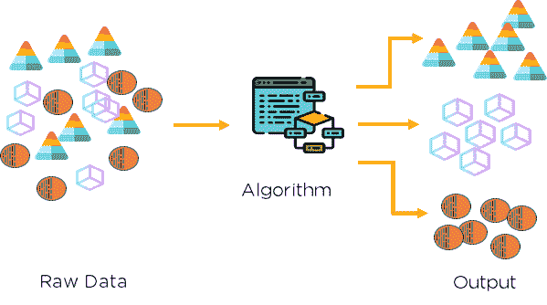
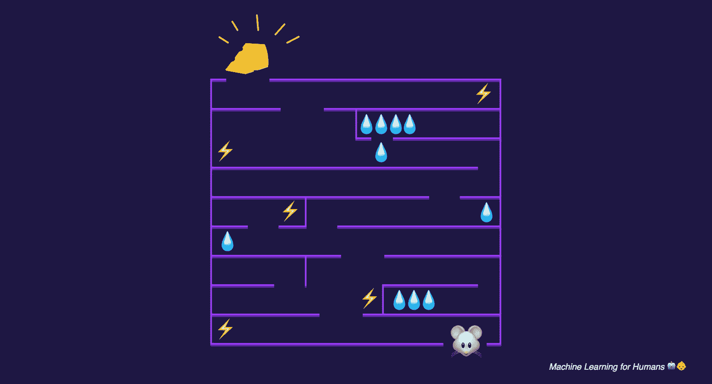
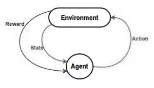
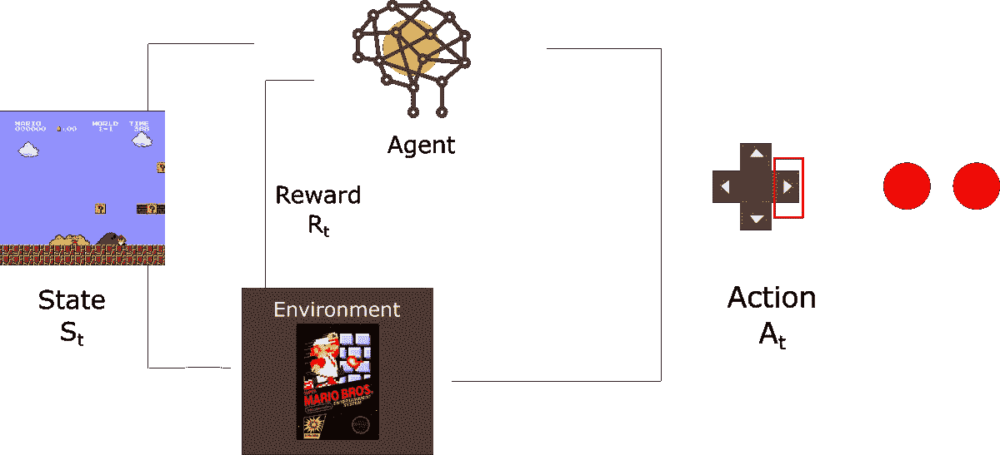

# 机器学习的类型有哪些？

> 原文：<https://towardsdatascience.com/what-are-the-types-of-machine-learning-e2b9e5d1756f?source=collection_archive---------1----------------------->

## 面向普通人的机器学习:为普通人编写的机器学习类型分析。

# 机器学习

在高层次上，机器学习只是研究如何教会计算机程序或算法逐步改进给定的任务。在事物的研究方面，机器学习可以通过这个过程如何工作的理论和数学模型来看待。然而，更实际的是研究如何构建展示这种迭代改进的应用程序。有许多方法来构建这个想法，但大体上有三个主要的公认类别:监督学习、非监督学习和强化学习。

在一个被人工智能、机器学习和过度热衷于谈论这两者的世界里，学习理解和识别我们可能遇到的机器学习类型是一件有趣的事情。对于普通计算机用户来说，这可以采取理解机器学习的类型以及它们如何在我们使用的应用程序中展示自己的形式。对于创建这些应用程序的从业者来说，了解机器学习的类型是至关重要的，这样，对于您可能遇到的任何给定任务，您都可以创建适当的学习环境，并了解为什么您所做的工作有效。

# 监督学习

监督学习是最流行的机器学习范式。它最容易理解，也最容易实现。这非常类似于教一个孩子使用闪存卡。

给定带有标签的示例形式的数据，我们可以将这些示例-标签对一个接一个地馈送给学习算法，允许算法预测每个示例的标签，并向它提供关于它是否预测了正确答案的反馈。随着时间的推移，该算法将学习近似示例及其标签之间关系的确切性质。经过充分训练后，监督学习算法将能够观察到一个新的、从未见过的例子，并为它预测一个好的标签。

因此，监督学习通常被描述为面向任务的。它高度专注于一个单一的任务，向算法提供越来越多的例子，直到它能够准确地执行该任务。这是您最有可能遇到的学习类型，因为它在以下许多常见应用程序中都有展示:

*   **广告流行度**:选择表现良好的广告通常是一项监督学习任务。当你浏览互联网时，你看到的许多广告被放在那里，因为一个学习算法说它们有合理的流行度(和可点击性)。此外，它在某个网站上或与某个查询(如果你发现自己使用搜索引擎)相关联的位置在很大程度上是由于一个习得的算法，该算法认为广告和位置之间的匹配将是有效的。
*   垃圾邮件分类:如果你使用现代电子邮件系统，你可能会遇到垃圾邮件过滤器。垃圾邮件过滤器是一个监督学习系统。Fed 电子邮件示例和标签(垃圾邮件/非垃圾邮件)，这些系统学习如何先发制人地过滤掉恶意电子邮件，以便其用户不会受到它们的骚扰。其中许多还以这样的方式运行，即用户可以向系统提供新的标签，并且系统可以学习用户偏好。
*   **人脸识别**:你用脸书吗？最有可能的是，你的脸已经被用于一个被训练来识别你的脸的监督学习算法中。拥有一个可以拍照、识别人脸、猜测照片中的人(建议使用标签)的系统是一个受监督的过程。它有多个层次，找到面孔，然后识别他们，但仍然受到监督。

# 无监督学习

无监督学习与监督学习完全相反。它没有标签。相反，我们的算法将被输入大量数据，并被赋予理解数据属性的工具。从那里，它可以学习分组、群集和/或组织数据，以便人类(或其他智能算法)可以进入并理解新组织的数据。

无监督学习之所以成为一个如此有趣的领域，是因为这个世界上绝大多数的数据都是未标记的。拥有智能算法，可以获取我们数万亿字节的未标记数据，并对其进行理解，这是许多行业潜在利润的巨大来源。仅此一项就可以帮助提高许多领域的生产率。

例如，如果我们有一个包含所有已发表的研究论文的大型数据库，并且我们有一个无监督的学习算法，知道如何以这样一种方式对这些论文进行分组，以便您始终了解特定研究领域的当前进展，会怎么样？现在，你开始自己启动一个研究项目，将你的工作钩入这个算法可以看到的网络。当你写下你的作品并做笔记时，该算法会向你提出相关作品的建议，你可能希望引用的作品，甚至可能帮助你推进该研究领域的作品。有了这样的工具，你的工作效率会大大提高。

因为无监督学习是基于数据及其属性，我们可以说无监督学习是数据驱动的。无监督学习任务的结果由数据及其格式化方式控制。您可能会在以下领域看到无监督学习:

*   推荐系统:如果你曾经使用过 YouTube 或网飞，你很可能会遇到一个视频推荐系统。这些系统经常处于无人监管的领域。我们知道关于视频的事情，也许它们的长度，它们的类型，等等。我们也知道很多用户的观看历史。考虑到用户已经观看了与你相似的视频，然后欣赏了你尚未观看的其他视频，推荐系统可以在数据中看到这种关系，并向你提示这样的建议。
*   **购买习惯**:你的购买习惯很可能包含在某个地方的数据库中，而这些数据此时正在被积极地买卖。这些购买习惯可以在无监督学习算法中使用，以将客户分组到相似的购买细分中。这有助于公司向这些分组的细分市场营销，甚至可以类似于推荐系统。
*   **对用户日志进行分组**:面向用户较少，但仍然非常相关，我们可以使用无监督学习对用户日志和问题进行分组。这可以帮助公司识别其客户面临的问题的中心主题，并通过改进产品或设计 FAQ 来处理常见问题来纠正这些问题。无论哪种方式，它都是积极完成的事情，如果你曾经提交过产品的问题或提交过错误报告，它很可能会被输入到无监督的学习算法中，与其他类似的问题进行聚类。

# 强化学习

与监督和非监督学习相比，强化学习是相当不同的。我们可以很容易地看到监督和非监督之间的关系(标签的存在或不存在)，与强化学习的关系有点模糊。一些人试图将强化学习与这两者联系起来，将它描述为一种依赖于时间依赖的标签序列的学习，然而，我的观点是，这只会使事情更加混乱。

我更愿意把强化学习看作是从错误中学习。将强化学习算法放在任何环境中，它在开始都会犯很多错误。只要我们向算法提供某种信号，将好的行为与积极的信号相关联，将坏的行为与消极的信号相关联，我们就可以加强我们的算法，使其更喜欢好的行为而不是坏的行为。随着时间的推移，我们的学习算法学会犯比以前更少的错误。

强化学习是非常行为驱动的。它受到神经科学和心理学领域的影响。如果你听说过巴甫洛夫的狗，那么你可能已经熟悉了强化代理的想法，尽管是生物代理。

但是，要真正理解强化学习，我们来分解一个具体的例子。让我们看一下教代理玩游戏马里奥。

对于任何强化学习问题，我们都需要一个代理和一个环境，以及一种通过反馈回路连接两者的方法。为了将代理连接到环境，我们给它一组可以影响环境的操作。为了将环境与代理连接起来，我们让它不断地向代理发出两个信号:一个更新的状态和一个奖励(我们对行为的强化信号)。

在马里奥这个游戏中，我们的智能体就是我们的学习算法，我们的环境就是游戏(很可能是特定的关卡)。我们的代理有一套动作。这些将是我们的按钮状态。我们的更新状态将是每一场比赛帧久而久之和我们的奖励信号将是分数的变化。只要我们将所有这些组件连接在一起，我们就建立了一个强化学习场景来玩游戏马里奥。

现实世界中强化学习在哪里？

*   **电子游戏**:强化学习最常见的地方之一就是学习玩游戏。看看谷歌的强化学习应用，哪个学围棋的 AlphaZero 和 AlphaGo。我们的马里奥例子也是一个常见的例子。目前，我还不知道有任何生产级游戏将强化学习代理部署为其游戏 AI，但我可以想象，这将很快成为游戏开发者采用的一个有趣的选择。
*   **工业模拟**:对于许多机器人应用来说(想想装配线)，让我们的机器学习完成它们的任务而不必硬编码它们的过程是很有用的。这可能是一个更便宜、更安全的选择；它甚至更不容易失败。我们也可以激励我们的机器使用更少的电力，以节省我们的钱。更重要的是，我们可以在模拟中开始这一切，以便在我们可能损坏机器时不浪费金钱。
*   **资源管理**:强化学习有利于在复杂环境中导航。它可以处理平衡某些需求的需要。以谷歌的数据中心为例。他们使用强化学习来平衡满足我们的电力需求的需要，但尽可能高效地做到这一点，从而削减主要成本。这对我们和普通人有什么影响？我们的数据存储成本更低，对我们共享的环境影响更小。

# 把这一切联系在一起

既然我们已经讨论了机器学习的三个不同类别，重要的是要注意，这些学习类型之间的界限很多时候是模糊的。不仅如此，有许多任务可以很容易地被表述为一种学习类型，然后转换成另一种范式。

例如，以推荐系统为例。我们把它作为一个无监督的学习任务来讨论。它也可以很容易地重新表述为一个监督的任务。给定一堆用户的观看历史，预测某部电影应该推荐还是不推荐。这样做的原因是，最终，所有的学习都是学习。这只是我们表述问题陈述的方式。某些问题更容易用这样或那样的方式表达。

这也凸显了另一个有趣的想法。我们可以混合这些类型的学习，设计系统的组件，以这样或那样的方式学习，但在一个更大的算法中集成在一起。

*   扮演马里奥的特工？为什么不赋予它识别和标记敌人的监督学习能力？
*   对句子进行分类的系统？为什么不让它有能力利用句子意思的表达，通过无监督的过程学习呢？
*   想要将社交网络中的人分组到关键细分市场和社交群组中吗？为什么不加入一个强化过程来提炼一个人的表征，这样我们就可以更准确地对他们进行聚类？

同样，我认为我们都了解一点机器学习是非常重要的，即使我们自己永远不会创建一个机器学习系统。随着机器学习在我们每天使用的一切事物中变得越来越普遍，我们的世界正在发生巨大的变化。理解基本原理将帮助我们驾驭这个世界，揭开看似崇高的概念的神秘面纱，让我们更好地思考我们使用的技术。

如果你有任何问题，让我知道！我自己仍然在学习人工智能领域的很多东西，讨论有助于加深理解。

如果你喜欢这篇文章或者觉得它有任何帮助，如果你给我一两美元来资助我的机器学习教育和研究，我会永远爱你！每一美元都让我离成功更近一步，我永远心存感激。

*原主办:*[*【hunterheidenreich.com】*](http://hunterheidenreich.com/blog/breaking_down_ml_for_the_average_person/)