# 你能从伯灵顿警方的数据中学到什么

> 原文：<https://towardsdatascience.com/what-can-you-learn-from-burlington-police-data-8f541bdc845a?source=collection_archive---------6----------------------->

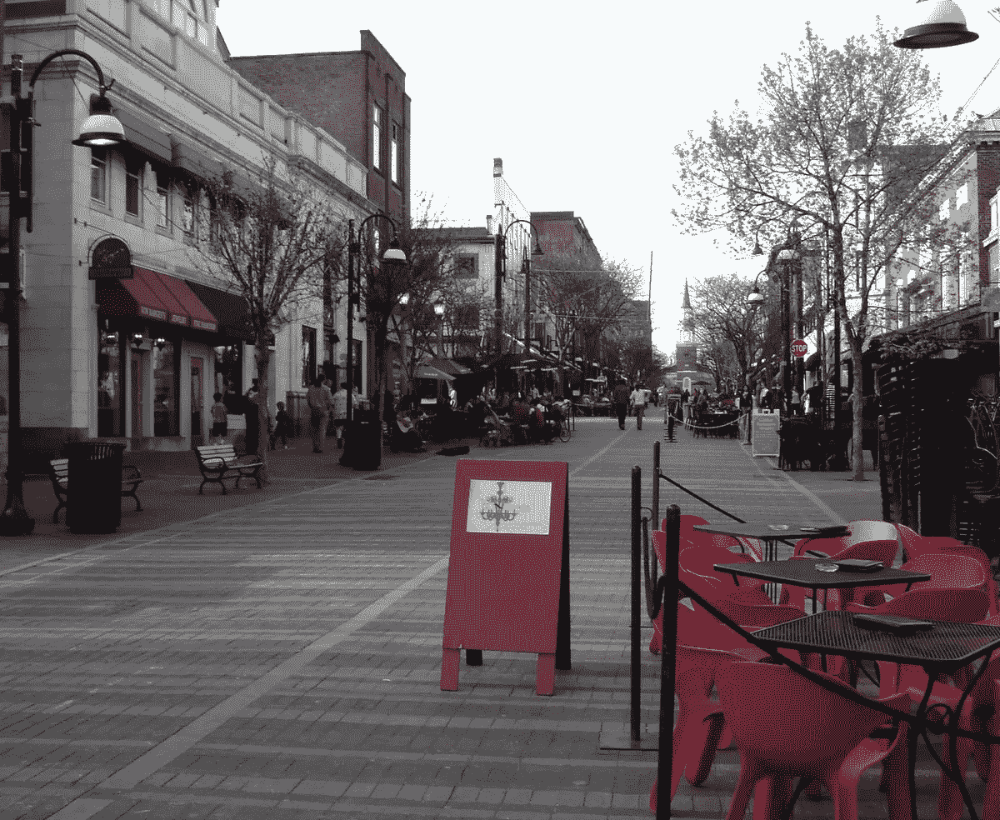

伯灵顿是佛蒙特州尚普兰湖畔的一座小城，人口大约 42000 人。这座城市有一个开放数据项目的门户，他们将其描述为:

部分资金来自一笔赠款，该市承诺与 Socrata 建立试验性合作伙伴关系，so crata 是一家基于云的软件公司，旨在促进佛蒙特州和纽约市等州政府和市政府的“开放数据”转变。这一安排使 Burlington 能够在其开放数据平台上发布多达 20 个数据集。这些数据集包括城市财政、出租房屋、公园一分钱计划、犯罪统计、分区许可申请等信息。”

对于自学如何在数据分析中使用 Python 的人来说，这是一个无价的工具。这让我追求的问题更有意义，与当地信息更相关。我已经研究了几个数据集，但是在这篇文章中，我将把重点放在伯灵顿警察局的数据集上

 [## 伯灵顿|开放数据

### 感谢您访问伯灵顿市的开放数据网站。单击此处了解如何浏览网站和…

data.burlingtonvt.gov](https://data.burlingtonvt.gov/) 

# 数据

对于伯灵顿警方的数据，只有几个变量可以处理。以下是它包含的内容列表:

*   事件 Id —数字渐进序列
*   呼叫类型—违规类型，例如。陶醉
*   日期—12 小时格式的日期和时间戳
*   位置—街道名称，用于由/分隔的两条街道
*   事故编号—字母数字字符串

其中一些比其他的更有用。一开始，事件 Id 和事件编号是没有用的，除非我在某个地方查找它们。日期从 2011 年 10 月 1 日到 2013 年 11 月 12 日，这是一个相当奇怪的选择，但它不应该是一个问题。在此期间，总共发生了 28，832 起违规事件。

# 位置

位置数据在变得有用之前需要大量的工作。有些列出了两条被连字符分开的街道，而不是只有一条。缩写不一致也是一个问题。我采取的第一步是把所有的东西都变成小写，以消除它作为变量的可能性，然后在浏览列表后，我最终去替换不同的缩写或拼写错误。例如:

*   “路”到“路”
*   " rd。"至“研发”
*   “大道”到“av”
*   “高度”到“高度”

最后，我做了大约 19 处修改，将唯一值从远远超过 900 减少到接近 700。无论数据集如何，这都是一个问题，不这样做可能会意外隐藏有用的信息。

# 地理

我带着我的狗步行、开车或骑自行车游览了这座城市的很多地方。教堂街(见文章顶部的图片)是一条步行街，镇上的大多数酒吧、餐馆和娱乐场所都在这里。UVM 大学、州立大学和尚普兰学院在会议期间占人口的很大比例，并且位于市中心步行距离内的东部。

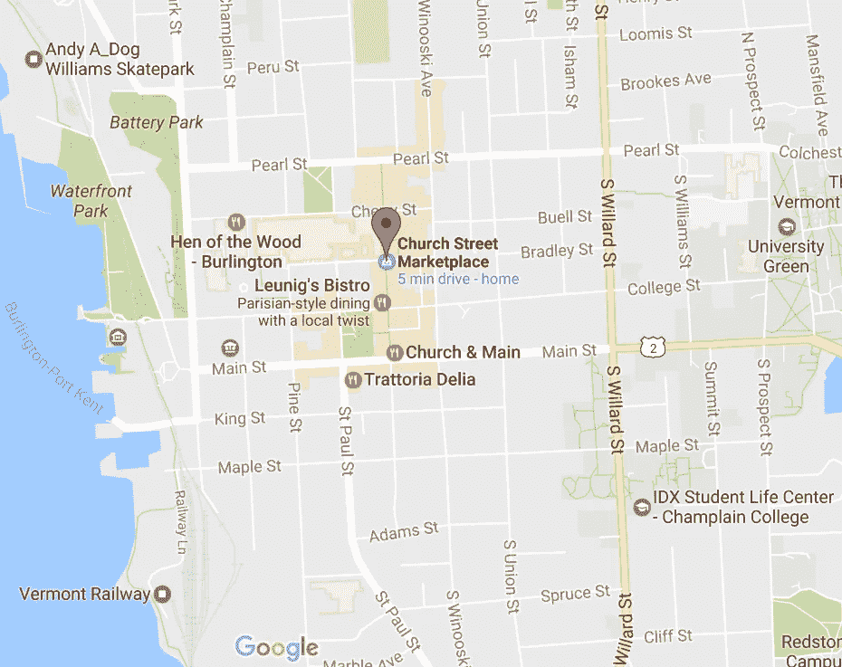

这是一个相当安静的城镇，但在夏季和秋季，我们确实有很多游客。冬天会很冷，我来这里后见过的最冷的时候是零下 25 华氏度，而夏天却很温暖。这也是一个相当活跃的城市，有漂亮的自行车道、公园和受保护的森林环绕。

# 概观

该数据集为期两年，快速浏览一下所有地点和时间段的所有违规次数，就可以发现一些明显的趋势。

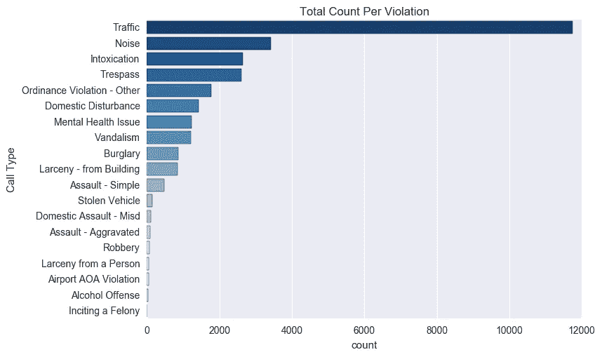

如你所见，这是一个非常安全的地方。与其他事情相比，交通违规领先一大截。噪音排在第二位，醉酒和非法侵入排在第三位。

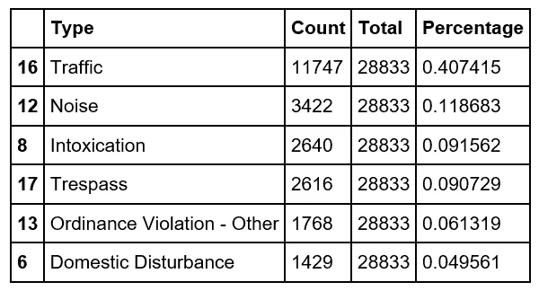

现在是时候深入挖掘一下了。一段时间内的趋势对于理解快速 matlibplot 折线图很重要，它显示虽然秋季有峰值，但到 2013 年总体上只有一点下降。在这种情况下，我希望能得到最新的数据。

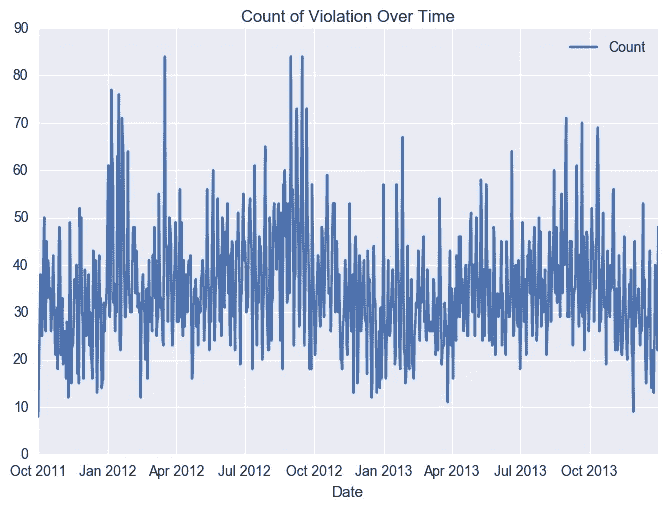

深入挖掘可能会发现更多，所以让我们看看每小时的模式。这可能会影响警方的人员配备，并让您大致了解何时最忙。

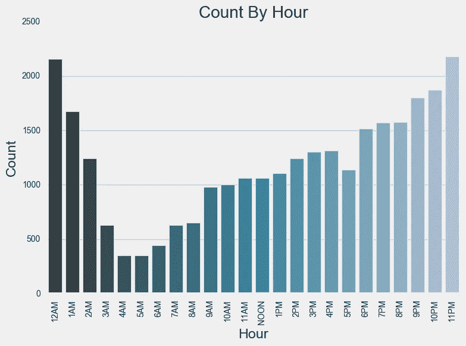

# 小时

没什么好惊讶的，这里很少有酒吧营业到凌晨 2 点，所以酒吧关门并不奇怪，但实际上中午是相当繁忙的时间。我将按违规情况进一步细分，但总的来说，基于一天中的时间有一个明显的趋势。

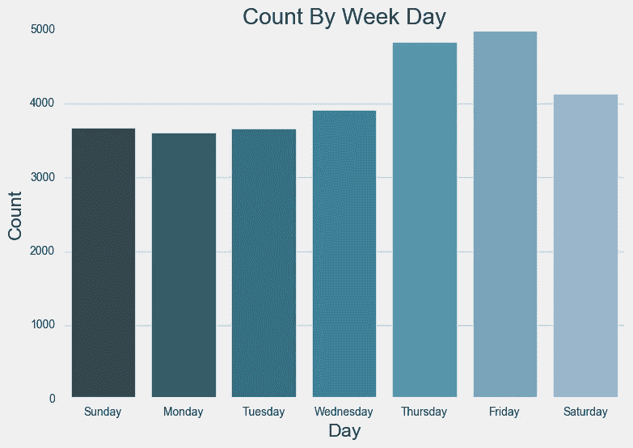

# 工作日

按照一周中的某一天来划分，可以看出一点趋势。这并不奇怪，当你接近工作周的尾声时，会有一个小的增长。让我惊讶的是，周日并不比一周中的其他时间低。如果能看到这种按通话类型分类的情况，将会很有意思。

# 月

纵观整个月，有一个相当一致的趋势，变化幅度很小。因为这是总数而不是平均数，31 号有所下降仅仅是因为不是每个月都有 31 天。在这种情况下，一个月中不同的日子会引发更多的问题。

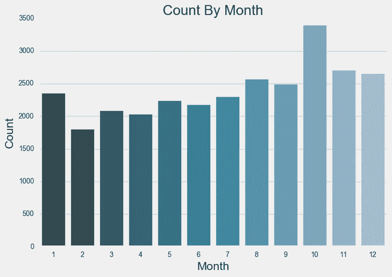

# 月

以下是一些有趣的趋势。佛蒙特州的二月寒冷刺骨，气温最低。十月有一个与秋天树叶季节相关的穗。当树叶变了的时候，路上会有大量游客涌入。

# 按街道细分

在这一点上，我们知道根据小时、星期几和月份会有变化。但这只能告诉我们整个城市的趋势。既然我们有了街道信息，下一步就是相互比较不同的街道。

我将重点关注教堂街及其周边地区，因为它在违规计数中排名前 5。前 5 名中还包括教堂街两端的两条街，珍珠街和梅恩街。

在下面的所有图表中，整个城市的违规顺序是从最常见到最少。如果街道反映了整个城市，那么每个酒吧都会向下减少，如果不是这样，那么这个位置就不同于一般人群。

# 教堂街

教堂街是一条行人专用街道，这里是城市中大多数酒吧、餐馆和娱乐场所的所在地。这是一个全年都很繁忙的地方，当气温在零度以上时更是如此。

我在和一个酒保谈论这个数据时发现了一个有趣的注意事项，他解释说，在这个数据出现的时候，酒吧利用非法侵入来阻止被赶出去的人回来。不一定是有人非法侵入住宅或其他私有财产。

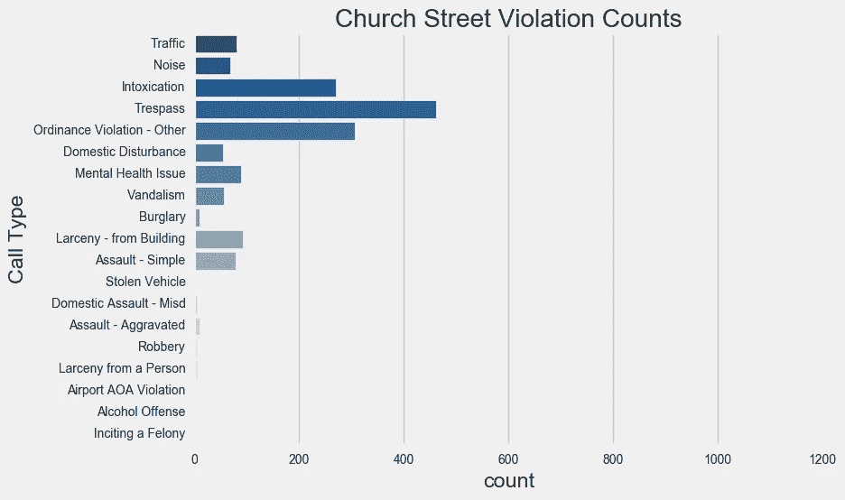

这并不奇怪，因为这是一条行人专用的街道，交通流量很小，醉酒和非法侵入的发生率很高。我希望我能更清楚地知道什么是违反条例——在这种情况下的其他手段。

# 珍珠街

珍珠街位于教堂街的北端，是镇上唯一的酒类商店之一，也是通往佛蒙特州立大学 UVM 分校(该市人口的主要组成部分)的主要通道。珍珠街到达 UVM 的地方变成了科尔切斯特大道，所以我把它们放在一起做对比。

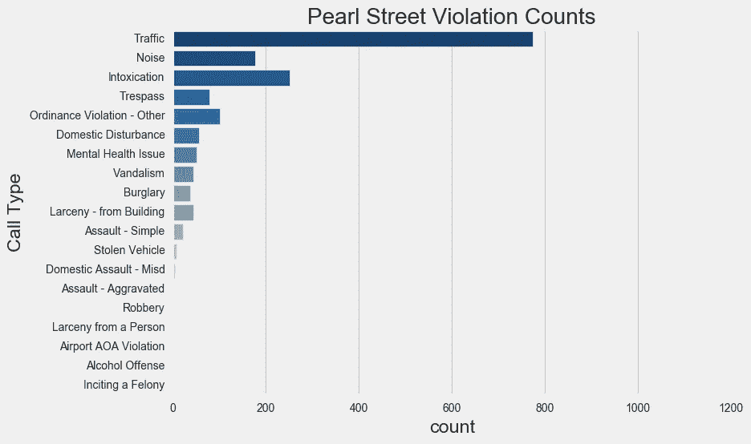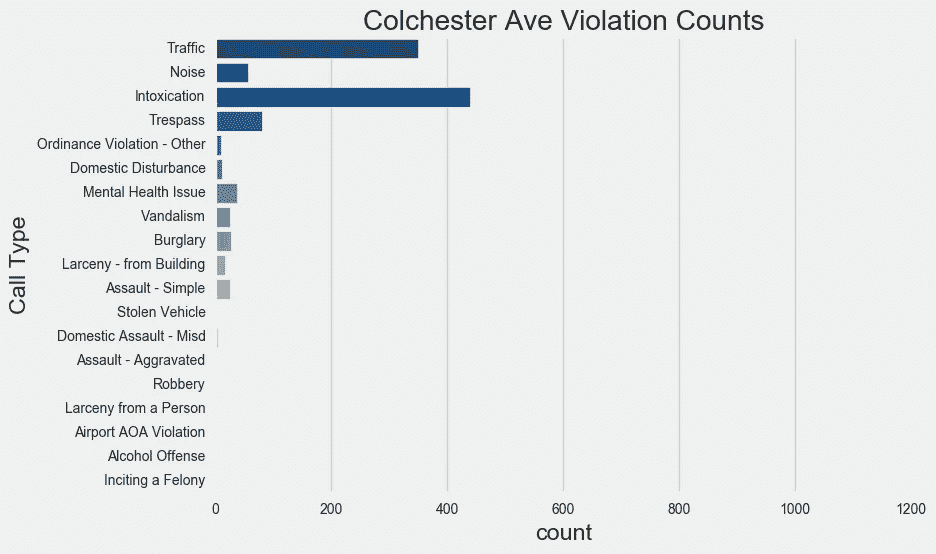

在这里你可以看到，从教堂街向外走，违法行为的类型减少了，只有醉酒例外。我猜这反映了学生们回家的路线，但有趣的是，当我看着大多数学生宿舍所在的南展望街时，那里几乎什么都没有。

# 主要街道

包围教堂街的南端，穿过 UVM 大学校园，我们看到一些与上面的 Pearl 和 Colchester 相同的行为，除了噪音投诉。

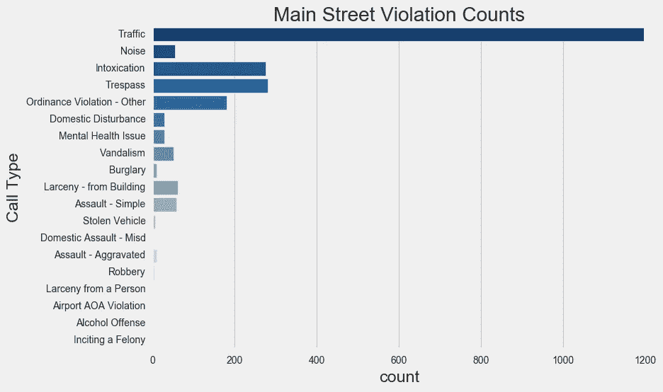

# 北大街

与目前其他的不同，这一次不是在去大学的路上，而是在去住宅区的路上。交通显然是首要问题。

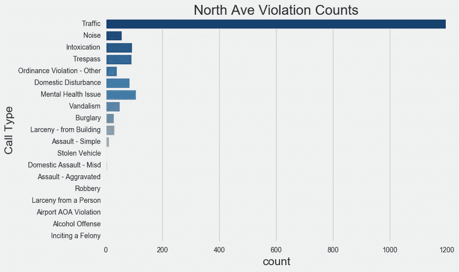

# 小时与呼叫类型

现在，让我们将一天中的具体时间与违规类型结合起来。这应该向我们显示某些违规行为最有可能发生或至少被报告的时间。

有趣的是，在 6 点的时候，这种巨大的增长一直持续到午夜。几乎就像在清晨、工作日和下班后有一个小小的平台期。

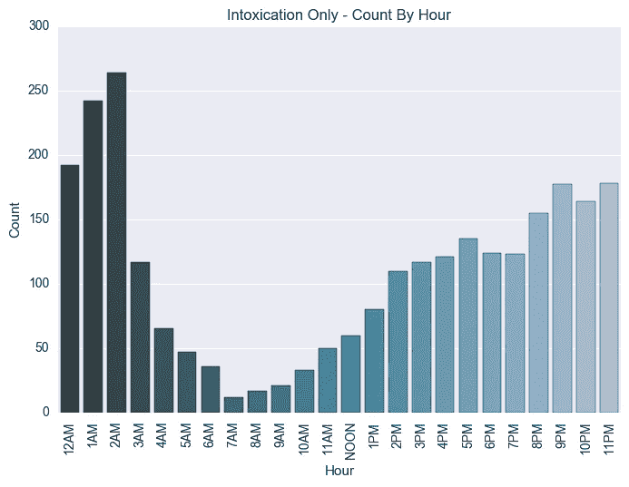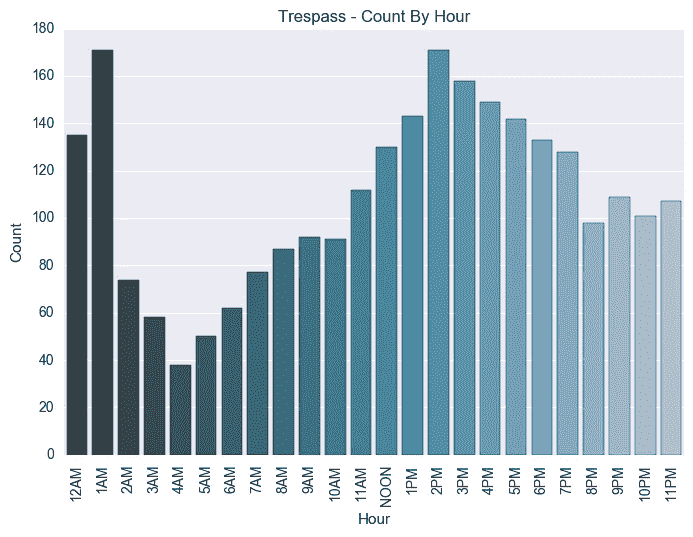

像这样分开，我不太确定酒保所说的醉酒和非法侵入的关联。如果酒吧阻止被踢出去的人重新进入是非法侵入的主要原因，那么有很多人试图在中午进入酒吧。

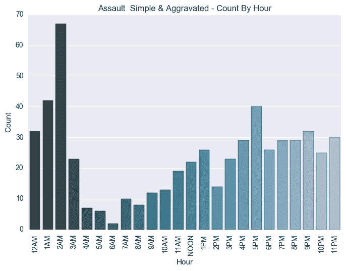

身体攻击和家庭暴力看起来有相似的形式，但是凌晨 2 点的攻击高峰显示了早上晚些时候喝多少酒可以影响决策。我也对下午 5 点的峰值很好奇，那里发生了什么？

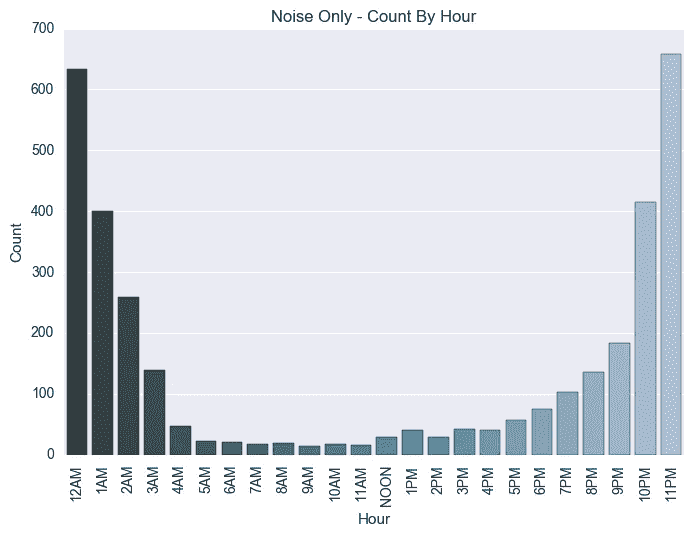

到目前为止，噪音违规比其他任何违规都有最有序的结构。噪音条例一天 24 小时执行，但晚上 10 点至早上 7 点之间有特定的安静时间，它显示。

精神健康问题似乎在上午 10 点有一个平台期，并在下午的大部分时间里保持在或接近这个水平。可能是同一个人的某个方面出现了反复的问题，但这些数据不会揭示这种趋势。

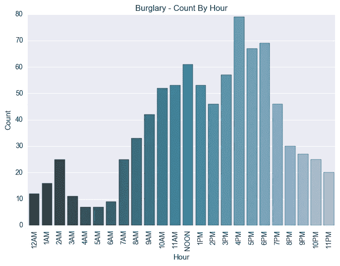

这是一个事故时间没有反映犯罪报告时间的例子。我想人们回家后会发现他们的房子被盗了，而不是在事情发生的时候呆在家里。

# 固有偏见

这是一个很好的点来谈一谈数据集如何有偏见，以及当政策根据这些见解进行修改时，如何将偏见纳入反馈循环。

给出违规的原因可能是因为官员发现了它，或者因为有人举报了它。例如，教堂街可能会有很多违规行为，因为整个晚上都有警察在那里巡逻。这并不意味着同样的违规行为没有在其他地方发生，只是没有人发现它。

这意味着这些模式可以在一个反馈循环中重新加强自己，通过对他们周围的一条街道进行更严格的监管，以发现更多的违法行为，这在数据中得到反映，他们被指示进行更多的巡逻，尽管这可能没有反映出现实中城市的犯罪密度。

我喜欢做这种工作，但从不把数据当作绝对的真理，每一部分都需要被认为是不完整的，随着一切变得越来越自动化，危险变得越来越明显。这种引入的偏见会因城市中不同种族、民族和阶级的聚集而放大，并以非常直接的方式不成比例地影响人们的生活。

以上数据应该持保留态度，我没有发现任何明显的偏见，种族不是我的数据中的一个变量，但请记住这一点

# 结论

我对此进行挖掘的结果并不令人惊讶，但有一些明显的趋势出现了:

*   违规计数明显受一天中的时间、一周中的日期和月份的影响(一般来说，二月星期一的凌晨 4 点问题最少，十月星期五晚上问题最严重)
*   交通违规是记录事件的主要原因，占总数的 40%,并且在以下方面具有独特的模式
*   相同的街道出现在多个违规类型列表的顶部，似乎存在特定热点位置的模式
*   分解一天中的时间和违规类型是非常有效的，并揭示了一些有趣的模式

将天气与违规类型进行比较会很有意思，因为我们已经可以看到寒冷是如何影响违规的。当他们发布从 2013 年到现在的数据时，看到比两年更长时间的趋势会很有趣。

我将继续看看我还能从伯灵顿的其他数据集中学到什么。喜欢就留言，喜欢就关注我！