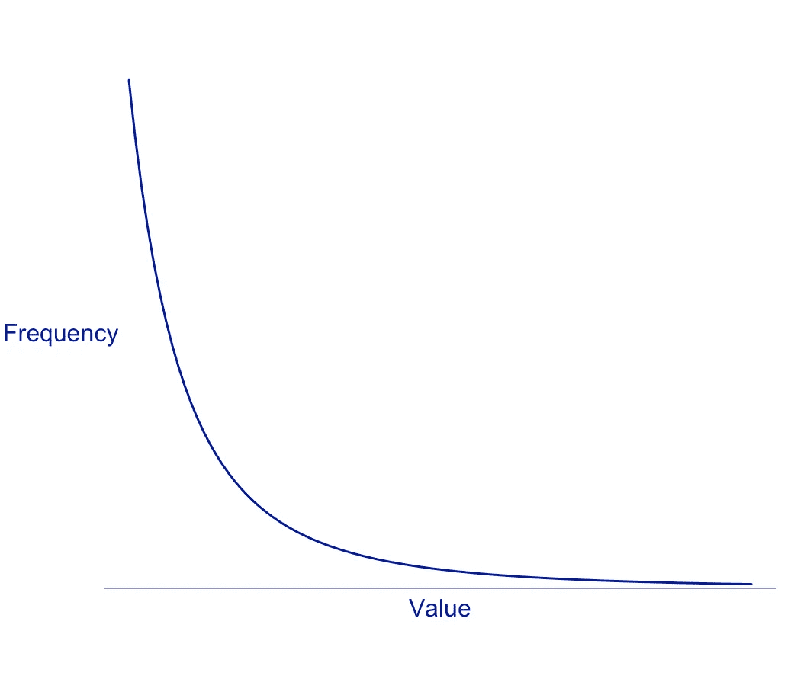

# 那只天鹅是什么颜色？

> 原文：<https://towardsdatascience.com/what-color-is-that-swan-372973f22c90?source=collection_archive---------3----------------------->

纳西姆·塔勒布的《黑天鹅》给广大观众带来了统计学、经济学和哲学中一些晦涩难懂的观点。他写这本书已经有一段时间了，但我最近才读了它。

当我读塔勒布的书时，许多观点让我感觉很熟悉。具有讽刺意味的是，这是因为我对经济学的研究，而塔勒布对此进行了激烈的批评。(不过，我认为塔勒布的厌恶针对的是金融和宏观经济学家，而不是我的领域——应用微观。)我在塔勒布身上感受到了一种同道中人的精神，因为他尊重不确定性。

很难用一段话来概括像塔勒布这样的一本书，因为事实上这本书里有许多优秀而独特的思想。然而，人们喜欢简化，黑天鹅*已经被简化为一个单一的主要想法。以下是亚马逊上的营销声明:*

> 黑天鹅是一个事件，积极的或消极的，被认为是不可能的，但造成巨大的后果。在这本具有开创性和预言性的书中，塔勒布以一种有趣的方式展示了黑天鹅事件几乎解释了我们世界的一切，然而我们——尤其是专家们——却对它们视而不见

“几乎一切”的说法值得商榷。塔勒布的例子主要集中在金融领域，他确实倾向于推断。以下是该书更具批判性的总结:

> 我可以通过总结这本书的主要观点来帮你节省这本书的价格——以及你阅读这本书所需要的时间:难以预测的事件很难预测，因为它们很难预测，我们经常欺骗自己认为我们可以预测它们。但是我们不能。

读完这本书后，很容易看出大多数人留下的是什么:有些事件，黑天鹅，既极其重要又不可预测。

不过，这本书还有更多的内容，我希望在这篇文章中探索一下。

## 灰色天鹅

在读这本书之前，我从来没有提到过灰天鹅。这让我很惊讶，因为我在书的早期就想知道塔勒布所讨论的关于灰天鹅的话题。

要了解灰天鹅，了解一两件关于伯努瓦·曼德尔布罗的事情是很重要的。Mandelbrot 是一位应用数学家，他发展了一门叫做分形几何的数学分支。不严格地说，分形几何是对不同尺度上重复模式的研究。Mandelbrot 发现分形几何为我们在自然界看到的许多事物提供了很好的模型。例如，树枝看起来很像树，只是更小。一个小的岩石露头看起来很像一座山，只是小一些。Mandelbrot 的工作使得在过去看似混乱的事物中发现模式成为可能。

为了我们的目的，重要的是要知道 Mandelbrot 和他的学生发现了许多复杂现象遵循幂律分布的大量证据。(这里有一些技术上的注意事项，但除非感兴趣的读者要求，否则我将省略它们。)

幂律分布很有趣，因为它们是分形的。幂律直方图可能是这样的:

如果这些值来自幂律分布，此图表仅显示不同值的概率。在最左边，你有低值，它们非常频繁。右边，你的值很高，而且不那么频繁。

正如我所说，幂律分布是分形的。假设你在上图左侧的某处画了一条垂直线。然后放大并重新绘制图形。我会给你一张新的图片，但我不需要:它看起来几乎和上面的一样。这就是幂律分布被称为“可伸缩”或“分形”的原因它们在不同的尺度上重复出现。

那又怎样？好吧，让我们把这个想象成美国的收入图表。幂律的分形性质意味着最富有的 10%之间的不平等与整体的不平等一样明显。

那就回到塔勒布的灰天鹅。灰天鹅类似于拥有 2000 亿美元净资产的人。(我刚刚查了一下，比尔·盖茨现在估计有 870 亿美元。最近，富豪榜有所波动。)因为幂律分布，我们都知道这是有可能发生的。此外，我们知道，认为有人可能在可预见的未来达到 5000 亿美元，甚至可能达到 1 万亿美元，这并不疯狂。如果发生这种情况，我们也不会完全措手不及。因此，我们的知识让一些黑天鹅变成了灰色。然而，它们并不是完全白色的，因为它们仍然是不可预测的，而且它们关系重大。提示一个关于有多少财富被最富有的 1%或其他人控制的统计数据。

现在，所有这些都是为了说明灰天鹅和黑天鹅的区别是非常重要的。

## 盲目的

我在盐湖城长大，它正好位于一条大断层线上。每个人都知道有一天，也许是明天，也许是 500 年后，沿着瓦萨奇前线很可能会有一场大地震。所以人们在某种程度上已经做好了准备。至少，如果发生了，没有人会说“我从来没想过这是可能的。”SLC 大地震:灰天鹅。

另一方面，2008 年金融危机是一只黑天鹅。一小部分人可能已经看到了它的到来。不过，最主要的是，它不知从哪里冒出来的。或者更准确地说，它是从我们的盲点靠近的。(在我看来，金融业没有因为发现盲点而得到任何赞誉。事实上，我要说复杂的建模和“风险管理”实际上在很大程度上保留了盲点。AAA 评级很有分量。谁知道我们得回去检查穆迪的工作？)

黑天鹅是巨大的事件，它们不仅仅是普通的不可预测的。它们有不可预知的原因。还记得 SLC 的地震吗？我们知道地震将会发生，我们知道原因是什么，只是不知道什么时候。对于黑天鹅，我们甚至不知道会发生什么。

## 知识毁灭

灰天鹅和黑天鹅之间另一个相当重要的区别与一个无聊的技术术语有关:“数据生成过程。”基本上，我们世界中的事物会产生数据。我们经常想知道给出数据的底层过程，并且我们经常只能通过研究数据本身来找到答案。

这是一个棘手的问题，塔勒布详细阐述了这个问题。一个简短的例子对我来说就够了。假装你回到家，看到一扇窗户被砸碎，一些贵重物品从你的卧室被偷走。窗户和贵重物品是数据点。您真的很想知道生成这些数据点的过程。即使你认为是窃贼造成了这两个事实(相对于，比如说，地震和需要借一些珠宝的家庭成员的组合)，你仍然不知道窃贼来自哪里。为什么你是目标？下一个是谁？

在这方面，灰天鹅还是比黑天鹅更容易驯服。随着你观察到越来越多的数据点，你开始了解事件的分布。这是非常缓慢的，仍然有很大的不确定性(T2 什么时候会看到万亿美元？)，但至少你可以用之前的数据做一些有根据的猜测。然而，对于黑天鹅，以前的数据本质上是没有帮助的。原因是因为黑天鹅产生于你推理系统之外的事物。它们是你的世界“模型”之外的风险。

“黑天鹅”还有更多坏消息，这源于它们的影响力如此之大。黑天鹅引发了经济学家有时称之为“结构性断裂”或“政权更迭”的现象。基本上，这意味着他们改变了数据生成过程。

再举一个例子，这次是从塔勒布回收的。这是火鸡的例子。我们有一只火鸡，随着时间的推移，它学会了每天被喂养和照顾。火鸡可能开始觉得它在积累数据生成过程的知识，直到感恩节到来。

感恩节过后，我们发现所有的数据收集都是无用的。感恩节前的数据生成过程完全没有告诉我们从感恩节开始的过程。

第二个例子。2008 年的黑天鹅事件对金融行业产生了巨大影响。压力测试、抵押贷款改革、资本要求和财政紧缩都是反应的特征。尽管有些人声称社会什么都没有改变，并且正在重蹈覆辙，但我认为我们已经对金融体系进行了修改，这些修改已经影响了 2008 年以后的数据生成过程。出于这个原因，查看 2008 年之前的数据并不能告诉我们 2008 年之后的情况。人们生活在一个不同的世界，正是因为 2008 年的黑天鹅。

## 观鸟

塔勒布以一些关于该做什么的讨论结束了*黑天鹅*，并且他以这种方式继续他随后的工作。

最后，我要指出，我认为大多数人并没有完全理解这本书。我在亚马逊的示例评论很好地证明了这一点。不确定性有很多种。我们应该努力学习更多关于地震震级的知识。然而，我们不应该试图预测和避免所有可能发生的坏事。调查灰天鹅是富有成效的，即使它不能提供确定性。调查黑天鹅通常不会有什么结果。

塔勒布讨论的另一个话题涉及保护我们免受负面黑天鹅的影响，以及从正面黑天鹅中获利的机会。这是另一篇文章的主题，即将发表。