# 理想的数据科学家的个人资料是什么样的？

> 原文：<https://towardsdatascience.com/what-does-an-ideal-data-scientists-profile-look-like-7d7bd78ff7ab?source=collection_archive---------1----------------------->

# 分析 1000 份招聘启事的结果

(这是我的数据科学职业项目的第 2 部分。你可以在这里找到第一部[。)](https://hackernoon.com/navigating-the-data-science-career-landscape-db746a61ac62)

如果你是一名数据科学求职者，你一定一直在想应该在简历上写些什么技能才能接到电话；如果你想进入这个领域，你可能已经挠了很多次头，想知道学习哪些技术才能成为一个有吸引力的候选人。

继续读下去，我有你的答案。

首先，我们看看不同职位的技能要求。(图表如下)

# Python 和 R 之间不再有争论，因为 Python 现在是主导者

曾经有一场关于 Python 或 R 是数据科学的首选语言的争论。显然，市场需求告诉我们，Python 现在是领导者。同样值得注意的是，R 甚至比 SAS 更少被提及。因此，如果您正在考虑进入数据科学，请考虑将您的学习精力集中在 Python 上。SQL 作为数据库的语言(也可能是数据！)，成为数据科学家第二重要的语言。由于数据科学家职业的广泛性，其他语言也扮演着重要的角色。

总结一下，数据科学家的顶级语言有: *Python，SQL，Scala，Lua，Java，SAS，R，C++和 Matlab* 。

# 机器学习工程师所需的语言更加多样化

Python 作为机器学习的事实上的语言，毫不奇怪地成为机器学习工程师的顶级语言。因为需要从零开始实现算法，在大数据环境中部署 ML 模型，所以 C++和 Scala 等相关语言也很重要。总的来说，与其他两个角色相比，对语言的需求似乎更加分散。

综上所述，机器学习工程师的顶级语言有: *Python，Scala，Java，C++，Lua，SQL，Javascript，Matlab，CSS 和 C#* 。

# 如果你想成为一名数据工程师，SQL 是绝对必须的

数据工程师无时无刻不在和数据库打交道，SQL 就是数据库语言，所以难怪 SQL 是顶级语言。Python 很重要，但还是输给了 Scala 和 Java，因为这些语言帮助数据工程师处理大数据。

综上所述，数据工程师的顶级语言有: *SQL、Scala、Java、Python 和 Lua* 。

# Scala 正在成为数据科学中第二重要的语言(不是 R)

有趣的是，当我们研究不同的角色时，Scala 要么是第二，要么是第三。所以我们可以说数据科学中排名前三的语言是 *Python、SQL 和 Scala* 。如果你正在考虑学习一门新的语言，考虑 Scala！

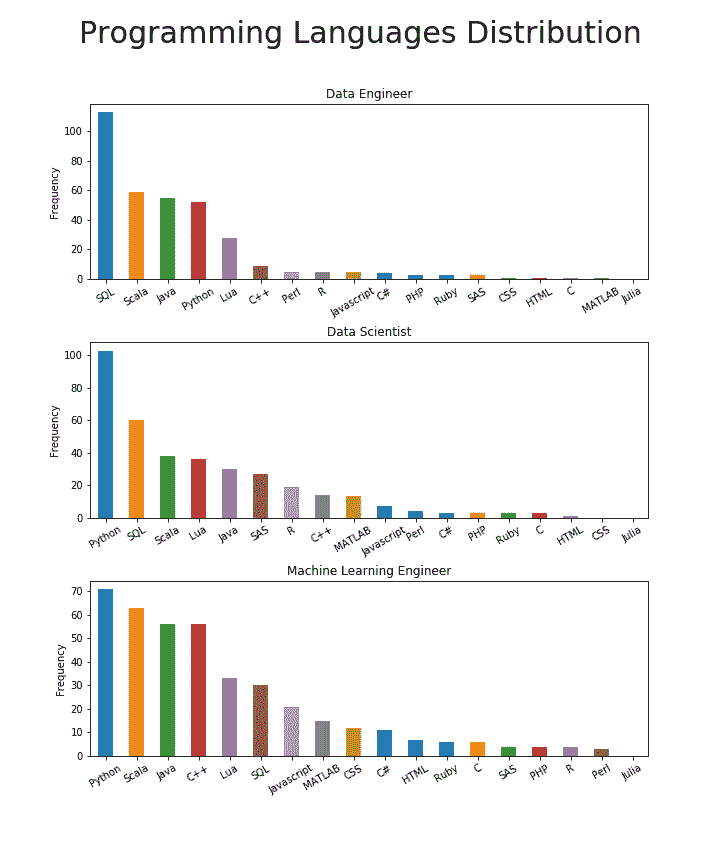

# Spark 是除了数据工程师之外最顶尖的大数据技能

仅对于数据工程师而言，Hadoop 比 Spark 被提及得多一点，但总体而言，Spark 绝对是人们应该首先学习的大数据框架。Cassandra 对于工程师来说比科学家更重要，而 Storm 似乎只与数据工程师相关。

综上所述，数据科学的顶级大数据技术有: *Spark，Hadoop，Kafka，Hive。*

# 在深度学习方面，TensorFlow 是王者

数据工程师的招聘信息中很少提到深度学习框架，因此这个角色似乎不需要 DL 框架。对 DL 框架的最多提及来自机器学习工程师角色，这表明 ML 工程师确实大量处理机器学习建模，而不仅仅是模型部署。再者，TensorFlow 在深度学习领域绝对是霸主。虽然 Keras 作为一个高级深度学习框架真的很受数据科学家的欢迎，但它几乎与机器学习工程师的角色无关，这可能表明 ML 从业者大多使用 TensorFlow 等较低级别的框架。

综上所述，数据科学中最重要的深度学习框架有: *TensorFlow，Torch，Caffee，MXNet* 。

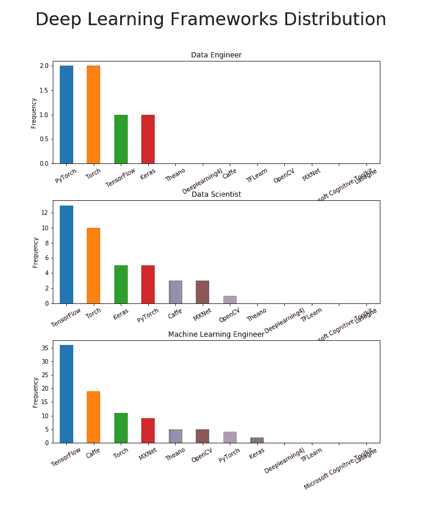

# AWS 全面领先

# 计算机视觉是机器学习中最大的需求来源

对于一般的数据科学家来说，自然语言处理是最大的 ML 应用领域，其次是计算机视觉、语音识别、欺诈检测和推荐系统。有意思的是，对于机器学习工程师来说，最大的需求仅来自计算机视觉，自然语言处理远在其次。另一方面，数据工程师再次成为焦点专家——这些 ML 应用领域都与他们无关。

**洞察力** —如果你想成为一名数据科学家，你可以根据你想进入的领域选择各种类型的项目来展示你的专业知识，但对于机器学习工程师来说，计算机视觉是一条出路！

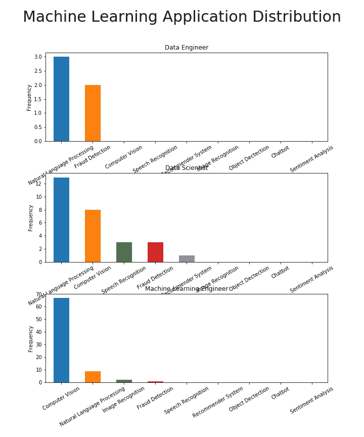

# 说到可视化，Tableau 是必须的

数据科学家最需要可视化工具，而数据工程师和机器学习工程师很少提到可视化工具。然而，Tableau 是所有角色的首选。对于数据科学家来说，Shiny、Matplotlib、ggplot 和 Seaborn 似乎同样重要。

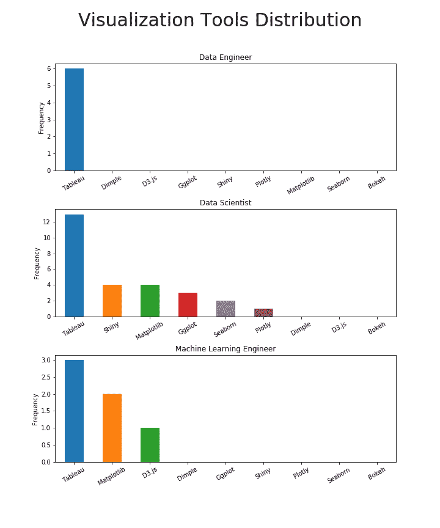

# Git 对每个人都很重要，而 Docker 只针对工程师

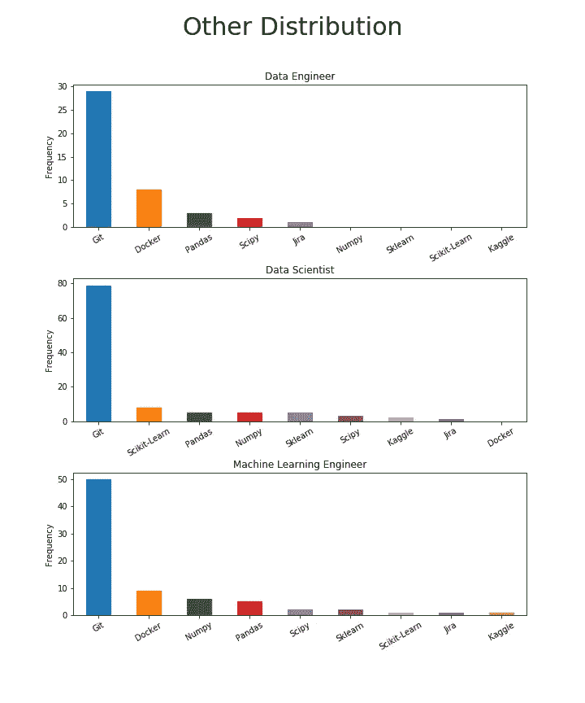

接下来，我们使用词云来探索每个角色最常用的关键词，并结合相应的技能来构建所有数据科学角色的理想配置文件！

# 数据科学家更多的是关于机器学习，而不是商业或分析

数据科学家一直被视为需要统计、分析、机器学习和商业知识的全能职业。现在看来还是这样，或者至少，在一个数据科学家身上还是有各种需求的。然而，现在数据科学家似乎更关注机器学习，而不是其他任何东西。

其他顶级要求包括:*业务、管理、沟通、研究、开发、分析、产品、技术、统计、算法、模型、客户/客户和计算机科学*。

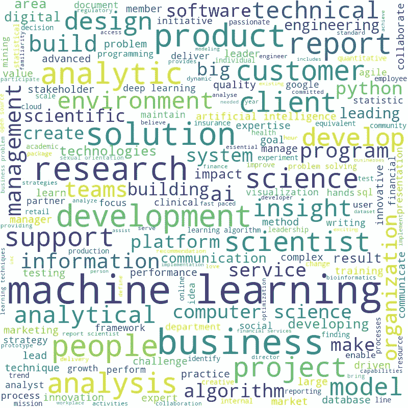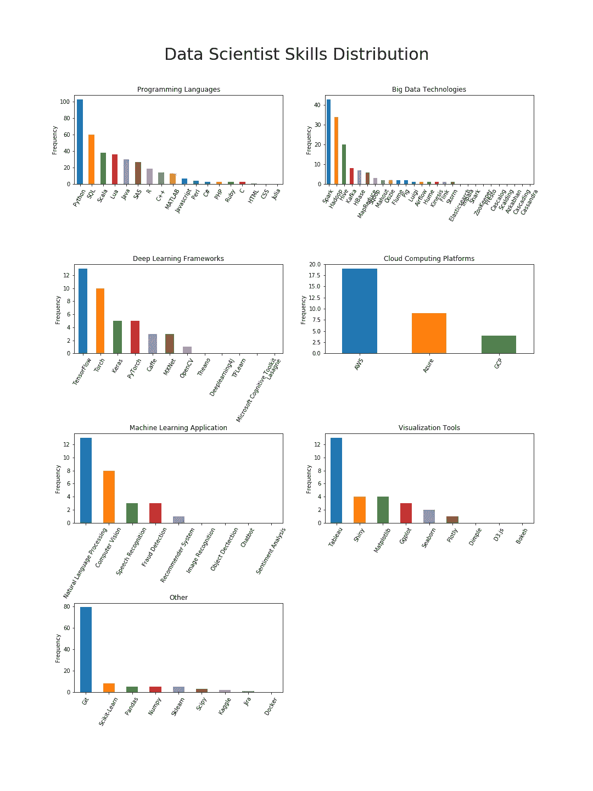

# 机器学习工程师是关于研究、系统设计和构建的

与一般的数据科学家相比，机器学习工程师显然似乎有更专注的投资组合，包括研究、设计和工程。显然，解决方案、产品、软件和系统是主导主题。与之相伴的还有研究、算法、人工智能、深度学习和计算机视觉。有趣的是，商业、管理、客户和沟通等术语似乎也很重要。这可以在这个项目的下一次迭代中进一步研究。另一方面，管道和平台也很突出，证实了机器学习工程师在建立数据管道以部署 ML 系统方面的责任的共同理解。

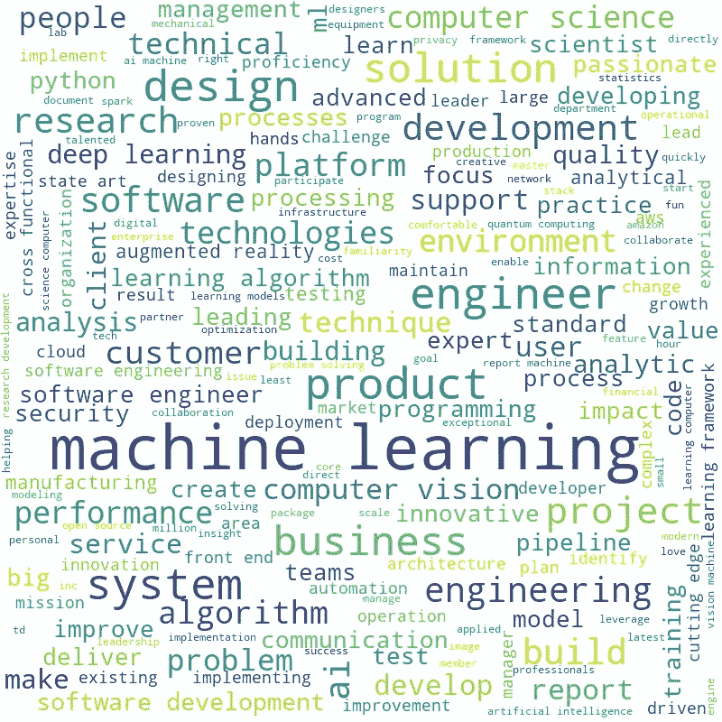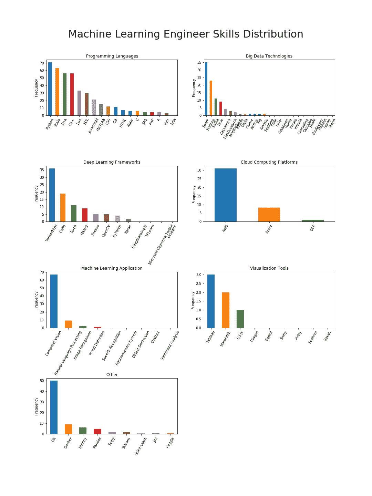

# 数据工程师是真正的专家

数据工程师拥有比机器学习工程师更专注的投资组合。显然，重点是通过设计和开发管道来支持产品、系统和解决方案。最高要求包括技术技能、数据库、构建、测试、环境和质量。机器学习也很重要，可能是因为管道主要是为了支持 ML 模型部署数据需求而构建的。

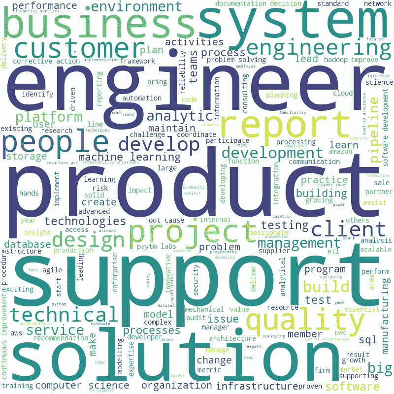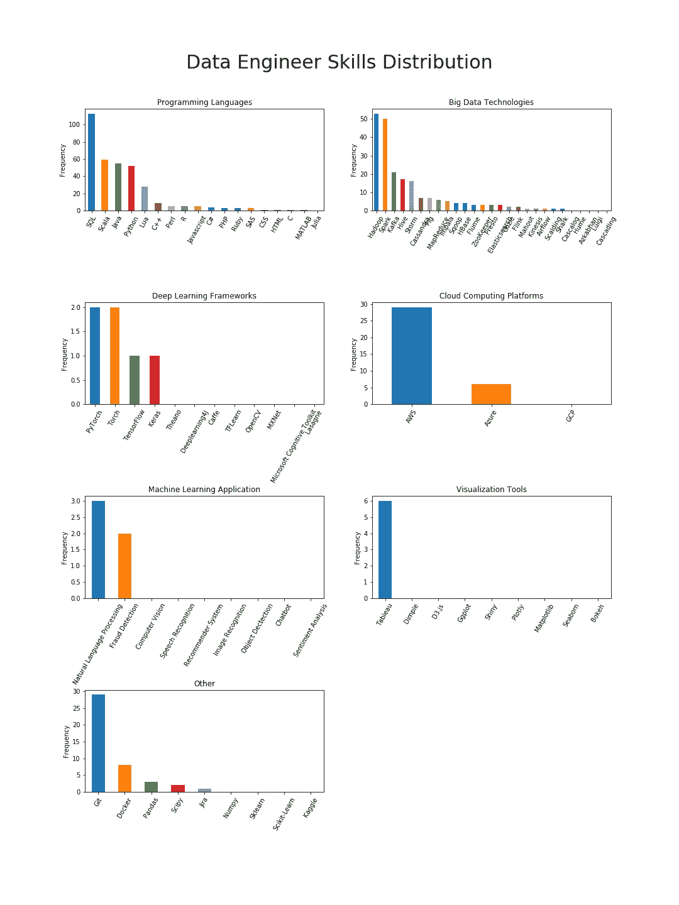

就是这样！我希望这个项目能帮助你了解雇主在寻找什么，最重要的是帮助你做出明智的决定，如何定制你的简历和学习什么技术！如果你喜欢这个帖子，我会感谢你的掌声，谢谢！

附言:我将在单独的帖子中讲述技术细节，请继续关注，更多内容即将推出:)

我们上 [LinkedIn](https://www.linkedin.com/in/georgeliu2/) 连线吧！