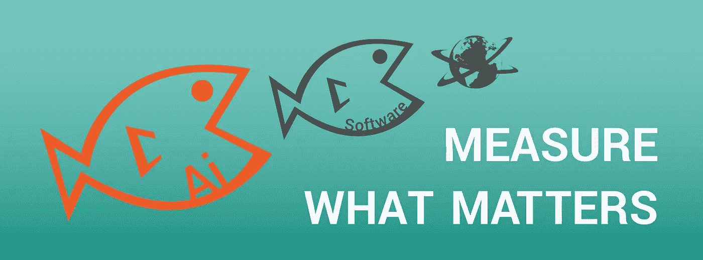
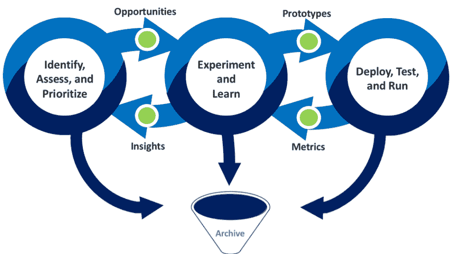

# 运营一个预测模型到底意味着什么？

> 原文：<https://towardsdatascience.com/what-does-it-really-mean-to-operationalize-a-predictive-model-1c2864678d40?source=collection_archive---------20----------------------->

## 仅仅建立一个能够做出预测的 web 服务是不够的。

[Original Image Source](https://live.staticflickr.com/63/202224772_4e6f0d2c0e_b.jpg) — Meme overlay by Imgflip

在 [2017 年 SAS 调查](https://www.sas.com/fr_ma/news/press-releases/2017/january/big-data-survey.html)中，83%的组织在大数据方面进行了中度至显著的投资，但只有 33%的组织表示他们从投资中获得了价值。最近在 T4 的其他调查也显示了类似的结果。我们发现，这种差距的主要原因是未能理解以真正有利于您的业务的方式实施预测所需的全部范围。在这篇文章中，我将带您浏览一个示例场景，并展示成功如何需要一个过程来确保与受影响的人保持一致，保持对要获得的业务价值的关注，并迭代地构建技术平台。

[Photo Source](https://www.pexels.com/photo/ai-https-www-cien-ai-sales-529629/)

在您的数据科学团队加载第一个数据框之前，模型的操作流程就已开始。一个高功能的数据科学团队将与业务一起产生想法，并展望将产生的业务价值。例如，仅仅说“我们想预测客户流失”是不够的。一个更好的商业假设可能是，“我们希望通过向 10%最有可能流失的客户发送有针对性的促销信息来防止他们流失，从而每年节省 72 万美元”。确定工作积压的优先级时，数据科学团队应该关注那些具有最高潜在投资回报的想法。正如我的同事肖恩·麦考尔指出的，这项任务应该落到数据科学产品负责人的肩上。您可以在下面找到一个计算客户流失率的示例:

`($300 cost of acquisition (measured)
— $100 cost of promotion(assumed))
* 30% success of retaining with promotion (assumed)
* 10000 customer churn per month (measured)
= $60K / month
= $720K / year`

一旦数据科学团队开始开发支持业务理念的模型，他们应该从最简单的模型开始，定期与受影响最大的团队分享结果，与他们合作改进模型，并共同决定模型何时足够好。这就是我们先前粗略估价的用处。与你的利益相关者谈论 RMSE、特征向量和 ROC 曲线很可能会让他们失去兴趣。通过将您试图预测的准确性翻译回业务价值陈述，您将说同一种语言。“我们能够以 75%的准确率预测客户流失”听起来要好得多，“根据目前的假设，这将为我们每月节省大约 45，000 美元”，尤其是当您在下一步中实际开始实施该模型时。

当模型背后的团队决定开始在生产中运行模型时，他们还应该了解构建和运行生产版本的成本(包括提供输入数据的数据平台、模型预测端点和模型服务的监控)。这与上面的数据科学家的成本一起，提供了 ROI 等式的成本侧。进行这种估算的细节超出了本文的范围，所以让我们假设成本是 18 万美元。以此成本，该解决方案应在 4 个月内收回成本，并提供 54 万美元的 1 年投资回报。这是一个巨大的回报，因此我们开始了自动化数据馈送的过程，在 web 服务后面部署模型，生成预测，并将预测结果集成到新的和现有的应用程序中，以使它们易于使用。因为我们一直在与预测的最终用户合作，我们知道他们希望看到哪些细节来帮助建立对预测的信任。

现在我们已经到了实际操作模型的地步，我们仍然需要说服人们使用它。在我们之前的例子中，让我们假设提供我们的目标促销的一种方式是手写笔记给客户。首先，我们需要说服某人提供预算来建立一个笔记部门(也许我们会投资一个 Robotica 的那些 [Turry 手写机器人)。如果我们不把它全部交给机器人，我们将需要通过展示他们的工作正在产生影响来激励我们的人类笔记团队。我们应该开发一个跟踪系统，看看我们的笔记中的促销活动是否被实际使用，以及有多少百分比的促销活动用户仍然在公司工作。这将允许我们验证业务假设，并帮助通知其他决策。](https://waitbutwhy.com/2015/01/artificial-intelligence-revolution-2.html)

因此，现在我们已经建立了一个很好的模型托管系统，并且我们正在测量 75%的预期保留率(人们似乎总是高估这些类型的假设，但这没关系，因为我们仍然有望节省 40.5 万美元)，该团队可能会继续构建其他高价值的模型。一个经常被忽视的关键步骤是将跨多个模型的通用操作构建到一个平台或框架中。为了在任何规模下操作模型，底层数据平台必须足够灵活，能够进行快速实验，同时还必须足够可伸缩，能够处理转换，并有助于快速预测大量数据。为了证明这些投资的成本，可以将它们分摊到几个模型的 ROI 中。

随着这一过程的重复，平台变得更加强大，团队在评估价值和与最终用户建立信任方面变得更好，我们能够真正大规模地运营模型。团队开始基于他们的预测模型更快地生产有价值的应用程序、功能和见解，更广泛的业务开始更快地信任这些结果。

然后，6 个月后的某一天，警报响起，客户流失模型不再有效。准确率已经下降到 50%，所以本质上只是猜测。数据科学团队必须努力找出问题所在并加以解决。输入数据发生了什么变化？我们上次部署该模型是什么时候？底层机器上的补丁破坏了什么吗？如果能回到我们训练模型时的确切状态就好了，这样我们就可以确定发生了什么变化。最终，有人发现并纠正了问题(由于错误的部署，所有客户的使用度量被设置为 0)。类似这样的事件导致团队专注于构建主动调试工具，如关键功能的异常检测和预测结果，以更快地检测和隔离问题。

此时，您的组织能够大规模构建和部署高价值的机器学习应用程序，同时将风险降至最低。这就是我们在 Pariveda 所说的“机器学习作为一种商业能力”。

虽然上面的故事是虚构的，但它是基于我们在机器学习旅程的各个阶段与许多客户合作的经验。如果您对此有任何问题，我很乐意讨论支持实验和模型操作的技术平台，以及对架构、流程和工具的指导/实现支持，以使您的团队能够将机器学习作为一种业务能力。

*原载于 2018 年 8 月 13 日*[*【http://parivedaperspectives.com】*](https://parivedaperspectives.com/2018/08/13/what-does-it-really-mean-to-operationalize-a-predictive-model/)*。*