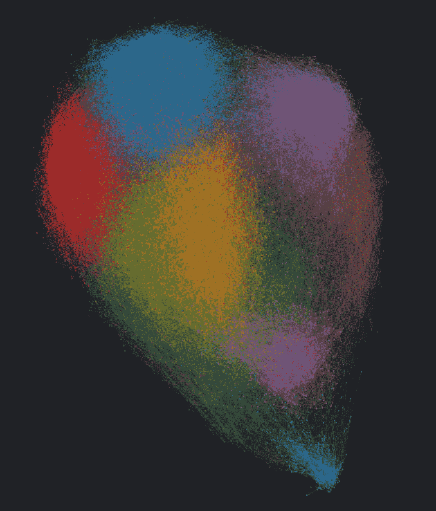
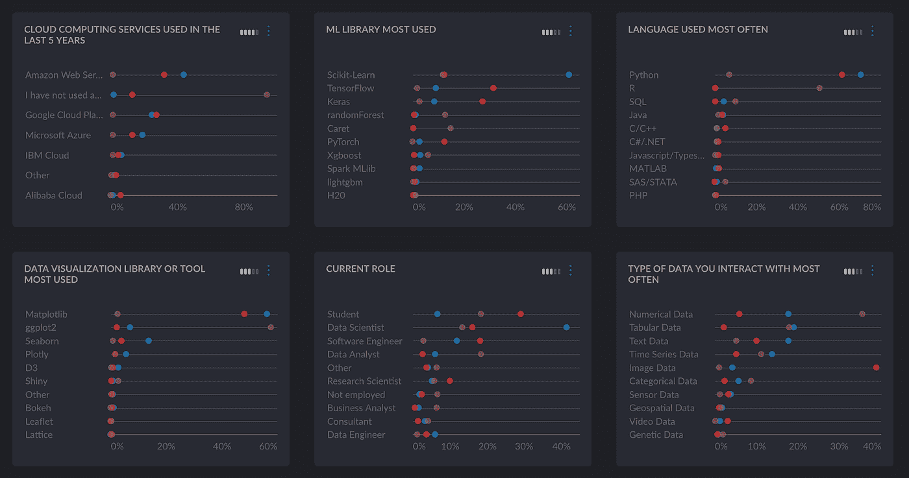

# 关于数据科学，Kaggle 调查告诉了我们什么

> 原文：<https://towardsdatascience.com/what-does-kaggle-survey-tell-us-about-data-science-1f634ea000b1?source=collection_archive---------15----------------------->

*使用 Graphext 理解用户配置文件*

Kaggle 最近发表了第二次年度机器学习和数据科学调查。全球约有 24，000 名用户参与了此次调查，透露了许多关于他们的人口统计、行为和观点的信息。它为机器学习和数据科学行业提供了一个独特的视角。

通过分析调查，我们想探索对特定人群来说什么是最重要的。但是任何调查分析的挑战总是在于，定义“一个群体”的最佳方式是什么？应该根据人口统计特征还是行为来划分人群？我们如何彻底调查数据，以便了解宏观趋势(例如，全球技术行业)和微观趋势(例如，在巴西工作的女性数据科学家主要使用 R )?在本文中，我们试图使用我们的软件 [Graphext](http://www.graphext.com) 运行调查分析来回答这些问题。

[Graphext](http://www.graphext.com) 的妙处在于，我们允许用户通过两种方式探索数据:一是通过无监督的数据分割；第二，通过回答具体问题。

**第 1 部分——无监督分割**

在将数据集上传到 [Graphext](http://www.graphext.com) 后，软件自动绘制出调查数据的拓扑结构(在这种情况下，它看起来像一个巨大的热气球)，并自动将响应分成几个集群。就我个人而言，我总是发现从一个概括的个人资料或用户考虑许多不同的特征开始非常有帮助。一旦我能想象出这个用户是谁，他/她每天做什么，通常他们的行为对我来说更有意义。

所以看看这些由无监督学习分割的聚类，一些有趣的轮廓从数据中跳出来。

蓝色集群(人口的 20%):约翰 38 岁，住在旧金山。他在一家科技公司工作，担任高级数据科学家。他拥有计算机科学博士学位，过去 6 年一直在数据科学领域工作。他的公司在技术方面相当成熟，所以他主要从事大数据方面的工作。他的工作包括构建原型，然后在 AWS 上运行 ML 模型。他使用 Python，尤其是 Scikit-learn 库，因为他主要处理表格、文本和时间序列数据。

红簇(人口的 10%):来自上海的年轻研究员明。他今年 25 岁，正在探索不同的 ML 方法来推进他的研究。他的研究重点是图像识别。他主要使用 Python、TensorFlow 和 Keras 库来处理图像数据。由于他不使用大数据集，他主要使用托管解决方案，但偶尔会使用阿里云。他拥有软件工程师学位，在 ML 领域只有 2-3 年的经验。对他来说，ML 是一个黑盒子，虽然他使用它，但他不觉得有必要向他的观众解释输出。

棕色人种(占总人口的 8%):Karina 是来自伦敦的商业分析师。她 27 岁，在一家保险公司工作。她拥有统计学本科学位，尽管她对数据科学非常感兴趣，但她从未接受过任何培训。她已经做了 4 年的工作，她的主要目标是发展分析来影响公司的决策者。她很少使用 ML，但是当她使用时，她使用随机森林和插入符号库来处理数字数据。对她来说，向她的利益相关者解释她的模型的输出并避免任何偏见是非常重要的。

如您所见，要构建丰富的用户资料，您需要提供许多详细的特征。当您有太多的数据维度需要考虑时，很难手动完成。但是有了 [Graphext](http://www.graphext.com) 这样的工具，你可以在几分钟内得到一个无偏的结果。

**第二部分——回答具体问题**

一旦你对调查人群有了一个总体的了解，通常，你会想用这些数据来回答一些特定的问题。在这种情况下，我们想知道欧洲的用户和美国的用户有什么不同。为此，我们选择了两组用户:来自排名前五的欧洲国家(英国、德国、法国、西班牙、意大利)的用户和来自美国的用户。我们简单地将它们分组以缩小我们的分析范围

[Graphext](http://www.graphext.com) 有一个“比较”功能，可以让你通过自动突出显示可以从统计上解释它们差异的变量来比较两个或多个组。下面是我们使用这个函数得到的结果(美国用蓝色表示，欧洲用橙色表示):

首先，欧洲用户的薪资水平远低于美国用户。从他们的背景来看，欧洲用户似乎更具技术性:他们更有可能拥有计算机科学、数学和物理学的硕士或博士学位，他们的工作是数据科学家和研究科学家。而在美国，用户更可能拥有工程、商业或生命科学方面的学士学位。除了像数据科学家这样的典型角色，他们还担任数据分析师和业务分析师。技术经验的水平也反映在他们使用的工具类型上。

当我们继续探索他们的差异时，我们发现欧洲用户更多地使用时间序列数据，而美国用户更多地使用数字数据。当我们观察这些用户工作的行业时，美国医疗和制药行业的用户比例几乎是欧洲用户比例的两倍。此外，与美国相比，欧洲男性用户的比例似乎略高。

尽管有这些不同，他们的挫折似乎是普遍的。他们都在数据清理上花了太多时间，他们发现很难解释黑盒模型，很难让工作易于重用，很难让算法公平或无偏见。我想这些共同的挫折是我们在 DS 和 ML 学科中的纽带，让我们互相学习。

我希望你喜欢阅读这篇文章。如果我的分析引起了你的兴趣，那么我鼓励你向我们索取一个演示来亲自看看 Graphext 在探索数据方面能做些什么！