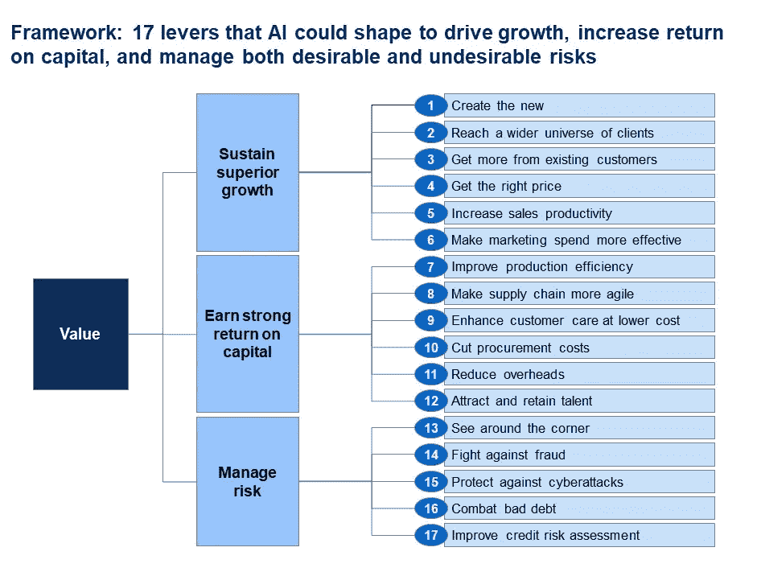

# 每个 CEO 需要了解的人工智能知识。第一部分:增长

> 原文：<https://towardsdatascience.com/what-every-ceo-needs-to-know-about-ai-part-one-growth-5c9c9d21374?source=collection_archive---------21----------------------->

简单地将 AI 委托给你的数字团队是错误的。以下是您如何利用它来改变您业务的方方面面。

人工智能(AI)允许公司思考以前不可想象的事情。然而，尽管微软、亚马逊、脸书、谷歌和百度等科技巨头将人工智能作为其核心，并定期利用其潜力，但大多数其他非科技公司现在才开始意识到人工智能给他们带来的机遇。

很少有首席执行官意识到人工智能可以帮助他们实现商业目标并塑造 P & L 。他们知道如何利用组织重新设计、削减成本、并购、业务和产品发布以及地理扩张，但未能看到人工智能是一个可以添加到他们工具包中的强大工具。

由于大多数非科技公司的首席执行官不知道如何将人工智能融入他们的商业战略，他们倾向于将人工智能工作委托给他们的数字团队。但是这些团队不可避免地从技术的角度而不是 P&L 的角度来看待它。我看到的是数字团队迷失在树林中，而牺牲了森林。后者需要高级商业领袖充分理解和欣赏人工智能如何帮助他们。

每个首席执行官都应该能够在人工智能的帮助下重新想象他们的业务和 P&L。作为一个指南，我确定了首席执行官可以在人工智能的帮助下塑造的 17 个杠杆，以提高他们的损益。我开发的框架(如下)既可以用作评估你的团队围绕人工智能所做努力的当前状态的晴雨表，也可以用于发现新的机会。这 17 个杠杆展示了人工智能如何帮助推动卓越的增长，提高资本回报率，以及管理可取和不可取的风险。

该框架将帮助您与您的团队围绕如何利用人工智能的力量进行结构化和集中的讨论，关注以下问题:

*   奖金的潜在规模有多大？
*   市场进化到了什么阶段？
*   早期采用者实现了什么？
*   要避免哪些陷阱？

**持续高速增长**

我们先来看增长。持续的高速增长是难以捉摸的。没有必胜的公式。但成功的公司似乎掌握了战略、资本配置、创新、市场扩张以及卓越的销售和营销的调配权。这些杠杆中的最后三个一直是人工智能早期采用者的关注点。

**创造新的**

推动增长的秘诀是大胆开发一种全新的产品，这在以前是不可能的。以亚马逊的智能音箱 Alexa 为例——现在每六个美国家庭中就有一个。这是一项创新，打破了电信巨头、手机制造商和家庭娱乐系统提供商对进入家庭的“声音”的束缚。

在零售领域，在线超市集团 Ocado 已经将人工智能置于其新客户服务中心运营方式的核心——我们过去称之为仓库。该公司坚持认为，组装订单的时间已经从几个小时减少到几分钟。算法运行仓库以确保速度、准确性和质量——甚至确保西瓜不是放在一箱鸡蛋上面。人工智能平台不仅让 Ocado 有效地运营自己的业务:它还将该系统出售给了海外的其他零售商。

微小的进步，比如给现有产品添加一些人工智能，可能会帮助你保持竞争力。但它不太可能增加你的收入或利润，除非你是苹果公司推出具有面部识别功能的 iPhoneX，或者你可以模块化你的产品并为人工智能模块定价。

**接触更广泛的客户群体**

**有远见的公司已经开始使用人工智能来服务以前被认为不值得为之烦恼的顾客。**

以提供信贷为例。机器学习可以查看数据，如个人过去的购物习惯、公用事业账单和租金的支付情况，以建立他们可能的信用状况。有了这些信息，公司就可以决定是否发放贷款——即使相关人员过去没有信用记录。全球约有 17 亿成年人仍然没有银行账户。然而，需要特别注意隐私法和客户的同意和偏好；该行业正面临一些监管阻力。

同样，小企业在寻求信贷时也可以接受评估:人工智能可以查看从脸书、LinkedIn、易贝和 PayPal 等地收集的销量、客户评论和数据等信息，来衡量一家公司是否有可能支付账单。

**从现有客户那里获得更多**

人工智能现在已经接近实现大规模个性化。它可以将传统数据与从在线浏览、社交媒体和可穿戴设备等来源收集的客户行为详细信息结合起来。这样就可以在正确的时间提供正确的产品，传达正确的信息。麦肯锡估计，这种大规模个性化可以将销售额提高 10%或更多。

例如，在亚马逊，我们已经看到机器学习被用来向现有客户提出建议:他们会收到一个推荐的“下一个要购买的产品”。这些想法是通过查看您的人口统计资料、您过去购买的产品以及具有类似资料的客户购买的产品而产生的。一度，亚马逊约 30%的销售额来自其推荐引擎。

企业对企业的公司可以采取类似的策略，通过挖掘过去的订购模式，并将它们与销售给类似客户的情况进行比较。

不要忽视人工智能在减少客户流失和留住客户方面的潜力。机器学习可以查看客户登录的频率、他们对电子邮件的回复率以及他们致电服务台的频率等指标。然后，它可以估计客户转向竞争对手的可能性，并进行干预，以尽量减少取消订单的数量。

以网飞为例。如果花超过 60 到 90 秒的时间才能找到他们想看的东西，客户很可能会失去兴趣。通过使用个性化和推荐，该公司认为它节省了超过 10 亿美元(7.57 亿英镑)的收入，否则它会失去这些收入。

**获得合适的价格**

没有自然法则说每个顾客都应该为给定的产品或服务支付相同的价格——事实上，也没有理由说一个顾客每次购买给定的东西都应该支付相同的价格。

优步提供了一个最著名的可变价格的例子:当一个特定地区的需求相对于可用的司机数量而言很高时，乘车的价格就会上涨。

同样的想法也适用于无数其他行业。移动电话运营商正在尝试使用机器学习来预测需求，并衡量一小批消费者的价格敏感度。然后，他们可以利用这些信息来决定需求价格的取舍，以实现收入和盈利能力的最大化。

在 B2B 领域，公司可以使用数据科学来确定具有相似购买模式的客户群，识别相似的交易，并生成有关支付价格的信息。让销售人员掌握这些信息可以帮助他们在不损失业务的情况下谈判出尽可能好的价格。

**提高销售效率**

销售人员大约三分之二的时间用于日常工作，如与潜在客户联系、安排约会、接受订单和准备合同。公司已经开始将此类活动自动化，让销售人员有时间完成交易、培养关系和管理非同寻常的交易。

一个能够识别最有可能促成销售的线索的公司将比其竞争对手更有优势。公司正在使用人工智能的预测能力来确定最有希望的线索，并根据他们过去的销售历史将这些线索发送给最适合完成这些交易的销售人员。此外，公司正在使用人工智能记录、转录和分析销售电话、演示和会议。观察最成功的销售代表是如何引导对话的，有助于公司指导其他员工提高水平，获得更多交易。

**让营销支出更有效**

个性化现在是营销的核心。它可以在营销支出上获得巨大的回报。

但有远见的营销人员现在可以走得更远。分析顾客的行为仅仅是开始。现在，企业可以根据客户的行为、偏好和情感来确定营销目标，利用自然语言处理(NLP)技术创建情感智能的个性化内容，这种技术可以在所有营销渠道中大规模部署。全球银行花旗(Citi)聘用了营销语言云公司 Persado，其电子邮件“打开率”增加了 70%，点击率增加了 114%。

(本文原载于《伦敦商学院评论》。)

待关注:每个 CEO 都需要知道的人工智能知识。第二部分:资本回报率